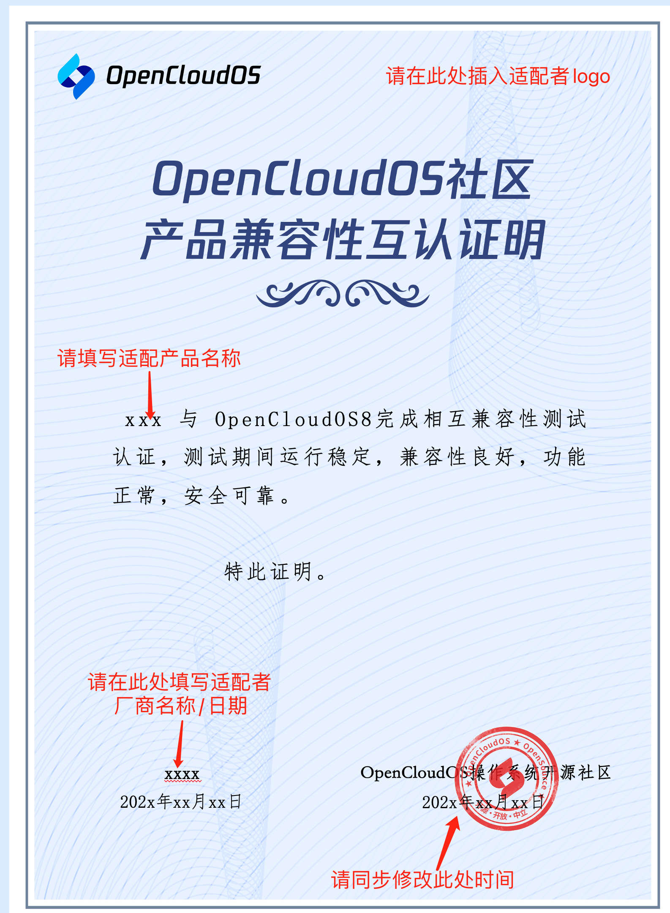

# OpenCloudOS社区适配流程手册
> 由于社区完整版适配流程的部分平台正在建设中，为保证适配工作顺利开展，现阶段暂时执行简化版流程。

## 0-适配流程图 
[适配流程图](https://doc.weixin.qq.com/flowchart/f3_AfIA2Ab8ADgxadWa23DTtStXutAaF?scode=AJEAIQdfAAoAlXGOEbAfIA2Ab8ADg)
## 1-适配申请
目前社区刚刚运行，生态体系正在逐步建立中，目前主要采取邀请制。    
适配SIG会主动筛选出行业中重要的生态合作伙伴，邀请其适配OpenCloud（后简称成OC）操作系统，保证其产品能够稳定、正常运行在OC操作系统之上。     
OC社区gitee主页：[https://gitee.com/OpenCloudOS](https://gitee.com/OpenCloudOS)
## 2-适配通知、沟通
会由OC社区工作人员主动与适配厂商建立微信沟通群，在群里对后续流程进行通知与交流。    
### 2.1-整机厂商
请提供整机中外设物料清单以及固件版本，方便在测试时针对特定的外设选择合适的测试项，保证整机的稳定性。    
### 2.2-云平台&中间件
请提供关键的环境依赖机器版本，确定OC操作系统中具有可靠、稳定的环境。    
## 3-适配代码开发
适配者在gitee中选取的适配的对应操作系统版本以及适配层级，下载对应代码，并进行软件适配开发工作。    
各版本操作系统ISO下载路径：      
[OpenCloudOS8下载链接](https://mirrors.opencloudos.tech/opencloudos/8.6/isos/x86_64/opencloudos-8.6-x86_64-dvd1.iso)    

（其他版本可以在[https://www.opencloudos.org/iso选择](https://www.opencloudos.org/iso选择))    

OC社区项目仓库链接如下：[https://gitee.com/organizations/OpenCloudOS/projects](https://gitee.com/organizations/OpenCloudOS/projects)    
## 4-测试
测试工具代码仓：https://gitee.com/opencloudos-stream/oc-hct    
### 4.1-可自主测试：
在微信群内，OC社区组织官方成员会提供相应的测试要求文件，请申请者按照标准完成测试，并提供标准测试报告给沟通群内的社区工作人员进行审核。    

测试报告模板链接：[产品互认证测试模板.docx](https://drive.weixin.qq.com/s?k=AJEAIQdfAAozq7Ph3N)    

整机厂商测试用例可参考：[整机认证测试项](https://doc.weixin.qq.com/doc/w3_AfIA2Ab8ADgJUpke0M9QuuBCmPiww?scode=AJEAIQdfAAosbgN97HAfIA2Ab8ADg)    
### 4.2-不可自主测试：
在微信群内提出申请，将特殊请求、设备发以及测试方法送至OC社区联合实验（E企研究院）处，进行相应测试。    
## 5-适配代码、软件包管理
请申请者决定若要加入OC社区的YUM源，则需完成OC社区Realse SIG的管理流程          [Relase-SIG快速导航](https://gitee.com/OpenCloudOS/SIG-release)。        
若不加入则申请者自主管理软件包。     
申请者在填写申请时，如果决定对适配代码进行开源，则鼓励在OC社区中建立子仓库，用以适配功能的代码管理。具体仓库建立方法，可以与SIG组运营人员咨询。    
## 6-认证证书
在确认测试通过后，OC社区会为申请者颁发OC操作系统兼容认证证书。OC社区会在沟通群内提供认证证书模板，申请者请在相应位置填加：    
- 正文第一段：适配软件名     
- 右上角：公司logo    
- 左下角：公司名称+认证时间   
适配者完成证书补充后，请回传至沟通群内进行审核。   
     
 
## 7-文档归档
- 纸质版：    
申请者需使用a4竖版、加厚纸张打印认证证书，并加盖申请者公章后邮寄至OC社区处。    
暂时由@devingeng(耿航航)代管，邮寄至如下地址：    
```
北京市海淀区希格玛大厦6层，耿航，18310451502    
```
- 电子版：     
测试报告、证书在沟通群内交由对处管理。


