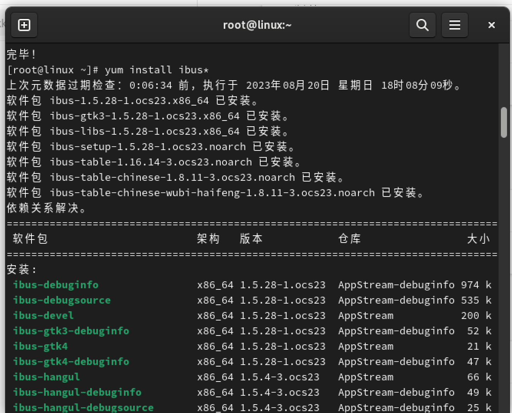
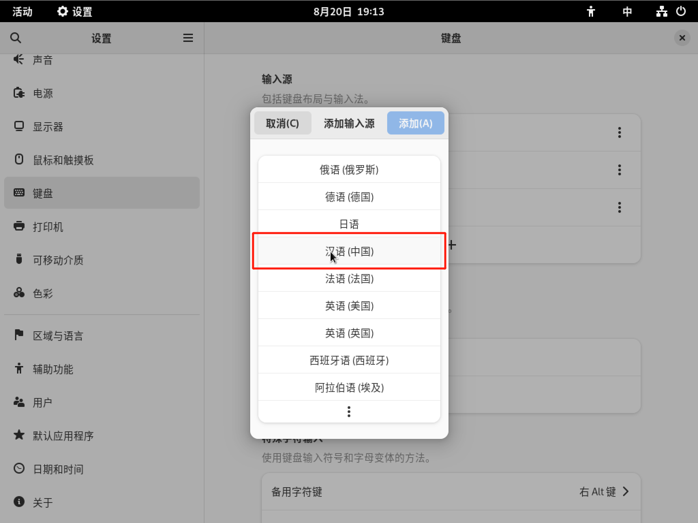
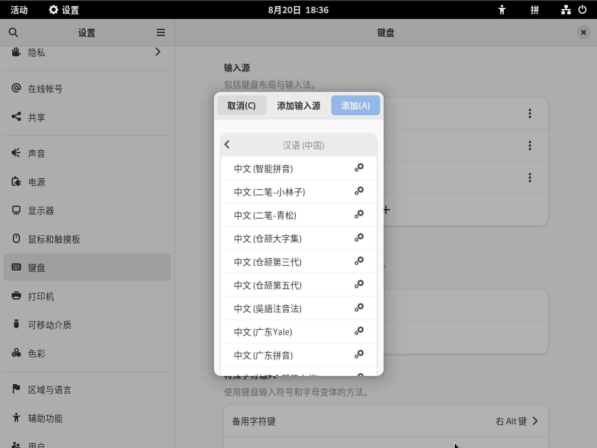
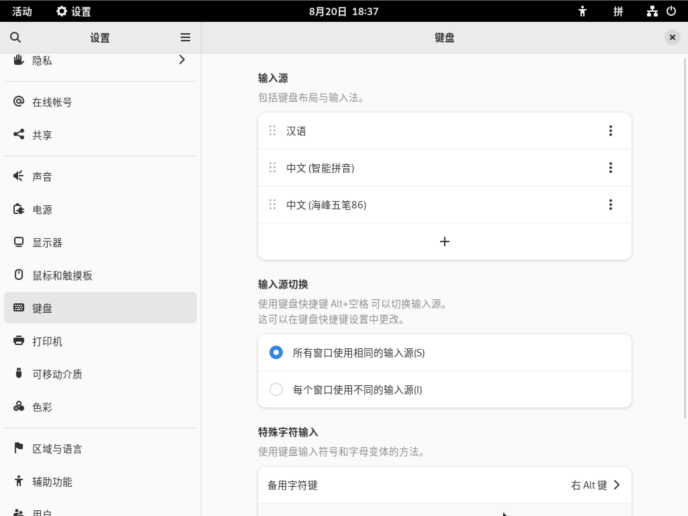
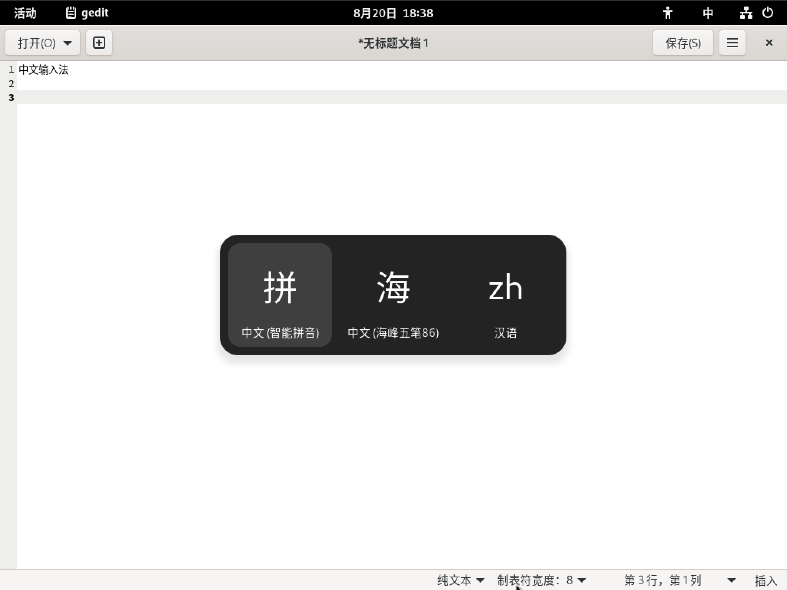
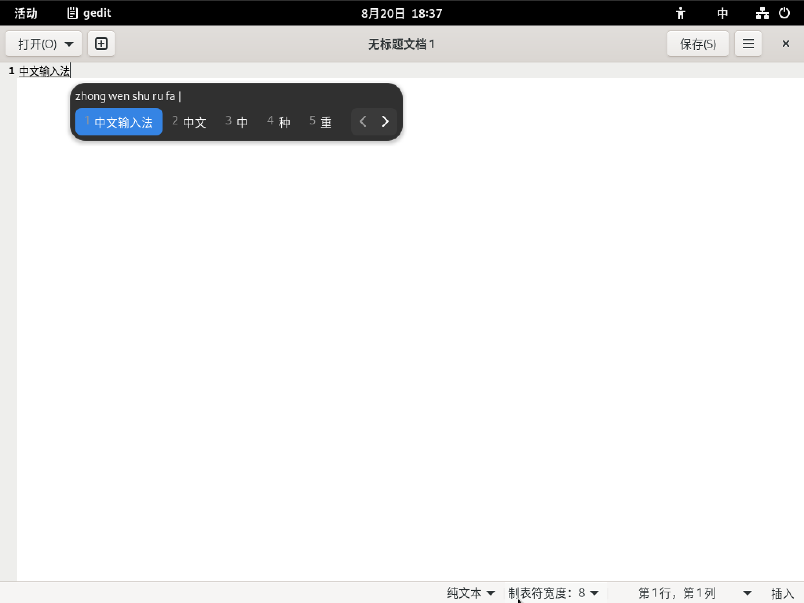
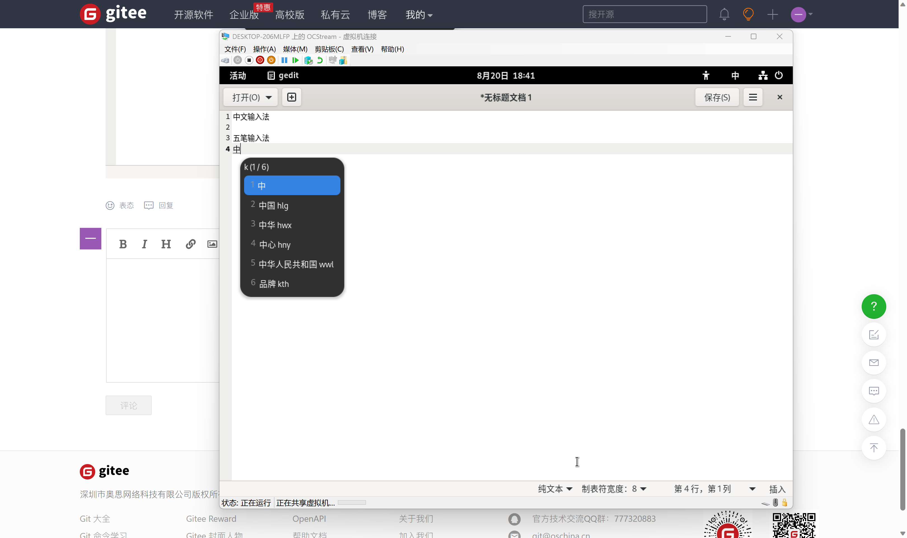

# <center> OpenCloudOS-中文输入法的安装和配置</center>

IBus 全称 Intelligent Input Bus 是下一代输入法框架（或者说“平台”）。 项目现托管于 [Google Code](https://code.google.com/p/ibus/) 此项目包含了世界多数语言的文字输入需求——由世界多个国家开发者维护。

## 1. 安装中文输入法 ibus 及其依赖

在终端输入命令:

```bash
yum install ibus*
```



## 2、在设置中，添加输入源

进入系统设置，点击键盘，添加输入源。


在弹出的窗口中，选择“汉语（中国）”。



然后可以选择添加您需要的输入法，例如：“中文（智能拼音）” 和 “中文（海峰五笔86）”




添加完成后，我们可以看到输入源中的出现了中文输入法



并且可以通过快捷键 Super + Alt + 空格 进行输入法的切换



## 3、在 gedit 中，使用中文（五笔）输入法拼写汉字

我们打开系统自带的文字编辑器工具 gedit，并切换到中文输入法后，就可以进行拼音输入了



也可以切换至五笔输入法，然后进行输入


