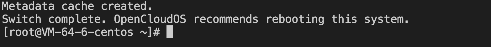
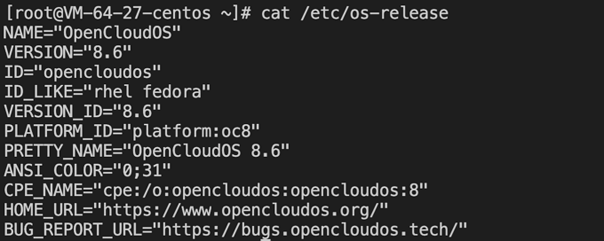
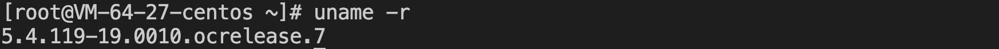
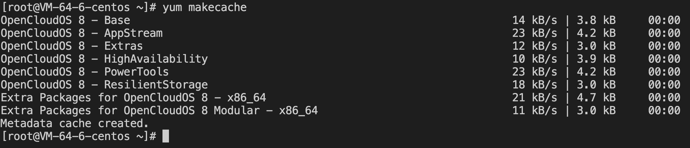

## 操作场景

CentOS has officially stopped maintaining CentOS 8, as shown in the table below. For more information, please refer to[CentOS Official Announcement](https://blog.centos.org/2020/12/future-is-centos-stream/?spm=a2c4g.11174386.n2.3.348f4c07hk46v4)。

| Operating system version | Stop maintenance time | Impact on users                                                                                                                               |
| ------------------------ | --------------------- | --------------------------------------------------------------------------------------------------------------------------------------------- |
| CentOS 8                 | January 1st, 2022     | After stopping maintenance, you will not be able to obtain any software maintenance and support, including problem fixes and feature updates. |

If you are using a CentOS 8 instance, you can refer to this article to replace it with OpenCloudOS 8.

## Release Note

**Operating system versions supported by the source host：**

- Support for CentOS 8 series operating system versions：
  
    CentOS 8.0 64 bit、CentOS 8.2 64 bit、CentOS 8.3 64 bit、CentOS 8.4 64 bit、CentOS 8.2 ARM 64 bit

**Recommended operating system version for the target host：**

- CentOS 8 series recommends migrating to OpenCloudOS 8
- The CentOS stream 8 public image currently does not support migration operations.

## Notes

- Migration is not supported in the following cases：
  - A graphical interface is installed.
  - The rpm package for i686 is installed.
- The following cases may affect the normal operation of the business after migration:：
  - The business program installs and relies on third-party rpm  packages.
  - Business programs depend on a fixed kernel version or compile kernel modules on their own. The target version after migration is tkernel4, based on the 5.4 kernel. This version is newer than the kernel version of CentOS 8, and some older features may change in the new version. Users who are strongly dependent on the kernel are advised to understand the features they depend on, or consult the OpenCloudOS community [Bugtracker](https://bugs.opencloudos.tech)。
  - Business programs depend on a fixed gcc version, and currently OpenCloudOS 8 has gcc 8.5 installed by default.
- After the migration is completed, a reboot is required to enter the OpenCloudOS kernel .
- Migration does not affect the data disk, only the upgrade at the OS level, and no operations are performed on the data disk.

## Resource Requirements

- Free memory is greater than 500MB.
- The remaining space of the system disk is greater than 10 GB.

## Operating Steps

### Migration preparation

1. The migration operation is irreversible. To ensure the security of business data, it is recommended that you backup the data before performing the migration. Tencent Cloud Server users can refer to [Create Snapshot](https://cloud.tencent.com/document/product/362/5755) .

2. Check and manually uninstall the rpm package for the i686.

3. If you do not have Python 3 installed in your environment, you need to install Python 3 first, and you can install it with the vault source.
   
   ```python
   # cat <<EOF | sudo tee /tmp/centos8_vault.repo
   [c8_vault_baseos]
   name=c8_vault - BaseOS
   baseurl=https://mirrors.cloud.tencent.com/centos-vault/8.5.2111/BaseOS/\$basearch/os/
   gpgcheck=0
   enabled=1
   [c8_vault_appstream]
   name=c8_vault - AppStream
   baseurl=https://mirrors.cloud.tencent.com/centos-vault/8.5.2111/AppStream/\$basearch/os/
   gpgcheck=0
   enabled=1
   EOF
   # yum -y install python3 --disablerepo=* -c /tmp/centos8_vault.repo --enablerepo=c8_vault*
   ```

### Performing Migration

The steps to migrate CentOS 8 to OpenCloudOS 8 are as follows:：

1. Log in to the target host. For more information on Tencent Cloud Server users, please refer to [Log in to a Linux instance using standard login](https://cloud.tencent.com/document/product/213/5436).

2. Run the following command to install Python 3: If the yum source is not available, use point 3 of **Migration preparation** above.[centos-vault install Python 3](#_6)。
   
   ```shell
   yum install -y python3
   ```

3. Run the following command to download and install the migration tool.
   
   ```shell
    #x86版本
   wget https://mirrors.opencloudos.tech/opencloudos/8.6/AppStream/x86_64/os/Packages/migrate2opencloudos-1.0-1.oc8.noarch.rpm
   #arm版本
   wget https://mirrors.opencloudos.tech/opencloudos/8/AppStream/aarch64/os/Packages/migrate2opencloudos-1.0-1.oc8.noarch.rpm 
   ```

4. Execute the following command to install the migration tool, which will create migrate2opencloudos.py under /usr/sbin .
   
   ```shell
    rpm -ivh migrate2opencloudos-1.0-1.oc8.noarch.rpm
   ```

5. Run the following command to start the migration.
   
   ```shell
   python3 /usr/sbin/migrate2opencloudos.py -v 8
   ```
   
   Migration will take some time, please be patient and wait. After the script execution is completed, the output information shown in the following figure indicates that the migration has been completed.
    

6. Restart the instance. More information on for cloud servers, please refer to [Restart the instance](https://cloud.tencent.com/document/product/213/4928)。

7. Check the migration results.
   
   1. Run the following command to check os-release.
      
      ```shell
      cat /etc/os-release
      ```
      
       Return the information shown in the following figure:
        
   
   2. Run the following command to check the kernel.
      
      ```shell
      uname -r
      ```
      
      Return the information shown in the following figure: 
        
      
       The kernel defaults to the latest version of yum, please refer to your actual return results, this article uses the illustrated version as an example.
      
      3.  Run the following command to check yum.
      
      ```shell
      yum makecache
      ```
      
      Return the information shown in the following figure:
      
      

## Encountered a problem?

If you encounter problems during the migration process, please contact the OpenCloudOS community [Bugtracker](https://www.opencloudos.org/?page_id=509).
