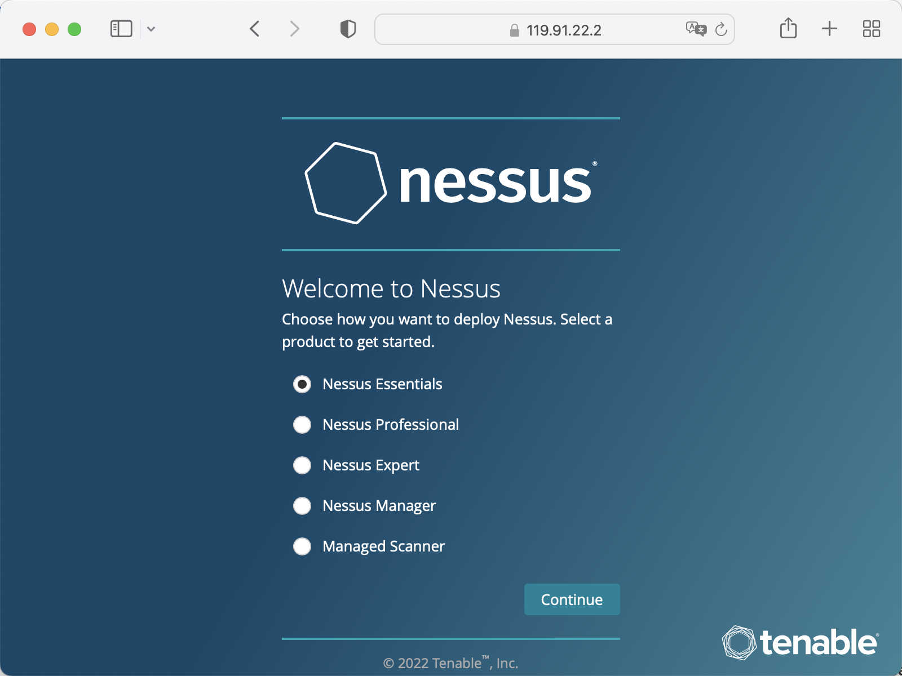

# <center> OpenCloudOS-System security configuration

## 1 Overview of System Security Reinforcement

### 1.1 What is Computer System Security

Computer security is a general term covering a broad field of computing and information processing. Industries that rely on computer systems and networks to conduct day-to-day business transactions and access critical information view their data as an essential part of their overall assets. Some terms and metrics have entered our everyday business vocabulary, such as total cost of ownership (TCO), return on investment (ROI) and quality of service (QoS). Using these metrics, industries can calculate aspects such as data integrity and high availability (HA) as part of their planning and process management costs. In some industries, such as e-commerce, the availability and trustworthiness of data can mean the difference between success and failure.


### 1.2 Security Control
Computer security is generally divided into three distinct main categories:
- Physical Security

- Logical Security

- Operational System Security


#### 1.2.1 Physical Security
Physical security is the implementation of security measures within a defined structure to prevent or prevent unauthorized access to sensitive material. There are some examples of physical security:
- CCTV camera

- Biometrics (including fingerprint, voice, face, iris, handwriting and other automated methods used to identify individuals)

- alarm system

#### 1.2.2 Logical Security
Technical security uses technology as a foundation to control access to and use of sensitive data across physical structures and networks. The technical controls are far-reaching and include the following technologies:

- Encryption

- Key Authentication

- Access Control List

- File Integrity Audit

#### 1.2.3 Operational System Security

Operational safety defines the human safety factor. They involve people at all levels of the organization and determine which users can access which resources and information by:

- Safety Training

- Disaster Preparedness and Recovery

### 1.3 Safety Assessment

Given enough time, resources, and motivation, hackers can break into almost any system. All security programs and technologies currently available cannot guarantee that any system will be completely invulnerable. Routers help secure the gateway to the Internet. Firewalls help protect the edge of your network. Virtual private networks deliver data securely in encrypted streams. Intrusion detection systems warn of malicious activity. However, the success of each technique depends on a number of variables, including:

- Expertise of the staff responsible for configuring, monitoring and maintaining the technology

- Ability to patch and update services and kernel quickly and efficiently

- Administrators' ability to maintain constant vigilance on the network


## 2 System Encryption Policy

System-wide encryption policies are system components that configure the encryption subsystem, covering TLS, IPSec, SSH, DNSec, and Kerberos protocols. This component provides a part of integrated encryption policies, which administrators can choose.


### 2.1 System-Wide Encryption Policy

When a system-wide policy is set, applications in opencloudos follow the security policy and refuse to use algorithms and protocols that do not comply with the policy, this policy applies to the default behavior of the application when running with the configuration provided by the system, but if required, can be overwritten.

To view or change the current system-wide encryption policy, use the encryption policy tool, for example: 

View Current System Encryption Policy
```
[root@opencloudos ~]# update-crypto-policies --show
LEGACY
```
Set system encryption policy to FUTURE

```
[root@opencloudos ~]# update-crypto-policies --set FUTURE
Setting system policy to FUTURE
Note: System-wide crypto policies are applied on application start-up.
It is recommended to restart the system for the change of policies
to fully take place.
```
*To ensure that encryption policy changes are applied, please reboot the system. 

```
[root@opencloudos ~]#reboot
```
### 2.2 Exclude some applications in the system encryption policy

Users can customize the encryption settings used by the application, preferably by configuring supported cipher suites and protocols directly in the application, in addition to removing application-related ones from the `/etc/crypto-policies/back-ends` directory symlink and replace it with custom encryption settings.

#### 2.2.1 Example of opting out of a system-wide encryption policy

- wget

To customize the encryption settings used by the wget web downloader, use the `--secure-protocol` and `--ciphers` options. For example:
```
[root@opencloudos ~]#wget --secure-protocol=TLSv1_1 --ciphers="SECURE128" https://example.com
```

- crul 

To specify the ciphers used by the curl tool, use the `--ciphers` option and provide a colon-separated list of ciphers as values. For example:

```
[root@opencloudos ~]#curl https://example.com --ciphers '@SECLEVEL=0:DES-CBC3-SHA:RSA-DES-CBC3-SHA'
```
For more information, please refer to: 

- update-crypto-policies(8) man page

### 2.3 Custom sub-encryption strategy


Users can apply custom sub-policies on top of existing system-wide encryption policies, or define such policies from scratch. The /etc/crypto-policies/state/CURRENT.pol file lists all the settings in the currently applied system-wide encryption policy. To make the encryption policy stricter, consider using the values ​​listed in the `/usr/share/crypto-policies/policies/FUTURE.pol` file. The configuration process is as follows

1.Check `/etc/crypto-policies/policies/modules/` directory

```
[root@opencloudos ~]#cd /etc/crypto-policies/policies/modules/
```

2.Create a sub-policy file

```
[root@opencloudos ~]# touch MYCRYPTO-1.pmod
[root@opencloudos ~]# touch SCOPES-AND-WILDCARDS.pmod
```
**Filenames should be in capital letters**

3.Add the following content to the above file

```
[root@opencloudos ~]#vim MYCRYPTO-1.pmod

min_rsa_size = 3072
hash = SHA2-384 SHA2-512 SHA3-384 SHA3-512

[root@opencloudos ~]#vim SCOPES-AND-WILDCARDS.pmod

# Disable the AES-128 cipher, all modes 
cipher = -AES-128-*
# Disable CHACHA20-POLY1305 for the TLS protocol (OpenSSL, GnuTLS, NSS, and OpenJDK)
cipher@TLS = -CHACHA20-POLY1305
# Allow using the FFDHE-1024 group with the SSH protocol (libssh and OpenSSH) 
group@SSH = FFDHE-1024+
# Disable all CBC mode ciphers for the SSH protocol (libssh and OpenSSH) 
cipher@SSH = -*-CBC
# Allow the AES-256-CBC cipher in applications using libssh 
cipher@libssh = AES-256-CBC+

```

4.Enable the configured encryption policy to DEFAULT level

```
[root@opencloudos ~]#update-crypto-policies --set DEFAULT:MYCRYPTO-1:SCOPES-AND-WILDCARDS
```

5.Restart to make the configuration take effect

```
[root@opencloudos ~]##reboot 
```

6.Verify that it is in effect

```
[root@opencloudos ~]# cat /etc/crypto-policies/state/CURRENT.pol | grep rsa_size
min_rsa_size = 3072
```

For more information, please refer to
- Custom Policies  in  the update-crypto-policies(8) man page

- Crypto Policy Definition Format  in  the crypto-policies(7) man page


### 2.4 Customize system encryption policy

In addition to customizing the sub-encryption policy, users can also customize the encryption policy of the entire system according to the following steps. The operation steps are as follows:

1.Create a policy file in the corresponding directory

```
[root@opencloudos ~]##cd /etc/crypto-policies/policies/
[root@opencloudos ~]##touch MYPOLICY.pol
```

2.Add the following parameters in the policy file, or copy a copy of the parameters predefined by the system as an example

```
[root@opencloudos ~]##cp /usr/share/crypto-policies/policies/DEFAULT.pol /etc/crypto-policies/policies/MYPOLICY.pol
```

3.Switch to custom system encryption policy

```
[root@opencloudos ~]## update-crypto-policies --set MYPOLICY
```

4.Restart to take effect

```
[root@opencloudos ~]##reboot
```

5.Verify whether the switch is successful

```
[root@opencloudos ~]# update-crypto-policies --show
MYPOLICY
```

For more information, please refer to
- Custom Policies  in  update-crypto-policies(8) man page

- Crypto Policy Definition Format in the crypto-policies(7) man page

## 3 Shared System Authentication
Shared system certificates enable NSS, GNUTLS, OpenSSL, and Java to share default sources for retrieving system certificate anchor and block list information. By default, the trust store contains a list of Mozilla CAs, including positive and negative trusts. This system allows updating the core Mozilla CA list or selecting a different certificate list.

### 3.1 Certificate storage

In opencloudos, the combined system certification is located in `/etc/pki/ca-trust/` and `/usr/share/pki/ca-trust-source/` directories, `/usr/share/pki/ca-trust-source/` in Trust settings have lower priority than those in `/etc/pki/ca-trust/`. The certificate files are installed into subdirectories of the following directory:

- Trusted Anchor

/usr/share/pki/ca-trust-source/anchors/ or /etc/pki/ca-trust/source/anchors/

- Untrusted the certificate

/usr/share/pki/ca-trust-source/blacklist/ or /etc/pki/ca-trust/source/blacklist/

- For certificates in the extended BEGIN TRUSTED file format

/usr/share/pki/ca-trust-source/ or /etc/pki/ca-trust/source/

### 3.2 Add a new certificate

To use a new source of trust to validate applications on the system, add the corresponding certificate to the system certificate store location and update it with the update-ca-trust command. The process is as follows:

1. Install ca-certificates 

```
[root@opencloudos ~]##yum install ca-certificates
```

2. Copy the certificate file to the `/usr/share/pki/ca-trust-source/anchors/` or `/etc/pki/ca-trust/source/anchors/` directory

```
[root@opencloudos ~]##cp ~/certificate-trust-examples/Cert-trust-test-ca.pem /usr/share/pki/ca-trust- source/anchors/
```

3.Update system authentication information

```
[root@opencloudos ~]## update-ca-trust
```

### 3.3 Manage Trusted Certificates
The trust command provides a convenient way to manage system certificates. trust is used to list, extract, add, delete, or change trust anchors. To view the built-in help for this command, use the `--help` directive without any arguments

```
[root@opencloudos ~]# trust
usage: trust command <args>...

Common trust commands are:
  list             List trust or certificates
  extract          Extract certificates and trust
  extract-compat   Extract trust compatibility bundles
  anchor           Add, remove, change trust anchors
  dump             Dump trust objects in internal format

See 'trust <command> --help' for more information
```

- List all system trust anchors and certificates

```
[root@opencloudos ~]# trust list
pkcs11:id=%12%C8%6D%75%89%62%89%3C%3E%A2%92%F7%8C%79%A1%42%F7%8D%A4%AE;type=cert
    type: certificate
    label: Tencent tlinux Root
    trust: anchor
    category: authority

pkcs11:id=%D2%87%B4%E3%DF%37%27%93%55%F6%56%EA%81%E5%36%CC%8C%1E%3F%BD;type=cert
    type: certificate
    label: ACCVRAIZ1
    trust: anchor
    category: authority

pkcs11:id=%F7%7D%C5%FD%C4%E8%9A%1B%77%64%A7%F5%1D%A0%CC%BF%87%60%9A%6D;type=cert
    type: certificate
    label: AC RAIZ FNMT-RCM
    trust: anchor
    category: authority
......
```

- To save a trust anchor to the system trust list, use the trust anchor command and specify the path to the certificate. Replace path.to/certificate.crt with the path to the certificate and its filename:


```
[root@opencloudos ~]##trust anchor path.to/certificate.crt
```

- Delete certificate based on certificate ID or path

```
[root@opencloudos ~]## trust anchor --remove path.to/certificate.crt
[root@opencloudos ~]## trust anchor --remove "pkcs11:id=%AA%BB%CC%DD%EE;type=cert"
```

- All subcommands of trust provide detailed built-in help, such as

```
[root@opencloudos ~]# trust list --help
usage: trust list --filter=<what>

  --filter=<what>     filter of what to export
                        ca-anchors        certificate anchors
                        blacklist         blacklisted certificates
                        trust-policy      anchors and blacklist (default)
                        certificates      all certificates
                        pkcs11:object=xx  a PKCS#11 URI
  --purpose=<usage>   limit to certificates usable for the purpose
                        server-auth       for authenticating servers
                         client-auth       for authenticating clients
                        email             for email protection
                        code-signing      for authenticating signed code
                        1.2.3.4.5...      an arbitrary object id
  -v, --verbose       show verbose debug output
  -q, --quiet         suppress command output
```


For more information, please refer to:
- update-ca-trust(8) , trust(1) man pages


## 4 Vulnerability and Configuration Compliance Scanning
Compliance auditing is the process of determining whether a given object complies with all the rules stated in a compliance policy. Compliance policies are defined by security professionals, who specify, usually in the form of a checklist, the necessary settings that a computing environment should use. Compliance policies can vary from organization to organization, and even across different systems within the same organization. The differences between these policies are based on the purpose of each system and its importance to the organization. Custom software setup and deployment features also increase the need for custom policy checklists.

### 4.1 Configuration Compliance Tool
OpencloudOS provides tools that enable users to perform fully automated compliance audits. These tools are based on the Automation Protocol (SCAP) standard and are designed to automate custom compliance policies. 
- SCAP Workbench - The Scap-workbench program is designed to perform configuration and vulnerability scans of individual local or remote systems. It can also be used to generate security reports based on these scans and assessments.

- OpenSCAP - The OpenSCAP library, and accompanying oscap command-line utility, is designed to perform configuration and vulnerability scans of local systems, verify configuration compliance content, and generate reports and guidelines based on these scans and assessments.

- SCAP Security Guide (SSG) - The scap-security-guide package provides an up-to-date collection of security policies for Linux systems. The guide includes a practical catalog of reinforcement recommendations. The project bridges the gap between general policy requirements and specific implementation guidance.

- Script Check Engine (SCE) - SCE is an extension to the SCAP protocol that enables administrators to write security content using scripting languages ​​such as Bash, Python, and Ruby. The SCE extension is provided in the openscap-engine-sce package. SCE itself is not part of the SCAP standard.


For more information, please refer to: 
- oscap(8), scap-workbench(8), scap-security-guide(8) man pages


### 4.2 Vulnerability scanning

It is recommended to use tenable for system vulnerability scanning.
- Install Nessus, download the Nessus installation package from the link below

```
https://www.tenable.com/downloads/nessus?loginAttempted=true

[root@opencloudos ~]#yum install Nessus-10.3.0-es8.x86_64.rpm
Last metadata expiration check: 15:28:22 ago on Wed 10 Aug 2022 07:47:14 PM CST.
Package Nessus-10.3.0-es8.x86_64 is already installed.
Dependencies resolved.
Nothing to do.
Complete!

```

- Start Service

```
[root@opencloudos ~]#systemctl start nessusd.service
```
- View service status

```
[root@opencloudos ~]# systemctl status nessusd.service
● nessusd.service - The Nessus Vulnerability Scanner
   Loaded: loaded (/usr/lib/systemd/system/nessusd.service; enabled; vendor preset: disabled)
   Active: active (running) since Thu 2022-08-11 12:17:33 CST; 3min 23s ago
 Main PID: 1196 (nessus-service)

```

- Login tenable nessus


- Create a scan policy


- Start a vulnerability scan


- View Results


## 5 Integrity Check
Advanced Intrusion Detection Environment (AIDE) is a utility that creates a database of files on a system, which is then used to ensure file integrity and detect system intrusions.

### 5.1 Install AIDE

1.Install aide

```
[root@opencloudos mapper]#yum install aide
```
2.Initialize aide 
```
[root@opencloudos ~]# aide --init
Start timestamp: 2022-08-15 15:57:08 +0800 (AIDE 0.16)
AIDE initialized database at /var/lib/aide/aide.db.new.gz
Number of entries:      273651
---------------------------------------------------
The attributes of the (uncompressed) database(s):
---------------------------------------------------
/var/lib/aide/aide.db.new.gz
  MD5      : gbDTEpIcp2U9/d0Lr+IyhA==
  SHA1     : cbzG7XCK7LKFgQrYTg9BGjLhOZo=
  RMD160   : qfOqQ/acSRhD7ezUQNYZixCG/DI=
  TIGER    : hTR0EWinckydttRnf47yWa2DDEzjKmra
  SHA256   : U9mcgPLyS4i82uC9RG3+6Qq05OLSkWra
             M/rXzo5UEoQ=
  SHA512   : bZ9rZKj2FfUd4UH5afgt2TOtdGc6vZIF
             4nXgwrwZrmd4HtE93W1kmwxClF99ueBm
             EhNQQRG5yb07vL/IEkl1Ig==
End timestamp: 2022-08-15 16:32:44 +0800 (run time: 35m 36s)
```

**In the default configuration, the aide `--init` command checks only a set of directories and files defined in the `/etc/aide.conf` file. To include other directories or files in the AIDE database, and change their viewing parameters, edit `/etc/aide.conf` accordingly**

3.To start using the database, remove the `.new` package from the initial database file

```
[root@opencloudos ~]# mv /var/lib/aide/aide.db.new.gz /var/lib/aide/aide.db.gz
```

To modify the location of the AIDE database, edit the /etc/aide.conf file and modify the DBDIR value. For extra security, store the database, configuration, and /usr/sbin/aide binaries in a safe location, such as read-only media.

### 5.2 Integrity check using AIDE
```
[root@opencloudos ~]# aide --check
Start timestamp: 2022-08-22 01:15:48 +0000 (AIDE 0.16)
AIDE found differences between database and filesystem!!

Summary:
  Total number of entries:      74891
  Added entries:                0
  Removed entries:              0
  Changed entries:              5
---------------------------------------------------
Changed entries:
---------------------------------------------------
f   ...    .C..  : /usr/local/qcloud/YunJing/log/hids.log
f   ...    .C..  : /usr/local/qcloud/YunJing/log/ydservice.20220822.log
f   ...    .C..  : /usr/local/qcloud/monitor/barad/log/dispatcher.log
f   ...    .C..  : /usr/local/qcloud/monitor/barad/log/executor.log
f   ...    .C..  : /usr/local/qcloud/stargate/logs/stargate.log
...
```

### 5.3 Update the AIDE database
```
[root@opencloudos mapper]#aide --update
```
The aide --update command creates the /var/lib/aide/aide.db.new.gz database file. To start using the updated database for integrity checking, remove the .new substring from the filename. 。

For more information, please refer to:
- aide(1)manual page

## 6 Block Device Encryption

Disk encryption protects data on block devices through encryption. To access the decrypted content of the device, the user must provide a password or key as authentication. This is especially important when it comes to mobile computers and removable media: it helps protect the contents of the device even after it has been physically removed from the system. The LUKS format is the default implementation of block device encryption in opencloudos.

### 6.1 LUKS

Linux Unified Key Setup-disk-format(LUKS) (LUKS) is capable of encrypting block devices and provides a set of tools to simplify the management of encrypted devices. LUKS allows multiple user keys to decrypt a master key, which is used for bulk encryption of partitions. opencloudos performs block device encryption using LUKS. By default, the option to encrypt block devices is unchecked during installation. If the user chooses to encrypt the disk, the system will be prompted for the password every time the computer is started. This passphrase "unlocks" the bulk encryption key that decrypts the partition. If the user chooses to modify the default partition table, they can choose which partitions to encrypt.

Brief introduction of LUKS function: 
- LUKS encrypts the entire block device, so it is very suitable for protecting the content of mobile devices, such as removable storage media or laptop disk drives.

- LUKS provides cryptographic strengthening against dictionary attacks.

- LUKS devices contain multiple key slots that allow users to add backup keys or passphrases.

- Disk encryption solutions like LUKS only protect data when the system is shut down. Once the system is turned on and LUKS has decrypted the disk, the files on that disk are available to anyone who has access to those files.

- LUKS is not suitable for applications that require file-level encryption.

The default encryption algorithm used by LUKS is aes-xts-plain64, and the default key size of LUKS is 512 bits. The default key size for LUKS with Anaconda (XTS mode) is 512 bits. For more information, please refer to: 
- LUKS homepage: https://gitlab.com/cryptsetup/cryptsetup/blob/master/README.md

- LUKS On-Disk Format specification: https://gitlab.com/cryptsetup/LUKS2-docs/blob/master/luks2_doc_wip.pdf

### 6.2 Encrypt existing data on block devices using LUKS
This section uses LUKS2 to encrypt data on the device that has not yet been encrypted. LUKS headers are stored in the device header. Before performing the encryption step, please make sure that the data is backed up and a file system exists on the disk.

1.Take the vdb1 partition as an example, unmount the partition

```
[root@opencloudos mapper]#umount /dev/vdb1
```
2.Install the `cryptsetup` tool

```
[root@opencloudos mapper]#yum install cryptsetup
```
3.Enter the password and start the encryption process
```
[root@opencloudos mapper]#cryptsetup reencrypt --encrypt --init-only --reduce-device-size 32M /dev/vdb1 			 vdb1_encrypted
```
In the above command, `vdb1_encrypted` is the name of the mapping file, which can be customized by the user. After the partition is encrypted using cryptsetup, the partition is no longer allowed to be mounted directly. LUKS is also an encryption scheme based on the device mapper mechanism. If you want to use this partition, you must make a mapping for this partition and map it to the `/dev/mapper` directory. You can only use this mapping by mounting it. However, when doing mapping, you need to enter the decryption password.

```
Last metadata expiration check: 15:28:22 ago on Wed 10 Aug 2022 07:47:14 PM CST.
Package Nessus-10.3.0-es8.x86_64 is already installed.
Dependencies resolved.
Nothing to do.
Complete!
```
### 6.3 Encrypt existing data using LUKS2 with detached headers
This section uses LUKS2 to encrypt data on the device that has not yet been encrypted. The LUKS header is stored at the specified location. Before performing the encryption step, please make sure that the data is backed up and a file system exists on the disk. 

1. Take the vdb1 partition as an example, unmount the partition

```
[root@opencloudos mapper]#umount /dev/vdb1
```
2. Install the `cryptsetup` tool

```
[root@opencloudos mapper]#yum install cryptsetup
```
3. Enter the password and start the encryption process

```
[root@opencloudos mapper] #cryptsetup reencrypt --encrypt --init-only --header /path/to/header /dev/vdb1 			 vdb1_encrypted
```

In the above command, vdb1_encrypted is the name of the mapping file, which can be customized by the user. After the partition is encrypted using cryptsetup, the partition is no longer allowed to be mounted directly. LUKS is also an encryption scheme based on the device mapper mechanism. If you want to use this partition, you must make a mapping for this partition and map it to the /dev/mapper directory. You can only use this mapping by mounting it. However, when doing mapping, you need to enter the decryption password.

```
[root@opencloudos mapper]# cryptsetup reencrypt --encrypt --init-only --header /data/header /dev/vdb1  vdb1_encrypted
WARNING!
========
Detected LUKS device on /dev/vdb1. Do you want to encrypt that LUKS device again?
Are you sure? (Type 'yes' in capital letters): YES
WARNING!
========
Header file does not exist, do you want to create it?

Are you sure? (Type 'yes' in capital letters): YES
Enter passphrase for /data/header: 
Verify passphrase: 
/dev/mapper/vdb1_encrypted is now active and ready for online encryption.
```

For more information, please refer to:
- cryptsetup（8）

### 6.4 LUKS2 Encrypted Blank Block Devices

1. Set the partition as an encrypted LUKS partition:

```
[root@opencloudos mapper]#cryptsetup luksFormat /dev/vdb1
```
2. Open the encrypted LUKS partition:
```
[root@opencloudos mapper]#cryptsetup open /dev/vdb1 vdb1_encrypted
```
3. To write encrypted data to a partition, the partition must be accessed through the device mapping name. For this, a file system must be created. For example:
```
[root@opencloudos mapper]#mkfs -t ext4 /dev/mapper/vdb1_encrypted
```
4. Format the mapping file

```
[root@opencloudos mapper]#mkfs.ext4 /dev/mapper/vdb1_encrypted
```
5. Mount the device:

```
[root@opencloudos mapper]#mount /dev/mapper/vdb1_encrypted mount-point
```

## 7 Audit System
The Linux audit system is used to count security policy violation records in the system, and then further process these violations through SELINUX. Auditing systems are critical in production environments to identify violators of security policies and what actions they took. 

The audit system can count the following information: 
- Time, type and result of the violation incident

- Object sensitivity

- Correlation of a breach event with the identity of the user who triggered the time

- Include or exclude events based on user identity, subject and object tags, and other attributes

- Modifications to trusted databases such as `/etc/passwd`

- Use of authentication mechanisms such as SSH

Among other things, the audit system can

- monitor file access

Auditing can track whether a file or directory has been accessed, modified, executed, or whether file attributes have been changed. For example detecting access to important files and providing an audit trail if one of the files is corrupted.

- Monitor system calls

Auditing can be configured to generate a log entry each time a particular system call is used. Can be used, for example, to track modifications to the system time by monitoring settimeofday, clock_adjtime, and other time-related system calls.

- Record user actions

An auditing system can track whether a file has been executed, so a rule can be defined to log every execution of a specific command. For example, one rule could be defined for each executable in the /bin directory. The resulting log entries can then be searched by user ID to generate an audit trail of the commands executed by each user.

- Log Security Events

The `pam_faillock` authentication module can log failed login attempts. Auditing can also be set to log failed login attempts and provide additional information about the user attempting to log in.

- Search event

The `ausearch` tool can filter log entries and provide a complete audit trail based on several criteria.

- Run summary report

The `aureport` program can be used to generate daily reports recording events, etc. Administrators can further investigate suspicious activity based on reports.

- Monitor network access

The `iptables` and `ebtables` tools can be configured to trigger audit events, enabling system administrators to monitor network access

**According to the amount of information collected, the audit system will have a certain impact on system performance**

### 7.1 Audit system architecture
The audit system includes two parts: user mode programs and kernel space system calls. The kernel component accepts system calls from user space applications and filters them by user, task, fstype or exit. The userspace audit daemon collects information from the kernel and creates entries in log files. Other userspace tools interact with the audit daemon, kernel audit components or audit log files:

- auditctl - audit control tool, manages rules and controls many settings and parameters for event processing.

- Other related tools take audit log files as input and generate output as requested by the user. For example aureport generates a report of all events.

### 7.2 Description of auditd configuration parameters
The default audit configuration is sufficient for most environments, but audit can be further configured according to security needs, and the relevant configuration is in the /etc/audit/audit.conf file. Some commonly used parameters are described as follows:

- `log_file` This parameter specifies the directory where the audit log is stored, usually in the `/var/log/audit/` directory.

- `max_log_file` Specifies the size of the largest log file.

- `max_log_file_action` Specifies the action to be taken when the log size reaches max_log_file. To prevent the audit log from being overwritten, this value is usually set to keep_logs.

- `space_left` Specifies the amount of free space remaining on the disk, which is the action to take when triggered by the setting in the space_left_action parameter. A number must be set to allow enough time for the administrator to respond and free up disk space. The value of space_left depends on the rate at which audit log files are generated. 

- `space_left_action` It is recommended to set the space_left_action parameter to email or exec using the appropriate notification method. 

- `admin_space_left` Specifies the absolute minimum amount of free space, which is the action taken when triggered by the setting in the admin_space_left_action parameter, must be set to a value that leaves enough space for logging actions taken by the admin.

- `admin_space_left_action` Should be set to single to put the system in single-user mode and allow administrators to free up some disk space.

- `disk_full_action` Specifies the action triggered when there is no free space on the partition that holds the audit log file. It must be set to halt or single. This ensures that the system is shut down or run in single-user mode when auditing fails to log events.

- `disk_error_action` Specifies the action to trigger when an error is detected on the partition containing the audit log file, must be set to syslog, single, or halt, depending on your local security policy for handling hardware failures.

- `flush` Should be set to incremental_async. This is combined with the freq parameter, which determines how many records can be sent to disk before forcing a hardsync with the disk. The freq parameter should be set to 100. These parameters ensure that audit event data is synchronized with the log files on disk while maintaining good activity performance. The rest of the configuration options should be set according to the local security policy.


### 7.3 Starting and configuring auditd

Auditd related operations are shown in the table:

|Function | Instruction operation  |
|:----------|:----------|
| Start autid as root    | #service auditd start    |
| Configure auditd to start automatically at boot    | #systemctl start auditd    |
| Temporarily disable auditd   | #auditctl -e 0    |
| Re-enable auditd   | #auditctl -e 1     |
| Restart auditd    | #service audited restart     |
| Stop auditd   | #service auditd stop    |
| Reload the auditd configuration in the /etc/audit/auditd.conf file   | #service auditd reload    |
| Rotate the log files in the /var/log/audit/ directory  | #service auditd rotate    |
| Display the running status of auditd   | #service auditd status    |

### 7.4 View audit log files
Audit systems typically store log entries in the /var/log/audit/audit.log file, and if log rotation is enabled, the rotated audit.log file is also stored in the same directory. Add the following audit rule to log every attempt to read or modify the /etc/ssh/sshd_config file

```
[root@opencloudos ~]#auditctl -w /etc/ssh/sshd_config -p warx -k sshd_config
```
If the auditd daemon is running, create a new event in the audit log file with the following command, for example
```
[root@opencloudos ~]# cat /etc/ssh/sshd_config
# $OpenBSD: sshd_config,v 1.103 2018/04/09 20:41:22 tj Exp $
# This is the sshd server system-wide configuration file.  See
# sshd_config(5) for more information.
...
#Port 22
#AddressFamily any
#ListenAddress 0.0.0.0
#ListenAddress ::
HostKey /etc/ssh/ssh_host_rsa_key
HostKey /etc/ssh/ssh_host_ecdsa_key
HostKey /etc/ssh/ssh_host_ed25519_key
...
```

### 7.5 Define and enforce audit rules
Auditing systems operate according to a set of rules that define what is captured in log files. Audit rules can be set on the command line or in the /etc/audit/rules.d/ directory using the auditctl tool.

1.To define a rule that logs all write access to the /etc/passwd file and each attribute modification:

```
[root@opencloudos ~]#auditctl -w /etc/passwd -p wa -k passwd_changes
```
2.To define a rule that records write access to all files in the /etc/selinux/ directory and the modification of each attribute:

```
[root@opencloudos ~]#auditctl -w /etc/selinux/ -p wa -k selinux_changes
```

**Example of a system call rule**

1.To define a rule, a log is created every time the program uses the adjtimex or settimeofday system call, and the system uses a 64-bit architecture

```
[root@opencloudos ~]# auditctl -a always,exit -F arch=b64 -S adjtimex -S settimeofday -k time_change
```

2.Define a rule to create a log every time a system user with an ID of 1000 or above deletes or renames a file

```
[root@opencloudos ~]# auditctl -a always,exit -S unlink -S unlinkat -S rename -S renameat -F auid>=1000 -F auid!=4294967295 -k delete
```

**Executable Rules**
<br />To define a rule that logs all executions of /bin/id programs, execute the following command

```
[root@opencloudos ~]# auditctl -a always,exit -F exe=/bin/id -F arch=b64 -S execve -k execution_bin_id
```

For more information see:

- auditctl(8) manual page

### 7.6 Define and enforce audit rules
To define audit rules that persist across reboots, they must be included directly in the /etc/audit/rules.d/audit.rules file, or read with the augenrules program located in /etc/audit/rules.d/ rules in the directory. Note that the /etc/audit/audit.rules file is generated each time the auditd service starts. Files in /etc/audit/rules.d/ use the same auditctl command-line syntax to specify rules. Empty lines and text following the hash sign (#) are ignored. Alternatively, administrators can use the auditctl command to read rules from a file specified with the -R option, for example:


```
[root@opencloudos ~]#auditctl -R /usr/share/audit/sample-rules/30-stig.rules
```

### 7.7 Using preconfigured rules files
In the /usr/share/audit/sample-rules directory, the audit package provides a set of preconfigured rule files based on various certification standards:

```
[root@opencloudos ~]#cat /usr/share/audit/sample-rules
```
To use these configuration files, copy them into the /etc/audit/rules.d/ directory and use the augenrules --load command, for example:

```
[root@opencloudos ~]# cd /usr/share/audit/sample-rules/
[root@opencloudos ~]# cp 10-base-config.rules 30-stig.rules 31-privileged.rules 99-finalize.rules /etc/audit/rules.d/
[root@opencloudos ~]# augenrules --load
```
Users can sort audit rules using a numbering scheme. For more information see 

- audit.rules(7) manual page

### 7.8 Using augenrules to define persistence rules

The augenrules script reads the rules located in the /etc/audit/rules.d/ directory and compiles them into the audit.rures file. This script processes all files ending in .rules in a specific order, according to their natural ordering. The files in this directory are organized into groups with the following meanings: 

- 10 - Kernel and auditctl configuration

- 20 - A rule that can match a regular rule but you want to match differently

- 30 - Master Rule

- 40 - optional rules

- 50 - server-specific rules

- 70 - System local rules

- 90 - Finalize (immutable)

Rules are not meant to be used all at once. They are part of the policy and should be considered carefully, and the individual files are copied to /etc/audit/rules.d/. For example, to set up the system in a STIG configuration, copy the rules 10-base-config, 30-stig, 31-privileged, and 99-finalize. Once you have rules in the /etc/audit/rules.d/ directory, run the augenrules script with the --load parameter to load them:

```
[root@opencloudos ~]#  augenrules --load
/usr/sbin/augenrules: No change
No rules
enabled 0
failure 1
pid 0
rate_limit 0
...
```
### 7.9 Disable augenrules
Use the following steps to disable the augenrules tool. This switches auditing to use the rules defined in the /etc/audit/audit.rules file. The operation steps are as follows:

1.Copy the /usr/lib/systemd/system/auditd.service file to the /etc/systemd/system/ directory
```
[root@opencloudos ~]# cp -f /usr/lib/systemd/system/auditd.service /etc/systemd/system/
```
2.Edit the /etc/systemd/system/auditd.service file in a text editor of your choice, eg

```
[root@opencloudos ~]# vi /etc/systemd/system/auditd.service
```
  
3.Comment out the line containing augenrules and uncomment the line containing the auditctl `-R` command

```
#ExecStartPost=-/sbin/augenrules --load	ExecStartPost=-/sbin/auditctl -R /etc/audit/audit.rules
```
4.Reload the systemd daemon to pick up the changes in the auditd.service file:

```
[root@opencloudos ~]# systemctl daemon-reload
```
5.Restart the auditd service

```
[root@opencloudos ~]#service auditd restart
```
### 7.10 Set audit policies to monitor software updates
In opencloudos 3, users can use pre-configured rule configurations to monitor the following package managers:
```
dnf,yum,pip,npm,cpan,gem,luarocks
```
By default, rpm provides auditing of SOFTWARE_UPDATE events when packages are installed or updated. Users can list them by typing ausearch -m SOFTWARE_UPDATE on the command line. The monitoring configuration steps are as follows: 

1.Copy the preconfigured rule file 44-installers.rules in the /usr/share/audit/sample-rules/ directory to the /etc/audit/rules.d/ directory:

```
[root@opencloudos ~]#cp /usr/share/audit/sample-rules/44-installers.rules /etc/audit/rules.d/
```
2.Create a new file called 44-installers.rules in the /etc/audit/rules.d/ directory and insert the following rules:

```
-a always,exit -F perm=x -F path=/usr/bin/dnf-3 -F key=software-installer
-a always,exit -F perm=x -F path=/usr/bin/yum -F
```
3.Load audit rules

```
[root@opencloudos ~]#augenrules --load
```
4.List the loading rules

```
[root@opencloudos ~]# auditctl -l
```

5.Search the audit log for recent installation events such as:

```
[root@opencloudos ~]# ausearch -ts recent -k software-installer
```

### 7.11 Use the audit system to monitor user login time
To monitor which user is logged in at a particular time, administrators do not need to configure auditing in any special way. You can use the ausearch or aureport tools, which provide different ways to display the same information. The configuration steps are as follows

1.Search the audit log for the USER_LOGIN message type

```
[root@opencloudos ~]#ausearch -m USER_LOGIN -ts '7/02/2022' '18:00:00' -sv no
time->Sat Jul 30 01:31:50 2022
type=USER_LOGIN msg=audit(1659115910.191:272434): pid=1416645 uid=0 auid=4294967295 ses=4294967295 msg='op=login acct="root" exe="/usr/sbin/sshd" hostname=? addr=1.235.57.39 terminal=ssh res=failed'
```

Parameter description: 

- `ts`: The option specifies the date and time. If this option is not used, ausearch will provide results from the current day. The 
- `sv yes` Option is used to filter successful login records. 
- `sv no` Option is used to filter records of failed logins.

2.Pass the raw output of the ausearch command to the aulast tool, which displays the output in a format similar to the output of the last command. For example:

```
[root@opencloudos audit]# ausearch --raw | aulast --stdin
root     pts/0        118.112.73.86    Sat Jul 30 18:00 - 20:30  (02:29)
root     pts/0        118.112.75.157   Sun Jul 31 16:21 - 16:21  (00:00)
root     pts/0        118.112.75.157   Sun Jul 31 16:23 - 17:08  (00:45)
root     pts/0        118.112.73.104   Mon Aug  1 10:55 - 10:55  (00:00)
root     ssh          114.132.79.10    Mon Aug  1 14:19 - 14:22  (00:02)
root     pts/0        118.112.73.104   Mon Aug  1 11:56 - 14:22  (02:26)
root     ssh          114.132.79.10    Mon Aug  1 14:22 - 16:41  (02:19)
root     ssh          114.132.79.10    Mon Aug  1 18:34 - 18:48  (00:14)
root     pts/0        118.112.73.104   Mon Aug  1 20:06 - 23:19  (03:12)
root     pts/0        118.112.72.152   Tue Aug  2 10:15   still logged in
```

3.Use the `aureport` command with the `--login` `-i` option to display a list of login events.

```
[root@opencloudos audit]# aureport --login -i 
...
1.    07/31/2022 23:30:39 root 183.131.3.30 ssh /usr/sbin/sshd no 294225
2.    07/31/2022 23:30:41 root 183.131.3.30 ssh /usr/sbin/sshd no 294237
3.    07/31/2022 23:30:45 root 183.131.3.30 ssh /usr/sbin/sshd no 294249
4.    07/31/2022 23:30:49 root 183.131.3.30 ssh /usr/sbin/sshd no 294261
5.    07/31/2022 23:30:53 root 183.131.3.30 ssh /usr/sbin/sshd no 294273
6.    07/31/2022 23:30:56 root 183.131.3.30 ssh /usr/sbin/sshd no 294285
7.    07/31/2022 23:30:58 root 183.131.3.30 ssh /usr/sbin/sshd no 294297
8.    07/31/2022 23:31:02 root 183.131.3.30 ssh /usr/sbin/sshd no 294309
9.    07/31/2022 23:31:04 root 183.131.3.30 ssh /usr/sbin/sshd no 294321
10.   07/31/2022 23:31:06 root 183.131.3.30 ssh /usr/sbin/sshd no 294333
11.   07/31/2022 23:31:08 root 183.131.3.30 ssh /usr/sbin/sshd no 294345
12.   07/31/2022 23:31:12 root 183.131.3.30 ssh /usr/sbin/sshd no 294357
...
```

For more information, please refer to:

- ausearch(8) manual pages.

- aulast(8) manual pages.

- aureport(8) manual pages.

## 8 USBGuard defends against attacks from USB devices
The system may be attacked by mounting USB devices, and system administrators can use USBGuard to defend against such attacks.
### 8.1 What is USBGuard
With the USBGuard software framework, you can use a basic list of allowed and forbidden devices to protect your system from hacking USB devices, based on the USB device authorization functions in the kernel. 

The USB Guard framework provides the following components: 

- System service components with inter-process communication (IPC) interfaces for dynamic interaction and policy enforcement

- A command-line interface for interacting with the running usbguard system service

- A rule language for writing authorization policies for USB devices

- C++ API for interacting with system service components implemented in shared libraries The usbguard system service configuration file (/etc/usbguard/usbguard-daemon.conf) includes options to authorize users and groups to use the IPC interface.


### 8.2 Install USBGuard
Install and start the USBGuard framework through the following procedure. 

1.Install usbgurd


```
[root@opencloudos ~]#yum install usbguard
```
2.Create the initial ruleset

```
[root@opencloudos ~]#usbguard generate-policy > /etc/usbguard/rules.conf
```
3.Start the usbguard daemon and make sure it starts automatically on boot

```
[root@opencloudos ~]# systemctl enable --now usbguard
```
4.Check whether the service is normal

```
[root@opencloudos ~]# systemctl status usbguard
● usbguard.service - USBGuard daemon
   Loaded: loaded (/usr/lib/systemd/system/usbguard.service; enabled; vendor preset: disabled)
   Active: active (running) since Sun 2022-08-21 15:41:35 UTC; 3min 11s ago
     Docs: man:usbguard-daemon(8)
  Process: 540366 ExecStart=/usr/sbin/usbguard-daemon -f -s -c /etc/usbguard/usbguard-daemon.co>
 Main PID: 540389 (usbguard-daemon)
    Tasks: 3 (limit: 22674)
   Memory: 1.4M
   CGroup: /system.slice/usbguard.service
           └─540389 /usr/sbin/usbguard-daemon -f -s -c /etc/usbguard/usbguard-daemon.conf
```
5.List USB devices recognized by USBGuard 

```
[root@opencloudos ~]# usbguard list-devices
2: allow id 1d6b:0001 serial "0000:00:01.2" name "UHCI Host Controller" hash "FRDEjz7OhdJbNjmJ8zityiNX/LuO+ovKC07I0bOFjao=" parent-hash "9+Zsfvo9IR/AEQ/Fn4mzdoPGk0rqpjku6uErfS09K4c=" via-port "usb1" with-interface 09:00:00 with-connect-type ""
```

For more information, please refer to: 

- usbguard(1) 和usbguadr-daemod.conf(5)

### 8.3  Block and authorize USB devices

- Temporarily Blocking and Authorizing USB Devices 

This procedure outlines how to authorize and block USB devices using the usbguard command. 
1.List recognized USB devices
```
[root@opencloudos ~]# usbguard list-devices
```
2.Authorize device 6 to interact with the system

```
[root@opencloudos ~]# usbguard allow-device 6
```

3.Deauthorize and delete the device 6

```
[root@opencloudos ~]# usbguard reject-device 6
```

- Permanently block and authorize USB devices 
1.Configure SELINUX to allow the usbguard daemon to write rules

Show semanage booleans related to usbguard

```
[root@opencloudos ~]# semanage boolean -l | grep usbguard
usbguard_daemon_write_conf     (off  ,  off)  Allow usbguard to daemon write conf
usbguard_daemon_write_rules    (on   ,   on)  Allow usbguard to daemon write rules
```


1.If the usbguard_daemon_write_rules boolean is off, turn it on:
```
[root@opencloudos ~]#semanage boolean -m --on usbguard_daemon_write_rules
```
2.List recognized USB devices

```
[root@opencloudos ~]# usbguard list-devices
```
3.Authorize device 6 to interact with the system

```
[root@opencloudos ~]# usbguard allow-device 6 -p
```

4.Deauthorize and delete device 6

```
[root@opencloudos ~]# usbguard reject-device 6 -p
```

5.Permanently deauthorize and keep the device 6

```
[root@opencloudos ~]# usbguard block-device 6 -p
```

6.Verify that the rules are modified

```
[root@opencloudos ~]# usbguard list-rules
```
For more information, please refer to:

- usbguard(1) manual page

### 8.4 Create custom policies

1.Create a policy that authorizes the currently connected USB device and save the generated rules to the rules.conf file:

```
[root@opencloudos ~]# usbguard generate-policy --no-hashes > ./rules.conf
```
2.Edit the rules.conf file with a text editor of your choice, for example:

```
[root@opencloudos ~]# vim ./rules.conf
```

3.Add, delete or edit rules as needed. For example, the following rule allows only devices with one mass storage interface to interact with the system:

```
[root@opencloudos ~]# allow with-interface equals { 08:*:* }
```
4.Install the updated strategy:

```
[root@opencloudos ~]# install -m 0600 -o root -g root rules.conf /etc/usbguard/rules.conf
```
5.Restart the usbguard daemon to apply the changes:

```
[root@opencloudos ~]# systemctl restart usbguard
```
6.Verify that the rules are in effect

```
[root@opencloudos ~]# usbguard list-rules
```
### 8.5 Authorize users and groups to use the USBGuard IPC interface
Use this process to authorize specific users or groups to use the USBGuard public IPC interface. By default, only the root user can use this interface. The process is as follows:

1. Make sure the /etc/usbguard/rules.conf file contains the initial set of rules generated by the usbguard generate-policy command.

2. Edit the /etc/usbguard/usbguard-daemon.conf file to add a line of rules to allow all users in the xxx group to use the IPC interface, and save the file

```
[root@opencloudos ~]# vim /etc/usbguard/usbguard-daemon.conf
...
# Hides personally identifiable information such as device serial numbers and
# hashes of descriptors (which include the serial number) from audit entries.
#
#HidePII=false
IPCAllowGroups=xxx
```

3. Restart the usbguard daemon to make the configuration take effect

```
[root@opencloudos ~]# systemctl restart usbguard
```
### 8.6 Log USBguard Authorization Events to the Linux Audit Log
Use the following steps to integrate USBguard authorization event logging into the standard Linux audit log. By default, the usbguard daemon logs events to the /var/log/usbguard/usbguard-audit.log file. 

1. Edit /etc/usbguard/usbguard-daemon.conf, change the AuditBackend option from FileAudit to LinuxAudit

```
[root@opencloudos ~]#vim /etc/usbguard/usbguard-daemon.conf

# USBGuard Audit events log backend
#
# One of:
#
# * FileAudit - Log audit events into a file specified by
#               AuditFilePath setting (see below)
# * LinuxAudit - Log audit events using the Linux Audit
#                subsystem (using audit_log_user_message)
#
AuditBackend=LinuxAudit
```

2. Restart the usbguard daemon process

```
[root@opencloudos ~]# systemctl restart usbguard
```

3. Verification

```
[root@opencloudos ~]# ausearch -ts recent -m USER_DEVICE
```
For more information, please refer to: 

- usbguard-daemon.conf(5) manual page.


## 9 SELINUX Configuration
SELinux (Security Enhanced Linux) provides an additional layer of system security. SELinux fundamentally answers questions: eg: Can a web server access files in a user's home directory?
### 9.1 What is SELINUX
SELinux is a Linux Security Module (LSM) built into the Linux kernel. The SELinux subsystem in the kernel is driven by a security policy that is controlled by the administrator and loaded at boot time. All security-related, kernel-level access operations in the system are intercepted by SELinux and checked in the context of the loaded security policy. If the loaded policy allows the operation, it will proceed. Otherwise, the operation is blocked and the process receives an error.

SELinux implements Mandatory Access Control (MAC). Every process and system resource has a special security label called a SELinux label, which is an identifier that abstracts system-level details and focuses on the entity's security attributes. This not only provides a consistent method of referencing objects in SELinux policy, but also removes ambiguities that may exist in other identity systems. For example, a file can have multiple valid pathnames on a system using bind mounts. SELinux labels define how processes interact with each other and with various system resources. By default no interaction is allowed unless the corresponding permission is explicitly granted by a rule. <br />

SELinux labels include the following fields:user、role、type and security level. <br />

SELinux decisions, such as allowing or denying access, are cached. This cache is called Access Vector Cache (AVC). By using these cached decisions, fewer checks are made to SELinux policy rules, which improves performance. SELinux policy rules have no effect if the DAC rules have already denied access in the first place. Raw audit messages are logged to /var/log/audit/audit.log, starting with the string type=AVC. <br />
In opencloudos, system services are controlled by the systemd daemon; systemd starts and stops all services, and users and processes communicate with systemd using the systemctl utility. The systemd daemon can refer to SELinux policy, check the label of the calling process and the label of the unit file that the caller is trying to manage, and then ask SELinux whether to allow the caller access. This method controls access control to critical system functions, including starting and stopping system services. <br />
The systemd daemon also acts as a SELinux access manager. It retrieves the label of the process running systemctl, or sending D-Bus messages to systemd. The daemon then looks for a unit file tag for the process to configure. Finally, systemd can retrieve information from the kernel if SELinux policy allows specific access between process labels and unit file labels. This means that SELinux can now restrict broken applications that need to interact with systemd for certain services. Policy authors can also use these fine-grained controls to restrict administrators.
If a process is sending a D-Bus message to another process, and SELinux policy does not allow D-Bus communication between the two processes, a USER_AVC deny message is printed and the D-Bus communication times out. Note that D-Bus communication between two processes works bidirectionally.

System administrators generally cannot generate comprehensive, granular security policies through access criteria based on users, groups, and other permissions (known as Discretionary Access Control, DAC). For example, restricting certain applications to only view log files while allowing other applications to add new data to log files.

SELinux has the following advantages:
- All processes and files are marked. SELinux policy rules define how processes interact with files, and how processes interact with each other. Access is only allowed if there is an explicitly allowing SELinux policy rule.

- Granular access control. Traditional UNIX controls through user authorization, Linux-based users and groups. Whereas SELinux's access control is based on all available information such as SELinux users, roles, types, and optionally security levels.

- SELinux policies are defined by system administrators and enforced system-wide.

- Improved mitigations for privilege escalation attacks. Processes run in domains and are therefore isolated from each other. SELinux policy rules define how access to files and other processes is handled. If a process is compromised, the attacker can only access the normal functions of the process and only access files that have been configured to be accessible by the process. For example: If the Apache HTTP server is compromised, an attacker cannot use that process to read files in the user's home directory unless specific SELinux policy rules are added or configured to allow such access.

- SELinux can be used to enforce data confidentiality and integrity while protecting processes from untrusted input.

However, SELinux itself is not:
- anti-virus software,

- to replace passwords, firewalls and other security systems,

- All-in-one security solution.

SELinux is designed to enhance existing security solutions, not replace them. Even when running SELinux, you still need to follow good security practices, such as keeping software updated, using secure passwords, and using a firewall.
How SELinux Improves Security:
- The default action is deny. If no SELinux policy rule exists to allow access (such as allowing a process to open a file), then deny access.

- SELinux can restrict Linux users. SELinux policies include many restricted SELinux users. Linux users can be mapped to restricted SELinux users to take advantage of the security rules and mechanisms they use. For example, mapping the Linux user to the SELinux user_u user makes it impossible for the Linux user to run unless there are other configured user ID (setuid) applications such as sudo and su.

- Increased separation of process and data. The SELinux domain concept allows defining which processes can access certain files and directories. For example: When running SELinux, unless otherwise configured, an attacker will not be able to break into a Samba server and then use the Samba server as an attack vector to read and write files used by other processes (such as a MariaDB database).

- SELinux helps mitigate damage from misconfigurations. Different DNS servers often copy information between each other, which is called a zone transfer. An attacker can use a zone transfer to update a DNS server to include incorrect information. When running with BIND (Berkeley Internet Name Domain) as the DNS server in Red Hat Enterprise Linux, the default SELinux policy blocks zone files[1] through the BIND naming daemon even if the administrator does not restrict which servers can execute zone transfers itself and other processes, using zone transfers for updates.


### 9.2 SELINUX state and mode changes
SELinux can run in one of three modes: enforcing, permissive, or disabled.
- Enforcing mode is the default mode of operation in which SELinux operates normally and enforces the loaded security policy throughout the system.

- In permissive mode, the system loads security policies like enforcing mode, including marking objects and logging access-denied entries, but it does not deny any operations. It is not recommended to use permissive mode in production environment system, but permissive mode is very helpful for SELinux policy development and debugging.

- It is strongly recommended not to use disabled mode. Not only does it keep the system from enforcing SELinux policies, it also avoids labeling any persistent objects such as files, making it very difficult to enable SELinux in the future.

Use the setenforce program to change between enforcing and permissive modes. Changes made with setenforce are not persisted across reboots. To change to enforce mode, enter the setenforce 1 command as the Linux root user. To change to permissive mode, enter the setenforce 0 command. Use the getenforce or sestatus command to check in which mode SELinux is running. The getenforce command returns Enforcing, Pmissive, or Disabled. The sestatus command returns SELinux status and the SELinux policy in use, such as:

```
[root@opencloudos ~]# sestatus
SELinux status:                 disabled
```

- switch to permissive state


Use the following steps to permanently change the SELinux mode to permissive. SELinux policies are not enforced when SELinux is running in permissive mode. The system remains operational and SELinux does not deny any operations, but simply logs AVC messages, which can be used for troubleshooting, debugging, and SELinux policy improvement. Each AVC is recorded only once in this example.

1. Open the configuration file and modify the parameters

```
[root@opencloudos ~]#vim /etc/selinux/config
# This file controls the state of SELinux on the system.
# SELINUX= can take one of these three values:
#     enforcing - SELinux security policy is enforced.
#     permissive - SELinux prints warnings instead of enforcing.
#     disabled - No SELinux policy is loaded.
SELINUX=permissive
# SELINUXTYPE= can take one of these three values:
#     targeted - Targeted processes are protected,
#     minimum - Modification of targeted policy. Only selected processes are protected.
#     mls - Multi Level Security protection.
SELINUXTYPE=targeted
```
2. Restart to make the configuration take effect

```
[root@opencloudos ~]#reboot
```

3. Verify that it is in effect

```
[root@opencloudos ~]#getenforce
```
- Switch to enforcing mode

Use the following steps to switch SELinux into enforcing mode. When SELinux is in enforcing mode, it enforces SELinux policy and denies access based on SELinux policy rules.

1. Open the configuration file and modify the parameters

```
[root@opencloudos ~]#vim /etc/selinux/config
# This file controls the state of SELinux on the system.
# SELINUX= can take one of these three values:
#     enforcing - SELinux security policy is enforced.
#     permissive - SELinux prints warnings instead of enforcing.
#     disabled - No SELinux policy is loaded.
SELINUX=enforcing
# SELINUXTYPE= can take one of these three values:
#     targeted - Targeted processes are protected,
#     minimum - Modification of targeted policy. Only selected processes are protected.
#     mls - Multi Level Security protection.
SELINUXTYPE=targeted
```
2. Restart to make the configuration take effect

```
[root@opencloudos ~]#reboot
```
3. Verify that it is in effect

```
[root@opencloudos ~]#getenforce
```

- Disable SELINUX

Use the following steps to disable SELinux from SElinux.

1. Open the configuration file and modify the parameters

```
[root@opencloudos ~]#vim /etc/selinux/config
# This file controls the state of SELinux on the system.
# SELINUX= can take one of these three values:
#     enforcing - SELinux security policy is enforced.
#     permissive - SELinux prints warnings instead of enforcing.
#     disabled - No SELinux policy is loaded.
SELINUX=enforcing
...
SELINUXTYPE=targeted
...
```

2. Restart to make the configuration take effect

```
[root@opencloudos ~]#reboot
```

3. Verify that it is in effect

```
[root@opencloudos ~]#getenforce
```
### 9.3 Manage restricted and unrestricted users
SELinux policies map every Linux user to an SELinux user. This allows Linux users to inherit the restrictions of SELinux users. Administrators can customize the privileges of restricted users in SELinux policies to specific needs by adjusting Boolean values in the policies. Administrators can use the semanage boolean -l command to determine the current state of these boolean values.

Install the necessary tools:

```
[root@opencloudos ~]#yum install setools-console
```
To view the SELinux user mapping on the system, use the semanage login -l command as root:

```
[root@opencloudos ~]# semanage login -l
Login Name           SELinux User         MLS/MCS Range        Service
__default__          unconfined_u         s0-s0:c0.c923       *
root                 unconfined_u         s0-s0:c0.c1023       *
```
To list available SELinux users, enter the following command:

```
[root@opencloudos ~]# seinfo -u
Users: 8
   guest_u
   root
   staff_u
   sysadm_u
   system_u
   unconfined_u
   user_u
   xguest_u
```


#### 9.3.1 Manage restricted and unrestricted users
SELinux policies map every Linux user to an SELinux user. This allows Linux users to inherit the restrictions of SELinux users. Administrators can customize the privileges of restricted users in SELinux policies to specific needs by adjusting Boolean values in the policies. Also use the semanage boolean -l command to determine the current state of these boolean values. system_u is a special user identity for system processes and objects, and system _r is an associated role. Administrators must not associate this system_u user and system_r role to a Linux user. Also, unconfined_u and root are unconfined users. Therefore, the roles associated with these SELinux users are not included in the access permissions for types and SELinux roles in the table below.

| User  | Default role  | Other role  |
|:----------|:----------|:----------|
| unconfined_u    | unconfined_r    | system_r    |
| guest_u    | guest_r   |      |
| xguest_u    | xguest_r    |     |
| staff_u    | staff_r    | sysadm_r    |
| staff_u    | staff_r    | unconfined_r    |
| staff_u    | staff_r    | system_r   |
| sysadm_u    | sysadm_r    |      |
| root   | staff_r    | sysadm_r    |
| root   | staff_r    | unconfined_r  |
| root   | staff_r    | system_r  |
| system_u   | system_r    |   |
```
[root@opencloudos ~]# setsebool -P ssh_sysadm_login on
```

In addition to the SELinux users already mentioned, there are special roles that can be mapped to these users with the semanage user command. These roles determine what SELinux allows these users to do:

- webadm_r can only manage SELinux types related to the Apache HTTP server.

- dbadm_r can only manage SELinux types related to MariaDB database and PostgreSQL database management system.

- logadm_r can only manage SELinux types related to syslog and auditlog processes.

- secadm_r can only manage SELinux.

- auditadm_r can only manage processes related to the Audit subsystem.

To list all available roles, enter the `seinfo -r` command:

```
[root@opencloudos ~]# seinfo -r 
Roles: 14
   auditadm_r
   dbadm_r
   guest_r
   logadm_r
  ...
   user_r
   webadm_r
   xguest_r
```

#### 9.3.2 Adding a new user is automatically mapped to the SELinux unconfined_u user

1.Enter the following command to create a new Linux user named example.user:

```
[root@opencloudos ~]#useradd example.user
```
2.Assign a password to the Linux example.user user:

```
[root@opencloudos ~]#passwd example.user
```

Log in as the Linux example.user user. At login, the pam_selinux PAM module automatically maps the Linux user to the SELinux user (unconfined_u in this case) and sets the resulting SELinux context. This context is then used to start the Linux user's shell.

3.Check the context of the Linux user when logged in as the example.user user

```
[root@opencloudos ~]#id -Z
```

#### 9.3.3 Add a new user as a SELinux-restricted user

1.Enter the following command to create a new Linux user named example.user and map it to the SELinux staff_u user:

```
[root@opencloudos ~]# useradd -Z staff_u example.user
```
2.Assign a password to the Linux example.user user:

```
[root@opencloudos ~]#passwd example.user
```
Log in as the Linux example.user user. The user's shell is started with the staff_u context.

3.Check the context of the Linux user when logged in as the example.user user

```
[root@opencloudos ~]#id -Z
```
For more resources, please refer to:
- pam_selinux(8) manual page

#### 9.3.4 Restrict regular users
The administrator can map all regular users in the system to the user_u SELinux user, the process is as follows:

1. Display the list of SELinux login records. This list shows the mapping of Linux users to SELinux users

```
[root@opencloudos ~]# semanage login -l
```
2. Map the __default__ user (which stands for all users not explicitly mapped) to the user_u SELinux user:

```
[root@opencloudos ~]# semanage login -m -s user_u -r s0 __default__
```

#### 9.3.5 Restrict administrators by mapping to sysadm_u
Users with administrative privileges can be restricted by mapping the user directly to the sysadm_u SELinux user. When a user logs in, the session will run in the sysadm_u:sysadm_r:sysadm_t SELinux context. By default, all Linux users in opencloudos (including those with administrative privileges) are mapped to the unconfined SELinux user unconfined_u. System administrators can improve system security by assigning users to SELinux-restricted users. The flow is as follows:

1. Allow the sysadm_u user to connect to the system using SSH:

```
[root@opencloudos ~]# setsebool -P ssh_sysadm_login on
```
2. Create a new user, add the user to the xxx user group, and map the user to the sysadm_u SELinux user:

```
[root@opencloudos ~]# adduser -G wheel -Z sysadm_u example.user
```

### 9.4 Troubleshooting SELinux related issues
If planning to enable SELinux on a system where SELinux was previously disabled, or to run services in a non-standard configuration, administrators may need to troubleshoot possible SELinux blocking issues.
#### 9.4.1 Recognizing SELinux denials
1. When the usage scenario is blocked by SELinux, the /var/log/audit/audit.log file is the first to check for rejection. More Information To query the Audit log, use the ausearch tool. Because SELinux decisions, such as allowing or denying access, are cached and this cache is called Access Vector Cache (AVC), use the AVC and USER_AVC values in the message type parameter, for example:

```
[root@opencloudos ~]# ausearch -m AVC,USER_AVC,SELINUX_ERR,USER_SELINUX_ERR -ts recent
```
If there is no match, check to see if the audit daemon is running. If not, repeat the denial scenario after starting auditd, and check the audit log again.
2. If auditd is running but there are no matches in the ausearch output, check the systemd Journal for information:

```
[root@opencloudos ~]# journalctl -t setroubleshoot
```
3. If SELinux is enabled and the Audit daemon is not running on the system, search for some SELinux information in the dmesg command output:

```
[root@opencloudos ~]# dmesg | grep -i -e type=1300 -e type=1400
```
4. Even after doing the previous three checks, you may still not find any results. In this case, AVC denials can be silenced because of the dontaudit rule. Temporarily disable the dontaudit rule, allowing all denials to be logged:

```
[root@opencloudos ~]# semodule -DB
```
5. If all four previous steps have been applied and the issue is still not recognized, consider whether SELinux is actually blocking the current scenario:

- Switch to permissive mode:
```
[root@opencloudos ~]# setenforce 0
```
#### 9.4.2 Analyzing SELinux Denial Messages
After confirming that SELinux is blocking the current scenario, it may be necessary to analyze the root cause before making a fix.
1. Install related tools

```
[root@opencloudos ~]#yum install policycoreutils-python-utils
[root@opencloudos ~]#yum install setroubleshoot-server
```
2. Use the sealert command to list details about log denials

```
[root@opencloudos ~]#sealert -l "*"
```
3. If the output from the previous step does not contain clear suggestions

Enable full path auditing to see the full path of accessed objects and make other Linux Audit event fields visible
```
[root@opencloudos ~]# auditctl -w /etc/shadow -p w -k shadow-write
```
Clear the setroubleshoot cache and repeat step 1
```
# rm -f /var/lib/setroubleshoot/setroubleshoot.xml
```
4. Disable full path auditing

```
[root@opencloudos ~]# auditctl -W /etc/shadow -p w -k shadow-write
```
### 9.5 Writing Custom SELinux Policies
This section describes how to write and use custom policies that allow SELinux-restricted applications.

A SELinux security policy is a collection of SELinux rules. Policies are a core component of SELinux and are loaded into the kernel by SELinux userspace tools. The kernel enforces SELinux policies to evaluate access requests in the system. By default, SELinux denies all requests except those corresponding to rules specified in loaded policies. Each SELinux policy rule describes the interaction between processes and system resources:
```
ALLOW apache_process apache_log:FILE READ;
```
This example rule can be read as: Apache processes can read their log files. In this rule, apache_process and apache_log are tags. SELinux security policies assign labels to processes and define relationships to system resources. In this way, policies map operating system entities to the SELinux layer.
SELinux labels are stored as extended attributes on filesystems, such as ext2. They can be listed using the getfattr utility or the ls -Z command, for example:
```
[root@opencloudos ~]#ls -Z /etc/passwd
```

The following example steps provide steps to secure a simple daemon process with SELinux. Replace the daemon with a custom application and modify the rules in the example as required by the application and security policy. Proceed as follows:
1. Install the toolkit

```
#[root@opencloudos ~]yum install policycoreutils-devel
```

2. In this example, prepare a simple daemon that opens the /var/log/messages file for writing:

```
[root@opencloudos ~]#vim mydaemon.c

#include <unistd.h>
#include <stdio.h>
FILE *f;
int main(void)
{
while(1) {
f = fopen("/var/log/messages","w");
        sleep(5);
        fclose(f);
    }
}
```

3. Compile the file

```
[root@opencloudos ~]#gcc -o mydaemon mydaemon.c
```

4. Create a systemd unit file:

```
[root@opencloudos ~]#vim mydaemon.service

[Unit]
Description=Simple testing daemon
[Service]
Type=simple
ExecStart=/usr/local/bin/mydaemon
[Install]
WantedBy=multi-user.target
```

5. Install and start the daemon
```
[root@opencloudos ~]# cp mydaemon /usr/local/bin/
[root@opencloudos ~]# cp mydaemon.service /usr/lib/systemd/system
[root@opencloudos ~]# systemctl start mydaemon
[root@opencloudos ~]# systemctl status mydaemon

● mydaemon.service - Simple testing daemon
   Loaded: loaded (/usr/lib/systemd/system/mydaemon.service; disabled; vendor preset: disabled)
   Active: active (running) since Sat 2020-05-23 16:56:01 CEST; 19s ago
 Main PID: 4117 (mydaemon)
    Tasks: 1
   Memory: 148.0K
   CGroup: /system.slice/mydaemon.service
           └─4117 /usr/local/bin/mydaemon

May 23 16:56:01 localhost.localdomain systemd[1]: Started Simple testing daemon.
```

Check that the new daemon is not restricted by SELinux:
```
[root@opencloudos ~]#ps -efZ | grep mydaemon
```
6. Generate a custom policy for the daemon:

```
[root@opencloudos ~]#sepolicy generate --init /usr/local/bin/mydaemon
```

7. Rebuild the system policy with the new policy module using the setup script created by the previous command:

```
[root@opencloudos ~]# ./mydaemon.sh
```
8. Restart the daemon and check that it is now restricted by SELinux

```
[root@opencloudos ~]# systemctl restart mydaemon
```
9. Since the daemon is now restricted by SELinux, SELinux will also prevent it from accessing /var/log/messages. Display the corresponding rejection message:

```
[root@opencloudos ~]# ausearch -m AVC -ts recent
```
10. Reinstall Policy

```
[root@opencloudos ~]#./mydaemon.sh
```
For more information, please refer to:

- sepolicy(8) and getfattr(1) manual page
