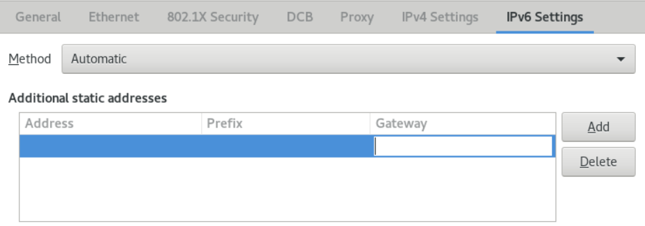

# 第19章 配置网络设备接受来自所有 MAC 地址的流量(混杂模式)

网络设备通常会拦截和读取程序所需要接收的数据包。您可以在虚拟交换机或端口组层面上，将网络设备配置为接受来自所有 MAC 地址的流量。

使用这项设置可以用来：

- 诊断网络连接问题，
- 监控网络活动提高安全性，
- 拦截传输中的私有数据或网络中的入侵。

本章介绍了如何使用 iproute2、 nmcli 或 nmstatectl 工具来将网络设备配置为接受来自所有 MAC 地址的流量。您可以为除 InfiniBand 以外的任何类型的网络设备启用此模式。

## 19.1.使用 iproute2 临时配置网卡混杂模式

本节介绍了配置网络设备来接受所有流量，而不考虑 MAC 地址。使用 iproute2 工具所做的任何更改都是临时的，并在机器重启后丢失。

**流程**

1. 可选：显示网络接口以确定您要接收所有流量的接口：
    ```
    # ip a
    1: enp1s0: <NO-CARRIER,BROADCAST,MULTICAST,UP> mtu 1500 qdisc fq_codel state DOWN group default qlen 1000
        link/ether 98:fa:9b:a4:34:09 brd ff:ff:ff:ff:ff:ff
    2: bond0: <NO-CARRIER,BROADCAST,MULTICAST,MASTER,UP> mtu 1500 qdisc noqueue state DOWN group default qlen 1000
        link/ether 6a:fd:16:b0:83:5c brd ff:ff:ff:ff:ff:ff
    3: wlp1s0: <BROADCAST,MULTICAST,UP,LOWER_UP> mtu 1500 qdisc noqueue state UP group default qlen 1000
    ...
    ```
2. 修改设备以启用或禁用 accept-all-mac-addresses 属性。
    - 为 enp1s0 启用 accept-all-mac-addresses 模式：
        ```
        # ip link set enp1s0 promisc on
        ```
    - 为 enp1s0 禁用 accept-all-mac-addresses 模式：
        ```
        # ip link set enp1s0 promisc off
        ```

**验证**

- 验证 accept-all-mac-addresses 模式是否已启用：
    ```
    # ip link show enp1s0
    1: enp1s0: <NO-CARRIER,BROADCAST,MULTICAST,PROMISC,UP> mtu 1500 qdisc fq_codel state DOWN mode DEFAULT group default qlen 1000
        link/ether 98:fa:9b:a4:34:09 brd ff:ff:ff:ff:ff:ff
    ```
    设备描述中的 PROMISC 标志表示启用了该模式。

## 19.2.使用 nmcli 配置网卡混杂模式

**流程**

1. 可选：显示网络接口以确定您要接收所有流量的接口：
    ```
    # ip a
    1: enp1s0: <NO-CARRIER,BROADCAST,MULTICAST,UP> mtu 1500 qdisc fq_codel state DOWN group default qlen 1000
        link/ether 98:fa:9b:a4:34:09 brd ff:ff:ff:ff:ff:ff
    2: bond0: <NO-CARRIER,BROADCAST,MULTICAST,MASTER,UP> mtu 1500 qdisc noqueue state DOWN group default qlen 1000
        link/ether 6a:fd:16:b0:83:5c brd ff:ff:ff:ff:ff:ff
    3: wlp1s0: <BROADCAST,MULTICAST,UP,LOWER_UP> mtu 1500 qdisc noqueue state UP group default qlen 1000
    ...
    ```
2. 修改设备以启用或禁用 accept-all-mac-addresses 属性。
    - 为 enp1s0 启用 accept-all-mac-addresses 模式：
        ```
        # nmcli connection modify enp1s0 ethernet.accept-all-mac-addresses yes
        ```
    - 为 enp1s0 禁用 accept-all-mac-addresses 模式：
        ```
        # nmcli connection modify enp1s0 ethernet.accept-all-mac-addresses no
        ```
3. 重启网卡以应用更改：
    ```
    # nmcli connection up enp1s0
    ```

**验证**

- 验证 ethernet.accept-all-mac-addresses 模式是否已启用：
    ```
    # nmcli connection show enp1s0
    ...
    802-3-ethernet.accept-all-mac-addresses:1     (true)
    ```
    802-3-ethernet.accept-all-mac-addresses: true 表示该模式已启用。

## 19.3.使用 nmstatectl 配置网卡混杂模式

**前提条件**

- nmstate 软件包已安装
- 用于配置设备的 .yml 文件可用

**流程**

1. 编辑或新建 enp1s0.yml 文件，修改 accept -all-mac-address: true ：
    ```
    ---
    interfaces:
    - name: enp1s0
        type: ethernet
        state: up
        accept -all-mac-address: true
    ```
2. 应用设置：
    ```
    # nmstatectl apply /enp1s0.yml
    ```

**验证**

- 验证 ethernet.accept-all-mac-addresses 模式是否已启用：
    ```
    # nmcli connection show enp1s0
    ...
    802-3-ethernet.accept-all-mac-addresses:1     (true)
    ```
    802-3-ethernet.accept-all-mac-addresses: true 表示该模式已启用。

# 第20章 设置 802.1x 网络身份验证服务

IEEE 802.1X 标准定义了安全身份验证和授权方法，以保护网络不接受未授权的客户端。使用 hostapd 服务和 FreeRADIUS，您可以在您的网络中提供网络访问控制(NAC)。

在本文档中，主机充当一个网桥，以使用现有的网络连接不同的客户端。但是，主机只授权认证的客户端可以访问网络。


## 20.1.安装 freeradius

```
# yum install freeradius
```

如果 freeradius 软件包已安装，请删除 /etc/raddb/ 目录，卸载，然后再次安装该软件包。不要使用 yum reinstall 命令重新安装软件包，因为 /etc/raddb/ 目录中的权限和符号链接会不同。

## 20.2.在验证主机上设置网桥

网桥是一个链路层设备，它根据 MAC 地址表在主机和网络之间转发流量。如果将主机设置为 802.1X 验证器，请将要在其上执行身份验证的接口和 LAN 接口添加到网桥。

**前提条件**

- 主机有多个网卡接口

**流程**

1. 创建网桥：
    ```
    # nmcli connection add type bridge con-name br0 ifname br0
    ```
2. 将太网接口分配给网桥：
    ```
    # nmcli connection add type ethernet slave-type bridge con-name br0-port1 ifname enp1s0 master br0
    # nmcli connection add type ethernet slave-type bridge con-name br0-port2 ifname enp7s0 master br0
    # nmcli connection add type ethernet slave-type bridge con-name br0-port3 ifname enp8s0 master br0
    # nmcli connection add type ethernet slave-type bridge con-name br0-port4 ifname enp9s0 master br0
    ```
3. 启用网桥以转发 LAN(EAPOL)数据包上的可扩展验证协议：
    ```
    # nmcli connection modify br0 group-forward-mask 8
    ```
4. 配置连接以自动激活端口：
    ```
    # nmcli connection modify br0 connection.autoconnect-slaves 1
    ```
5. 激活网卡连接：
    ```
    # nmcli connection up br0
    ```

**验证**

1. 显示作为网桥端口的设备状态：
    ```
    # ip link show master br0
    3: enp1s0: <BROADCAST,MULTICAST,UP,LOWER_UP> mtu 1500 qdisc fq_codel master br0 state UP mode DEFAULT group default qlen 1000
    link/ether 52:54:00:62:61:0e brd ff:ff:ff:ff:ff:ff
    ...
    ```
2. 查看 br0 上是否启用了 EAPOL 数据包的转发：
    ```
    # cat /sys/class/net/br0/bridge/group_fwd_mask
    0x8
    ```
    如果返回值为 0x8 ，则说明启用了转发。

## 20.3.FreeRADIUS 的证书要求

在使用 FreeRADIUS 安全服务时，您需要不同的 TLS 证书来满足不同的目的：

- 用于加密连接到服务器的 TLS 服务器证书。使用信任的证书颁发机构(CA)来发布证书。
服务器证书要求将扩展密钥使用(EKU)字段设为 TLS Web Server Authentication。

- 由同一 CA 为扩展身份验证协议传输层安全(EAP-TLS)发布的客户端证书。EAP-TLS 提供基于证书的身份验证，并默认启用。
客户端证书需要其 EKU 字段设为 TLS Web Client Authentication。

如果要保证连接的私密性，请使用您公司的 CA 或创建自己的 CA 来为 FreeRADIUS 发布证书。如果使用公共 CA，则您将允许其验证用户，并为 EAP-TLS 发布客户端证书。

## 20.4.在 FreeRADIUS 服务器上，创建一组测试证书

出于测试目的，freeradius 软件包会在 /etc/raddb/certs/ 目录中安装脚本和配置文件，以创建自己的证书颁发机构(CA)并发布证书。

如果您使用默认配置，这些脚本生成的证书会在 60 天后过期，密钥使用不安全的密码("whatever")。您也可以自定义 CA、服务器和客户端配置。

按流程创建以下所需的文件：

- /etc/raddb/certs/ca.pem: CA 证书
- /etc/raddb/certs/server.key: 服务器证书的私钥
- /etc/raddb/certs/server.pem: 服务器证书
- /etc/raddb/certs/client.key: 客户端证书的私钥
- /etc/raddb/certs/client.pem: 客户端证书

**前提条件**

- 已安装 freeradius 。

**流程**

1. 进入 /etc/raddb/certs/ 目录：
    ```
    # cd /etc/raddb/certs/
    ```
2. 可选：自定义 CA 配置 ca.conf：
    ```
    ...
    [ req ]
    default_bits            = 2048
    input_password          = ca_password
    output_password         = ca_password
    ...
    [certificate_authority]
    countryName             = US
    stateOrProvinceName     = North Carolina
    localityName            = Raleigh
    organizationName        = Example Inc.
    emailAddress            = admin@example.org
    commonName              = "Example Certificate Authority"
    ...
    ```
3. 可选：自定义服务器配置 server.cnf：
    ```
    ...
    [ CA_default ]
    default_days            = 730
    ...
    [ req ]
    distinguished_name      = server
    default_bits            = 2048
    input_password          = key_password
    output_password         = key_password
    ...
    [server]
    countryName             = US
    stateOrProvinceName     = North Carolina
    localityName            = Raleigh
    organizationName        = Example Inc.
    emailAddress            = admin@example.org
    commonName              = "Example Server Certificate"
    ...
    ```
4. 可选：自定义客户端配置 client.cnf：
    ```
    ...
    [ CA_default ]
    default_days            = 365
    ...
    [ req ]
    distinguished_name      = client
    default_bits            = 2048
    input_password          = password_on_private_key
    output_password         = password_on_private_key
    ...
    [client]
    countryName             = US
    stateOrProvinceName     = North Carolina
    localityName            = Raleigh
    organizationName        = Example Inc.
    emailAddress            = user@example.org
    commonName              = user@example.org
    ...
    ```
5. 创建证书：
    ```
    # make all
    ```
6. 将 /etc/raddb/certs/server.pem 文件中的组更改为 radiusd ：
    ```
    # chgrp radiusd /etc/raddb/certs/server.pem*
    ```

## 20.5.配置 FreeRADIUS 以使用 EAP 安全地验证网络客户端

FreeRADIUS 支持不同的扩展验证协议(EAP)。但是出于网络安全的目的，本文档介绍了如何配置 FreeRADIUS 来支持以下安全 EAP 身份验证方法：

- EAP-TLS（传输层安全协议）使用安全 TLS 连接来验证使用证书的客户端。要使用 EAP-TLS，需要每个网络客户端的 TLS 客户端证书，以及服务器的服务器证书。请注意，同样的证书颁发机构(CA)必须已发布了证书。始终使用您自己的 CA 来创建证书，因为您使用的 CA 发布的所有客户端证书都可以向 FreeRADIUS 服务器进行身份验证。
- EAP-TTLS（隧道传输层安全协议）使用安全 TLS 连接，并使用密码认证协议(PAP)或挑战握手身份验证协议(CHAP)等机制来验证客户端。要使用 EAP-TTLS，您需要一个 TLS 服务器证书。
- EAP-PEAP（受保护的身份验证协议）使用安全 TLS 连接作为外部身份验证协议来设置隧道。验证器验证 RADIUS 服务器的证书。之后，请求方通过使用 Microsoft 挑战握手身份验证协议版本 2(MS-CHAPv2)或其他方法加密的隧道来进行身份验证。
默认的 FreeRADIUS 配置文件充当了描述了所有参数和指令的文档。如果要禁用某些特性，请注释掉它们，而不是删除配置文件中的相应部分。这可让您保留配置文件和包含的文档的结构。

**前提条件**

- 已安装 freeradius 。
- /etc/raddb/ 目录中的配置文件保持不变，与 freeradius 软件提供的一样。
- 服务器存在以下文件：
  - FreeRADIUS 主机的 TLS 私钥：/etc/raddb/certs/server.key
  - FreeRADIUS 主机的 TLS 服务器证书：/etc/raddb/certs/server.pem
  - TLS CA 证书：/etc/raddb/certs/ca.pem
  如果您将文件存储在不同的位置或者它们有不同的名称，请在 /etc/raddb/mods-available/eap 文件中相应地设置 private_key_file、certificate_file 和 ca_file 参数。

**流程**

1. 如果带有 Diffie-Hellman(DH)参数的 /etc/raddb/certs/dh 不存在，就创建一个。例如，要创建带有 2048 位素数的 DH 文件，请输入：
```
#openssl dhparam -out /etc/raddb/certs/dh 2048
```
为了安全起见，请不要使用小于 2048 位素数的 DH 文件。根据位数，文件的创建可能需要几分钟。
2. 使用 DH 参数对 TLS 私钥、服务器证书、CA 证书和文件设置安全权限：
```
# chmod 640 /etc/raddb/certs/server.key /etc/raddb/certs/server.pem /etc/raddb/certs/ca.pem /etc/raddb/certs/dh
# chown root:radiusd /etc/raddb/certs/server.key /etc/raddb/certs/server.pem /etc/raddb/certs/ca.pem /etc/raddb/certs/dh
```
3. 编辑 /etc/raddb/mods-available/eap 文件：
    1. 在 private_key_password 参数中设置私钥的密码：
    ```
    eap {
        ...
        tls-config tls-common {
            ...
            private_key_password = key_password
            ...
        }
    }
    ```
    2. 根据您的环境，将 eap 指令中的 default_eap_type 参数设为您使用的主要 EAP 类型：
    ```
    eap {
        ...
        default_eap_type = ttls
        ...
    }
    ```
    出于安全性考虑，请仅使用 ttls、tls 或 peap。
    3. 注释掉 md5 指令，以禁用不安全的 EAP-MD5 身份验证方法：
    ```
    eap {
        ...
        # md5 {
        # }
        ...
    }
    ```
4. 编辑 /etc/raddb/sites-available/default 文件，然后注释掉 eap 以外的所有身份验证方法：
```
authenticate {
    ...
    # Auth-Type PAP {
    #     pap
    # }

    # Auth-Type CHAP {
    #     chap
    # }

    # Auth-Type MS-CHAP {
    #     mschap
    # }

    # mschap

    # digest
    ...
}
```
这只会启用 EAP，并禁用纯文本身份验证方法。
5. 编辑 /etc/raddb/clients.conf 文件：
    1. 在 localhost 和 localhost_ipv6 客户端指令中设置安全密码：
    ```
    client localhost {
        ipaddr = 127.0.0.1
        ...
        secret = client_password
        ...
    }

    client localhost_ipv6 {
        ipv6addr = ::1
        secret = client_password
    }
    ```
    2. 如果远程主机上的 RADIUS 客户端（如网络验证器）应能够访问 FreeRADIUS 服务，请为它们添加相应的客户端指令：
    ```
    client hostapd.example.org {
        ipaddr = 192.0.2.2/32
        secret = client_password
    }
    ```
    ipaddr 参数接受 IPv4 和 IPv6 地址，您可以使用可选的无类别域间路由(CIDR)表示法来指定范围。但是，在这个参数中您只能设置一个值。例如，若要授予对 IPv4 和 IPv6 地址的访问权限，请添加两个客户端指令。
    为客户端指令使用一个描述性名称，如主机名或一个描述 IP 范围在哪里使用的词语。
6. 如果要使用 EAP-TTLS 或 EAP-PEAP，请将用户添加到 /etc/raddb/users 文件中：
```
example_user        Cleartext-Password := "user_password"
```
7. 验证配置文件：
```
# radiusd -XC
...
Configuration appears to be OK
```
8. 启用并启动 radiusd 服务：
```
# systemctl enable --now radiusd
```

**故障排除**

1. 停止 radiusd 服务：
```
# systemctl stop radiusd
```
2. 以debug 模式启动该服务：
```
# radiusd -X
...
Ready to process requests
```
3. 在 FreeRADIUS 主机上执行验证测试，如 20.7 、20.8 小节中所述。

## 20.6.在有线网络中将 hostapd 配置为验证器

主机访问点守护进程（hostapd）服务可在有线网络中充当验证器，来提供 802.1X 身份验证。为此，hostapd 服务需要一个用来验证客户端的 RADIUS 服务器。

hostapd 服务提供集成的 RADIUS 服务器。但是，使用集成的 RADIUS 服务器只用于测试目的。对于生产环境，请使用 FreeRADIUS 服务器，它支持其他特性，如不同的身份验证方法和访问控制。

hostapd 服务不与流量平面交互。该服务仅充当身份验证器。例如，使用脚本或服务，该脚本或服务使用 hostapd 控制接口、根据身份验证事件的结果来允许或拒绝流量。

**前提条件**

- 已安装 hostapd 软件包
- FreeRADIUS 服务器已配置，可以对客户端进行身份验证。

**流程**

1. 使用以下内容创建 /etc/hostapd/hostapd.conf 文件：
```
# General settings of hostapd
# ===========================

# Control interface settings
ctrl_interface=/var/run/hostapd
ctrl_interface_group=wheel

# Enable logging for all modules
logger_syslog=-1
logger_stdout=-1

# Log level
logger_syslog_level=2
logger_stdout_level=2


# Wired 802.1X authentication
# ===========================

# Driver interface type
driver=wired

# Enable IEEE 802.1X authorization
ieee8021x=1

# Use port access entry (PAE) group address
# (01:80:c2:00:00:03) when sending EAPOL frames
use_pae_group_addr=1


# Network interface for authentication requests
interface=br0


# RADIUS client configuration
# ===========================

# Local IP address used as NAS-IP-Address
own_ip_addr=192.0.2.2

# Unique NAS-Identifier within scope of RADIUS server
nas_identifier=hostapd.example.org

# RADIUS authentication server
auth_server_addr=192.0.2.1
auth_server_port=1812
auth_server_shared_secret=client_password

# RADIUS accounting server
acct_server_addr=192.0.2.1
acct_server_port=1813
acct_server_shared_secret=client_password
```
有关此配置中使用的参数的详情，请查看 /usr/share/doc/hostapd/hostapd/hostapd.conf 示例配置文件中的描述。
2. 启用 hostapd 服务：
```
# systemctl enable --now hostapd
```

**故障排除**

1. 停止 radiusd 服务：
```
# systemctl stop radiusd
```
2. 以debug 模式启动该服务：
```
# radiusd -X
...
Ready to process requests
```
3. 在 FreeRADIUS 主机上执行验证测试，如 20.7 、20.8 小节中所述。

## 20.7. 针对 FreeRADIUS 服务器或验证器测试 EAP-TTLS 身份验证

要测试在隧道传输层安全协议(EAP-TTLS)上使用可扩展身份验证协议(EAP-TTLS)的身份验证是否按预期工作，请运行此流程：

- 设置 FreeRADIUS 服务器。
- 将 hostapd 服务设为 802.1X 网络身份验证验证器。

此流程中使用的测试工具的输出提供有关 EAP 通信的其他信息，可以帮助您调试问题。

**前提条件**

- 当您要验证：
  - FreeRADIUS 服务器：
    - hostapd 软件包提供的 eapol_test 工具已安装。
    - 您在其上运行此流程的客户端已在 FreeRADIUS 服务器的客户端数据库中被授权。
  - 由同名软件包提供的验证器 wpa_supplicant 工具已安装。
- 您在 /etc/pki/tls/certs/ca.pem 文件中存储了证书颁发机构(CA)证书。

**流程**

1. 使用以下内容创建 /etc/wpa_supplicant/wpa_supplicant-TTLS.conf 文件：
    ```
        ap_scan=0

    network={
        eap=TTLS
        eapol_flags=0
        key_mgmt=IEEE8021X

        # Anonymous identity (sent in unencrypted phase 1)
        # Can be any string
        anonymous_identity="anonymous"

        # Inner authentication (sent in TLS-encrypted phase 2)
        phase2="auth=PAP"
        identity="example_user"
        password="user_password"

        # CA certificate to validate the RADIUS server's identity
        ca_cert="/etc/pki/tls/certs/ca.pem"
    }
    ```
2. 要向以下进行身份验证：
    - FreeRADIUS 服务器，请输入：
        ```
        # eapol_test -c /etc/wpa_supplicant/wpa_supplicant-TTLS.conf -a 192.0.2.1 -s client_password
        ...
        EAP: Status notification: remote certificate verification (param=success)
        ...
        CTRL-EVENT-EAP-SUCCESS EAP authentication completed successfully
        ...
        SUCCESS
        ```
        -a 选项定义了 FreeRADIUS 服务器的 IP 地址，而 -s 选项指定您要在其上运行 FreeRADIUS 服务器的客户端配置中命令的主机的密码。
    - 验证器，请输入：
        ```
        # wpa_supplicant -c /etc/wpa_supplicant/wpa_supplicant-TTLS.conf -D wired -i enp0s31f6
        ...
        enp0s31f6: CTRL-EVENT-EAP-SUCCESS EAP authentication completed successfully
        ...
        ```
        -i 选项指定 wpa_supplicant 通过 LAN(EAPOL)数据包发送扩展验证协议的网络接口名称。
        若要了解更多调试信息，请将 -d 选项传给命令。

## 20.8.针对 FreeRADIUS 服务器或验证器测试 EAP-TLS 身份验证

要测试使用可扩展身份验证协议(EAP)传输层安全(EAP-TLS)的身份验证是否按预期工作，请执行以下流程：

- 设置 FreeRADIUS 服务器。
- 将 hostapd 服务设为 802.1X 网络身份验证验证器。

此流程中使用的测试工具的输出提供有关 EAP 通信的其他信息，可以帮助您调试问题。

**前提条件**

- 当您要验证：
  - FreeRADIUS 服务器：
    - hostapd 软件包提供的 eapol_test 工具已安装。
    - 您在其上运行此流程的客户端已在 FreeRADIUS 服务器的客户端数据库中被授权。
  - 由同名软件包提供的验证器 wpa_supplicant 工具已安装。
- 您在 /etc/pki/tls/certs/ca.pem 文件中存储了证书颁发机构(CA)证书。
- 发布客户端证书的 CA 与发布 FreeRADIUS 服务器的服务器证书的 CA 是同一个。
- 您将客户端证书存储在 /etc/pki/tls/certs/client.pem 文件中。
- 将客户端的私钥存储在 /etc/pki/tls/private/client.key中

**流程**

1. 使用以下内容创建 /etc/wpa_supplicant/wpa_supplicant-TTLS.conf 文件：
    ```
    ap_scan=0

    network={
        eap=TLS
        eapol_flags=0
        key_mgmt=IEEE8021X

        identity="user@example.org"
        client_cert="/etc/pki/tls/certs/client.pem"
        private_key="/etc/pki/tls/private/client.key"
        private_key_passwd="password_on_private_key"

        # CA certificate to validate the RADIUS server's identity
        ca_cert="/etc/pki/tls/certs/ca.pem"
    }
    ```
2. 要向以下进行身份验证：
    - FreeRADIUS 服务器，请输入：
        ```
        # eapol_test -c /etc/wpa_supplicant/wpa_supplicant-TLS.conf -a 192.0.2.1 -s client_password
        ...
        EAP: Status notification: remote certificate verification (param=success)
        ...
        CTRL-EVENT-EAP-SUCCESS EAP authentication completed successfully
        ...
        SUCCESS
        ```
        -a 选项定义了 FreeRADIUS 服务器的 IP 地址，而 -s 选项指定您要在其上运行 FreeRADIUS 服务器的客户端配置中命令的主机的密码。
    - 验证器，请输入：
        ```
        # wpa_supplicant -c /etc/wpa_supplicant/wpa_supplicant-TLS.conf -D wired -i enp0s31f6
        ...
        enp0s31f6: CTRL-EVENT-EAP-SUCCESS EAP authentication completed successfully
        ...
        ```
        -i 选项指定 wpa_supplicant 通过 LAN(EAPOL)数据包发送扩展验证协议的网络接口名称。
        若要了解更多调试信息，请将 -d 选项传给命令。

## 20.9.根据 hostapd 验证事件阻止和允许流量

hostapd 服务不与流量平面交互。该服务仅充当身份验证器。但是，您可以编写一个脚本，根据身份验证事件的结果来允许或拒绝流量。

此流程不受支持，没有企业级的解决方案。它只演示如何通过评估由 hostapd_cli 检索的事件来阻止或允许流量。

当 802-1x-tr-mgmt systemd 服务启动时，OpenCloudOS 会阻止 hostapd 监听端口上的所有流量，但 LAN(EAPOL)数据包上可扩展验证协议除外，并使用 hostapd_cli 工具连接到 hostapd 控制接口。/usr/local/bin/802-1x-tr-mgmt 脚本随后评估事件。根据 hostapd_cli 收到的不同事件，该脚本允许或阻止 MAC 地址的流量。请注意，当 802-1x-tr-mgmt 服务停止时，所有流量会自动允许。

在 hostapd 服务器上执行此流程。

**前提条件**

- hostapd 服务已配置，服务已准备好对客户端进行身份验证。

**流程**

1. 使用以下内容创建 /usr/local/bin/802-1x-tr-mgmt 文件：
```
#!/bin/sh

if [ "x$1" == "xblock_all" ]
then

    nft delete table bridge tr-mgmt-br0 2>/dev/null || true
    nft -f - << EOF
table bridge tr-mgmt-br0 {
        set allowed_macs {
                type ether_addr
        }

        chain accesscontrol {
                ether saddr @allowed_macs accept
                ether daddr @allowed_macs accept
                drop
        }

        chain forward {
                type filter hook forward priority 0; policy accept;
                meta ibrname "br0" jump accesscontrol
        }
}
EOF
    echo "802-1x-tr-mgmt Blocking all traffic through br0. Traffic for given host will be allowed after 802.1x authentication"

elif [ "x$1" == "xallow_all" ]
then

    nft delete table bridge tr-mgmt-br0
    echo "802-1x-tr-mgmt Allowed all forwarding again"

fi

case ${2:-NOTANEVENT} in

    AP-STA-CONNECTED | CTRL-EVENT-EAP-SUCCESS | CTRL-EVENT-EAP-SUCCESS2)
        nft add element bridge tr-mgmt-br0 allowed_macs { $3 }
        echo "$1: Allowed traffic from $3"
        ;;

    AP-STA-DISCONNECTED | CTRL-EVENT-EAP-FAILURE)
        nft delete element bridge tr-mgmt-br0 allowed_macs { $3 }
        echo "802-1x-tr-mgmt $1: Denied traffic from $3"
        ;;

esac
```

2. 使用以下内容创建 /etc/systemd/system/802-1x-tr-mgmt@.service systemd 服务文件：
```
[Unit]
Description=Example 802.1x traffic management for hostapd
After=hostapd.service
After=sys-devices-virtual-net-%i.device

[Service]
Type=simple
ExecStartPre=-/bin/sh -c '/usr/sbin/tc qdisc del dev %i ingress > /dev/null 2>&1'
ExecStartPre=-/bin/sh -c '/usr/sbin/tc qdisc del dev %i clsact > /dev/null 2>&1'
ExecStartPre=/usr/sbin/tc qdisc add dev %i clsact
ExecStartPre=/usr/sbin/tc filter add dev %i ingress pref 10000 protocol 0x888e matchall action ok index 100
ExecStartPre=/usr/sbin/tc filter add dev %i ingress pref 10001 protocol all matchall action drop index 101
ExecStart=/usr/sbin/hostapd_cli -i %i -a /usr/local/bin/802-1x-tr-mgmt
ExecStopPost=-/usr/sbin/tc qdisc del dev %i clsact

[Install]
WantedBy=multi-user.target
```

3. 重新载入 systemd：
```
# systemctl daemon-reload
```

4. 启动接口 hostapd 正在侦听的 802-1x-tr-mgmt 服务：
```
# systemctl enable --now 802-1x-tr-mgmt@br0.service
```

# 第21章 使用证书保存在文件系统上的 802.1X 标准来向网络验证客户端

管理员通常使用基于 IEEE 802.1X 标准的基于端口的网络访问控制（NAC）来保护网络不受未授权 LAN 和 Wi-Fi 客户端的影响。本章中的步骤描述了配置网络身份验证的不同选项。

## 21.1.使用 nmcli 在现有以太网连接中配置 802.1X 网络身份验证

使用 nmcli 工具，您可以将客户端配置为向网络进行身份验证。本节介绍了如何在名为 enp1s0 的现有以太网连接配置文件中配置 TLS 身份验证，以向网络进行身份验证。

**前提条件**

- 网络支持 802.1X 网络身份验证。
- 以太网连接配置集存在于 NetworkManager 中，且具有有效的 IP 配置。
- 客户端上存在 TLS 身份验证所需的以下文件：

  - 客户端密钥存储在 /etc/pki/tls/private/client.key 文件中，该文件归 root 用户所有，且只对 root 可读。
  - 客户端证书存储在 /etc/pki/tls/certs/client.crt 文件中。
  - 证书颁发机构(CA)证书存储在 /etc/pki/tls/certs/ca.crt 文件中。
- wpa_supplicant 软件包已安装。

**流程**

1. 将扩展验证协议(EAP)设置为 tls，将路径设置为客户端证书和密钥文件：
    ```
    # nmcli connection modify enp1s0 802-1x.eap tls 802-1x.client-cert /etc/pki/tls/certs/client.crt 802-1x.private-key /etc/pki/tls/certs/certs/client.key
    ```
    请注意，您必须在同一个命令中设置 802-1x.eap、802-1x.client-cert 和 802-1x.private-key 参数。
2. 设置 CA 证书的路径：
    ```
    # nmcli connection modify enp1s0 802-1x.ca-cert /etc/pki/tls/certs/ca.crt
    ```
3. 设置证书中使用的用户的身份：
    ```
    # nmcli connection modify enp1s0 802-1x.identity user@example.com
    ```
4. 另外，还可将该密码存储在配置中：
    ```
    # nmcli connection modify enp1s0 802-1x.private-key-password password
    ```

    默认情况下，NetworkManager 在 /etc/sysconfig/network-scripts/keys-connection_name 文件中以明文形式保存密码，该文件只对 root 用户可读。但是，在配置文件中清除文本密码会有安全隐患。

    要提高安全性，请将 802-1x.password-flags 参数设为 0x1。有了这个设置，在具有 GNOME 桌面环境或运行 nm-applet 的服务器上，NetworkManager 可以从这些服务中检索密码。在其他情况下，NetworkManager 会提示输入密码。
5. 激活连接配置集：
    ```
    # nmcli connection up enp1s0
    ```

## 21.2.使用 nmstatectl 配置带有 802.1X 网络身份验证的静态以太网连接

**前提条件**

- 网络支持 802.1X 网络身份验证。
- 以太网连接配置集存在于 NetworkManager 中，且具有有效的 IP 配置。
- 客户端上存在 TLS 身份验证所需的以下文件：

  - 客户端密钥存储在 /etc/pki/tls/private/client.key 文件中，该文件归 root 用户所有，且只对 root 可读。
  - 客户端证书存储在 /etc/pki/tls/certs/client.crt 文件中。
  - 证书颁发机构(CA)证书存储在 /etc/pki/tls/certs/ca.crt 文件中。

**流程**

1. 创建 YAML 文件 ~/create-ethernet-profile.yml ：
    ```
    ---
    interfaces:
    - name: enp1s0
    type: ethernet
    state: up
    ipv4:
        enabled: true
        address:
        - ip: 192.0.2.1
        prefix-length: 24
        dhcp: false
    ipv6:
        enabled: true
        address:
        - ip: 2001:db8:1::1
        prefix-length: 64
        autoconf: false
        dhcp: false
    802.1x:
        ca-cert: /etc/pki/tls/certs/ca.crt
        client-cert: /etc/pki/tls/certs/client.crt
        eap-methods:
        - tls
        identity: client.example.org
        private-key: /etc/pki/tls/private/client.key
        private-key-password: password
    routes:
    config:
    - destination: 0.0.0.0/0
        next-hop-address: 192.0.2.254
        next-hop-interface: enp1s0
    - destination: ::/0
        next-hop-address: 2001:db8:1::fffe
        next-hop-interface: enp1s0
    dns-resolver:
    config:
        search:
        - example.com
        server:
        - 192.0.2.200
        - 2001:db8:1::ffbb
    ```
2. 应用配置：
    ```
    # nmstatectl apply ~/create-ethernet-profile.yml
    ```

## 使用 rhel-system-roles 配置带有 802.1X 网络身份验证的静态以太网连接

在 Ansible 控制节点上运行此步骤。

**前提条件**

- ansible 和 rhel-system-roles 软件包已安装在控制节点上。
- 如果您使用非 root 用户运行 playbook ，请确保该用户在受管节点上具有合适的 sudo 权限。
- 网络支持 802.1X 网络身份验证。
- 以太网连接配置集存在于 NetworkManager 中，且具有有效的 IP 配置。
- 客户端上存在 TLS 身份验证所需的以下文件：

  - 客户端密钥存储在 /etc/pki/tls/private/client.key 文件中，该文件归 root 用户所有，且只对 root 可读。
  - 客户端证书存储在 /etc/pki/tls/certs/client.crt 文件中。
  - 证书颁发机构(CA)证书存储在 /etc/pki/tls/certs/ca.crt 文件中。

**流程**

1. 将执行 playbook 的主机 IP 添加到 /etc/ansible/hosts Ansible 清单中：
    ```
    node.example.com
    ```
2. 创建 playbook ~/enable-802.1x.yml :
    ```
    ---
    - name: Configure an Ethernet connection with 802.1X authentication
    hosts: node.example.com
    become: true
    tasks:
        - name: Copy client key for 802.1X authentication
        copy:
            src: "/srv/data/client.key"
            dest: "/etc/pki/tls/private/client.key"
            mode: 0600

        - name: Copy client certificate for 802.1X authentication
        copy:
            src: "/srv/data/client.crt"
            dest: "/etc/pki/tls/certs/client.crt"

        - name: Copy CA certificate for 802.1X authentication
        copy:
            src: "/srv/data/ca.crt"
            dest: "/etc/pki/ca-trust/source/anchors/ca.crt"

        - include_role:
            name: rhel-system-roles.network
        vars:
            network_connections:
            - name: enp1s0
                type: ethernet
                autoconnect: yes
                ip:
                address:
                    - 192.0.2.1/24
                    - 2001:db8:1::1/64
                gateway4: 192.0.2.254
                gateway6: 2001:db8:1::fffe
                dns:
                    - 192.0.2.200
                    - 2001:db8:1::ffbb
                dns_search:
                    - example.com
                ieee802_1x:
                identity: user_name
                eap: tls
                private_key: "/etc/pki/tls/private/client.key"
                private_key_password: "password"
                client_cert: "/etc/pki/tls/certs/client.crt"
                ca_cert: "/etc/pki/ca-trust/source/anchors/ca.crt"
                domain_suffix_match: example.com
                state: up
    ```
3. 运行 playbook：
    - 要以 root 用户身份连接到受管主机，请输入：
        ```
        # ansible-playbook -u root ~/enable-802.1x.yml
        ```
    - 以用户身份连接到受管主机，请输入：
        ```
        # ansible-playbook -u user_name --ask-become-pass ~/ethernet-static-IP.yml
        ```
        --ask-become-pass 选项确保 ansible-playbook 命令提示输入 -u user_name 选项中定义的用户的 sudo 密码。

    如果没有指定 -u user_name 选项，ansible-playbook 以当前登录到控制节点的用户身份连接到受管主机。

# 第22章 管理默认网关设置

默认网关是在没有其他路由与数据包的目的地匹配时转发网络数据包的路由器。在本地网络中，默认网关通常是与距离互联网一跳的主机。

## 22.1.使用 nmcli 在现有网络连接上设置默认网关

在大多数情况下，管理员会在创建连接时设置默认网关，本节讲述了如何使用 nmcli 工具在之前创建的连接上设置或更新默认网关。

**前提条件**

- 至少需要在设置默认网关的连接上配置一个静态 IP 地址。
- 如果用户能够在物理控制台中登录，说明用户权限足够。否则，用户必须具有 root 权限。

**流程**

1. 设置默认网关 IP 地址。
    例如，要将 example 的默认网关的 IPv4 地址设为 192.0.2.1 ：
    ```
    # nmcli connection modify example ipv4.gateway "192.0.2.1"
    ```
    将 example 的默认网关的 IPv6 地址设为 2001:db8:1::1 ：
    ```
    # nmcli connection modify example ipv6.gateway "2001:db8:1::1"
    ```
2. 重启网络连接以使更改生效。例如，要使用命令行重启 example 连接：
    ```
    # nmcli connection up example
    ```
3. （可选）验证路由是否活跃。
    IPv4:
    ```
    # ip -4 route
    default via 192.0.2.1 dev example proto static metric 100
    ```
    IPv6:
    ```
    # ip -6 route
    default via 2001:db8:1::1 dev example proto static metric 100 pref medium
    ```

## 22.2.使用 nmcli 互动模式在现有网络连接上设置默认网关

在大多数情况下，管理员会在创建连接时设置默认网关，如 使用 nmcli 交互式编辑器配置动态以太网连接 中所述。

本节介绍了如何使用 nmcli 工具的交互模式在之前创建的连接上设置或更新默认网关。

**前提条件**

- 需要设置默认网关的网络连接至少拥有一个静态 IP 地址
- 工作用户需要能在物理控制台登录，否则用户必须具有 root 权限

**流程**

1. 打开  nmcli 交互模式配置网络连接，例如为连接 example 打开 nmcli 交互模式：
    ```
    # sudo nmcli connection edit example
    ```
2. 设置默认网关。
    例如，要将 example 连接上的默认网关的 IPv4 地址设为 192.0.2.1 ：
    ```
    nmcli> set ipv4.gateway 192.0.2.1
    ```
    例如，要将 example 连接上的默认网关的 IPv6 地址设为 2001:db8:1::1 ：
    ```
    nmcli> set ipv6.gateway 2001:db8:1::1
    ```
3. 可选，验证默认网关是否正确设置：
    ```
    nmcli> print
    ...
    ipv4.gateway:                           192.0.2.1
    ...
    ipv6.gateway:                           2001:db8:1::1
    ...
    ```
4. 保存配置：
    ```
    nmcli> save persistent
    ```
5. 重启网络连接应用更改：
    ```
    nmcli> activate example
    ```
    重启过程中网络连接会暂时中断。
6. 退出 nmcli 交互模式：
    ```
    nmcli> quit
7. （可选）验证路由是否活跃。
    IPv4:
    ```
    # ip -4 route
    default via 192.0.2.1 dev example proto static metric 100
    ```
    IPv6:
    ```
    # ip -6 route
    default via 2001:db8:1::1 dev example proto static metric 100 pref medium
    ```

## 22.3.使用 nm-connection-editor 为已有网络连接设置默认网关

在大多数情况下，管理员在创建连接时设置默认网关。本节介绍了如何使用 nm-connection-editor 应用程序在之前创建的连接上设置或更新默认网关。

**前提条件**

- 需要设置默认网关的网络连接至少拥有一个静态 IP 地址

**流程**

1. 在终端输入 nm-connection-editor ：
2. 选择要修改的连接，并点击齿轮图标编辑现有连接。
3. 设置 IPv4 默认网关。

4. 设置 IPv6 默认网关。

5. 点击 Save 。
6. 重启网络连接使更改生效。例如，要使用命令行重启 example 连接：
    ```
    $ sudo nmcli connection up example
    ```
7. （可选）验证路由是否活跃。
    IPv4:
    ```
    # ip -4 route
    default via 192.168.138.1 dev example proto static metric 100
    ```
    IPv6:
    ```
    # ip -6 route
    default via 2001:db8:1::1 dev example proto static metric 100 pref medium
    ```


## 22.4.使用 control-center 为现有网络连接设置默认网关

在大多数情况下，管理员在创建连接时设置默认网关。本节描介绍了如何使用 control-center 应用程序在之前创建的连接上设置或更新默认网关。

**前提条件**

- 需要设置默认网关的网络连接至少拥有一个静态 IP 地址
- 网络连接配置可以在 control-center 应用程序中打开。

**流程**

1. 进入设置 Settings ，选择 Network ,点击所要配置的网络连接右侧齿轮进行编辑。
2. 设置 IPv4 默认网关。

3. 设置 IPv6 默认网关。

4. 点击 Apply 。
5. 将配置的网络连接状态切换成 Off ，然后再切换成 On 来重启网络连接应用更改。
6. （可选）验证路由是否活跃。
    IPv4:
    ```
    # ip -4 route
    default via 192.168.138.1 dev example proto static metric 100
    ```
    IPv6:
    ```
    # ip -6 route
    default via 2001:db8:1::1 dev example proto static metric 100 pref medium
    ```


## 22.5.使用 nmstatectl 为现有网络连接设置默认网关

**前提条件**

- 需要设置默认网关的网络连接至少拥有一个静态 IP 地址
- 已安装 nmstate 。

**流程**

1. 创建~/set-default-gateway.yml  YAML 文件：
    ```
    ---
    routes:
    config:
    - destination: 0.0.0.0/0
        next-hop-address: 192.0.2.1
        next-hop-interface: enp1s0
    ```
2. 应用设置:
    ```
    # nmstatectl apply ~/set-default-gateway.yml
    ```

## 22.6.使用 rhel-system-roles 为现有网络连接设置默认网关

当您运行使用 Networking RHEL system roles 的脚本时，如果设置的值与脚本中指定的名称不匹配，则系统角色会覆盖具有相同名称的现有的连接配置文件。因此，始终在脚本中指定网络连接配置文件的整个配置，即使 IP 配置已经存在。否则，role 会将这些值重置为默认值。

**前提条件**

- 控制节点上 ansible 和 rhel-system-roles 软件包已安装。
- 如果您在运行 playbook 时使用非 root 用户，请确保使用的用户拥有 sudo 权限。

**流程**

1. 如果您用来执行 playbook 中指令的主机还没有被列入清单，则将主机 IP 或名称添加到 /etc/ansible/hosts Ansible 清单文件中：
    ```
    node.example.com
    ```

2. 使用以下内容创建 ~/ethernet-connection.yml playbook：
    ```
    ---
    - name: Configure an Ethernet connection with static IP and default gateway
    hosts: node.example.com
    become: true
    tasks:
    - include_role:
        name: rhel-system-roles.network

        vars:
        network_connections:
            - name: enp1s0
            type: ethernet
            autoconnect: yes
            ip:
                address:
                - 198.51.100.20/24
                - 2001:db8:1::1/64
                gateway4: 198.51.100.254
                gateway6: 2001:db8:1::fffe
                dns:
                - 198.51.100.200
                - 2001:db8:1::ffbb
                dns_search:
                - example.com
            state: up
    ```

3. 运行 playbook：
    - 要以 root 用户身份连接到受管主机，请输入：
        ```
        # ansible-playbook -u root ~/ethernet-connection.yml
        ```
    - 以用户身份连接到受管主机，请输入：
        ```
        # ansible-playbook -u user_name --ask-become-pass ~/ethernet-connection.yml
        ```
        --ask-become-pass 选项确保 ansible-playbook 命令提示输入 -u user_name 选项中定义的用户的 sudo 密码。

    如果没有指定 -u user_name 选项，ansible-playbook 以当前登录到控制节点的用户身份连接到受管主机。

## 22.7.使用 network scripts 为现有网络连接设置默认网关

**前提条件**

- NetworkManager 软件包未安装，或者 NetworkManager 服务被禁用。
- network-scripts 软件包已安装。

**流程**

1. 将 /etc/sysconfig/network-scripts/ifcfg-enp1s0 文件中的 GATEWAY 参数设为 192.0.2.1 ：
    ```
    GATEWAY=192.0.2.1
    ```
2. 在 /etc/sysconfig/network-scripts/route-enp0s1 文件中添加 default 条目：
    ```
    default via 192.0.2.1
    ```
3. 重启网络：
    ```
    # systemctl restart network
    ```

## 22.8.使用 NetworkManager 管理多个默认网关

在某些情况下，您可能需要在主机上设置多个默认网关。但是，为了避免异步路由问题，同一协议的每个默认网关都需要单独的指标值。请注意，OpenCloudOS 只使用到设置成最低路由权的默认网关的连接。

您可以使用以下命令为连接的 IPv4 和 IPv6 网关设置指标：
```
# nmcli connection modify connection-name ipv4.route-metric value ipv6.route-metric value
```

不要为多个连接配置集中的同一协议设置相同的路由权值以避免路由问题。

如果您设置了没有路由权的默认网关，则 NetworkManager 会自动根据接口类型设置路由权。NetworkManager 会将这个网络类型的默认值分配给激活的第一个连接，并根据激活的顺序为同一类型的每一个其他连接设置递增值。例如，如果带有默认网关的两个以太网连接存在，则 NetworkManager 会将您首先激活的连接的默认网关路由上的路由权设置为 100 。对于第二个连接，NetworkManager 会设为 101。

以下是经常使用的网络类型及其默认路由权的对应关系：

| 连接类型 | 默认路由权 |
|---------|------------|
|VPN      | 50         |
|Ethernet | 100        |
|MACsec   | 125        |
|InfiniBand| 150        |
|Bond     | 300        |
|Team     | 350        |
|VLAN     | 400        |
|Bridge   | 425        |
|TUN      | 450        |
|Wi-Fi    | 600        |
|IP tunnel| 675        |
|         |            |


## 22.9.配置 NetworkManager 避免特定配置文件提供默认网关

您可以配置 NetworkManager 来不使用特定的配置文件来提供默认网关。对于没有连接到默认网关的连接配置集，请按照以下步骤操作。

**前提条件**

- 未配置默认网关的网络连接存在 NetworkManager 连接配置文件。

**流程**

1. 如果网络连接使用动态 IP 配置，请配置 NetworkManager 不使用 IPv4 和 IPv6 默认路由：
    ```
    # nmcli connection modify connection_name ipv4.never-default yes ipv6.never-default yes
    ```
    请注意，将 ipv4.never-default 和 ipv6.never-default 设为 yes，会自动从连接配置文件中删除相应协议默认网关的 IP 地址。
2. 激活链接：
    ```
    # nmcli connection up connection_name
    ```

**验证**

- 使用 ip -4 route 或 ip -6 route 验证是否启用默认网关。


## 22.10.修复因为多个默认网关导致的意外路由行为

只有在很少情况下（比如使用多路径 TCP 时），在主机上需要多个默认网关。在大多数情况下，您只配置一个默认网关，来避免意外的路由行为或异步路由问题。

**前提条件**

- 主机使用 NetworkManager 管理网络连接。
- 主机有多个网络接口。
- 主机配置了多个默认网关。

**流程**

1. 显示路由表：
    - IPv4:
        ```
        # ip -4 route
        default via 192.0.2.1 dev enp1s0 proto static metric 101
        default via 198.51.100.1 dev enp7s0 proto static metric 102
        ...
        ```
    - IPv6:
        ```
        # ip -6 route
        default via 2001:db8:1::1 dev enp1s0 proto static metric 101 pref medium
        default via 2001:db8:2::1 dev enp7s0 proto static metric 102 pref medium
        ...
        ```
    以 default 开头的条目表示默认路由。注意 dev 旁边显示的这些条目的接口名称。
2. 使用以下命令显示您在上一步中识别的 NetworkManager 连接：
    ```
    # nmcli -f GENERAL.CONNECTION,IP4.GATEWAY,IP6.GATEWAY device show enp1s0
    GENERAL.CONNECTION:      Corporate-LAN
    IP4.GATEWAY:             192.168.122.1
    IP6.GATEWAY:             2001:db8:1::1

    # nmcli -f GENERAL.CONNECTION,IP4.GATEWAY,IP6.GATEWAY device show enp7s0
    GENERAL.CONNECTION:      Internet-Provider
    IP4.GATEWAY:             198.51.100.1
    IP6.GATEWAY:             2001:db8:2::1
    ```
    在这些示例中，名为 Corporate-LAN 和 Internet-Provider 的配置文件设置了默认网关。因为在本地网络中，默认网关通常是距离互联网一跳的主机，所以此流程的剩下部分假设 Corporate-LAN 中的默认网关是不正确的。
3. 配置 NetworkManager 不使用 Corporate-LAN 连接作为 IPv4 和 IPv6 连接的默认路由：
    ```
    # nmcli connection modify Corporate-LAN ipv4.never-default yes ipv6.never-default yes
    ```
4. 激活 Corporate-LAN 连接：
    ```
    # nmcli connection up Corporate-LAN
    ```

**验证**

- 使用 ip -4 route 或 ip -6 route 验证是否只有一个网关。


# 第23章 配置静态路由

路由可确保您可以在相互连接的网络间发送和接收流量。在较大环境中，管理员通常配置服务以便路由器可以动态地了解其他路由器。在较小的环境中，管理员通常会配置静态路由，以确保流量可以从一个网络到下一个网络访问。

如果适用以下这些条件，您可能需要静态路由以在多个网络间获得正常运行的通信：
- 流量必须通过多个网络。
- 通过默认网关的独占流量流不足。

## 23.1.需要静态路由的网络示例

因为并非所有 IP 网络都通过一个路由器直接连接，如果没有静态路由，一些网络将无法相互通信。而某些网络流的流量仅有一个方向也可以配置静态路由。

您可以配置静态路由，如下所示：

- 简单配置：仅在路由器 1 上设置此静态路由。但是，这会增加路由器 1 上的流量，因为数据中心（203.0.113.0/24的主机）发送到 Network B (198.51.100.0/24)的流量，始终通过路由器 1 到路由器 2。
- 复杂配置：请在数据中心的所有主机上配置此静态路由(203.0.113.0/24)。然后，此子网中的所有主机直接向路由器 2(203.0.113.10)发送更接近 Network B 的主机(198.51.100.0/24)。
更多详情，请参见以下示意图中的说明。


如果没有配置所需的静态路由，下面描述了各网络通信工作情况：

- Network A 中的主机(192.0.2.0/24)：
  - 可以与同一子网中的其他主机通信，因为它们是直接连接的。
  - 可以与互联网通信，因为路由器 1 位于 Network A 网络(192.0.2.0/24)中，并有一个与互联网相连的默认网关。
  - 可以与数据中心网络通信(203.0.113.0/24)，因为路由器 1 在 Network A (192.0.2.0/24)和数据中心(203.0.113.0/24)网络中有接口。
  - 无法与 Network B (198.51.100.0/24)通信，因为路由器 1 在此网络中没有接口。因此，路由器 1 会将流量发送到自己的默认网关(Internet)。

- 数据中心网络中的主机(203.0.113.0/24):
  - 可以与同一子网中的其他主机通信，因为它们是直接连接的。
  - 可以与互联网通信，因为它们的默认网关设置为路由器 1，路由器 1 在网络、数据中心(203.0.113.0/24)和互联网上均有接口。
  - 可以与 Network A (192.0.2.0/24)通信，因为它们的默认网关设置为路由器 1，并且路由器 1 在数据中心(203.0.113.0/24)和 Network A (192.0.2.0/24)网络中都存在接口。
  - 无法与 Network B 网络(198.51.100.0/24)通信，因为该网络中没有接口。因此，数据中心中的主机(203.0.113.0/24)将流量发送到其默认网关(Router 1)。路由器 1 在 Network B（198.51.100.0/24中）没有接口，因此 Router 1 会将这个流量发送到自己的默认网关(Internet)。

- Network B 网络中的主机(198.51.100.0/24)：
  - 可以与同一子网中的其他主机通信，因为它们是直接连接的。
  - 无法与互联网上的主机通信。路由器 2 将流量发送到路由器 1，因为默认网关设置。路由器 1 的实际行为取决于反向路径过滤器(rp_filter)系统控制(sysctl)设置。默认情况下，在 OpenCloudOS 中，路由器 1 会丢弃传出流量，而不是将其路由到互联网。但是，无论配置的行为如何，都无法在没有静态路由的情况下进行通信。
  - 无法与数据中心网络通信(203.0.113.0/24)。由于默认网关设置，传出流量通过路由器 2 到达目的地。但是，对数据包的回复不会到达发送者，因为数据中心网络中的主机(203.0.113.0/24)将回复发送到其默认网关(Router 1)。然后，路由器 1 将流量发送到互联网。
  - 无法与 Network A 通信(192.0.2.0/24)。路由器 2 将流量发送到路由器 1，因为默认网关设置。路由器 1 的实际行为取决于 rp_filter sysctl 设置。默认情况下，在 OpenCloudOS 中，路由器 1 会丢弃传出流量，而不是将其发送到 Network A (192.0.2.0/24)。但是，无论配置的行为如何，都无法在没有静态路由的情况下进行通信。

注意，除了配置静态路由外，还必须在两个路由器上启用 IP 转发。

## 23.2. nmcli 命令配置静态路由简介

可以使用以下命令配置静态路由：
```
$ nmcli connection modify connection_name ipv4.routes "ip[/prefix] [next_hop] [metric] [attribute=value] [attribute=value] ..."
```

此命令支持配置以下属性：
- cwnd=n ：设置拥塞窗口(CWND)大小，以数据包数量定义。
- lock-cwnd=true|false ：定义内核是否可以更新 CWND 值。
- lock-mtu=true|false ：定义内核是否可以将 MTU 更新为路径 MTU （PMTU）。
- lock-window=true|false ：定义内核是否可更新 TCP 数据包的最大窗口大小。
- mtu=n ：设置发往目的地址路径的最大传输单元(MTU)。
- onlink=true|false ：定义下一跳是否直接附加到此链接，即使它与任何接口前缀都不匹配。
- scope=n: 对于 IPv4 路由，此属性设置路由前缀所涵盖的目的地的范围。将值设为整数(0-255)。
- src=address ：当将流量发送到路由前缀所涵盖的目的地时，将源地址设为首选。
- table=table_id ：设置应将路由添加到的表的 ID。如果省略此参数，NetworkManager 将使用 main 表。
- tos=n ：设置服务类型(TOS)密钥。将值设为整数(0-255)。
- type=value ：设置路由类型。NetworkManager 支持 unicast、local、blackhole、unreachable、prohibit 和 throw 路由类型。默认为 unicast。
- window=n ：设置播发到这些目的地的 TCP 的最大窗口大小，以字节为单位。

如果使用 ipv4.routes 子命令，nmcli 会覆盖这个参数的所有当前设置。

添加一个路由：
```
$ nmcli connection modify connection_name +ipv4.routes "..."
```
删除一个路由：
```
$ nmcli connection modify connection_name -ipv4.routes "..."
```


## 23.3.使用 nmcli 命令配置静态路由

您可以使用 nmcli connection modify 命令将一个静态路由添加网络连接配置中。

本节中的流程描述了如何将一个路由添加到 192.0.2.0/24 网络，该网络使用运行在 198.51.100.1 上的网关，该网关可通过 example 连接访问。

**前提条件**

- 网络已配置
- 静态路由的网关必须能在接口上直接访问。
- 用户需要能在物理控制台中登录。否则，命令需要 root 权限。

**流程**

1. 将静态路由添加到 example 连接中：
    ```
    $ sudo nmcli connection modify example +ipv4.routes "192.0.2.0/24 198.51.100.1"
    ```
    要在一个步骤中设置多个路由，请使用逗号分隔每个静态路由传递给该命令。例如，要将路由添加到 192.0.2.0/24 和 203.0.113.0/24 网络中，这两个网络都通过 198.51.100.1 网关进行路由，请输入：
    ```
    $ sudo nmcli connection modify example +ipv4.routes "192.0.2.0/24 198.51.100.1, 203.0.113.0/24 198.51.100.1"
    ```
2. （可选）验证路由是否已正确添加到配置中：
    ```
    $ nmcli connection show example
    ...
    ipv4.routes:        { ip = 192.0.2.1/24, nh = 198.51.100.1 }
    ...
    ```
3. 重启网络连接：
    ```
    $ sudo nmcli connection up example
    ```
4. （可选）验证路由是否活跃：

    ```
    $ ip route
    ...
    192.0.2.0/24 via 198.51.100.1 dev example proto static metric 100
    ```

## 23.4.使用 control-center 配置静态路由

您可以在 GNOME 中使用 control-center，来将静态路由添加到网络连接配置中。

本节中的流程描述了如何将路由添加到 192.0.2.0/24 网络，该网络使用运行在 198.51.100.1 上的网关。

**前提条件**

- 网络已配置。
- 静态路由的网关必须能在接口上直接访问。
- 连接的网络配置能在 control-center 应用程序中打开。

**流程**

1. 进入设置，选择Network，点击需要添加静态路由的网络条目中的齿轮进行编辑。
2. （可选）通过单击 IPv4 选项卡的 Routes 部分中的 On 按钮来禁用自动路由，以便只使用静态路由。如果启用了自动路由，OpenCloudOS 将使用静态路由和从 DHCP 服务器接收的路由。
3. 输入地址、子网掩码、网关和路由权(可选)：

4. 点击 Apply 。
5. 返回到 Network 窗口，通过将连接的按钮切换为 Off ，然后切换回 On 来重新启用连接应用更改。
6. （可选）验证路由是否活跃：
    ```
    $ ip route
    ...
    192.0.2.0/24 via 198.51.100.1 dev example proto static metric 100
    ```

## 23.5.使用 nm-connection-editor 配置静态路由

您可以使用 nm-connection-editor 应用程序将静态路由添加到网络连接配置中。

本节中的流程描述了如何将路由添加到 192.0.2.0/24 网络，该网络使用运行在 198.51.100.1 上的网关，该网关可通过 example 连接访问。

**前提条件**

- 网络已配置。
- 静态路由的网关必须能在接口上直接访问。

**流程**

1. 在终端输入：
2. 选择 example 连接，并点击齿轮图标来编辑连接。
3. 打开 IPv4 选项卡。
4. 点击 Route 按钮。
5. 点击 Add 按钮并输入地址、子网掩码、网关以及路由权(可选)。

6. 点击 OK 。
7. 点击 Save 。
8. 重启网络应用更改。
    ```
    $ sudo nmcli connection up example
    ```
9. （可选）验证路由是否活跃：
    ```
    $ ip route
    ...
    192.0.2.0/24 via 198.51.100.1 dev example proto static metric 100
    ````

## 23.6.使用 nmcli 互动模式配置静态路由

您可以使用 nmcli 工具的交互模式，将静态路由添加到网络连接配置中。

本节中的流程描述了如何将路由添加到 192.0.2.0/24 网络，该网络使用运行在 198.51.100.1 上的网关，该网关可通过 example 连接访问。

**前提条件**

- 网络已配置
- 静态路由的网关必须在接口上直接访问。
- 用户需要能在物理控制台中登录。否则，命令需要 root 权限。

**流程**

1. 使用 nmcli 交互模式编辑 example ：
    ```
    $ sudo nmcli connection edit example
    ```
2. 添加静态路由：
    ```
    nmcli> set ipv4.routes 192.0.2.0/24 198.51.100.1
    ```
3. （可选）验证路由是否已正确添加到配置中：
    ```
    nmcli> print
    ...
    ipv4.routes:        { ip = 192.0.2.1/24, nh = 198.51.100.1 }
    ...
    ```
    ip 属性对应要路由的网络，nh 属性对应网关（下一跳）。
4. 保存配置：
    ```
    nmcli> save persistent
    ```
5. 重启网络连接：
    ```
    nmcli> activate example
    ```
6. 退出nmcli 交互模式：
    ```
    nmcli> quit
    ```
7. （可选）验证路由是否活跃：
    ```
    $ ip route
    ...
    192.0.2.0/24 via 198.51.100.1 dev example proto static metric 100
    ```

## 23.7.使用 nmstatectl 配置静态路由

您可以使用 nmstatectl 工具将静态路由添加到网络连接配置中。

本节中的流程描述了如何将路由添加到 192.0.2.0/24 网络，该网络使用运行在 198.51.100.1 上的网关，该网关可通过 example 网络接口访问。

**前提条件**

- example 网络接口已配置。
- 静态路由的网关必须能在网络接口上直接访问。
- nmstate 软件包已安装。

**流程**

1. 创建 YAML 文件 ~/add-static-route-to-enp1s0.yml，其内容如下：
    ```
    ---
    routes:
    config:
    - destination: 192.0.2.0/24
        next-hop-address: 198.51.100.1
        next-hop-interface: enp1s0
    ```
2. 应用设置：
    ```
    # nmstatectl apply ~/add-static-route-to-enp1s0.yml
    ```

## 23.8.使用 rhel-system-roles 配置静态路由

当您运行使用 Networking RHEL system roles 的脚本时，如果设置的值与脚本中指定的名称不匹配，则系统角色会覆盖具有相同名称的现有的连接配置文件。因此，始终在脚本中指定网络连接配置文件的整个配置，即使 IP 配置已经存在。否则，role 会将这些值重置为默认值。

**前提条件**

- 控制节点上 ansible 和 rhel-system-roles 软件包已安装。
- 如果您在运行 playbook 时使用非 root 用户，请确保使用的用户拥有 sudo 权限。

**流程**

1. 如果您用来执行 playbook 中指令的主机还没有被列入清单，则将主机 IP 或名称添加到 /etc/ansible/hosts Ansible 清单文件中：
    ```
    node.example.com
    ```

2. 使用以下内容创建 ~/ethernet-connection.yml playbook：
    ```
    ---
    - name: Configure an Ethernet connection with static IP and additional routes
    hosts: node.example.com
    become: true
    tasks:
    - include_role:
        name: rhel-system-roles.network

        vars:
        network_connections:
            - name: enp7s0
            type: ethernet
            autoconnect: yes
            ip:
                address:
                - 198.51.100.20/24
                - 2001:db8:1::1/64
                gateway4: 198.51.100.254
                gateway6: 2001:db8:1::fffe
                dns:
                - 198.51.100.200
                - 2001:db8:1::ffbb
                dns_search:
                - example.com
                route:
                - network: 192.0.2.0
                    prefix: 24
                    gateway: 198.51.100.1
                - network: 203.0.113.0
                    prefix: 24
                    gateway: 198.51.100.2
            state: up
    ```

3. 运行 playbook：
    - 要以 root 用户身份连接到受管主机，请输入：
        ```
        # ansible-playbook -u root ~/add-static-routes.yml
        ```
    - 以用户身份连接到受管主机，请输入：
        ```
        # ansible-playbook -u user_name --ask-become-pass ~/add-static-routes.yml
        ```
        --ask-become-pass 选项确保 ansible-playbook 命令提示输入 -u user_name 选项中定义的用户的 sudo 密码。

    如果没有指定 -u user_name 选项，ansible-playbook 以当前登录到控制节点的用户身份连接到受管主机。

**验证**

- 显示路由表：
    ```
    # ip -4 route
    default via 198.51.100.254 dev enp7s0 proto static metric 100
    192.0.2.0/24 via 198.51.100.1 dev enp7s0 proto static metric 100
    203.0.113.0/24 via 198.51.100.2 dev enp7s0 proto static metric 100
    ...
    ```

## 23.9.使用 network scripts 以键值对格式创建静态路由配置文件

本节流程描述了当使用 network scripts 而不是 NetworkManager 时，如何手动为到 192.0.2.0/24 网络的 IPv4 路由创建一个路由配置文件。在本例中，IP 地址为 198.51.100.1 的相应的网关可以通过 enp1s0 接口访问。

此流程中的示例使用 key-value-format 中的配置条目。

注意，network scripts 只支持静态 IPv4 路由的键值格式。对于 IPv6 路由，请使用 ip-command-format。

**前提条件**

- 静态路由的网关必须能在接口上直接访问。
- NetworkManager 软件包未安装，或者 NetworkManager 服务被禁用。
- network-scripts 软件包已安装。

**流程**

1. 将静态 IPv4 路由添加到 /etc/sysconfig/network-scripts/route-enp0s1 文件中：
    ```
    ADDRESS0=192.0.2.0
    NETMASK0=255.255.255.0
    GATEWAY0=198.51.100.1
    ```
    - ADDRESS0 变量定义第一个路由条目的网络。
    - NETMASK0 变量定义第一个路由条目的子网掩码。
    - GATEWAY0 变量定义到远程网络的网关的 IP 地址或第一个路由条目的主机。

    如果您添加多个静态路由，请增加变量名称的数量。请注意，每个路由的变量都必须按顺序编号。例如，ADDRESS0 、ADDRESS1、ADDRESS3 ，等等。

2. 重启网络：
    ```
    # systemctl restart network
    ```

## 23.10.使用 network scripts 以 ip-command-format 格式创建静态路由配置文件

本节流程描述了如何使用 network scripts 为以下静态路由手动创建路由配置文件：

- 到 192.0.2.0/24 网络的 IPv4 路由。IP 地址为 198.51.100.1 的相应的网关可以通过 enp1s0 接口访问。
- 到 2001:db8:1::/64 网络的 IPv6 路由。IP 地址为 2001:db8:2::1 的相应的网关可以通过 enp1s0 接口访问。

此流程中的示例使用 ip-command-format 中的配置条目。

**前提条件**

- 静态路由的网关必须能在网络接口上直接访问。
- NetworkManager 软件包未安装，或者 NetworkManager 服务被禁用。
- network-scripts 软件包已安装。

**流程**

1. 将静态 IPv4 路由添加到 /etc/sysconfig/network-scripts/route-enp0s1 文件中：
    ```
    192.0.2.0/24 via 198.51.100.1 dev enp0s1
    ```
2. 将静态 IPv6 路由添加到 /etc/sysconfig/network-scripts/route6-enp0s1 文件中：
    ```
    2001:db8:1::/64 via 2001:db8:2::1 dev enp0s1
    ```
3. 重启网络：
    ```
    # systemctl restart network
    ```

# 第24章 配置策略路由以定义其他路由

默认情况下，OpenCloudOS 中的内核会决定使用路由表根据目标地址转发网络数据包。策略路由允许您配置复杂的路由场景。例如，您可以根据各种条件来路由数据包，如源地址、数据包元数据或协议。

本节论述了如何使用 NetworkManager 配置策略路由。

注意，在使用 NetworkManager 的系统上，只有 nmcli 工具支持设置路由规则，并将路由分配给特定的表。

## 24.1. 使用 NetworkManager 将特定子网的流量路由到不同的默认网关

本节介绍了如何将 OpenCloudOS 配置默认路由为将所有流量路由到互联网供应商 A 的路由器。使用策略路由，OpenCloudOS 会将从内部工作站子网接收的流量路由到供应商 B。

流程网络拓扑如下图：


**前提条件**

- 系统使用 NetworkManager 配置网络。
- 要在流程中配置的路由器有四个网络接口：
  - enp7s0 接口已连接到提供商 A 的网络。提供商网络中的网关 IP 为 198.51.100.2，网络使用 /30 网络掩码。
  - enp1s0 接口连接到提供商 B 的网络。提供商网络中的网关 IP 为 192.0.2.2，网络使用 /30 网络掩码。
  - enp8s0 接口已与连有内部工作站的 10.0.0.0/24 子网相连。
  - enp9s0 接口已与连有公司服务器的 203.0.113.0/24 子网相连。
- 内部工作站子网中的主机使用 10.0.0.1 作为默认网关。在此流程中，您可以将这个 IP 地址分配给路由器的 enp8s0 网络接口。
- 服务器子网中的主机使用 203.0.113.1 作为默认网关。在此流程中，您可以将这个 IP 地址分配给路由器的 enp9s0 网络接口。
- firewalld 服务已启用，并处于活动状态。

**流程**

1. 将网络接口配置为Provider A:
    ```
    # nmcli connection add type ethernet con-name Provider-A ifname enp7s0 ipv4.method manual ipv4.addresses 198.51.100.1/30 ipv4.gateway 198.51.100.2 ipv4.dns 198.51.100.200 connection.zone external
    ```
    nmcli connection add 命令创建 NetworkManager 连接配置文件。下面描述了该命令的选项参数：
    - type ethernet ：定义连接类型为以太网。
    - con-name connection_name ：设置配置文件的名称。使用有意义的名称以避免混淆。
    - ifname network_device ：配置的网络接口。
    - ipv4.method manual: 允许配置静态 IP 地址。
    - ipv4.addresses IP_address/subnet_mask ：设置 IPv4 地址和子网掩码。
    - ipv4.gateway IP_address ：设置默认网关地址。
    - ipv4.dns IP_of_DNS_server ：设置 DNS 服务器的 IPv4 地址。
    - connection.zone firewalld_zone ：将网络接口分配给定义的 firewalld 区域。请注意，firewalld 会为分配给 external 区域的接口自动启用伪装。

2. 将网络接口配置为Provider B:
    ```
    # nmcli connection add type ethernet con-name Internal-Workstations ifname enp8s0 ipv4.method manual ipv4.addresses 10.0.0.1/24 ipv4.routes "10.0.0.0/24 table=5000" ipv4.routing-rules "priority 5 from 10.0.0.0/24 table 5000" connection.zone trusted
    ```
    此命令使用 ipv4.routes 参数而不是 ipv4.gateway 来设置默认网关。这需要将这个连接的默认网关分配给不同于默认的路由表(5000)。当连接被激活时，NetworkManager 会自动创建这个新的路由表。

3. 将网络接口配置为内部工作站子网：
    ```
    # nmcli connection add type ethernet con-name Internal-Workstations ifname enp8s0 ipv4.method manual ipv4.addresses 10.0.0.1/24 ipv4.routes "10.0.0.0/24 table=5000" ipv4.routing-rules "priority 5 from 10.0.0.0/24 table 5000" connection.zone trusted
    ```
    此命令使用 ipv4.routes 参数将静态路由添加到 ID 为 5000 的路由表中。10.0.0.0/24 子网的这个静态路由使用到供应商 B 的本地网络接口的 IP 地址(192.0.2.1)来作为下一跳。

    另外，命令使用 ipv4.routing-rules 参数来添加优先级为 5 的路由规则，该规则将来自 10.0.0.0/24 子网的流量路由到表 5000。低的值具有更高的优先级。

    请注意，ipv4.routing-rules 参数的语法与 ip rule add 命令中的语法相同，但 ipv4.routing-rules 总是需要指定优先级。

 4. 将网络接口配置为服务器子网：
    ```
    # nmcli connection add type ethernet con-name Servers ifname enp9s0 ipv4.method manual ipv4.addresses 203.0.113.1/24 connection.zone trusted
    ```

**验证**

1. 在内部工作站子网的主机上：
   1. 安装 traceroute 软件包：
        ```
        # yum insall traceroute
        ```
   2. 使用 traceroute 工具显示到互联网上主机的路由：
        ```
        # traceroute host.com
        traceroute to host.com (209.132.183.105), 30 hops max, 60 byte packets
        1  10.0.0.1 (10.0.0.1)     0.337 ms  0.260 ms  0.223 ms
        2  192.0.2.1 (192.0.2.1)   0.884 ms  1.066 ms  1.248 ms
        ...
        ```
        命令的输出显示路由器通过 192.0.2.1 ，即提供商 B 的网络来发送数据包。
2. 在服务器子网的主机上：
    1. 安装 traceroute 软件包：
        ```
        # yum insall traceroute
        ```
   2. 使用 traceroute 工具显示到互联网上主机的路由：
        ```
       # traceroute host.com
        traceroute to host.com (209.132.183.105), 30 hops max, 60 byte packets
        1  203.0.113.1 (203.0.113.1)    2.179 ms  2.073 ms  1.944 ms
        2  198.51.100.2 (198.51.100.2)  1.868 ms  1.798 ms  1.549 ms
        ...
        ```
        命令的输出显示路由器通过 198.51.100.2 ，即供应商 A 的网络来发送数据包。

**故障排除**

在使用 OpenCloudOS 路由的主机中：
1. 显示 ip 规则列表：
    ```
    # ip rule list
    0:	from all lookup local
    5:	from 10.0.0.0/24 lookup 5000
    32766:	from all lookup main
    32767:	from all lookup default
    ```
    默认情况下包含 local 、 main 、 default 的规则。
2. 显示 id 为 5000 的表中的路由：
    ```
    # ip route list table 5000
    0.0.0.0/0 via 192.0.2.2 dev enp1s0 proto static metric 100
    10.0.0.0/24 dev enp8s0 proto static scope link src 192.0.2.1 metric 102 
    ```
3. 显示接口和防火墙域：
    ```
    # firewall-cmd --get-active-zones
    external
    interfaces: enp1s0 enp7s0
    trusted
    interfaces: enp8s0 enp9s0
    ```
4. 验证 external 域是否启用了伪装：
    ```
    # firewall-cmd --info-zone=external
    external (active)
    target: default
    icmp-block-inversion: no
    interfaces: enp1s0 enp7s0
    sources:
    services: ssh
    ports:
    protocols:
    masquerade: yes
    ...
    ```

## 24.2.使用 network scripts 配置策略路由概述

使用 network scripts 配置策略路由时会涉及以下配置文件：

- /etc/sysconfig/network-scripts/route-interface ：此文件定义 IPv4 路由。使用 table 选项来指定路由表。例如：
    ```
    192.0.2.0/24 via 198.51.100.1 table 1
    203.0.113.0/24 via 198.51.100.2 table 2
    ```
- /etc/sysconfig/network-scripts/route6-interface ：此文件定义 IPv6 路由。
- /etc/sysconfig/network-scripts/rule-interface ：此文件定义内核将流量路由到特定路由表的 IPv4 源网络的规则。例如：
    ```
    from 192.0.2.0/24 lookup 1
    from 203.0.113.0/24 lookup 2
    ```
- /etc/sysconfig/network-scripts/rule6-interface ：此文件定义内核将流量路由到特定路由表的 IPv6 源网络的规则。
- /etc/iproute2/rt_tables ：如果您想要使用名称而不是数字来引用特定的路由表，这个文件定义了映射。例如：
    ```
    1     Provider_A
    2     Provider_B
    ```

## 24.3.使用 network scripts 将指定子网的流量路由到不同的默认网关

您可以配置策略路由使指定子网的流量路由到非默认的网关。例如，将默认路由到 Provider A 的内部工作站子网流量路由到 Provider B 。

流程网络拓扑如下所示：


注意，network scripts 会按照字母顺序处理配置文件。因此，您必须为配置文件命名，确保当依赖接口需要时，用于其他接口的规则和路由的接口会被启动。要实现正确的顺序，流程使用 ifcfg-*、route-* 和 rules-* 文件中的数字。

**前提条件**

- NetworkManager 软件包未安装，或者 NetworkManager 服务被禁用。
- network-scripts 软件包已安装。
- 要在流程中设置的 OpenCloudOS 路由器有四个网络接口：
  - enp7s0 接口已连接到提供商 A 的网络。提供商网络中的网关 IP 为 198.51.100.2，网络使用 /30 网络掩码。
  - enp1s0 接口连接到提供商 B 的网络。提供商网络中的网关 IP 为 192.0.2.2，网络使用 /30 网络掩码。
  - enp8s0 接口已与连有内部工作站的 10.0.0.0/24 子网相连。
  - enp9s0 接口已与连有公司服务器的 203.0.113.0/24 子网相连。
- 内部工作站子网中的主机使用 10.0.0.1 作为默认网关。在此流程中，您可以将这个 IP 地址分配给路由器的 enp8s0 网络接口。
- 服务器子网中的主机使用 203.0.113.1 作为默认网关。在此流程中，您可以将这个 IP 地址分配给路由器的 enp9s0 网络接口。
- firewalld 服务已启用，并处于活动状态。

**流程**

1. 创建 /etc/sysconfig/network-scripts/ifcfg-1_Provider-A 文件将网络接口的配置添加给提供商 A：
    ```
    TYPE=Ethernet
    IPADDR=198.51.100.1
    PREFIX=30
    GATEWAY=198.51.100.2
    DNS1=198.51.100.200
    DEFROUTE=yes
    NAME=1_Provider-A
    DEVICE=enp7s0
    ONBOOT=yes
    ZONE=external
    ```
    文件参数描述如下：
    - TYPE=Ethernet ：定义连接类型为以太网。
    - IPADDR=IP_address ：设置 IPv4 地址。
    - PREFIX=subnet_mask ：设置子网掩码。
    - GATEWAY=IP_address ：设置默认网关地址。
    - DNS1=IP_of_DNS_server ：设置 DNS 服务器的 IPv4 地址。
    - DEFROUTE=yes|no ：定义连接是否为默认路由。
    - NAME=connection_name ：设置连接配置文件的名称。使用有意义的名称以避免混淆。
    - DEVICE=network_device ：设置网络接口。
    - ONBOOT=yes ：定义 RHEL 在系统引导时启动此连接。
    - ZONE=firewalld_zone ：将网络接口分配给定义的 firewalld 区域。请注意，firewalld 会为分配给 external 区域的接口自动启用伪装。

2. 为供应商 B 添加网络接口配置：
   1. 使用以下内容创建 /etc/sysconfig/network-scripts/ifcfg-2_Provider-B 文件：
        ```
        TYPE=Ethernet
        IPADDR=192.0.2.1
        PREFIX=30
        DEFROUTE=no
        NAME=2_Provider-B
        DEVICE=enp1s0
        ONBOOT=yes
        ZONE=external
        ```
    请注意，这个接口的配置文件不包含默认的网关设置。
   2. 将 2_Provider-B 连接的网关分配给单独的路由表。因此，使用以下内容创建 /etc/sysconfig/network-scripts/route-2_Provider-B 文件：
        ```
        0.0.0.0/0 via 192.0.2.2 table 5000
        ```
        此条目将通过这个网关路由的所有子网的网关和流量分配给表 5000 。
    
3. 为内部工作站子网创建网络接口配置：
   1. 使用以下内容创建 /etc/sysconfig/network-scripts/ifcfg-3_Internal-Workstations 文件：
        ```
        TYPE=Ethernet
        IPADDR=10.0.0.1
        PREFIX=24
        DEFROUTE=no
        NAME=3_Internal-Workstations
        DEVICE=enp8s0
        ONBOOT=yes
        ZONE=internal
        ```
   2. 为内部工作站子网添加路由规则配置。因此，使用以下内容创建 /etc/sysconfig/network-scripts/rule-3_Internal-Workstations 文件：
        ```
        pri 5 from 10.0.0.0/24 table 5000
        ```
        此配置定义了优先级为 5 的路由规则，该规则将来自 10.0.0.0/24 子网的所有流量路由到表 5000。低的值具有更高的优先级。
   3. 使用以下内容创建 /etc/sysconfig/network-scripts/route-3_Internal-Workstations 文件，以将静态路由添加到 ID 为 5000 的路由表：
        ```
        10.0.0.0/24 via 192.0.2.1 table 5000
        ```
        此静态路由定义 RHEL 将从 10.0.0.0/24 子网到本地网络接口的 IP 的流量发送给提供商 B (192.0.2.1)。这个接口是到路由表 5000，并用作下一跳。

4. 通过创建包含以下内容的 /etc/sysconfig/network-scripts/ifcfg-4_Servers 文件来将网络接口的配置添加到服务器子网中：
    ```
    TYPE=Ethernet
    IPADDR=203.0.113.1
    PREFIX=24
    DEFROUTE=no
    NAME=4_Servers
    DEVICE=enp9s0
    ONBOOT=yes
    ZONE=internal
    ```

5. 重启网络：
    ```
    # systemctl restart network
    ```

**验证**

1. 在内部工作站子网的主机上：
   1. 安装 traceroute 软件包：
        ```
        # yum insall traceroute
        ```
   2. 使用 traceroute 工具显示到互联网上主机的路由：
        ```
        # traceroute host.com
        traceroute to host.com (209.132.183.105), 30 hops max, 60 byte packets
        1  10.0.0.1 (10.0.0.1)     0.337 ms  0.260 ms  0.223 ms
        2  192.0.2.1 (192.0.2.1)   0.884 ms  1.066 ms  1.248 ms
        ...
        ```
        命令的输出显示路由器通过 192.0.2.1 ，即提供商 B 的网络来发送数据包。
2. 在服务器子网的主机上：
    1. 安装 traceroute 软件包：
        ```
        # yum insall traceroute
        ```
   2. 使用 traceroute 工具显示到互联网上主机的路由：
        ```
       # traceroute host.com
        traceroute to host.com (209.132.183.105), 30 hops max, 60 byte packets
        1  203.0.113.1 (203.0.113.1)    2.179 ms  2.073 ms  1.944 ms
        2  198.51.100.2 (198.51.100.2)  1.868 ms  1.798 ms  1.549 ms
        ...
        ```
        命令的输出显示路由器通过 198.51.100.2 ，即供应商 A 的网络来发送数据包。

**故障排除**

在使用 OpenCloudOS 路由的主机中：
1. 显示 ip 规则列表：
    ```
    # ip rule list
    0:	from all lookup local
    5:	from 10.0.0.0/24 lookup 5000
    32766:	from all lookup main
    32767:	from all lookup default
    ```
    默认情况下包含 local 、 main 、 default 的规则。
2. 显示 id 为 5000 的表中的路由：
    ```
    # ip route list table 5000
    0.0.0.0/0 via 192.0.2.2 dev enp1s0 proto static metric 100
    10.0.0.0/24 dev enp8s0 proto static scope link src 192.0.2.1 metric 102 
    ```
3. 显示接口和防火墙域：
    ```
    # firewall-cmd --get-active-zones
    external
    interfaces: enp1s0 enp7s0
    trusted
    interfaces: enp8s0 enp9s0
    ```
4. 验证 external 域是否启用了伪装：
    ```
    # firewall-cmd --info-zone=external
    external (active)
    target: default
    icmp-block-inversion: no
    interfaces: enp1s0 enp7s0
    sources:
    services: ssh
    ports:
    protocols:
    masquerade: yes
    ...
    ```
