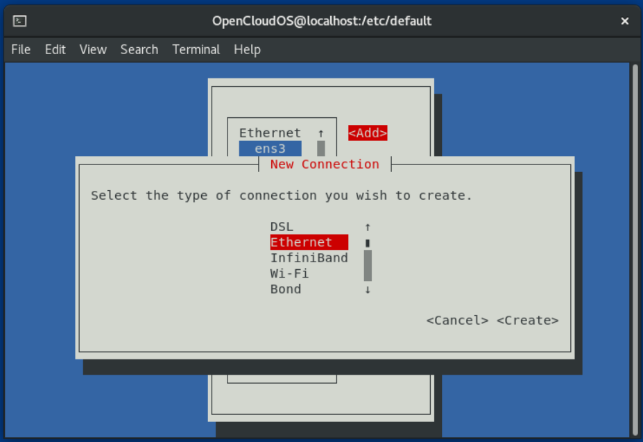
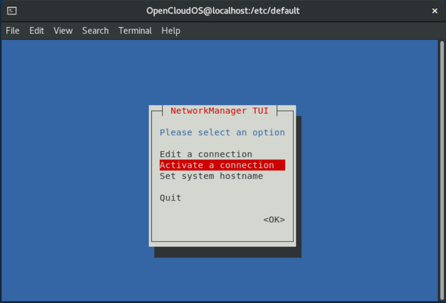
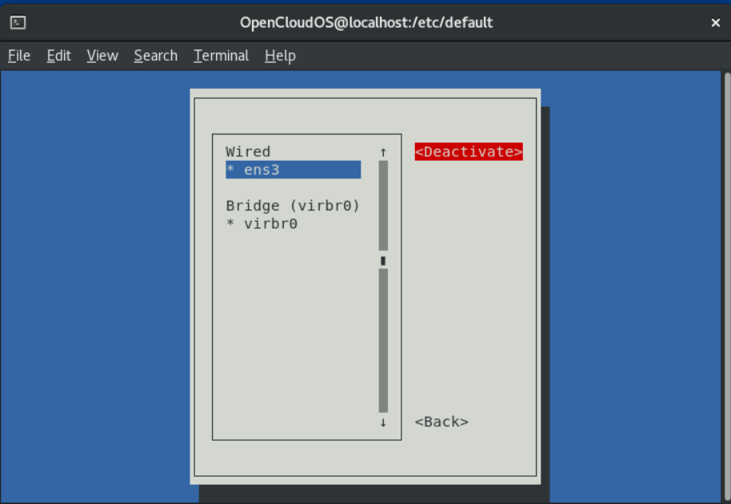
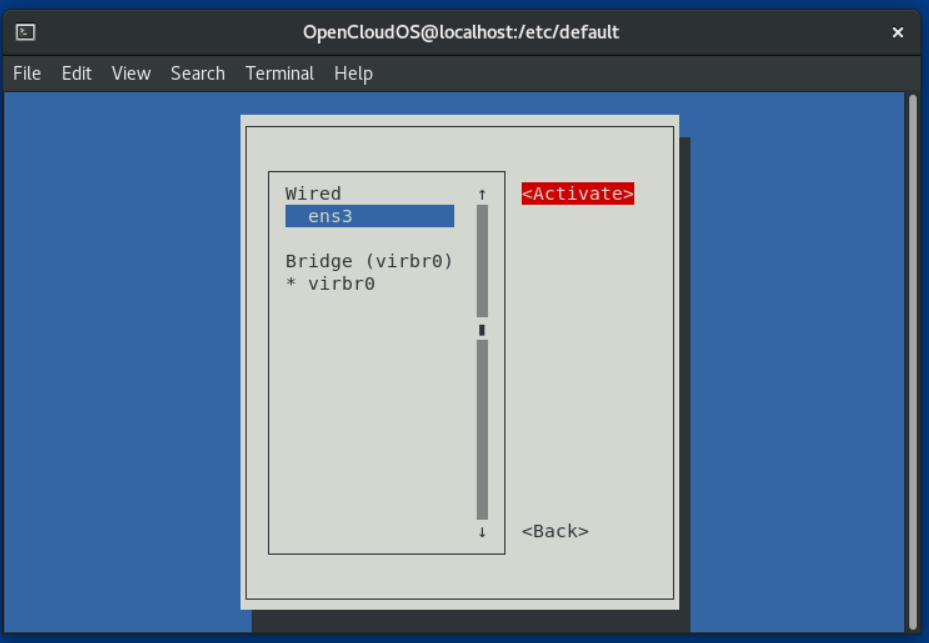
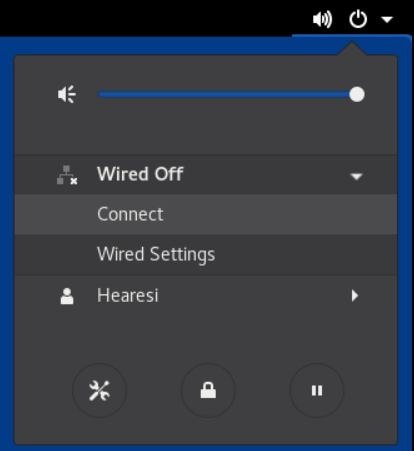

# 第1章 网卡接口命名规范

为了便于查找和区分网络接口，确保网络接口的一致性和可见性，OpenCloudOS提供了网络接口的命名规范。

网络接口名称由固定前缀和内核初始化网络设备生成的序列号组成。例如，eth0 代表启动时系统检测到的第一个网络设备，但是这些名称与主机外壳上的标签名不一定相对应。在具有多个网络适配器的服务器上可能会遇到接口命名不明确的的情况，这会影响系统中嵌入的网络适配器和附加适配器。

在OpenCloudOS中，udev 设备管理器支持多种命名方案。在默认情况下，udev 根据固件、拓扑和位置信息为设备分配名称，这样做有以下几个优点：

- 设备名称完全可预见。
- 添加或删除硬件不会改变设备名称，因为序列号不会重新生成。
- 便于有问题的硬件更换。

## 1.1 网络接口设备命名方案

以下是 udev 设备管理器默认设备命名方案：

| 方案  | 描述                                                 | 示例              |
| --- | -------------------------------------------------- | --------------- |
| 1   | 设备名称包含BIOS索引号或者固件，适用于主板上的设备。此方案不适用时，udev 将使用方案2。   | eno1            |
| 2   | 设备名称包含固件或者BIOS提供的PCIe热插件插槽索引号。此方案不适用时，udev 将使用方案3。 | ens1            |
| 3   | 设备名称包含硬件连接器的物理位置。此方案不适用时，udev 将使用方案5。              | enp2s0          |
| 4   | 设备名称包含MAC地址。OpenCloudOS默认不适用此方案，但管理员可选择性使用它。       | enx00ff2420b540 |
| 5   | 传统无法预见的内核命名方案。如果 udev 无法应用任何其他方案，则设备管理器使用这个方案。     | eth0            |

默认情况下，OpenCloudOS根据/usr/lib/systemd/network/99-default.link文件中的NamePolicy设置选择设备名称。NamePolicy中值的顺序非常重要。OpenCloudOS使用文件中指定的和 udev 生成的第一个设备名称。

如果您手动配置 udev 规则来更改内核设备名称，则这些规则优先。

## 1.2.网络设备重命名工作方式

默认情况下，OpenCloudOS启用相同的设备命名规则。udev 设备管理器会根据不同的方案来重命名设备。以下列表描述了 udev 处理这些方案的顺序，以及这些规则负责的操作：

1. /usr/lib/udev/rules.d/60-net.rules 文件定义了 /lib/udev/rename_device 帮助工具搜索 /etc/sysconfig/network-scripts/ifcfg-* 文件中的 HWADDR 参数。当网卡MAC地址与变量设置的值匹配时，帮助工具会将网卡接口重命名为文件的 DEVICE 参数中的名称。

2. /usr/lib/udev/rules.d/71-biosdevname.rules 文件定义了 biosdevname 工具如果设备在上一步中没有重命名，则根据其命名策略重命名接口。

3. /usr/lib/udev/rules.d/75-net-description.rules 文件定义了 udev 检查网络接口设备，并在 udev-internal 变量中设置在下一步中将要处理的属性。请注意，其中一些属性可能没有定义。

4. /usr/lib/udev/rules.d/80-net-setup-link.rules 文件调用内置的 net_setup_link udev ，然后应用重命名方案。以下是存储在 /usr/lib/systemd/network/99-default.link 文件中的默认策略：

    ```
    [Link]
    NamePolicy=kernel database onboard slot path
    MACAddressPolicy=persistent
    ```
    有了这个策略，如果内核使用持久名称，则 udev 不会重命名接口。如果内核不使用持久名称，则 udev 会将接口重命名为 udev 的硬件数据库提供的名称。如果这个数据库不可用，OpenCloudOS 会返回到上述机制中。

    另外，对于基于介质访问控制（MAC）地址的接口名称，将此文件中的 NamePolicy 参数设为 mac。

5. /usr/lib/udev/rules.d/80-net-setup-link.rules 文件定义了 udev 按以下顺序，根据 udev-internal 参数重命名接口：
    1. ID_NET_NAME_ONBOARD
    2. ID_NET_NAME_SLOT
    3. ID_NET_NAME_PATH
    如果没有设置参数，则 udev 将使用下一个参数。如果没有设置任何参数，接口就不会被重命名。

步骤3和4实现了网络接口设备命名方案中介绍的命名方案1到4。

## 1.3.x86_64平台上的可预测的网络接口名称解释

当启用了一致的网络设备名称特性时， udev 设备管理器会根据不同的标准创建设备名称。这部分解释了在 x86_64 平台上安装 OpenCloudOS 时的命名方案。

接口名称以两个字符前缀开始，该前缀基于接口类型：
- en 用于以太网
- wl 用于无限LAN（WLAN）
- ww 用于无线广域网（WWAN）

另外，以下之一会根据 udev 设备管理器应用的模式，附加到上述前缀中的一个：
- o<on-board_index_number> 
- s<hot_plug_slot_index_number>[f\<function>][d<device_id>] 
  
  请注意，所有多功能 PCI 设备在设备名称中都包含 [f\<function>] 号， 包括功能 0 设备。 
- x<MAC_address> 
- [P\<domain_number>]p\<bus>s\<slot>[f\<function>][d<device_id>] 
  
  [P\<domain_number>] 部分定义了 PCI 的物理位置。如果域号不是 0 ，才会设置此部分。
- [P\<domain_number>]p\<bus>s\<slot>[f\<function>][u<usb_port>][…​][c\<config>][i\<interface>]
  
  对于 USB 设备，hub 端口号的完整链由 hub 的端口号组成。如果名称大于最大值（15 个字符），则不会导出该名称。如果链中有多个 USB 设备，则 udev 会抑制 USB 配置描述符(c1)和 USB 接口描述符(i0)的默认值。

## 1.4.System z 平台中可预测的网络接口设备名称解释

当启用了一致的网络设备名称特性时，System z 平台上的 udev 设备管理器会根据总线 ID 创建设备名称。总线 ID 识别 s390 频道子系统中的一个设备。

对于通道命令词(CCW)设备，总线 ID 是前缀为 0.n 的设备号 ，其中 n 是子通道集 ID。

例如，以太网接口被命名为 enccw0.0.1234。例如,串行线互联网协议(SLIP)通道到通道(CTC)网络设备被命名为 slccw0.0.1234。

使用 znetconf -c 或 lscss -a 命令显示可用的网络设备及其总线 ID。

## 1.5.在安装过程中禁用接口设备命名规范

此节介绍了如何在安装过程中禁用接口设备命名规范。

```
OpenCloudOS建议不要禁用此规范。禁用接口设备命名规范可能会导致不同类型的问题，例如添加一个网卡后，内核分配的设备名称不会固定下来，每次重启后内核可以用不同的方案来为该网卡命名。
```

流程：
1. 引导 OpenCloudOS 安装介质
2. 在引导管理器中，选择 Install OpenCloudOS ，然后按 [Tab] 键来编辑该条目。
3. 在内核命令行中追加 net.ifnames=0 参数：

    ```
    vmlinu... net.ifnames=0
    ```
4. 按 [Enter] 键开始安装。

## 1.6.在已安装的系统中禁用接口设备命名规范

此节介绍了如何在已安装的Open Cloud OS系统上禁用接口设备命名规范。

```
OpenCloudOS建议不要禁用此规范。禁用接口设备命名规范可能会导致不同类型的问题，例如添加一个网卡后，内核分配的设备名称不会固定下来，每次重启后内核可以用不同的方案来为该网卡命名。
```

**前提条件**
- 系统已默认使用接口设备命名规范

**流程**
1. 编辑 /etc/default/grub 文件，并将 net.ifnames=0 参数追加到 GRUB_CMDLINE_LINUX 变量中：
   ```
   GRUB_CMDLINE_LINUX="... net.ifnames=0"
   ```
2. 重建 grub.cfg文件：
   - 在具有UEFI引导模式的系统上：
        ```
        # grub2-mkconfig -o /boot/efi/EFI/redhat/grub.cfg
        ```
   - 在使用旧引导模式的系统：
        ```
        # grub2-mkconfig -o /boot/grub2/grub.cfg
        ```
3. 显示当前的配置文件名称和相关联的设备名称：
   ```
   # nmcli -f NAME,DEVICE,FILENAME connection show
    NAME           DEVICE  FILENAME
    System enp1s0  enp1s0  /etc/sysconfig/network-scripts/ifcfg-enp1s0
    System enp7s0  enp7s0  /etc/NetworkManager/system-connections/enp7s0.nmconnection
   ```
   请注意各个设备与哪一个配置文件和文件名称相关联。
4. 从所有连接配置文件中删除 HWADDR 参数：
   ```
   # sed -i '/^HWADDR=/d' /etc/sysconfig/network-scripts/ifcfg-enp1s0 /etc/NetworkManager/system-connections/enp7s0.nmconnection
   ```
5. 显示与以太网设备相关连的 MAC 地址：
   ```
   # ip link show
   ...
   2: enp1s0: <BROADCAST,MULTICAST,UP,LOWER_UP> mtu 1500 qdisc fq_codel state UP mode DEFAULT group default qlen 1000
        link/ether 00:53:00:c5:98:1c brd ff:ff:ff:ff:ff:ff
   3: enp7s0: <BROADCAST,MULTICAST,UP,LOWER_UP> mtu 1500 qdisc fq_codel state UP mode DEFAULT group default qlen 1000
        link/ether 00:53:00:b6:87:c6 brd ff:ff:ff:ff:ff:ff
   ```
6. 重启主机：
   ```
   # reboot
   ```
7. 重启后，显示以太网设备，并根据 MAC 地址识别新的接口名称：
   ```
   # ip link show
    ...
    2: eth0: <BROADCAST,MULTICAST,UP,LOWER_UP> mtu 1500 qdisc fq_codel state UP mode DEFAULT group default qlen 1000
        link/ether 00:53:00:b6:87:c6 brd ff:ff:ff:ff:ff:ff
    3: eth1: <BROADCAST,MULTICAST,UP,LOWER_UP> mtu 1500 qdisc fq_codel state UP mode DEFAULT group default qlen 1000
        link/ether 00:53:00:c5:98:1c brd ff:ff:ff:ff:ff:ff
   ```
   如果您将当前输出与上一个输出进行比较：
   - 接口 enp7s0 ( MAC 地址 00:53:00:b6:87:c6 ) 现在被命名为 eth0 。
   - 接口 enp1s0 ( MAC 地址 00:53:00:c5:98:1c ) 现在被命名为 eth1 。
8. 重命名配置文件：
   ```
   # mv /etc/NetworkManager/system-connections/enp7s0.nmconnection /etc/NetworkManager/system-connections/eth0.nmconnection
   # mv /etc/sysconfig/network-scripts/ifcfg-enp1s0 /etc/sysconfig/network-scripts/ifcfg-eth1
   ```
9. 重新载入NetworkManager：
    ```
    # nmcli connetction reload
    ```
10. 如果在配置文件中没有设置文件名称，NetworkManager将使用默认值。要在重命名并重新载入连接后确定当前的配置文件名称，请使用以下命令：
    ```
    # nmcli -f NAME,DEVICE,FILENAME connection show
    NAME           FILENAME
    System enp7s0  /etc/NetworkManager/system-connections/eth0.nmconnection
    System enp1s0  /etc/sysconfig/network-scripts/ifcfg-eth1
    ```
    在下一步中配置文件名称。
11. 重命名NetworkManager连接配置文件，并更新每个配置文件中的接口名称：
    ```
    # nmcli connection modify "System enp7s0" connection.id eth0 connection.interface-name eth0
    # nmcli connection modify "System enp1s0" connection.id eth1 connection.interface-name eth1
    ```
12. 重新激活NetworkManager连接：
    ```
    # nmcli connection up eth0
    # nmcli connection up eth1
    ```

## 1.7.自定义以太网接口前缀

本节介绍了如何在Open Cloud OS安装过程中自定义以太网接口名称的前缀。

```
暂不支持在已安装的系统上使用 prefixdevname 工具自定义前缀。
```

在Open Cloud OS安装后，udev 服务会将以太网设备命名为 \<prefix>.\<index>的格式。例如，如果您希望使用 net 作为前缀，那么Open Cloud OS会将以太网接口命名为 net0 , net1 ,等等。

**前提条件**

- 要设置的前缀格式要求如下：
  - 由ASCII字符组成
  - 仅有字母和数字组成
  - 小于16个字符
  - 不与任何已有的网络接口前缀冲突，如 eth 、 eno 、 ens 和 em 。

**流程**

1. 引导Open Cloud OS安装介质。
2. 在引导管理器中：
   1. 选择 Install Open CLoud OS\<version> 选项，然后按 [Tab] 键编辑选项。
   2. 将 net.ifnames.prefix=\<prefix> 追加到内核选项中。
   3. 按 [Enter] 键启动安装程序。 
3. 安装Open Cloud OS。

**验证**

- 安装后，显示以太网接口：
  ```
  # ip link show
    ...
    2: net0: <BROADCAST,MULTICAST,UP,LOWER_UP> mtu 1500 qdisc fq_codel state UP mode DEFAULT group default qlen 1000
        link/ether 00:53:00:c5:98:1c brd ff:ff:ff:ff:ff:ff
    3: net1: <BROADCAST,MULTICAST,UP,LOWER_UP> mtu 1500 qdisc fq_codel state UP mode DEFAULT group default qlen 1000
        link/ether 00:53:00:c2:39:9e brd ff:ff:ff:ff:ff:ff
    ...
  ```

## 1.8.使用 udev 设备管理器分配自定义的网络接口名称

 udev 设备管理器支持一组规则来自定义接口名称

**流程**

1. 显示所有网络接口及其 MAC 地址：
   ```
   # ip link list

    enp6s0f0: <BROADCAST,MULTICAST,UP,LOWER_UP> mtu 1500 qdisc fq_codel state UP mode DEFAULT group default qlen 1000
        link/ether b4:96:91:14:ae:58 brd ff:ff:ff:ff:ff:ff
    enp6s0f1: <BROADCAST,MULTICAST,UP,LOWER_UP> mtu 1500 qdisc fq_codel state UP mode DEFAULT group default qlen 1000
        link/ether b4:96:91:14:ae:5a brd ff:ff:ff:ff:ff:ff
    enp4s0f0: <BROADCAST,MULTICAST,UP,LOWER_UP> mtu 1500 qdisc fq_codel state UP mode DEFAULT group default qlen 1000
        link/ether 00:90:fa:6a:7d:90 brd ff:ff:ff:ff:ff:ff
    ```
2. 创建具有以下内容的文件 /etc/udev/rules.d/70-custom-ifnames.rules ：
    ```
    SUBSYSTEM=="net",ACTION=="add",ATTR{address}=="b4:96:91:14:ae:58",ATTR{type}=="1",NAME="provider0"
    SUBSYSTEM=="net",ACTION=="add",ATTR{address}=="b4:96:91:14:ae:5a",ATTR{type}=="1",NAME="provider1"
    SUBSYSTEM=="net",ACTION=="add",ATTR{address}=="00:90:fa:6a:7d:90",ATTR{type}=="1",NAME="provider2"
    ```
    这些规则与网络接口的 MAC 地址相匹配，并将它们重命名为 NAME 属性中指定的名称。在这些示例中， ATTR{type} 参数值设置为1定义了接口类型为 Ethernet 。

**验证**

1. 重启系统：
    ```
    # reboot
    ```
2. 验证每个 MAC 地址的接口名称是否与您在规则文件中的 NAME 参数中设置的值相匹配：
    ```
    # ip link show

    provider0: <BROADCAST,MULTICAST,UP,LOWER_UP> mtu 1500 qdisc mq state UP mode DEFAULT group default qlen 1000
        link/ether b4:96:91:14:ae:58 brd ff:ff:ff:ff:ff:ff
    altname enp6s0f0
    provider1: <BROADCAST,MULTICAST,UP,LOWER_UP> mtu 1500 qdisc mq state UP mode DEFAULT group default qlen 1000
        link/ether b4:96:91:14:ae:5a brd ff:ff:ff:ff:ff:ff
        altname enp6s0f1
    provider2: <BROADCAST,MULTICAST,UP,LOWER_UP> mtu 1500 qdisc mq state UP mode DEFAULT group default qlen 1000
        link/ether 00:90:fa:6a:7d:90 brd ff:ff:ff:ff:ff:ff
        altname enp4s0f0
    ```

## 1.9.使用 systemd 链接文件分配用户定义的网络接口名称

通过将网络接口重命名为 provider0 来创建一个命名方案。

**流程**

1. 显示所有接口名称及其 MAC 地址：
    ```
    # ip link show

    enp6s0f0: <BROADCAST,MULTICAST,UP,LOWER_UP> mtu 1500 qdisc fq_codel state UP mode DEFAULT group default qlen 1000
        link/ether b4:96:91:14:ae:58 brd ff:ff:ff:ff:ff:ff
    enp6s0f1: <BROADCAST,MULTICAST,UP,LOWER_UP> mtu 1500 qdisc fq_codel state UP mode DEFAULT group default qlen 1000
        link/ether b4:96:91:14:ae:5a brd ff:ff:ff:ff:ff:ff
    enp4s0f0: <BROADCAST,MULTICAST,UP,LOWER_UP> mtu 1500 qdisc fq_codel state UP mode DEFAULT group default qlen 1000
        link/ether 00:90:fa:6a:7d:90 brd ff:ff:ff:ff:ff:ff
    ```
2. 将 MAC 地址为 b4:96:91:14:ae:58 的接口命名为 provider0 ，需要创建 /etc/systemd/network/70-custom-ifnames.link 文件并包含以下内容：
    ```
    [Match]
    MACAddress=b4:96:91:14:ae:58

    [Link]
    Name=provider0
    ```
    此链接文件与 MAC 地址相匹配，并将网络接口重命名为 Name 参数中设置的名称。

**验证**

1. 重启系统：
    ```
    # reboot
    ```
2. 验证 MAC 地址为您在文件中指定的设备是否已分配给 provider0 ：
    ```
    # ip link show

    provider0: <BROADCAST,MULTICAST,UP,LOWER_UP> mtu 1500 qdisc mq state UP mode DEFAULT group default qlen 1000
        link/ether b4:96:91:14:ae:58 brd ff:ff:ff:ff:ff:ff
    ```

# 第2章 NetworkManager 入门

默认情况下，Open Cloud OS使用NetworkManager管理和配置网络连接。

## 2.1.NetworkManager的优点

使用NetworkManager的主要优点是：
- 通过 D-Bus 提供 API，它允许查询和控制网络配置和状态。这样，多个应用程序就可以检查和配置网络，确保同步和最新的网络状态。例如， web 控制台（通过一个 web 浏览器监控和配置服务）使用 NetworkManager D-BUS 接口来配置网络，以及 Gnome GUI、nmcli 和 nm-connection-editor 工具。对这些工具所做的每个改变都会被其他所有用户检测到。
- 可以更方便的镜像网络配置：网络管理器（ NetworkManager）确保网络连接正常工作。当发现在系统中没有网络配置但存在网络设备时，NetworkManager 会创建临时连接以提供连接。
- 为用户提供简单的连接设置： NetworkManager 通过不同的工具提供管理 - GUI、nmtui、nmcli。
- 支持灵活配置。例如，配置 WiFi 接口，NetworkManager 会扫描并显示可用的 wifi 网络。您可以选择一个接口，NetworkManager 会显示在重启过程后提供自动连接所需的凭证。NetworkManager 可以配置网络别名、IP 地址、静态路由、DNS 信息和 VPN 连接以及很多具体连接的参数。您可以修改配置选项以配合您的需要。
- 重启过程后保持设备状态，并接管在重启过程中将其设定为受管模式的接口。
- 处理没有被显式设置但由用户或者其他网络设备手动控制的设备。

## 2.2.NetworkManager管理连接的工具与程序概述

您可以试用一下工具对NetworkManager连接进行管理：
- nmcli ：用来管理连接的命令行工具。
- nmtui ：基于鼠标光标到文本用户界面(TUI)。需要安装 NetworkManager-tui 软件包。
- nm-connection-editor ：用于与NetworkManager有关任务的图形化用户界面(GUI)。要启动这个程序，请在GNOME会话终端中输入 nm-connection-editor 。
- control-center ：GNOME shell 为桌面用户提供的GUI。请注意，这个程序支持的功能比 nm-connection-editor 少。
- GNOME shell 中的网络连接图标：此图标表示网络连接状态，并充当您在使用的连接类型的视觉指示符。

## 2.3.将手动配置的 ifcfg 文件加载到NetworkManager中

在 Open Cloud OS 中，如果您编辑了 ifcfg 文件，NetworkManager 不会自动获取该更改。如果您使用其中一个工具更新 NetworkManager 配置集设置，NetworkManager 不会实现这些更改，除非您使用该配置集重新连接。例如，如果使用编辑器修改了配置文件，NetworkManager 必须再次读取配置文件。

```
NetworkManager 支持以 keyfile 格式存储的配置集。但是，当使用 NetworkManager API 创建或更新配置文件时，NetworkManager 默认使用 ifcfg 格式。
```

/etc/sysconfig/ 目录是配置文件和脚本的位置。除 VPN、移动宽带和 PPPoE 配置外，大多数网络配置信息都存储在 /etc/NetworkManager/ 子目录中。例如，特定于接口的信息存储在 /etc/sysconfig/network-scripts/ 目录下的 ifcfg 文件中。

VPN、移动宽带和 PPPoE 连接的信息存储在 /etc/NetworkManager/system-connections/ 中。

**流程**

1. 要载入新的配置文件：
    ```
    # nmcli connection load /etc/sysconfig/network-scripts/ifcfg-connection_name
    ```
2. 如果您更新了已载入到NetworkManager中的连接文件，请输入：
    ```
    # nmcli connection up connection_name
    ```

# 第3章 配置NetworkManager以忽略某些设备

默认情况下，NetworkManager管理 lo (环回)设备以外的所有设备。但是，您可以配置NetworkManager忽略某些设备，将其设置为非受管设备。使用这个设置，您可以手动管理这些设备，例如使用脚本。

## 3.1.配置永久非受管设备

您可以根据几个标准，将设备配置为 unmanaged ，如接口名称、MAC 地址或设备类型。以下流程描述了如何在 NetworkManager 中将 enp1s0 接口永久设置为 unmanaged 。

**流程**

1. 可选：显示设备列表，以便识别您要将其设置为 unmanaged 的设备：
    ```
    # nmcli device status
    DEVICE  TYPE      STATE         CONNECTION
    enp1s0  ethernet  disconnected  --
    ...
    ```
2. 创建 /etc/NetworkManager/conf.d/99-unmanaged-devices.conf 文件：
    ```
    [keyfile]
    unmanaged-devices=interface-name:enp1s0
    ```
    要将多个设备设置为非受管，请使用分号分隔 unmanaged-devices 参数中的条目：
    ```
    [keyfile]
    unmanaged-devices=interface-name:interface_1;interface-name:interface_2;...
    ```
3. 重新载入NetworkManager服务：
    ```
    # systemctl reload NetworkManager
    ```

**验证**

- 显示设备列表：
    ```
    # nmcli device status
    DEVICE  TYPE      STATE      CONNECTION
    enp1s0  ethernet  unmanaged  --
    ...
    ```
    enp1s0 设备旁边的 unmanaged 状态表示 NetworkManager 没有管理该设备。

## 3.2.配置临时非受管设备

您可以根据几个标准，将设备配置为 unmanaged，如接口名称、MAC 地址或设备类型。这个流程描述了如何在 NetworkManager 中临时将 enp1s0 接口设置为 unmanaged 。

**流程**

1. 可选：显示设备列表，以便识别您要将其设置为 unmanaged 的设备：
    ```
    # nmcli device status
    DEVICE  TYPE      STATE         CONNECTION
    enp1s0  ethernet  disconnected  --
    ...
    ```
2. 将 enp1s0 设备设置为 unmanaged 状态：
    ```
    # nmcli device set enp1s0 managed no
    ```

**验证**

- 显示设备列表：
    ```
    # nmcli device status
    DEVICE  TYPE      STATE      CONNECTION
    enp1s0  ethernet  unmanaged  --
    ...
    ```
    enp1s0 设备旁边的 unmanaged 状态表示 NetworkManager 没有管理该设备。

# 第4章 使用nmtui文本界面管理网络连接

## 4.1.启动nmtui工具

**前提条件**

- 已安装 NetworkManager-tui 软件包

**流程**

1. 启动 nmtui ，在命令行输入：
    ```
    # nmtui
    ```
    
2. 进入 nmtui：
    - 在选项中，使用光标或按[Tab]键前进，按[Shift]+[Tab]后退。
    - 使用[Enter]选择一个选项。
    - 使用[Space]切换复选框状态。

## 4.2.使用nmtui添加连接配置集

**前提条件**

- 已安装 NetworkManager-tui 软件包

**流程**

1. 启动 nmtui ，在命令行输入：
    ```
    # nmtui
    ```
2. 选择 Edit a connection 选项，按[Enter]进入编辑。
3. 选择[Add]选项，按[Enter]进入。
4. 选择 Ethernet ，按[Enter]边界

5. 输入连接详情信息。

6. 选择[OK]保存更改。
7. 选择 Back 返回主菜单。
8. 选择 Activate a connection 并选择[Enter]。
9. 选择新的连接，点[Enter]键激活连接。
10. 选择[Back]返回主菜单。
11. 选择 Quit 。

**验证**

1. 显示设备和连接状态：
    ```
    # nmcli device status
    DEVICE      TYPE      STATE      CONNECTION
    ens3      ethernet  connected  ens3
    ```
2. 显示连接配置集的所有设置：
    ```
    # nmcli connection show ens3
    connection.id:                          ens3
    connection.uuid:                        f46c8406-74f4-458f-a884-a1889377aebc
    connection.stable-id:                   --
    connection.type:                        802-3-ethernet
    connection.interface-name:              ens3
    connection.autoconnect:                 yes
    connection.autoconnect-priority:        0
    ...
    ```
    注意，如果磁盘中的配置与设备中的配置不匹配，则启动或重启 NetworkManager 会创建一个代表该设备的配置的内存连接。

## 4.3.使用nmtui应用更改连接

在 nmtui 中修改了连接后，您必须重新激活连接。请注意，在 nmtui 中重新激活连接会临时停用连接。

**前提条件**

- 连接配置文件未启用 auto-connect 设置。

**流程**

1. 主菜单选择 Activate a connection 选项：
    
2. 选择修改的连接。
3. 在右侧，选择 Deactivate 按钮，然后按[Enter]键：
    
4. 再次选择连接。
5. 在右侧，选择 Activate 按钮，然后按[Enter]键：
    

# 第5章 nmcli 入门

## 5.1.不同格式的nmcli输出

nmcli 工具支持通过不同的参数控制命令的输出。通过使用这些选项，您可以只显示所需的信息。这简化了处理脚本中输出的过程。

默认情况下，nmcli 以类似于表格的格式显示其输出：
```
# nmcli device
DEVICE      TYPE      STATE                   CONNECTION
ens3        ethernet  connected               ens3
virbr0      bridge    connected (externally)  virbr0
lo          loopback  unmanaged               --
virbr0-nic  tun       unmanaged               --
```

使用 -f 参数，您可以按自定义的顺序显示列，例如：
```
# nmcli -f DEVICE,STATE device
DEVICE      STATE
ens3        connected
virbr0      connected (externally)
lo          unmanaged
virbr0-nic  unmanaged
```

使用 -t 参数以冒号分隔的形式显示输出每个字段：
```
# nmcli -t device
ens3:ethernet:connected:ens3
virbr0:bridge:connected (externally):virbr0
lo:loopback:unmanaged:
virbr0-nic:tun:unmanaged:
```

当您使用脚本来处理输出时，将 -f 和 -t 组合，可以只显示冒号分隔形式的特定字段：
```
# nmcli -f DEVICE,STATE -t device
ens3:connected
virbr0:connected (externally)
lo:unmanaged
virbr0-nic:unmanaged
```

## 5.2.使用tab键自动补全nmcli命令

如果您的主机上安装了 bash-completion 软件包，则 nmcli 工具将支持选项卡补全功能。这可让您自动完成选项名称，并识别可能的选项和值。

例如，如果您输入 nmcli con ，并按 Tab 键，则 shell 会自动补全命令 nmcli connection。

您所输入的选项或值必须是唯一的。如果它不唯一，则 nmcli 会显示所有可能的选项。例如，如果您输入 nmcli connection d ，并按 Tab ，则命令将显示命令 delete 和 down 来作为可能的选项。

您还可以使用 tab 自动完成来显示连接配置集中可以设置的所有属性。例如，如果您输入 nmcli connection modify connection_name ，并按 Tab，命令将显示可用属性的完整列表。

## 5.3.常用的nmcli命令

- 显示连接配置集列表：
    ```
    # nmcli connection show
    NAME    UUID                                  TYPE      DEVICE
    ens3    f46c8406-74f4-458f-a884-a1889377aebc  ethernet  ens3
    ```

- 显示指定连接的配置：
    ```
    # nmcli connection show CONNECTION-NAME
    connection.id:                          ens3
    connection.uuid:                        f46c8406-74f4-458f-a884-a1889377aebc
    connection.stable-id:                   --
    connection.type:                        802-3-ethernet
    connection.interface-name:              ens3
    connection.autoconnect:                 yes
    ...
    ```

- 修改连接属性：
    ```
    nmcli connection modify CONNECTION-NAME PROPERTY VALUE
    ```
    支持使用了多个 PROPERTY VALUE 组合同时修改多个属性。

- 显示网络设备、状态、类型和连接集列表：
    ```
    # nmcli device
    DEVICE      TYPE      STATE                   CONNECTION
    ens3        ethernet  connected               ens3
    ...
    ```

- 激活连接：
    ```
    # nmcli connection up CONNECTION-NAME
    ```

- 取消激活连接：
    ```
    # nmcli connection down CONNECTION-NAME
    ```

# 第6章 使用GNOME GUI配置网络入门

您可以在 GNOME 中使用以下方法管理和配置网络连接：

- 桌面右上角的 GNOME Shell 网络连接图标
- GNOME control-center 应用程序
- GNOME nm-connection-editor 应用程序

## 6.1.通过桌面图标管理网络连接

**前提条件**

- GNOME 软件包组已安装。
- 您已登录到 GNOME。
- 如果网络需要特定的配置，如静态 IP 地址或 802.1x 配置,则需要已创建了连接配置集。

**流程**

1. 点击桌面右上角的网络连接图标。

    

2. 根据连接类型，选择 Wired 或 Wi-Fi 。

    

3. 对于有线连接，请选择 Connect 来连接到网络。


4. 对于 Wi-Fi 连接，点击 Select network，选择您要连接的网络，然后输入密码

