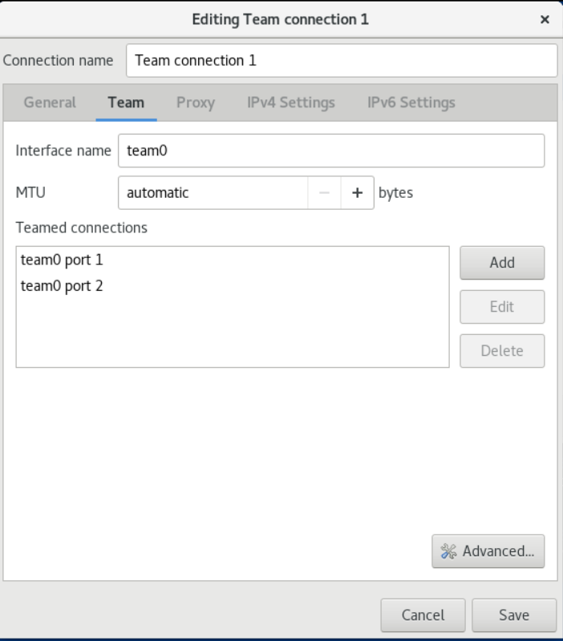
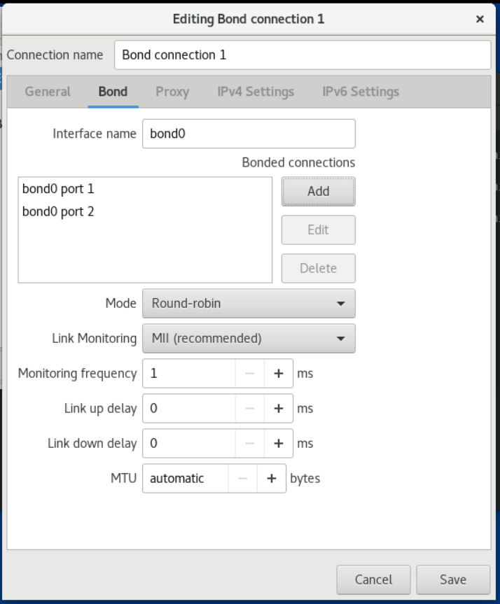
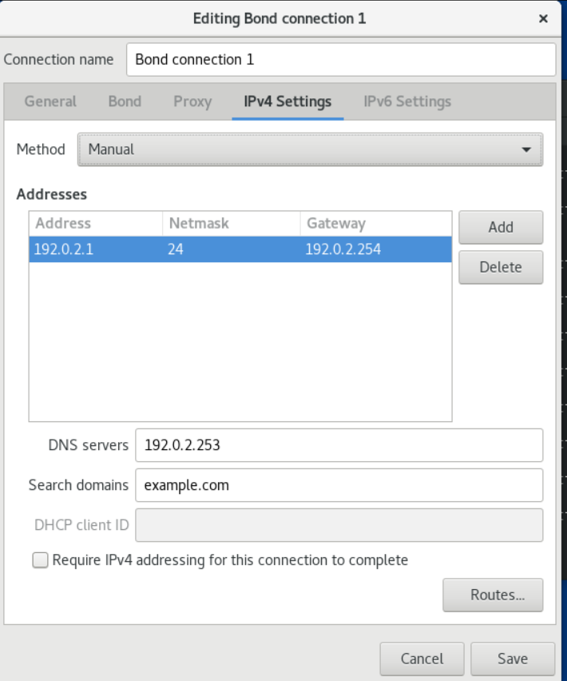
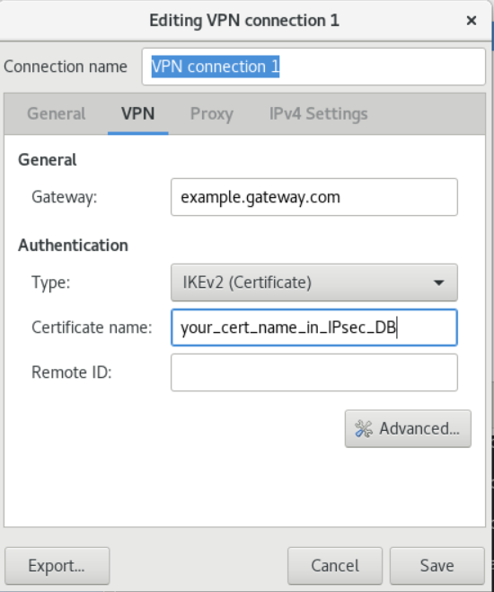

# 第 13 章 配置网络团队（team）

## 13.1.网络团队简介

网络团队（network teaming）是一个合并或聚合网络接口的功能，它提供了一个高吞吐量或冗余的逻辑接口。

网络团队使用内核驱动程序来实现对数据包流、用户空间库以及用于其他任务的服务的快速处理。因此，网络团队是一个易扩展的解决方案，来满足负载均衡和冗余的要求。

## 13.2.了解控制器和端口接口的默认配置

在使用 NetworkManager 服务管理或排除团队或绑定端口接口故障时，请考虑以下默认配置：
- 启动控制器接口不会自动启动端口接口。
- 启动端口接口总会启动控制器接口。
- 停止控制器接口也会停止端口接口。
- 没有端口的控制器可以启动静态 IP 连接。
- 没有端口的控制器在启动 DHCP 连接时会等待端口。
- 当您添加带有载波的端口时，具有 DHCP 连接的控制器会等待端口完成。
- 当您添加不具有载波的端口时，具有 DHCP 连接的控制器继续等待端口。

## 13.3.网络团队和绑定功能的比较

网络团队和绑定功能的比较：

|功能                             |网络绑定|网络团队|
|---------------------------------|--------|-------|
|广播 Tx 策略                      |是      |是      |
|轮询 Tx 策略                      |是      |是      |
|Active-backup Tx 策略             |是      |是      |
|LACP（802.3ad）支持               |是(仅活动)|是      |
|基于 hash 的 Tx 策略              |是      |是      |
|用户可以设置哈希功能              |否      |是      |
|TX 负载均衡支持（TLB）            |是      |是      |
|LACP 哈希端口选择                 |是      |是      |
|LACP 支持的负载均衡               |否      |是      |
|ethtool 链接监控                  |是      |是      |
|ARP 链路监控                      |是      |是      |
|NS/NA（IPv6）链路监控             |否      |是      |
|端口启动/关闭延时                 |是      |是      |
|端口优先级和粘性（"主要" 选项增强）|否      |是      |
|独立的每个端口链路监控设置         |否      |是      |
|多个链路监控设置                  |有限    |是      |
|Lockless Tx/Rx 路径              |否(rwlock)|是(RCU) |
|VLAN 支持                        |是      |是      |
|用户空间运行时控制                |有限    |是      |
|用户空间中的逻辑                  |否      |是      |
|可扩展性                          |难      |易      |
|模块化设计                        |否      |是      |
|性能开销                          |低      |非常低  |
|D-Bus 接口                        |否      |是      |
|多设备堆栈                        |是      |是      |
|使用 LLDP 时零配置                |否      |(计划中)|
|NetworkManager 支持              |是      |是      |

## 13.4.了解 teamd 服务、运行程序和 link-watchers

团队服务 teamd 团队驱动程序控制的一个实例。这个驱动的实例添加硬件设备驱动程序实例组成一个网络接口组。团队驱动程序向内核提供一个网络接口，如 team0。

teamd 服务对所有团队方法的实现提供通用的逻辑。这些功能对不同的负载共享和备份方法（如循环）是唯一的，并由称为 runners 的单独的代码单元来实现。管理员以 JavaScript 对象表示法(JSON)格式指定runners ，在创建实例时，JSON 代码被编译到 teamd 实例中。另外，在使用 NetworkManager 时，您可以在 team.runner 参数中设置 runner ，NetworkManager 会自动创建对应的 JSON 代码。

可用的 runner 如下：

- broadcast ：转换所有端口上的数据。
- roundrobin ：依次转换所有端口上的数据。
- activebackup ：转换一个端口上的数据，而其他端口上的数据则作为备份保留。
- loadbalance：转换所有具有活跃的 Tx 负载均衡和基于 Berkeley 数据包过滤器(BPF)的 Tx 端口选择器的端口上的数据。
- random ：转换随机选择的端口上的数据。
- lacp ：实现 802.3ad 链路聚合控制协议(LACP)。


teamd 服务使用链路监视器来监控从属设备的状态。可用的 link-watchers 如下：

- ethtool ：libteam 库使用 ethtool 工具来监视链接状态的变化。这是默认的 link-watcher。
- arp_ping: libteam 库使用 arp_ping 工具来监控使用地址解析协议(ARP)的远端硬件地址是否存在。
- nsna_ping: 在 IPv6 连接上，libteam 库使用来自 IPv6 邻居发现协议的邻居广告和邻居请求功能来监控邻居接口的存在。

每个 runner 都可以使用任何链接监视器，但 lacp 除外。此 runner 只能使用 ethtool 链接监视器。

## 13.5.安装 teamd 服务

要在 NetworkManager 中配置网络团队，您需要 NetworkManager 的 teamd 服务和团队插件。默认情况下，它们都安装在 OpenCloudOS 上。

```
# yum install teamd NetworkManager-team
```

## 13.6.使用 nmcli 命令配置网络团队

**前提条件**

- 在服务器中安装两个或者两个以上物理或者虚拟网络设备。
- 要将以太网设备用作团队的端口，必须在服务器中安装物理或者虚拟以太网设备并连接到交换机。
- 要将 bond、bridge 或 VLAN 设备用作团队的端口，您可以在创建团队时创建这些设备，或者预先创建它们。

**流程**

1. 创建团队接口：
    ```
    # nmcli connection add type team con-name team0 ifname team0 team.runner activebackup
    ```
    此命令创建一个使用 activebackup runner、名为 team0 的网络团队。
2. 设置链接监视器。例如，要在 team0 连接配置文件中设置 ethtool 链接监视器：
    ```
    # nmcli connection modify team0 team.link-watchers "name=ethtool"
    ```
    链路监视器支持不同的参数。要为链路监视器设置参数，请在 name 属性中以空格分隔的方式来指定它们。请注意，name 属性必须用引号包围起来。例如，要使用 ethtool 链接监视器，并将其 delay-up 参数设置为 2500 毫秒（2.5 秒）：
    ```
    # nmcli connection modify team0 team.link-watchers "name=ethtool delay-up=2500"
    ```
    要设置多个链路监视器，每个都使用特定的参数，不同的连接监视器以逗号分隔。以下示例使用 delay-up 参数设置 ethtool 链接监视器，使用 source-host 和 target-host 参数设置 arp_ping 链路监视器：
    ```
    # nmcli connection modify team0 team.link-watchers "name=ethtool delay-up=2, name=arp_ping source-host=192.0.2.1 target-host=192.0.2.2"
    ```
3. 显示网络接口，并记录您要添加到团队中的接口名称：
    ```
    # nmcli device status
    DEVICE  TYPE      STATE         CONNECTION
    enp7s0  ethernet  disconnected  --
    enp8s0  ethernet  disconnected  --
    bond0   bond      connected  bond0
    bond1   bond      connected  bond1
    ...
    ```
    在本例中：
    - 没有配置 enp7s0 和 enp8s0 。要将这些设备用作端口，请在下一步中添加连接配置集。请注意，您只能在没有分配给任何连接的团队中使用以太网接口。
    - bond0 和 bond1 已有连接配置文件。要将这些设备用作端口，请在下一步中修改其配置集。
4. 为团队分配端口接口：
   1. 如果没有配置您要分配给团队的接口，为其创建新的连接配置集：
        ```
        # nmcli connection add type ethernet slave-type team con-name team0-port1 ifname enp7s0 master team0
        # nmcli connection add type ethernet slave-type team con-name team0-port2 ifname enp8s0 master team0
        ```
        这些命令为 enp7s0 和 enp8s0 创建配置文件，并将它们添加到 team0 连接中。
   2. 要现有的连接配置文件分配给团队，请将这些连接的 master 参数设为 team0 ：
        ```
        # nmcli connection modify bond0 master team0
        # nmcli connection modify bond1 master team0
        ```
        这些命令将名为 bond0 和 bond1 的现有连接配置文件分配给 team0 连接。

5. 配置团队的 IP 设置。如果要使用这个团队作为其它设备的端口，请跳过这一步。
   1. 配置 IPv4 设置。例如：要设置 team0 连接的静态 IPv4 地址、网络掩码、默认网关、DNS 服务器和 DNS 搜索域，请输入：
        ```
        # nmcli connection modify team0 ipv4.addresses '192.0.2.1/24'
        # nmcli connection modify team0 ipv4.gateway '192.0.2.254'
        # nmcli connection modify team0 ipv4.dns '192.0.2.253'
        # nmcli connection modify team0 ipv4.dns-search 'example.com'
        # nmcli connection modify team0 ipv4.method manual
        ```
   2. 配置 IPv6 设置。例如：要设置 team0 连接的静态 IPv6 地址、网络掩码、默认网关、DNS 服务器和 DNS 搜索域，请输入：
        ```
        # nmcli connection modify team0 ipv6.addresses '2001:db8:1::1/64'
        # nmcli connection modify team0 ipv6.gateway '2001:db8:1::fffe'
        # nmcli connection modify team0 ipv6.dns '2001:db8:1::fffd'
        # nmcli connection modify team0 ipv6.dns-search 'example.com'
        # nmcli connection modify team0 ipv6.method manual
        ```
6. 激活连接：
    ```
    # nmcli connection up team0
    ```

**验证**

- 显示团队状态：
    ```
    # teamdctl team0 state
    setup:
    runner: activebackup
    ports:
    enp7s0
        link watches:
        link summary: up
        instance[link_watch_0]:
            name: ethtool
            link: up
            down count: 0
    enp8s0
        link watches:
        link summary: up
        instance[link_watch_0]:
            name: ethtool
            link: up
            down count: 0
    runner:
    active port: enp7s0
    ```
    在这个示例中，两个端口都是上线的。

## 13.7.使用 nm-connection-editor 配置网络团队

本节介绍了如何使用 nm-connection-editor 应用程序配置网络团队。

请注意：nm-connection-editor 只能向团队添加新端口。要使用现有的连接配置文件作为端口，请使用 nmcli 工具来创建团队，如 使用 nmcli 命令配置网络团队 中所述。

**前提条件**

- 在服务器中安装两个或者两个以上物理或者虚拟网络设备。
- 要将以太网设备用作团队的端口，必须在服务器中安装物理或者虚拟以太网设备。
- 要使用 team、bond 或 VLAN 设备作为团队的端口，请确保这些设备还没有配置。

**流程**

1. 在终端输入 nm-connection-editor 。
2. 点击 + 按钮来添加一个新的连接。
3. 选择 Team 连接类型，然后单击 Create。
4. 在 Team 选项卡中：
   1. 可选：在 Interface name 字段中设置团队接口的名称。
   2. 点击 Add 按钮为网络接口添加新连接配置集，并将配置集作为端口添加到团队。
      1. 选择接口的连接类型。例如，为有线连接选择 Ethernet。
      2. 可选：为端口设置连接名称。
      3. 如果您要为以太网设备创建一个连接配置文件，请打开 Ethernet 选项卡，然后在 Device 字段中选择您要作为端口添加到团队的网络接口。如果您选择了不同的设备类型，请相应地进行配置。请注意，您只能在没有分配给任何连接的团队中使用以太网接口。
      4. 点 Save。
   3. 对您要添加到团队的每个接口重复前面的步骤。
   
   4. 点 Advanced 按钮将高级选项设置为团队连接。
      1. 在 Runner 选项卡中，选择 runner。
      2. 在 Link Watcher 选项卡中，设置链接监视器及其可选设置。
      3. 点确定。
5. 配置团队的 IP 设置。如果要使用这个团队作为其它设备的端口，请跳过这一步。
   1. 在 IPv4 Settings 选项卡中，配置 IPv4 设置。例如，设置静态 IPv4 地址、网络掩码、默认网关、DNS 服务器和 DNS 搜索域： 
   
   2. 在 IPv6 Settings 选项卡中，配置 IPv6 设置。例如，设置静态 IPv6 地址、网络掩码、默认网关、DNS 服务器和 DNS 搜索域：
   
6. 保存团队连接。
7. 关闭 nm-connection-editor。

**验证**

- 显示团队状态：
    ```
    # teamdctl team0 state
    setup:
    runner: activebackup
    ports:
    enp7s0
        link watches:
        link summary: up
        instance[link_watch_0]:
            name: ethtool
            link: up
            down count: 0
    enp8s0
        link watches:
        link summary: up
        instance[link_watch_0]:
            name: ethtool
            link: up
            down count: 0
    runner:
    active port: enp7s0
    ```


# 第14章 配置网络绑定

## 14.1.网络绑定简介

网络绑定（network bonding）是组合或者整合网络接口的方法，以便提供一个高吞吐量或冗余的逻辑接口。

active-backup、balance-tlb 和 balance-alb 模式不需要网络交换机的任何具体配置。然而，其他绑定模式需要配置交换机来聚合链接。例如，对于模式 0、2 和 3，Cisco 交换机需要 EtherChannel ，但对于模式 4，需要链接聚合控制协议(LACP)和 EtherChannel。

## 14.2.控制器和端口接口的默认配置

在使用 NetworkManager 服务管理或排除团队或绑定端口接口故障时，请考虑以下默认配置：

- 启动控制器接口不会自动启动端口接口。
- 启动端口接口总会启动控制器接口。
- 停止控制器接口也会停止端口接口。
- 没有端口的控制器可以启动静态 IP 连接。
- 没有端口的控制器在启动 DHCP 连接时会等待端口。
- 当您添加带有载波的端口时，具有 DHCP 连接的控制器会等待端口完成。
- 当您添加不具有载波的端口时，具有 DHCP 连接的控制器继续等待端口。

## 14.3.网络团队和绑定功能的比较

网络团队和绑定功能的比较：

|功能                             |网络绑定|网络团队|
|---------------------------------|--------|-------|
|广播 Tx 策略                      |是      |是      |
|轮询 Tx 策略                      |是      |是      |
|Active-backup Tx 策略             |是      |是      |
|LACP（802.3ad）支持               |是(仅活动)|是      |
|基于 hash 的 Tx 策略              |是      |是      |
|用户可以设置哈希功能              |否      |是      |
|TX 负载均衡支持（TLB）            |是      |是      |
|LACP 哈希端口选择                 |是      |是      |
|LACP 支持的负载均衡               |否      |是      |
|ethtool 链接监控                  |是      |是      |
|ARP 链路监控                      |是      |是      |
|NS/NA（IPv6）链路监控             |否      |是      |
|端口启动/关闭延时                 |是      |是      |
|端口优先级和粘性（"主要" 选项增强）|否      |是      |
|独立的每个端口链路监控设置         |否      |是      |
|多个链路监控设置                  |有限    |是      |
|Lockless Tx/Rx 路径              |否(rwlock)|是(RCU) |
|VLAN 支持                        |是      |是      |
|用户空间运行时控制                |有限    |是      |
|用户空间中的逻辑                  |否      |是      |
|可扩展性                          |难      |易      |
|模块化设计                        |否      |是      |
|性能开销                          |低      |非常低  |
|D-Bus 接口                        |否      |是      |
|多设备堆栈                        |是      |是      |
|使用 LLDP 时零配置                |否      |(计划中)|
|NetworkManager 支持              |是      |是      |

## 14.4.绑定模式对应上游交换机配置

下表描述了根据绑定模式，您必须对上游交换机应用哪些设置：

|绑定模式        |交换机上的配置              |
|--------|--------------|
|0 - balance-rr        |需要启用静态的 Etherchannel（未启用 LACP 协商）              |
|1 - active-backup        |需要可自主端口              |
|2 - balance-xor        |需要启用静态的 Etherchannel（未启用 LACP 协商）              |
|3 - broadcast        |需要启用静态的 Etherchannel（未启用 LACP 协商）              |
|4 - 802.3ad        |需要启用 LACP 协商的 Etherchannel              |
|5 - balance-tlb        |需要可自主端口              |
|6 - balance-alb        |需要可自主端口              |

有关在交换机中配置这些设置，请查看交换机文档。

## 14.5.使用 nmcli 命令配置网络绑定

**前提条件**

- 在服务器中安装两个或者两个以上物理或者虚拟网络设备。
- 要将以太网设备用作团队的端口，必须在服务器中安装物理或者虚拟以太网设备并连接到交换机。
- 要将 bond、bridge 或 VLAN 设备用作团队的端口，您可以在创建团队时创建这些设备，或者预先创建它们。

**流程**

1. 创建绑定接口
    ```
    # nmcli connection add type bond con-name bond0 ifname bond0 bond.options "mode=active-backup"
    ```
    这个命令会创建一个使用 active-backup 模式、名为 bond0 的绑定。

    要额外设置介质独立接口(MII)监控间隔，请在 bond.options 属性中添加 miimon=interval 选项。例如，要使用同样的命令，但还需要将 MII 监控间隔设为 1000 毫秒（1 秒），请输入：
    ```
    # nmcli connection add type bond con-name bond0 ifname bond0 bond.options "mode=active-backup,miimon=1000"
    ```

2. 显示网络接口选择添加到绑定中的接口
    ```
    # nmcli device status
    DEVICE   TYPE      STATE         CONNECTION
    enp7s0   ethernet  disconnected  --
    enp8s0   ethernet  disconnected  --
    bridge0  bridge    connected     bridge0
    bridge1  bridge    connected     bridge1
    ...
    ```

    在本例中：
    - 没有配置 enp7s0 和 enp8s0 。要将这些设备用作端口，请在下一步中添加连接配置集。
    - bridge0 和 bridge1 都有现有的连接配置文件。要将这些设备用作端口，请在下一步中修改其配置集。

3. 为绑定分配接口
   1. 如果没有配置您要分配给绑定的接口，为其创建新的连接配置集：
        ```
        # nmcli connection add type ethernet slave-type bond con-name bond0-port1 ifname enp7s0 master bond0
        # nmcli connection add type ethernet slave-type bond con-name bond0-port2 ifname enp8s0 master bond0
        ```
        这些命令为 enp7s0 和 enp8s0 创建配置文件，并将它们添加到 bond0 连接中。
   2. 要将现有连接的配置文件分配给绑定，请将这些连接的 master 参数设为 bond0 ：
        ```
        # nmcli connection modify bridge0 master bond0
        # nmcli connection modify bridge1 master bond0
        ```
        这些命令将名为 bridge0 和 bridge1 的现有连接配置文件分配给 bond0 连接。

4. 配置绑定的 IP 设置。如果要使用这个绑定作为其它设备的端口，请跳过这一步。
   1. 配置 IPv4 设置。例如，要对 bond0 连接设置静态 IPv4 地址、网络掩码、默认网关、DNS 服务器和 DNS 搜索域设置，请输入：
        ```
        # nmcli connection modify bond0 ipv4.addresses '192.0.2.1/24'
        # nmcli connection modify bond0 ipv4.gateway '192.0.2.254'
        # nmcli connection modify bond0 ipv4.dns '192.0.2.253'
        # nmcli connection modify bond0 ipv4.dns-search 'example.com'
        # nmcli connection modify bond0 ipv4.method manual
        ```
   2. 配置 IPv6 设置。例如，要对 bond0 连接设置静态 IPv6 地址、网络掩码、默认网关、DNS 服务器和 DNS 搜索域设置，请输入：
        ```
        # nmcli connection modify bond0 ipv6.addresses '2001:db8:1::1/64'
        # nmcli connection modify bond0 ipv6.gateway '2001:db8:1::fffe'
        # nmcli connection modify bond0 ipv6.dns '2001:db8:1::fffd'
        # nmcli connection modify bond0 ipv6.dns-search 'example.com'
        # nmcli connection modify bond0 ipv6.method manual
        ```

5. 激活连接：
    ```
    # nmcli connection up bond0
    ```

6. 验证端口是否已连接，并且 CONNECTION 列是否显示端口的连接名称：
    ```
    # nmcli device
    DEVICE   TYPE      STATE      CONNECTION
    ...
    enp7s0   ethernet  connected  bond0-port1
    enp8s0   ethernet  connected  bond0-port2
    ```
    当您激活连接的任何端口时，NetworkManager 也激活绑定，但不会激活它的其它端口。您可以配置 OpenCloudOS ，在启用绑定时自动启用所有端口：
    1. 启用绑定连接的 connection.autoconnect-slaves 参数：
        ```
        # nmcli connection modify bond0 connection.autoconnect-slaves 1
        ```
    2. 重新激活桥接：
        ```
        # nmcli connection up bond0
        ```

**验证**

1. 在主机中暂时拔掉网线。

请注意，无法使用软件工具正确测试链路失败事件。停用连接的工具（如 nmcli ），只显示绑定驱动程序可以处理端口配置的更改，而不是实际的链接失败事件。

2. 显示绑定状态
    ```
    # cat /proc/net/bonding/bond0
    ```

## 14.6.使用 nm-connection-editor 配置网络绑定

本节介绍了如何使用 nm-connection-editor 应用程序配置网络绑定。

请注意：nm-connection-editor 只能向绑定添加新端口。要使用现有连接配置文件作为端口，请使用 nmcli 工具创建绑定。

**前提条件**

- 在服务器中安装两个或者两个以上物理或者虚拟网络设备。
- 要将以太网设备用作绑定的端口，必须在服务器中安装物理或者虚拟以太网设备。
- 要使用 team、bond 或 VLAN 设备作为绑定的端口，请确保这些设备还没有配置

**流程**

1. 在终端中输入 nm-connection-editor 。
2. 点击 + 按钮来添加一个新的连接。
3. 选择 Bond 连接类型，再单击 Create。
4. 在 Bond 选项卡中：
   1. 可选：在 Interface name 字段中设置绑定接口的名称。
   2. 单击 Add 按钮，将网络接口作为端口添加到绑定中。
      1. 选择接口的连接类型。例如，为有线连接选择 Ethernet。
      2. 可选：为端口设置连接名称。
      3. 如果您要为以太网设备创建连接配置文件，请打开 Ethernet 选项卡，在 Device 字段中选择您要作为端口添加到绑定的网络接口。如果您选择了不同的设备类型，请相应地进行配置。请注意，您只能在没有配置的绑定中使用以太网接口。
      4. 点 Save。
   3. 对您要添加到绑定的每个接口重复前面的步骤：
   
   4. 可选：设置其他选项，如介质独立接口（MII）监控间隔。
5. 配置绑定的 IP 设置。如果要使用这个绑定作为其它设备的端口，请跳过这一步。
   1. 在 IPv4 Settings 选项卡中，配置 IPv4 设置。例如，设置静态 IPv4 地址、网络掩码、默认网关、DNS 服务器和 DNS 搜索域：
   
   2. 在 IPv6 Settings 选项卡中，配置 IPv6 设置。例如，设置静态 IPv6 地址、网络掩码、默认网关、DNS 服务器和 DNS 搜索域：
   
6. 点 Save 保存绑定连接。
7. 关闭 nm-connection-editor。

**验证**

1. 在主机中暂时拔掉网线。

请注意，无法使用软件工具正确测试链路失败事件。停用连接的工具（如 nmcli ），只显示绑定驱动程序可以处理端口配置的更改，而不是实际的链接失败事件。

2. 显示绑定状态
    ```
    # cat /proc/net/bonding/bond0
    ```

## 14.7.使用 nmstatectl 配置网络绑定

**前提条件**

- 在服务器中安装两个或者两个以上物理或者虚拟网络设备。
- 要将以太网设备用作绑定中的端口，必须在服务器中安装物理或者虚拟以太网设备。
- 要在绑定中使用团队、网桥或 VLAN 设备作为端口，请在 port 列表中设置接口名称，并定义相应的接口。
- nmstate 软件包已安装。

**流程**

1. 创建 ~/create-bond.yml YAML文件：

    ```
    ---
    interfaces:
    - name: bond0
    type: bond
    state: up
    ipv4:
        enabled: true
        address:
        - ip: 192.0.2.1
        prefix-length: 24
        dhcp: false
    ipv6:
        enabled: true
        address:
        - ip: 2001:db8:1::1
        prefix-length: 64
        autoconf: false
        dhcp: false
    link-aggregation:
        mode: active-backup
        port:
        - enp1s0
        - enp7s0
    - name: enp1s0
    type: ethernet
    state: up
    - name: enp7s0
    type: ethernet
    state: up

    routes:
    config:
    - destination: 0.0.0.0/0
        next-hop-address: 192.0.2.254
        next-hop-interface: bond0
    - destination: ::/0
        next-hop-address: 2001:db8:1::fffe
        next-hop-interface: bond0

    dns-resolver:
    config:
        search:
        - example.com
        server:
        - 192.0.2.200
        - 2001:db8:1::ffbb
    ```
2. 应用设置：
    ```
    # nmstatectl apply /create-bond.yml
    ```

**验证**

1. 显示设备和连接的状态：
    ```
    # nmcli device status
    DEVICE      TYPE      STATE      CONNECTION
    bond0       bond      connected  bond0
    ```
2. 显示连接配置集的所有设置：
    ```
    # nmcli connection show bond0
    connection.id:              bond0
    connection.uuid:            79cbc3bd-302e-4b1f-ad89-f12533b818ee
    connection.stable-id:       --
    connection.type:            bond
    connection.interface-name:  bond0
    ...
    ```
3. 以 YAML 格式显示连接设置：
    ```
    # nmstatectl show bond0
    ```

## 14.8.使用 rhel-system-roles 软件配置网络绑定

**前提条件**

- ansible 和 rhel-system-roles 软件包已安装在控制节点上。
- 如果您在运行 playbook 时使用了非 root 用户，则要求此用户在受管节点上具有对应的 sudo 权限。
- 在服务器中安装两个或者两个以上物理或者虚拟网络设备。

**流程**

1. 如果您用来执行 playbook 中指令的主机还没有被列入清单，则将主机 IP 或名称添加到 /etc/ansible/hosts Ansible 清单文件中：
    ```
    node.example.com
    ```
2. 创建 ~/bond-ethernet.yml playbook：

    ```
    ---
    - name: Configure a network bond that uses two Ethernet ports
    hosts: node.example.com
    become: true
    tasks:
    - include_role:
        name: rhel-system-roles.network

        vars:
        network_connections:
            # Define the bond profile
            - name: bond0
            type: bond
            interface_name: bond0
            ip:
                address:
                - "192.0.2.1/24"
                - "2001:db8:1::1/64"
                gateway4: 192.0.2.254
                gateway6: 2001:db8:1::fffe
                dns:
                - 192.0.2.200
                - 2001:db8:1::ffbb
                dns_search:
                - example.com
            bond:
                mode: active-backup
            state: up

            # Add an Ethernet profile to the bond
            - name: bond0-port1
            interface_name: enp7s0
            type: ethernet
            controller: bond0
            state: up

            # Add a second Ethernet profile to the bond
            - name: bond0-port2
            interface_name: enp8s0
            type: ethernet
            controller: bond0
            state: up
    ```
3. 运行 playbook：
    - 要以 root 用户身份连接到受管主机，请输入：
        ```
        # ansible-playbook -u root ~/bond-ethernet.yml
        ```
    - 以用户身份连接到受管主机，请输入：
        ```
        # ansible-playbook -u user_name --ask-become-pass ~/bond-ethernet.yml
        ```
        --ask-become-pass 选项确保 ansible-playbook 命令提示输入 -u user_name 选项中定义的用户的 sudo 密码。

    如果没有指定 -u user_name 选项，ansible-playbook 以当前登录到控制节点的用户身份连接到受管主机。

## 14.9.创建网络绑定以便在不中断 VPN 的情况下在以太网和无线连接间进行切换

需要使用公司内网工作的用户通常会使用 VPN 访问远程资源。然而，如果工作主机在以太网和 Wi-Fi 连接间切换，例如：如果您是从带以太网连接的扩展坞中释放的笔记本电脑，VPN 连接就会中断。要避免这个问题，您可以在 active-backup 模式中创建使用以太网和 Wi-Fi 连接的网络绑定。

**前提条件**

- 主机包含以太网和 Wi-Fi 设备。
- 已创建以太网和 Wi-Fi 网络管理器连接配置集，且两个连接都可以独立工作。
- 此流程使用以下连接配置文件来创建名为 bond0 的网络绑定：
  - 与 enp11s0u1 以太网设备关联的 Docking_station 
  - Wi-Fi 与 wlp1s0 Wi-Fi 设备关联

**流程**

1. 在 active-backup 模式中创建一个绑定接口：
    ```
    # nmcli connection add type bond con-name bond0 ifname bond0 bond.options "mode=active-backup"
    ```
    这个命令将接口和连接配置文件命名为 bond0 。
2. 配置绑定的 IPv4 设置：
    - 如果您的网络中的 DHCP 服务器为主机分配 IPv4 地址，则不需要任何操作。
    - 如果您的本地网络需要静态 IPv4 地址，请将地址、网络掩码、默认网关、DNS 服务器和 DNS 搜索域设为 bond0 连接：
        ```
        # nmcli connection modify bond0 ipv4.addresses '192.0.2.1/24'
        # nmcli connection modify bond0 ipv4.gateway '192.0.2.254'
        # nmcli connection modify bond0 ipv4.dns '192.0.2.253'
        # nmcli connection modify bond0 ipv4.dns-search 'example.com'
        # nmcli connection modify bond0 ipv4.method manual
        ```
3. 配置绑定的 IPv6 设置：
    - 如果您的网络中的路由器或者 DHCP 服务器为主机分配 IPv6 地址，则不需要任何操作。
    - 如果您的本地网络需要静态 IPv6 地址，请将地址、网络掩码、默认网关、DNS 服务器和 DNS 搜索域设为 bond0 连接：
        ```
        # nmcli connection modify bond0 ipv6.addresses '2001:db8:1::1/64'
        # nmcli connection modify bond0 ipv6.gateway '2001:db8:1::fffe'
        # nmcli connection modify bond0 ipv6.dns '2001:db8:1::fffd'
        # nmcli connection modify bond0 ipv6.dns-search 'example.com'
        # nmcli connection modify bond0 ipv6.method manual
        ```
4. 显示连接配置集：
    ```
    # nmcli connection show
    NAME             UUID                                  TYPE      DEVICE
    Docking_station  256dd073-fecc-339d-91ae-9834a00407f9  ethernet  enp11s0u1
    Wi-Fi            1f1531c7-8737-4c60-91af-2d21164417e8  wifi      wlp1s0
    ...
    ```
    下一步需要连接配置集的名称和以太网设备名称。
5. 为绑定分配以太网连接的配置：
    ```
    # nmcli connection modify Docking_station master bond0
    ```
6. 为绑定分配 Wi-Fi 连接的连接配置集：
    ```
    # nmcli connection modify Wi-Fi master bond0
    ```
7. 如果您的 Wi-Fi 网络使用 MAC 过滤来只允许允许列表中的 MAC 地址访问网络，请配置网络管理器(NetworkManager)为绑定动态分配活跃端口的 MAC 地址：
    ```
    # nmcli connection modify bond0 +bond.options fail_over_mac=1
    ```
    使用这个设置时，您必须将 Wi-Fi 设备的 MAC 地址设置为 allow 列表，而不是以太网和 Wi-Fi 设备的 MAC 地址。
8. 将与以太连接关联的设备设置为绑定的主设备：
    ```
    # nmcli con modify bond0 +bond.options "primary=enp11s0u1"
    ```
9. 配置当 bond0 设备激活时，NetworkManager 会自动激活端口：
    ```
    # nmcli connection modify bond0 connection.autoconnect-slaves 1
    ```
10. 激活 bond0 连接：
    ```
    # nmcli connection up bond0
    ```

**验证**

- 显示当前活跃的设备，绑定及其端口的状态：
    ```
    # cat /proc/net/bonding/bond0
    Ethernet Channel Bonding Driver: v3.7.1 (April 27, 2011)

    Bonding Mode: fault-tolerance (active-backup) (fail_over_mac active)
    Primary Slave: enp11s0u1 (primary_reselect always)
    Currently Active Slave: enp11s0u1
    MII Status: up
    MII Polling Interval (ms): 1
    Up Delay (ms): 0
    Down Delay (ms): 0
    Peer Notification Delay (ms): 0

    Slave Interface: enp11s0u1
    MII Status: up
    Speed: 1000 Mbps
    Duplex: full
    Link Failure Count: 0
    Permanent HW addr: 00:53:00:59:da:b7
    Slave queue ID: 0

    Slave Interface: wlp1s0
    MII Status: up
    Speed: Unknown
    Duplex: Unknown
    Link Failure Count: 2
    Permanent HW addr: 00:53:00:b3:22:ba
    Slave queue ID: 0
    ```

# 第15章 配置 VPN 连接

本章介绍了如何配置虚拟专用网络（VPN）连接。

VPN 是通过互联网连接到本地网络的一种方式。本章使用 Libreswan 作为创建 VPN 的方法。libreswan 通过 VPN 的用户空间 IPsec 实现。VPN 通过在中间网络（比如互联网）设置隧道，实现 LAN 和另一个远程 LAN 之间的通信。为了安全起见，VPN 隧道总是使用认证和加密。对于加密操作，Libreswan 使用 NSS 库。

## 15.1.使用 control-center 配置 VPN 连接

**前提条件**

- 已安装 NetworkManager-libreswan-gnome 软件。

**流程**

1. 进入 Settings 。
2. 选择左侧 Network 条目。
3. 点击 VPN 右侧的 + 图标。
4. 选择 VPN 。
5. 选择 Identity 菜单条目来查看基本配置选项：
    - General ： 网关-远程 VPN 网关的名称或 IP 地址。
    - Authentication ：类型
      - IKEv2(Certificate)- 客户端通过证书进行身份验证。更安全（默认）。
      - IKEv1(XAUTH) - 客户端通过用户名和密码或预共享密钥(PSK)进行身份验证。
    
    以下配置设置在 高级 部分中提供：
    - Identification
      - domain 如果需要，输入域名。
    - Security
      - phase1 Algorithms 对应 ike Libreswan 参数,输入用于身份验证和设置加密频道的算法。
      - phase2 Algorithms 对应 esp Libreswan 参数,输入用于 IPsec 协商的算法。
      检查 Disable PFS 字段以关闭 Perfect Forward Secrecy(PFS)，以确保与不支持 PFS 的旧服务器兼容。
      - Phase1 Lifetime 对应 ikelifetime Libreswan 参数,用于加密流量的密钥的有效期。
      - phase2 Lifetime 对应 salifetime Libreswan 参数,在过期前特定连接实例应持续多长时间。
        注意：为了安全起见，加密密钥应该不时地更改。
    - Connectivity
      - Remote Network 对应 rightsubnet Libreswan 参数,应该通过 VPN 访问的目标专用远程网络。
      - Enable fragmentation 对应 fragmentation Libreswan 参数是否允许 IKE 碎片。有效值为 yes （默认）或 no。
      - Enable Mobike 对应 mobike Libreswan 参数,是否允许移动性和多功能协议（MOBIKE、RFC 4555）启用连接以迁移其端点，而无需从头开始重新启动连接。这可用于在有线、无线或者移动数据连接之间进行切换的移动设备。值为 no （默认）或 yes。
    
6. 选择 IPv4 菜单条目：
    - IPv4 Method
      - Automatic (DHCP) - 如果您要连接的网络使用 DHCP 服务器来分配动态 IP 地址，请选择此选项。
      - 仅链接 - 如果您要连接的网络没有 DHCP 服务器且您不想手动分配 IP 地址，请选择这个选项。随机地址将根据 RFC 3927 分配前缀 169.254/16。
      - Manual - 如果要手动分配 IP 地址，请选择这个选项。
      - disable - 此连接禁用 IPv4。
    - DNS：

        当 Automatic 为 ON 时，将其切换到 OFF 以输入您要使用逗号分开的 DNS 服务器的 IP 地址。
    - Routes

        请注意，在 Routes 部分，当 Automatic 为 ON 时，会使用来自 DHCP 的路由，但您也可以添加其他静态路由。OFF 时，仅使用静态路由。
      - Address 输入远程网络或主机的 IP 地址。
      - Netmask 上面输入的 IP 地址 的子网掩码或前缀长度。
      - Gateway 上面输入的 IP 地址 的子网掩码或前缀长度。
      - Metric  网络成本，赋予此路由的首选值。数值越低，优先级越高。
    - 仅将此连接用于其网络上的资源

        选择这个复选框以防止连接成为默认路由。选择这个选项意味着只有特别用于路由的流量才会通过连接自动获得，或者手动输入到连接上。


7. 要在 VPN 连接中配置 IPv6 设置，请选择 IPv6 菜单条目：
    - IPv6 Method
      - 自动 - 选择此选项以使用 IPv6 无状态地址自动配置(SLAAC)，基于硬件地址和路由器公告(RA)创建自动无状态配置。
      - 自动，仅 DHCP - 选择此选项以不使用 RA，而是直接从 DHCPv6 请求信息以创建有状态配置。
      - 仅链接 - 如果您要连接的网络没有 DHCP 服务器且您不想手动分配 IP 地址，请选择这个选项。随机地址将根据 RFC 4862 进行分配，前缀为 FE80::0。
      - Manual - 如果要手动分配 IP 地址，请选择这个选项。
      - disable - 此连接禁用 IPv6。

    请注意，DNS、Route s、仅将此连接用于其网络上的资源 对 IPv4 设置很常见。
    
8. 编辑完 VPN 连接后，点 Add 按钮自定义配置，或者使用 Apply 按钮为现有配置保存它。

9. 将配置集切换为 ON 激活 VPN 连接。

## 15.2.使用 nm-connection-editor 配置 VPN 连接

**前提条件**

- 已安装 NetworkManager-libreswan-gnome 软件包。
- 如果您配置了互联网密钥交换（IKEv2）验证：
  - 将证书导入到IPsec网络安全服务（NSS）数据库中。
  - NSS 数据库中的证书名称是已知的。

**流程**

1. 在终端输入：nm-connection-editor
2. 点击 + 按钮来添加一个新的连接。
3. 选择 IPsec based VPN 连接类型，然后点击 Create。
4. 在 VPN 选项卡中：
   1. 在 Gateway 字段中输入 VPN 网关的主机名或 IP 地址，然后选择验证类型。根据验证类型，您必须输入不同的额外信息：
    - IKEv2(Certificate)- 客户端通过证书进行身份验证，更安全。此设置需要在IPsec NSS 数据库中指定证书的名称。
    - IKEv1(XAUTH) - 客户端通过用户名和密码或预共享密钥(PSK)进行身份验证。此设置要求您输入以下信息：
      - 用户名
      - 密码
      - 组名称
      - 密钥
   2. 如果远程服务器为 IKE 交换指定了本地标识符，在 Remote ID 字段中输入准确的字符串。在运行 Libreswan 的远程服务器中，这个值是在服务器的 leftid 参数中设置的。
   
   3. （可选）点击 Advanced 按钮配置附加设置。您可以配置以下设置：
       - Identification
         - domain 如果需要，输入域名。
       - Security
         - phase1 Algorithms 对应 ike Libreswan 参数,输入用于身份验证和设置加密频道的算法。
         - phase2 Algorithms 对应 esp Libreswan 参数,输入用于 IPsec 协商的算法。
         检查 Disable PFS 字段以关闭 Perfect Forward Secrecy(PFS)，以确保与不支持 PFS 的旧服务器兼容。
         - Phase1 Lifetime 对应 ikelifetime Libreswan 参数,用于加密流量的密钥的有效期。
         - phase2 Lifetime 对应 salifetime Libreswan 参数,在过期前特定连接实例应持续多长时间。
           注意：为了安全起见，加密密钥应该不时地更改。
       - Connectivity
         - Remote Network 对应 rightsubnet Libreswan 参数,应该通过 VPN 访问的目标专用远程网络。
         - Enable fragmentation 对应 fragmentation Libreswan 参数是否允许 IKE 碎片。有效值为 yes （默认）或 no。
         - Enable Mobike 对应 mobike Libreswan 参数,是否允许移动性和多功能协议（MOBIKE、RFC 4555）启用连接以迁移其端点，而无需从头开始重新启动连接。这可用于在有线、无线或者移动数据连接之间进行切换的移动设备。值为 no （默认）或 yes。

5. 在 IPv4 Settings 选项卡中，选择 IP 分配方法，并可选择设置静态地址、DNS 服务器、搜索域和路由。

6. 保存设置。
7. 关闭 nm-connection-editor。

## 15.3.配置自动检测和使用 ESP 硬件卸载来加速 IPsec 连接

卸载硬件的封装安全负载(ESP)来加速以太网上的 IPsec 连接。默认情况下，Libreswan 会检测硬件是否支持这个功能，并默认启用 ESP 硬件卸载。本节描述了如何在禁用或显式启用此功能时启用自动检测。

**前提条件**

- 网卡支持 ESP 硬件卸载。
- 网络驱动程序支持 ESP 硬件卸载。
- IPsec 连接已配置且可以正常工作。

**流程**

1. 编辑 VPN 连接的 /etc/ipsec.d/ 目录中的 Libreswan 配置文件，该文件应使用 ESP 硬件卸载支持的自动检测。
2. 确保连接的设置中没有设置 nic-offload 参数。
3. 如果您删除了 nic-offload，请重启 ipsec 服务：
    ```
    # systemctl restart ipsec
    ```

**验证**

如果网卡支持 ESP 硬件卸载支持，请按照以下步骤验证结果：

1. 显示 IPsec 连接使用的以太网设备计数器 tx_ipsec 和 rx_ipsec ：
    ```
    # ethtool -S enp1s0 | egrep "_ipsec"
        tx_ipsec: 10
        rx_ipsec: 10
    ```
2. 通过 IPsec 隧道发送流量。例如，ping 远程 IP 地址：
    ```
    # ping -c 5 remote_ip_address
    ```
3. 再次显示 tx_ipsec 和 rx_ipsec 以太网设备计数器：
    ```
    # ethtool -S enp1s0 | egrep "_ipsec"
        tx_ipsec: 15
        rx_ipsec: 15
    ```
    如果计数器值增加了，说明 ESP 硬件卸载正常工作。

## 15.4.在绑定中配置 ESP 硬件卸载以加快 IPsec 连接

将封装安全负载(ESP)从硬件卸载可加速 IPsec 连接。如果出于故障转移原因而使用网络绑定，配置 ESP 硬件卸载的要求和流程与使用常规以太网设备的要求和流程不同。例如，在这种情况下，您可以对绑定启用卸载支持，内核会将设置应用到绑定的端口。

**前提条件**

- 绑定中的所有网卡都支持 ESP 硬件卸载。
- 网络驱动程序支持对绑定设备的 ESP 硬件卸载。在 RHEL 中，只有 ixgbe 驱动程序支持此功能。
- 绑定已配置且可以正常工作。
- 该绑定使用 active-backup 模式。绑定驱动程序不支持此功能的任何其他模式。
- IPsec 连接已配置且可以正常工作。

**流程**

1. 对网络绑定启用 ESP 硬件卸载支持：
    ```
    # nmcli connection modify bond0 ethtool.feature-esp-hw-offload on
    ```
2. 重新激活 bond0 连接：
    ```
    # nmcli connection up bond0
    ```
3. 编辑应使用 ESP 硬件卸载的连接的 /etc/ipsec.d/ 目录中的 Libreswan 配置文件，并将 nic-offload=yes 语句附加到连接条目：
    ```
    conn example
    ...
    nic-offload=yes
    ```
4. 重启 ipsec 服务：
    ```
    # systemctl restart ipsec
    ```

**验证**

1. 显示绑定的活动端口：
    ```
    # grep "Currently Active Slave" /proc/net/bonding/bond0
    Currently Active Slave: enp1s0
    ```
2. 显示 IPsec 连接使用的以太网设备计数器 tx_ipsec 和 rx_ipsec ：
    ```
    # ethtool -S enp1s0 | egrep "_ipsec"
        tx_ipsec: 10
        rx_ipsec: 10
    ```
3. 通过 IPsec 隧道发送流量。例如，ping 远程 IP 地址：
    ```
    # ping -c 5 remote_ip_address
    ```
4. 再次显示 tx_ipsec 和 rx_ipsec 以太网设备计数器：
    ```
    # ethtool -S enp1s0 | egrep "_ipsec"
        tx_ipsec: 15
        rx_ipsec: 15
    ```
    如果计数器值增加了，说明 ESP 硬件卸载正常工作。


# 第16章 配置 IP 隧道

与 VPN 类似，IP 隧道通过第三方网络（如互联网）直接连接两个子网络。但是不是所有的隧道协议都支持加密。

建立隧道网络的路由器至少需要两个接口：

- 一个连接到本地网络的接口
- 一个连接到建立隧道的网络的接口。


要建立隧道，您可以在两个路由器中使用来自远程子网的 IP 地址创建一个虚拟接口。

NetworkManager 支持以下 IP 隧道：

- 通用路由封装（GRE）
- IPv6 上的通用路由封装（IP6GRE）
- 通用路由封装终端接入点（GRETAP）
- 通用路由登录在 IPv6（IP6GRETAP）上
- IPv4 over IPv4（IPIP）
- IPv4 over IPv6（IPIP6）
- IPv6 over IPv6（IP6IP6）
- 简单的互联网转换（SIT）

根据类型，这些通道在 Open Systems Interconnection（OSI）模型的第 2 层或 3 层动作。

## 16.1.使用 nmcli 配置 IPIP 隧道

IP over IP（IPIP）隧道工作在 OSI 模型第 3 层，通过 IPIP 隧道发送的数据没有加密。出于安全考虑，应只在已经加密的数据中使用隧道，比如 HTTPS。

请注意，IPIP 隧道只支持单播数据包。如果您需要支持多播的 IPv4 隧道，请参阅 使用 nmcli 配置 GRE 隧道来封装 IPv4 数据包中的第 3 层流量。

下图描述了如何在两个路由器之间创建 IPIP 隧道以通过互联网连接两个内部子网，如下图所示：


**前提条件**

- 每个路由器都有一个网络接口，它连接到其本地子网。
- 每个路由器都有一个网络接口，它连接到互联网。
- 您需要通过隧道发送的流量是 IPv4 单播。

**流程**

1. 在网络 A 的路由器上：
   1. 创建名为 tun0 的 IPIP 隧道接口：
        ```
        # nmcli connection add type ip-tunnel ip-tunnel.mode ipip con-name tun0 ifname tun0 remote 198.51.100.5 local 203.0.113.10
        ```
        remote 和 local 参数设置远程和本地路由器的公共 IP 地址。
   2. 将 IPv4 地址设为 tun0 设备：
        ```
        # nmcli connection modify tun0 ipv4.addresses '10.0.1.1/30'
        ```
        请注意，具有两个可用 IP 地址的 /30 子网足以满足隧道的需要。
   3. 将 tun0 连接配置为使用手动 IPv4 配置：
        ```
        # nmcli connection modify tun0 ipv4.method manual
        ```
   4. 添加一个静态路由，其将到 172.16.0.0/24 网络的流量路由到路由器 B 上的隧道 IP：
        ```
        # nmcli connection modify tun0 +ipv4.routes "172.16.0.0/24 10.0.1.2"
        ```
   5. 启用 tun0 连接。
        ```
        # nmcli connection up tun0
        ```
   6. 启用数据包转发：
        ```
        # echo "net.ipv4.ip_forward=1" > /etc/sysctl.d/95-IPv4-forwarding.conf
        # sysctl -p /etc/sysctl.d/95-IPv4-forwarding.conf
        ```
2. 在网络 B 的路由器中：
   1. 创建名为 tun0 的 IPIP 隧道接口：
        ```
        # nmcli connection add type ip-tunnel ip-tunnel.mode ipip con-name tun0 ifname tun0 remote 203.0.113.10 local 198.51.100.5
        ```
        remote 和 local 参数设置远程和本地路由器的公共 IP 地址。
   2. 将 IPv4 地址设为 tun0 设备：
        ```
        # nmcli connection modify tun0 ipv4.addresses '10.0.1.2/30'
        ```
   3. 将 tun0 连接配置为使用手动 IPv4 配置：
        ```
        # nmcli connection modify tun0 ipv4.method manual
        ```
   4. 添加一个静态路由，其将到 192.0.2.0/24 网络的流量路由到路由器 A 上的隧道 IP：
        ```
        # nmcli connection modify tun0 +ipv4.routes "192.0.2.0/24 10.0.1.1"
        ```
   5. 启用 tun0 连接。
        ```
        # nmcli connection up tun0
        ```
   6. 启用数据包转发：
        ```
        # echo "net.ipv4.ip_forward=1" > /etc/sysctl.d/95-IPv4-forwarding.conf
        # sysctl -p /etc/sysctl.d/95-IPv4-forwarding.conf
        ```

**验证**

- 从每个路由器中，ping 路由器的内部接口的 IP 地址：
  - 在路由器 A 上，ping 172.16.0.1 ：
        ```
        # ping 172.16.0.1
        ```
  - 在路由器 B 上，ping 192.0.2.1 ：
        ```
        # ping 192.0.2.1
        ```

## 16.2. 使用 nmcli 配置 GRE 隧道来封装 IPv4 数据包中的第 3 层流量

Generic Routing Encapsulation（GRE）隧道封装 IPv4 数据包中的第 3 层流量，如 RFC 2784 所述。GRE 隧道可以使用有效的以太网类型封装任何第 3 层协议。通过 GRE 隧道发送的数据没有加密。出于安全考虑，应只在已经加密的数据中使用隧道，比如 HTTPS。

下图描述了如何在两个路由器之间创建 GRE 隧道以及通过互联网连接两个内部子网：

注意， gre0 是保留词，请使用 gre1 为隧道命名。

**前提条件**

- 每个路由器都有一个网络接口，它连接到其本地子网。
- 每个路由器都有一个网络接口，它连接到互联网。

**流程**

1. 在网络 A 的路由器上：
   1. 创建名为 gre1 的 GRE 隧道接口：
        ```
        # nmcli connection add type ip-tunnel ip-tunnel.mode gre con-name gre1 ifname gre1 remote 198.51.100.5 local 203.0.113.10
        ```
        remote 和 local 参数设置远程和本地路由器的公共 IP 地址。
   2. 将 IPv4 地址设为 gre1 设备：
        ```
        # nmcli connection modify gre1 ipv4.addresses '10.0.1.1/30'
        ```
        请注意，具有两个可用 IP 地址的 /30 子网足以满足隧道的需要。
   3. 将 gre1 连接配置为使用手动 IPv4 配置：
        ```
        # nmcli connection modify gre1 ipv4.method manual
        ```
   4. 添加一个静态路由，其将到 172.16.0.0/24 网络的流量路由到路由器 B 上的隧道 IP：
        ```
        # nmcli connection modify gre1 +ipv4.routes "172.16.0.0/24 10.0.1.2"
        ```
   5. 启用 gre1 连接。
        ```
        # nmcli connection up gre1
        ```
   6. 启用数据包转发：
        ```
        # echo "net.ipv4.ip_forward=1" > /etc/sysctl.d/95-IPv4-forwarding.conf
        # sysctl -p /etc/sysctl.d/95-IPv4-forwarding.conf
        ```
2. 在网络 B 的路由器中：
   1. 创建名为 gre1 的 IPIP 隧道接口：
        ```
        # nmcli connection add type ip-tunnel ip-tunnel.mode ipip con-name gre1 ifname gre1 remote 203.0.113.10 local 198.51.100.5
        ```
        remote 和 local 参数设置远程和本地路由器的公共 IP 地址。
   2. 将 IPv4 地址设为 gre1 设备：
        ```
        # nmcli connection modify gre1 ipv4.addresses '10.0.1.2/30'
        ```
   3. 将 gre1 连接配置为使用手动 IPv4 配置：
        ```
        # nmcli connection modify gre1 ipv4.method manual
        ```
   4. 添加一个静态路由，其将到 192.0.2.0/24 网络的流量路由到路由器 A 上的隧道 IP：
        ```
        # nmcli connection modify gre1 +ipv4.routes "192.0.2.0/24 10.0.1.1"
        ```
   5. 启用 gre1 连接。
        ```
        # nmcli connection up gre1
        ```
   6. 启用数据包转发：
        ```
        # echo "net.ipv4.ip_forward=1" > /etc/sysctl.d/95-IPv4-forwarding.conf
        # sysctl -p /etc/sysctl.d/95-IPv4-forwarding.conf
        ```

**验证**

- 从每个路由器中，ping 路由器的内部接口的 IP 地址：
  - 在路由器 A 上，ping 172.16.0.1 ：
        ```
        # ping 172.16.0.1
        ```
  - 在路由器 A 上，ping 172.16.0.1 ：
        ```
        # ping 192.0.2.1
        ```

## 16.3.配置 GRETAP 隧道来通过 IPv4 传输以太网帧

通用路由封装终端接入点(GRETAP)隧道在 OSI 模型第 2 层上运行，并封装 IPv4 数据包中的以太网流量，如 RFC 2784 所述。通过 GRETAP 隧道发送的数据没有加密。出于安全考虑，请通过 VPN 或不同的加密连接建立隧道。

下图描述了如何在两个路由器之间创建 GRETAP 隧道以使用桥接连接两个网络：

请注意，gretap0 是保留次，此处使用 gretap1 作为连接名称

**前提条件**

- 每个路由器都有一个网络接口，它连接到其本地网络，接口没有分配 IP 配置。
- 每个路由器都有一个网络接口，它连接到互联网。

**流程**

1. 在网络 A 的路由器上：
   1. 创建名为 bridge0 的网桥接口：
        ```
        # nmcli connection add type bridge con-name bridge0 ifname bridge0
        ```
   2. 配置网桥的 IP 设置：
        ```
        # nmcli connection modify bridge0 ipv4.addresses '192.0.2.1/24'
        # nmcli connection modify bridge0 ipv4.method manual
        ```
   3. 为连接到本地网络的接口添加新连接配置集到网桥：
        ```
        # nmcli connection add type ethernet slave-type bridge con-name bridge0-port1 ifname enp1s0 master bridge0
        ```
   4. 为网桥添加 GRETAP 隧道接口的新连接配置集：
        ```
        # nmcli connection add type ip-tunnel ip-tunnel.mode gretap slave-type bridge con-name bridge0-port2 ifname gretap1 remote 198.51.100.5 local 203.0.113.10 master bridge0
        ```
        remote 和 local 参数设置远程和本地路由器的公共 IP 地址。
   5. 关闭 STP（Spanning Tree Protocol）如果您不需要：
        ```
        # nmcli connection modify bridge0 bridge.stp no

        ```
   6. 配置激活 bridge0 连接会自动激活网桥端口：
        ```
        # nmcli connection modify bridge0 connection.autoconnect-slaves 1
        ```
   7. 激活 bridge0 连接：
        ```
        # nmcli connection up bridge0
        ```
2. 在网络 B 的路由器上：
   1. 创建名为 bridge0 的网桥接口：
        ```
        # nmcli connection add type bridge con-name bridge0 ifname bridge0
        ```
   2. 配置网桥的 IP 设置：
        ```
        # nmcli connection modify bridge0 ipv4.addresses '192.0.2.2/24'
        # nmcli connection modify bridge0 ipv4.method manual
        ```
   3. 为连接到本地网络的接口添加新连接配置集到网桥：
        ```
        # nmcli connection add type ethernet slave-type bridge con-name bridge0-port1 ifname enp1s0 master bridge0
        ```
   4. 为网桥添加 GRETAP 隧道接口的新连接配置集：
        ```
        # nmcli connection add type ip-tunnel ip-tunnel.mode gretap slave-type bridge con-name bridge0-port2 ifname gretap1 remote 203.0.113.10 local 198.51.100.5 master bridge0
        ```
        remote 和 local 参数设置远程和本地路由器的公共 IP 地址。
   5. 关闭 STP（Spanning Tree Protocol）如果您不需要：
        ```
        # nmcli connection modify bridge0 bridge.stp no

        ```
   6. 配置激活 bridge0 连接会自动激活网桥端口：
        ```
        # nmcli connection modify bridge0 connection.autoconnect-slaves 1
        ```
   7. 激活 bridge0 连接：
        ```
        # nmcli connection up bridge0
        ```

**验证**

1. 在两个路由器上，验证 enp1s0 和 gretap1 连接是否已连接，并且 CONNECTION 列是否显示端口的连接名称：
    ```
    # nmcli device
    nmcli device
    DEVICE   TYPE      STATE      CONNECTION
    ...
    bridge0  bridge    connected  bridge0
    enp1s0   ethernet  connected  bridge0-port1
    gretap1  iptunnel  connected  bridge0-port2
    ```
2. 在每个路由器中，ping 路由器的内部接口的 IP 地址：
   1. 在路由器 A 上，ping 192.0.2.2 ：
        ```
        # ping 192.0.2.2
        ```
   2. 在路由器 B 上，ping 192.0.2.1 ：
        ```
        # ping 192.0.2.1
        ```


# 第17章 使用network-scripts

默认情况下，OpenCloudOS 使用 NetworkManager 配置和管理网络连接，/usr/sbin/ifup 和 /usr/sbin/ifdown 两个脚本使用 NetworkManager 来处理 /etc/sysconfig/network-scripts/ 目录中的 ifcfg 文件。

如果您需要使用 network-scripts 来配置和管理网络，您可以安装它。此时，/usr/sbin/ifup 和 /usr/sbin/ifdown 脚本会链接到管理网络配置的 shell 脚本。

- 安装 network-scripts 软件包：
    ```
    # yum install network-scripts
    ```

# 第18章 端口镜像

网络管理员可以使用端口镜像复制从一个网络设备传输到另一个网络设备的入站和出站网络流量。使用端口镜像来监控、收集网络流量，可用于：

- 调试网络问题并调整网络流
- 检查并分析网络流量，来对网络问题进行故障排除
- 检测入侵

## 18.1.使用 nmcli 配置网络端口镜像

您可以使用 NetworkManager 配置端口镜像。以下流程通过将流量控制(tc)规则和过滤器添加到 enp1s0，将网络流量从 enp1s0 复制到 enp7s0 网络接口。

**前提条件**

- 有一个用作网络流量镜像的网络接口

**流程**

1. 添加您要复制网络流量的网络连接配置集：
    ```
    # nmcli connection add type ethernet ifname enp1s0 con-name enp1s0 autoconnect no
    ```
2. 将 prio qdisc 以 10：handle模式附加到流量出口 enp1s0 ：
    ```
    # nmcli connection modify enp1s0 +tc.qdisc "root prio handle 10:"
    ```
    在没有子项的情况下，附加 prio qdisc 允许附加过滤器。
3. 为入口流量添加 qdisc，使用 ffff: handle 添加 qdisc：
    ```
    # nmcli connection modify enp1s0 +tc.qdisc "ingress handle ffff:"
    ```
4. 添加以下过滤器，以匹配入口和出口 qdiscs 上的数据包，并将其复制到 enp7s0 ：
    ```
    # nmcli connection modify enp1s0 +tc.tfilter "parent ffff: matchall action mirred egress mirror dev enp7s0"

    # nmcli connection modify enp1s0 +tc.tfilter "parent 10: matchall action mirred egress mirror dev enp7s0"
    ```
    matchall 过滤器与所有数据包匹配，mirred 操作会将数据包重定向到目的地。
5. 激活连接：
    ```
    # nmcli connection up enp1s0
    ```

**验证**

1. 安装 tcpdump 工具：
    ```
    # yum install tcpdump
    ```
2. 查看目标设备上镜像的流量(enp7s0)：
    ```
    # tcpdump -i enp7s0
    ```
