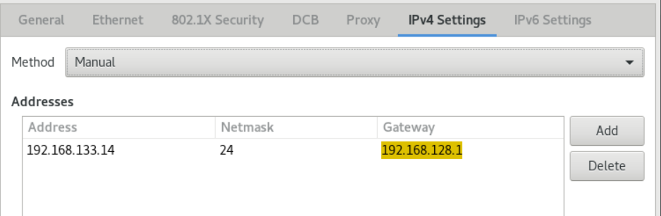

# Chapter 19 Configuring Network Devices to Receive Traffic from All MAC Addresses (Promiscuous Mode)

Network devices typically intercept and read the packets that programs need to receive. You can configure network devices to accept traffic from all MAC addresses at the virtual switch or port group level.	

Use this setting to:

- Diagnose network connection problems,
- Monitor network activity for increased security,
- Intercept private data in transit or intrusions in the network.

This chapter describes how to use the iproute2, nmcli, or nmstatectl tools to configure a network device to accept traffic from all MAC addresses. You can enable this mode for any type of network device except InfiniBand.

## 19.1. Use iproute2 to temporarily configure NIC promiscuous mode

This section describes configuring network devices to accept all traffic regardless of MAC address. Any changes made using the iproute2 tool are temporary and lost after a machine reboot.

**Procedure**

1. Optional: Display the network interfaces to determine which interface you want to receive all traffic on:
    ```
    # ip a
    1: enp1s0: <NO-CARRIER,BROADCAST,MULTICAST,UP> mtu 1500 qdisc fq_codel state DOWN group default qlen 1000
        link/ether 98:fa:9b:a4:34:09 brd ff:ff:ff:ff:ff:ff
    2: bond0: <NO-CARRIER,BROADCAST,MULTICAST,MASTER,UP> mtu 1500 qdisc noqueue state DOWN group default qlen 1000
        link/ether 6a:fd:16:b0:83:5c brd ff:ff:ff:ff:ff:ff
    3: wlp1s0: <BROADCAST,MULTICAST,UP,LOWER_UP> mtu 1500 qdisc noqueue state UP group default qlen 1000
    ...
    ```
2. Modify the device to enable or disable the accept-all-mac-addresses attribute.
    - Enable accept-all-mac-addresses mode for enp1s0:
        ```
        # ip link set enp1s0 promisc on
        ```
    - Disable accept-all-mac-addresses mode for enp1s0:
        ```
        # ip link set enp1s0 promisc off
        ```

**Verification**

- Verify that the accept-all-mac-addresses mode is enabled:
    ```
    # ip link show enp1s0
    1: enp1s0: <NO-CARRIER,BROADCAST,MULTICAST,PROMISC,UP> mtu 1500 qdisc fq_codel state DOWN mode DEFAULT group default qlen 1000
        link/ether 98:fa:9b:a4:34:09 brd ff:ff:ff:ff:ff:ff
    ```
    The PROMISC flag in the device description indicates that the mode is enabled.

## 19.2. Use nmcli to configure NIC promiscuous mode

**Procedure**

1. Optional: Display the network interfaces to determine which interface you want to receive all traffic on:
    ```
    # ip a
    1: enp1s0: <NO-CARRIER,BROADCAST,MULTICAST,UP> mtu 1500 qdisc fq_codel state DOWN group default qlen 1000
        link/ether 98:fa:9b:a4:34:09 brd ff:ff:ff:ff:ff:ff
    2: bond0: <NO-CARRIER,BROADCAST,MULTICAST,MASTER,UP> mtu 1500 qdisc noqueue state DOWN group default qlen 1000
        link/ether 6a:fd:16:b0:83:5c brd ff:ff:ff:ff:ff:ff
    3: wlp1s0: <BROADCAST,MULTICAST,UP,LOWER_UP> mtu 1500 qdisc noqueue state UP group default qlen 1000
    ...
    ```
2. Modify the device to enable or disable the accept-all-mac-addresses attribute.
    - Enable accept-all-mac-addresses mode for enp1s0:
        ```
        # nmcli connection modify enp1s0 ethernet.accept-all-mac-addresses yes
        ```
    - Disable accept-all-mac-addresses mode for enp1s0:
        ```
        # nmcli connection modify enp1s0 ethernet.accept-all-mac-addresses no
        ```
3. Reboot the NIC to apply the changes:
    ```
    # nmcli connection up enp1s0
    ```

**Verification**

- Verify that the ethernet.accept-all-mac-addresses mode is enabled:
    ```
    # nmcli connection show enp1s0
    ...
    802-3-ethernet.accept-all-mac-addresses:1     (true)
    ```
    802-3-ethernet.accept-all-mac-addresses: true means the mode is enabled.

## 19.3. Use nmstatectl to configure NIC promiscuous mode

**Prerequisites**

- nmstate package installed
- A .yml file for configuring the device is available

**Procedure**

1. Edit or create a new enp1s0.yml file and modify accept -all-mac-address: true :
    ```
    ---
    interfaces:
    - name: enp1s0
        type: ethernet
        state: up
        accept -all-mac-address: true
    ```
2. App settings:
    ```
    # nmstatectl apply /enp1s0.yml
    ```

**Verification**

- Verify that the ethernet.accept-all-mac-addresses mode is enabled:
    ```
    # nmcli connection show enp1s0
    ...
    802-3-ethernet.accept-all-mac-addresses:1     (true)
    ```
    802-3-ethernet.accept-all-mac-addresses: true means the mode is enabled.

# Chapter 20 Setting Up 802.1x Network Authentication Service

The IEEE 802.1X standard defines secure authentication and authorization methods to protect the network from unauthorized clients. Using the hostapd service and FreeRADIUS, you can provide Network Access Control (NAC) in your network.

In this document, the host acts as a bridge to connect different clients using the existing network. However, the host only authorizes authenticated clients to access the network.


## 20.1. Install freeradius

```
# yum install freeradius
```

If the freeradius package is already installed, delete the /etc/raddb/ directory, uninstall, and then install the package again. Do not use the yum reinstall command to reinstall packages as the permissions and symlinks in the /etc/raddb/ directory will be different.

## 20.2. Setting up the bridge on the authentication host

A bridge is a link-layer device that forwards traffic between a host and a network based on a table of MAC addresses. If the host is set up as an 802.1X authenticator, add the interface on which to authenticate and the LAN interface to the bridge.

**Prerequisites**

- The host has multiple NIC interfaces

**Procedure**

1. Create a bridge:
    ```
    # nmcli connection add type bridge con-name br0 ifname br0
    ```
2. Assign the Ethernet interface to the bridge:
    ```
    # nmcli connection add type ethernet slave-type bridge con-name br0-port1 ifname enp1s0 master br0
    # nmcli connection add type ethernet slave-type bridge con-name br0-port2 ifname enp7s0 master br0
    # nmcli connection add type ethernet slave-type bridge con-name br0-port3 ifname enp8s0 master br0
    # nmcli connection add type ethernet slave-type bridge con-name br0-port4 ifname enp9s0 master br0
    ```
3. Enable the bridge to forward Extensible Authentication Protocol over LAN (EAPOL) packets:
    ```
    # nmcli connection modify br0 group-forward-mask 8
    ```
4. Configure the connection to automatically activate the port:
    ```
    # nmcli connection modify br0 connection.autoconnect-slaves 1
    ```
5. Activate network card connection:
    ```
    # nmcli connection up br0
    ```

**Verification**

1. Display the status of devices acting as bridge ports:
    ```
    # ip link show master br0
    3: enp1s0: <BROADCAST,MULTICAST,UP,LOWER_UP> mtu 1500 qdisc fq_codel master br0 state UP mode DEFAULT group default qlen 1000
    link/ether 52:54:00:62:61:0e brd ff:ff:ff:ff:ff:ff
    ...
    ```
2. Check to see if forwarding of EAPOL packets is enabled on br0:
    ```
    # cat /sys/class/net/br0/bridge/group_fwd_mask
    0x8
    ```
    If the return value is 0x8 , forwarding is enabled.

## 20.3. Certificate Requirements for FreeRADIUS

When using the FreeRADIUS security service, you need different TLS certificates for different purposes:

- A TLS server certificate for encrypted connections to the server. Use a trusted certificate authority (CA) to issue certificates.
   The server certificate requires the Extended Key Usage (EKU) field to be set to TLS Web Server Authentication.

- A client certificate issued by the same CA for Extensible Authentication Protocol-Transport Layer Security (EAP-TLS). EAP-TLS provides certificate-based authentication and is enabled by default.
   Client certificates need to have their EKU field set to TLS Web Client Authentication.

If you want to keep your connection private, use your company's CA or create your own to issue certificates for FreeRADIUS. If you use a public CA, you will allow it to authenticate users and issue client certificates for EAP-TLS.

## 20.4. On the FreeRADIUS server, create a set of test certificates

For testing purposes, the freeradius package installs scripts and configuration files in the /etc/raddb/certs/ directory to create its own Certificate Authority (CA) and issue certificates.

If you use the default configuration, these scripts generate certificates that expire after 60 days and keys that use insecure passwords ("whatever"). You can also customize CA, server, and client configurations.

Follow the process to create the following required files:

- /etc/raddb/certs/ca.pem: CA certificate
- /etc/raddb/certs/server.key: the private key of the server certificate
- /etc/raddb/certs/server.pem: server certificate
- /etc/raddb/certs/client.key: the private key of the client certificate
- /etc/raddb/certs/client.pem: client certificate

**Prerequisites**

- freeradius is installed.

**Procedure**

1. Enter the /etc/raddb/certs/ directory:
    ```
    # cd /etc/raddb/certs/
    ```
2. Optional: Custom CA configuration ca.conf:
    ```
    ...
    [ req ]
    default_bits            = 2048
    input_password          = ca_password
    output_password         = ca_password
    ...
    [certificate_authority]
    countryName             = US
    stateOrProvinceName     = North Carolina
    localityName            = Raleigh
    organizationName        = Example Inc.
    emailAddress            = admin@example.org
    commonName              = "Example Certificate Authority"
    ...
    ```
3. Optional: Customize the server configuration server.cnf:
    ```
    ...
    [ CA_default ]
    default_days            = 730
    ...
    [ req ]
    distinguished_name      = server
    default_bits            = 2048
    input_password          = key_password
    output_password         = key_password
    ...
    [server]
    countryName             = US
    stateOrProvinceName     = North Carolina
    localityName            = Raleigh
    organizationName        = Example Inc.
    emailAddress            = admin@example.org
    commonName              = "Example Server Certificate"
    ...
    ```
4. Optional: Customize client configuration client.cnf:
    ```
    ...
    [ CA_default ]
    default_days            = 365
    ...
    [ req ]
    distinguished_name      = client
    default_bits            = 2048
    input_password          = password_on_private_key
    output_password         = password_on_private_key
    ...
    [client]
    countryName             = US
    stateOrProvinceName     = North Carolina
    localityName            = Raleigh
    organizationName        = Example Inc.
    emailAddress            = user@example.org
    commonName              = user@example.org
    ...
    ```
5. Create a certificate:
    ```
    # make all
    ```
6. Change the group in the /etc/raddb/certs/server.pem file to radiusd :
    ```
    # chgrp radiusd /etc/raddb/certs/server.pem*
    ```

## 20.5. Configuring FreeRADIUS to securely authenticate network clients using EAP

FreeRADIUS supports different Extensible Authentication Protocols (EAP). However, for network security purposes, this document describes how to configure FreeRADIUS to support the following secure EAP authentication methods:

- EAP-TLS (Transport Layer Security Protocol) uses a secure TLS connection to authenticate clients using certificates. To use EAP-TLS, you need a TLS client certificate for each network client, and a server certificate for the server. Note that the same Certificate Authority (CA) must have issued the certificate. Always use your own CA to create certificates, as all client certificates issued by the CA you use can authenticate to the FreeRADIUS server.
- EAP-TTLS (Tunneled Transport Layer Security Protocol) uses a secure TLS connection and uses mechanisms such as Password Authentication Protocol (PAP) or Challenge-Handshake Authentication Protocol (CHAP) to authenticate clients. To use EAP-TTLS, you need a TLS server certificate.
- EAP-PEAP (Protected Authentication Protocol) sets up a tunnel using a secure TLS connection as the external authentication protocol. The authenticator verifies the certificate of the RADIUS server. The supplicant then authenticates through a tunnel encrypted using Microsoft Challenge Handshake Authentication Protocol version 2 (MS-CHAPv2) or other methods.
   The default FreeRADIUS configuration file acts as a document describing all parameters and directives. If you want to disable certain features, please comment them out instead of deleting the corresponding section in the configuration file. This lets you preserve the structure of your configuration files and included documentation.

**Prerequisites**

- Freeradius is installed.
- The configuration files in the /etc/raddb/ directory remain unchanged, as provided by the freeradius software.
- The following files exist on the server:
  - TLS private key of the FreeRADIUS host: /etc/raddb/certs/server.key
  - TLS server certificate for FreeRADIUS host: /etc/raddb/certs/server.pem
  - TLS CA certificate: /etc/raddb/certs/ca.pem
     If you store the files in a different location or they have different names, set the private_key_file, certificate_file and ca_file parameters accordingly in the /etc/raddb/mods-available/eap file.

**Procedure**

1. Create /etc/raddb/certs/dh with Diffie-Hellman (DH) parameters if it does not exist. For example, to create a DH file with 2048-bit primes, enter:
```
#openssl dhparam -out /etc/raddb/certs/dh 2048
```
To be on the safe side, do not use DH files with primes smaller than 2048 bits. Depending on the number of bits, file creation may take several minutes.
2. Set security permissions on TLS private keys, server certificates, CA certificates, and files using DH parameters:
```
# chmod 640 /etc/raddb/certs/server.key /etc/raddb/certs/server.pem /etc/raddb/certs/ca.pem /etc/raddb/certs/dh
# chown root:radiusd /etc/raddb/certs/server.key /etc/raddb/certs/server.pem /etc/raddb/certs/ca.pem /etc/raddb/certs/dh
```
3. Edit the /etc/raddb/mods-available/eap file:
    1. Set the password for the private key in the private_key_password parameter:
    ```
    eap {
        ...
        tls-config tls-common {
            ...
            private_key_password = key_password
            ...
        }
    }
    ```
    2. Depending on your environment, set the default_eap_type parameter in the eap directive to the primary EAP type you are using:
    ```
    eap {
        ...
        default_eap_type = ttls
        ...
    }
    ```
    For security, use only ttls, tls or peap.
    3. Comment out the md5 directive to disable the insecure EAP-MD5 authentication method:
    ```
    eap {
        ...
        # md5 {
        # }
        ...
    }
    ```
4. Edit the /etc/raddb/sites-available/default file and comment out all authentication methods except eap:
```
authenticate {
    ...
    # Auth-Type PAP {
    #     pap
    # }

    # Auth-Type CHAP {
    #     chap
    # }

    # Auth-Type MS-CHAP {
    #     mschap
    # }

    # mschap

    # digest
    ...
}
```
This only enables EAP and disables the plain text authentication method.
5. Edit the /etc/raddb/clients.conf file:
    1. Set secure passwords in localhost and localhost_ipv6 client directives:
    ```
    client localhost {
        ipaddr = 127.0.0.1
        ...
        secret = client_password
        ...
    }
    
    client localhost_ipv6 {
        ipv6addr = ::1
        secret = client_password
    }
    ```
    2. If RADIUS clients on remote hosts (such as network authenticators) should be able to access the FreeRADIUS service, add the corresponding client directives for them:
    ```
    client hostapd.example.org {
        ipaddr = 192.0.2.2/32
        secret = client_password
    }
    ```
    The ipaddr parameter accepts IPv4 and IPv6 addresses, and you can specify ranges using optional Classless Inter-Domain Routing (CIDR) notation. However, you can only set one value in this parameter. For example, to grant access to IPv4 and IPv6 addresses, add two client directives.
    Use a descriptive name for the client directive, such as hostname or a word that describes where the IP range is used.
6. If you want to use EAP-TTLS or EAP-PEAP, add the user to the /etc/raddb/users file:
```
example_user        Cleartext-Password := "user_password"
```
7. Verify configuration file:
```
# radiusd -XC
...
Configuration appears to be OK
```
8. Enable and start the radiusd service:
```
# systemctl enable --now radiusd
```

**Troubleshooting**

1. Stop the radiusd service:
```
# systemctl stop radiusd
```
2. Start the service in debug mode:
```
# radiusd -X
...
Ready to process requests
```
3. Perform verification tests on the FreeRADIUS host, as described in sections 20.7, 20.8.

## 20.6. Configuring hostapd as an authenticator on a wired network

The Host Access Point Daemon (hostapd) service acts as an authenticator on a wired network to provide 802.1X authentication. For this, the hostapd service requires a RADIUS server to authenticate clients.

The hostapd service provides an integrated RADIUS server. However, use the integrated RADIUS server for testing purposes only. For a production environment, use the FreeRADIUS server, which supports additional features such as different authentication methods and access control.

The hostapd service does not interact with the traffic plane. The service only acts as an authenticator. For example, use a script or service that uses the hostapd control interface to allow or deny traffic based on the results of authentication events.

**Prerequisites**

- The hostapd package is installed
- The FreeRADIUS server is configured to authenticate clients.

**Procedure**

1. Create the /etc/hostapd/hostapd.conf file with the following content:
```
# General settings of hostapd
# ===========================

# Control interface settings
ctrl_interface=/var/run/hostapd
ctrl_interface_group=wheel

# Enable logging for all modules
logger_syslog=-1
logger_stdout=-1

# Log level
logger_syslog_level=2
logger_stdout_level=2


# Wired 802.1X authentication
# ===========================

# Driver interface type
driver=wired

# Enable IEEE 802.1X authorization
ieee8021x=1

# Use port access entry (PAE) group address
# (01:80:c2:00:00:03) when sending EAPOL frames
use_pae_group_addr=1


# Network interface for authentication requests
interface=br0


# RADIUS client configuration
# ===========================

# Local IP address used as NAS-IP-Address
own_ip_addr=192.0.2.2

# Unique NAS-Identifier within scope of RADIUS server
nas_identifier=hostapd.example.org

# RADIUS authentication server
auth_server_addr=192.0.2.1
auth_server_port=1812
auth_server_shared_secret=client_password

# RADIUS accounting server
acct_server_addr=192.0.2.1
acct_server_port=1813
acct_server_shared_secret=client_password
```
For details on the parameters used in this configuration, see the description in the /usr/share/doc/hostapd/hostapd/hostapd.conf sample configuration file.
2. Enable the hostapd service:
```
# systemctl enable --now hostapd
```

**Troubleshooting**

1. Stop the radiusd service:
```
# systemctl stop radiusd
```
2. Start the service in debug mode:
```
# radiusd -X
...
Ready to process requests
```
3. Perform verification tests on the FreeRADIUS host, as described in sections 20.7, 20.8.

## 20.7. Testing EAP-TTLS Authentication Against a FreeRADIUS Server or Authenticator

To test that authentication using Extensible Authentication Protocol (EAP-TTLS) over Tunneled Transport Layer Security (EAP-TTLS) works as expected, run this flow:

- Set up a FreeRADIUS server.
- Set hostapd service as 802.1X network authentication authenticator.

The output from the testing tools used in this process provides additional information about EAP communication that can help you debug issues.

**Prerequisites**

- When you want to verify:
  - FreeRADIUS server:
    - The eapol_test tool provided by the hostapd package is installed.
    - The client you are running this process on is already authorized in the FreeRADIUS server's client database.
  - The validator wpa_supplicant tool provided by the package of the same name is installed.
- You stored your Certificate Authority (CA) certificate in the /etc/pki/tls/certs/ca.pem file.

**Procedure**

1. Create the /etc/wpa_supplicant/wpa_supplicant-TTLS.conf file with the following content:
    ```
        ap_scan=0
    
    network={
        eap=TTLS
        eapol_flags=0
        key_mgmt=IEEE8021X
    
        # Anonymous identity (sent in unencrypted phase 1)
        # Can be any string
        anonymous_identity="anonymous"
    
        # Inner authentication (sent in TLS-encrypted phase 2)
        phase2="auth=PAP"
        identity="example_user"
        password="user_password"
    
        # CA certificate to validate the RADIUS server's identity
        ca_cert="/etc/pki/tls/certs/ca.pem"
    }
    ```
2. To authenticate to:
    - FreeRADIUS server, enter:
        ```
        # eapol_test -c /etc/wpa_supplicant/wpa_supplicant-TTLS.conf -a 192.0.2.1 -s client_password
        ...
        EAP: Status notification: remote certificate verification (param=success)
        ...
        CTRL-EVENT-EAP-SUCCESS EAP authentication completed successfully
        ...
        SUCCESS
        ```
        The -a option defines the IP address of the FreeRADIUS server, while the -s option specifies the password of the host on which you want to run the commands in the FreeRADIUS server's client configuration.
    - Authenticator, please enter:
        ```
        # wpa_supplicant -c /etc/wpa_supplicant/wpa_supplicant-TTLS.conf -D wired -i enp0s31f6
        ...
        enp0s31f6: CTRL-EVENT-EAP-SUCCESS EAP authentication completed successfully
        ...
        ```
        The -i option specifies the name of the network interface on which wpa_supplicant sends Extensible Authentication Protocol over LAN (EAPOL) packets.
        For more debugging information, pass the -d option to the command.

## 20.8. Testing EAP-TLS Authentication Against a FreeRADIUS Server or Authenticator

To test that authentication using Extensible Authentication Protocol (EAP) Transport Layer Security (EAP-TLS) works as expected, follow this process:

- Set up a FreeRADIUS server.
- Set hostapd service as 802.1X network authentication authenticator.

The output from the testing tools used in this process provides additional information about EAP communication that can help you debug issues.

**Prerequisites**

- When you want to verify:
  - FreeRADIUS server:
    - The eapol_test tool provided by the hostapd package is installed.
    - The client on which you are running this Procedure is authorized in the FreeRADIUS server's client database.
  - The validator wpa_supplicant tool provided by the package of the same name is installed.
- You stored the Certificate Authority (CA) certificate in the /etc/pki/tls/certs/ca.pem file.
- The CA that issued the client certificate is the same CA that issued the FreeRADIUS server's server certificate.
- You store client certificates in the /etc/pki/tls/certs/client.pem file.
- Store the client's private key in /etc/pki/tls/private/client.key

**Procedure**

1. Create the /etc/wpa_supplicant/wpa_supplicant-TTLS.conf file with the following content:
    ```
    ap_scan=0
    
    network={
        eap=TLS
        eapol_flags=0
        key_mgmt=IEEE8021X
    
        identity="user@example.org"
        client_cert="/etc/pki/tls/certs/client.pem"
        private_key="/etc/pki/tls/private/client.key"
        private_key_passwd="password_on_private_key"
    
        # CA certificate to validate the RADIUS server's identity
        ca_cert="/etc/pki/tls/certs/ca.pem"
    }
    ```
2. To authenticate to:
    - FreeRADIUS server, enter:
        ```
        # eapol_test -c /etc/wpa_supplicant/wpa_supplicant-TLS.conf -a 192.0.2.1 -s client_password
        ...
        EAP: Status notification: remote certificate verification (param=success)
        ...
        CTRL-EVENT-EAP-SUCCESS EAP authentication completed successfully
        ...
        SUCCESS
        ```
        The -a option defines the IP address of the FreeRADIUS server, while the -s option specifies the password of the host on which you want to run the commands in the FreeRADIUS server's client configuration.
    - Authenticator, please enter:
        ```
        # wpa_supplicant -c /etc/wpa_supplicant/wpa_supplicant-TLS.conf -D wired -i enp0s31f6
        ...
        enp0s31f6: CTRL-EVENT-EAP-SUCCESS EAP authentication completed successfully
        ...
        ```
        The -i option specifies the name of the network interface on which wpa_supplicant sends Extensible Authentication Protocol over LAN (EAPOL) packets.
        For more debugging information, pass the -d option to the command.

## 20.9. Block and allow traffic based on hostapd authentication events

The hostapd service does not interact with the traffic plane. The service only acts as an authenticator. However, you can write a script to allow or deny traffic based on the outcome of the authentication event.

This Procedure is not supported and there is no enterprise-level solution. It only demonstrates how to block or allow traffic by evaluating the events retrieved by hostapd_cli.

When the 802-1x-tr-mgmt systemd service is started, OpenCloudOS prevents hostapd from listening to all traffic on the port except Extensible Authentication Protocol over LAN (EAPOL) packets, and uses the hostapd_cli tool to connect to the hostapd control interface. The /usr/local/bin/802-1x-tr-mgmt script then evaluates the events. Depending on the different events received by hostapd_cli, the script allows or blocks traffic for a MAC address. Note that when the 802-1x-tr-mgmt service is stopped, all traffic is automatically allowed.

Execute this Procedure on the hostapd server.

**Prerequisites**

- The hostapd service is configured and the service is ready to authenticate clients.

**Procedure**

1. Create the /usr/local/bin/802-1x-tr-mgmt file with the following content:
```
#!/bin/sh

if [ "x$1" == "xblock_all" ]
then

    nft delete table bridge tr-mgmt-br0 2>/dev/null || true
    nft -f - << EOF
table bridge tr-mgmt-br0 {
        set allowed_macs {
                type ether_addr
        }

        chain accesscontrol {
                ether saddr @allowed_macs accept
                ether daddr @allowed_macs accept
                drop
        }

        chain forward {
                type filter hook forward priority 0; policy accept;
                meta ibrname "br0" jump accesscontrol
        }
}
EOF
    echo "802-1x-tr-mgmt Blocking all traffic through br0. Traffic for given host will be allowed after 802.1x authentication"

elif [ "x$1" == "xallow_all" ]
then

    nft delete table bridge tr-mgmt-br0
    echo "802-1x-tr-mgmt Allowed all forwarding again"

fi

case ${2:-NOTANEVENT} in

    AP-STA-CONNECTED | CTRL-EVENT-EAP-SUCCESS | CTRL-EVENT-EAP-SUCCESS2)
        nft add element bridge tr-mgmt-br0 allowed_macs { $3 }
        echo "$1: Allowed traffic from $3"
        ;;

    AP-STA-DISCONNECTED | CTRL-EVENT-EAP-FAILURE)
        nft delete element bridge tr-mgmt-br0 allowed_macs { $3 }
        echo "802-1x-tr-mgmt $1: Denied traffic from $3"
        ;;

esac
```

2. Create the /etc/systemd/system/802-1x-tr-mgmt@.service systemd service file with the following content:
```
[Unit]
Description=Example 802.1x traffic management for hostapd
After=hostapd.service
After=sys-devices-virtual-net-%i.device

[Service]
Type=simple
ExecStartPre=-/bin/sh -c '/usr/sbin/tc qdisc del dev %i ingress > /dev/null 2>&1'
ExecStartPre=-/bin/sh -c '/usr/sbin/tc qdisc del dev %i clsact > /dev/null 2>&1'
ExecStartPre=/usr/sbin/tc qdisc add dev %i clsact
ExecStartPre=/usr/sbin/tc filter add dev %i ingress pref 10000 protocol 0x888e matchall action ok index 100
ExecStartPre=/usr/sbin/tc filter add dev %i ingress pref 10001 protocol all matchall action drop index 101
ExecStart=/usr/sbin/hostapd_cli -i %i -a /usr/local/bin/802-1x-tr-mgmt
ExecStopPost=-/usr/sbin/tc qdisc del dev %i clsact

[Install]
WantedBy=multi-user.target
```

3. Reload systemd:
```
# systemctl daemon-reload
```

4. Start the 802-1x-tr-mgmt service that the interface hostapd is listening on:
```
# systemctl enable --now 802-1x-tr-mgmt@br0.service
```

# Chapter 21 Authenticating clients to the network using the 802.1X standard with certificates stored on the file system

Administrators typically use port-based Network Access Control (NAC) based on the IEEE 802.1X standard to protect the network from unauthorized LAN and Wi-Fi clients. The steps in this chapter describe the different options for configuring network authentication.

## 21.1. Configuring 802.1X Network Authentication on an Existing Ethernet Connection Using nmcli

Using the nmcli tool, you can configure clients to authenticate to the network. This section describes how to configure TLS authentication in an existing Ethernet connection profile named enp1s0 to authenticate to the network.

**Prerequisites**

- The network supports 802.1X network authentication.
- The Ethernet connection profile exists in NetworkManager and has a valid IP configuration.
- The following files required for TLS authentication are present on the client:

   - The client key is stored in the /etc/pki/tls/private/client.key file, which is owned by and readable only by root.
   - Client certificates are stored in the /etc/pki/tls/certs/client.crt file.
   - Certificate Authority (CA) certificates are stored in the /etc/pki/tls/certs/ca.crt file.
- The wpa_supplicant package is installed.

**Procedure**

1. Set Extensible Authentication Protocol (EAP) to tls and path to client certificate and key files:
    ```
    # nmcli connection modify enp1s0 802-1x.eap tls 802-1x.client-cert /etc/pki/tls/certs/client.crt 802-1x.private-key /etc/pki/tls/certs/certs/client.key
    ```
    Note that you must set the 802-1x.eap, 802-1x.client-cert, and 802-1x.private-key parameters in the same command.
2. Set the path to the CA certificate:
    ```
    # nmcli connection modify enp1s0 802-1x.ca-cert /etc/pki/tls/certs/ca.crt
    ```
3. Set the identity of the user used in the certificate:
    ```
    # nmcli connection modify enp1s0 802-1x.identity user@example.com
    ```
4. Alternatively, the password can be stored in the configuration:
    ```
    # nmcli connection modify enp1s0 802-1x.private-key-password password
    ```

    By default, NetworkManager saves passwords in clear text in the /etc/sysconfig/network-scripts/keys-connection_name file, which is only readable by the root user. However, clearing text passwords in configuration files has security implications.

    For increased security, set the 802-1x.password-flags parameter to 0x1. With this setup, on servers with the GNOME desktop environment or running nm-applet, NetworkManager can retrieve passwords from these services. In other cases, NetworkManager will prompt for a password.
5. Activate the connection profile:
    ```
    # nmcli connection up enp1s0
    ```

## 21.2. Configuring Static Ethernet Connections with 802.1X Network Authentication Using nmstatectl

**Prerequisites**

- The network supports 802.1X network authentication.
- The Ethernet connection profile exists in NetworkManager and has a valid IP configuration.
- The following files required for TLS authentication are present on the client:
  - The client key is stored in the /etc/pki/tls/private/client.key file, which is owned by and readable only by root.
  - Client certificates are stored in the /etc/pki/tls/certs/client.crt file.
  - Certificate Authority (CA) certificates are stored in the /etc/pki/tls/certs/ca.crt file.

**Procedure**

1. Create the YAML file ~/create-ethernet-profile.yml :
    ```
    ---
    interfaces:
    - name: enp1s0
    type: ethernet
    state: up
    ipv4:
        enabled: true
        address:
        - ip: 192.0.2.1
        prefix-length: 24
        dhcp: false
    ipv6:
        enabled: true
        address:
        - ip: 2001:db8:1::1
        prefix-length: 64
        autoconf: false
        dhcp: false
    802.1x:
        ca-cert: /etc/pki/tls/certs/ca.crt
        client-cert: /etc/pki/tls/certs/client.crt
        eap-methods:
        - tls
        identity: client.example.org
        private-key: /etc/pki/tls/private/client.key
        private-key-password: password
    routes:
    config:
    - destination: 0.0.0.0/0
        next-hop-address: 192.0.2.254
        next-hop-interface: enp1s0
    - destination: ::/0
        next-hop-address: 2001:db8:1::fffe
        next-hop-interface: enp1s0
    dns-resolver:
    config:
        search:
        - example.com
        server:
        - 192.0.2.200
        - 2001:db8:1::ffbb
    ```
2. Application configuration:
    ```
    # nmstatectl apply ~/create-ethernet-profile.yml
    ```

## Configuring Static Ethernet Connections with 802.1X Network Authentication Using rhel-system-roles

Run this step on the Ansible control node.

**Prerequisites**

- Ansible and rhel-system-roles packages are installed on the control node.
- If you are running the playbook with a non-root user, make sure that user has appropriate sudo privileges on the managed nodes.
- The network supports 802.1X network authentication.
- The Ethernet connection profile exists in NetworkManager and has a valid IP configuration.
- The following files required for TLS authentication are present on the client:
  - The client key is stored in the /etc/pki/tls/private/client.key file, which is owned by and readable only by root.
  - Client certificates are stored in the /etc/pki/tls/certs/client.crt file.
  - Certificate Authority (CA) certificates are stored in the /etc/pki/tls/certs/ca.crt file.

**Procedure**

1. Add the IP of the host executing the playbook to the /etc/ansible/hosts Ansible inventory:
    ```
    node.example.com
    ```
2. Create playbook ~/enable-802.1x.yml :
    ```
    ---
    - name: Configure an Ethernet connection with 802.1X authentication
    hosts: node.example.com
    become: true
    tasks:
        - name: Copy client key for 802.1X authentication
        copy:
            src: "/srv/data/client.key"
            dest: "/etc/pki/tls/private/client.key"
            mode: 0600
    
        - name: Copy client certificate for 802.1X authentication
        copy:
            src: "/srv/data/client.crt"
            dest: "/etc/pki/tls/certs/client.crt"
    
        - name: Copy CA certificate for 802.1X authentication
        copy:
            src: "/srv/data/ca.crt"
            dest: "/etc/pki/ca-trust/source/anchors/ca.crt"
    
        - include_role:
            name: rhel-system-roles.network
        vars:
            network_connections:
            - name: enp1s0
                type: ethernet
                autoconnect: yes
                ip:
                address:
                    - 192.0.2.1/24
                    - 2001:db8:1::1/64
                gateway4: 192.0.2.254
                gateway6: 2001:db8:1::fffe
                dns:
                    - 192.0.2.200
                    - 2001:db8:1::ffbb
                dns_search:
                    - example.com
                ieee802_1x:
                identity: user_name
                eap: tls
                private_key: "/etc/pki/tls/private/client.key"
                private_key_password: "password"
                client_cert: "/etc/pki/tls/certs/client.crt"
                ca_cert: "/etc/pki/ca-trust/source/anchors/ca.crt"
                domain_suffix_match: example.com
                state: up
    ```
3. Run the playbook:
    - To connect to a managed host as root, enter:
        ```
        # ansible-playbook -u root ~/enable-802.1x.yml
        ```
    - To connect to a managed host as a user, enter:
        ```
        # ansible-playbook -u user_name --ask-become-pass ~/ethernet-static-IP.yml
        ```
        The --ask-become-pass option ensures that the ansible-playbook command prompts for the sudo password for the user defined in the -u user_name option.

    If the -u user_name option is not specified, ansible-playbook connects to the managed host as the user currently logged into the control node.

# Chapter 22 Managing Default Gateway Settings

A default gateway is a router that forwards network packets when no other route matches the packet's destination. On a local network, the default gateway is usually a host one hop away from the Internet.

## 22.1. Setting a Default Gateway on an Existing Network Connection Using nmcli

In most cases, administrators will set the default gateway when creating a connection, this section describes how to use the nmcli tool to set or update the default gateway on a previously created connection.

**Prerequisites**

- At least one static IP address needs to be configured on the connection where the default gateway is set.
- If the user is able to log in at the physical console, the user rights are sufficient. Otherwise, the user must have root privileges.

**Procedure**

1. Set the default gateway IP address.
    For example, to set the IPv4 address of example's default gateway to 192.0.2.1 :
    
    ```
    # nmcli connection modify example ipv4.gateway "192.0.2.1"
    ```
    Set the IPv6 address of the example's default gateway to 2001:db8:1::1 :
    ```
    # nmcli connection modify example ipv6.gateway "2001:db8:1::1"
    ```
2. Restart your network connection for the changes to take effect. For example, to restart the example connection using the command line:
    ```
    # nmcli connection up example
    ```
3. (Optional) Verify that the route is active.
    IPv4:

    ```
    # ip -4 route
    default via 192.0.2.1 dev example proto static metric 100
    ```
    IPv6:
    ```
    # ip -6 route
    default via 2001:db8:1::1 dev example proto static metric 100 pref medium
    ```

## 22.2. Setting a Default Gateway on an Existing Network Connection Using nmcli Interactive Mode

In most cases, administrators set the default gateway when creating a connection, as described in Configuring Dynamic Ethernet Connections Using the nmcli Interactive Editor .

This section describes how to set or update the default gateway on a previously created connection using the interactive mode of the nmcli tool.

**Prerequisites**

- Network connections that require a default gateway to have at least one static IP address
- The working user needs to be able to log in at the physical console, otherwise the user must have root privileges

**Procedure**

1. Turn on nmcli interactive mode to configure network connections, for example to connect nmcli interactive mode:
    ```
    # sudo nmcli connection edit example
    ```
2. Set the default gateway.
    For example, to set the IPv4 address of the default gateway on the example connection to 192.0.2.1 :
    
    ```
    nmcli> set ipv4.gateway 192.0.2.1
    ```
    For example, to set the IPv6 address of the default gateway on the example connection to 2001:db8:1::1 :
    ```
    nmcli> set ipv6.gateway 2001:db8:1::1
    ```
3. Optionally, verify that the default gateway is set correctly:
    ```
    nmcli> print
    ...
    ipv4.gateway:                           192.0.2.1
    ...
    ipv6.gateway:                           2001:db8:1::1
    ...
    ```
4. Save configuration:
    ```
    nmcli> save persistent
    ```
5. Restart the network connection to apply the changes:
    ```
    nmcli> activate example
    ```
    The network connection is temporarily lost during the reboot.
6. Exit nmcli interactive mode:
    ```
    nmcli> quit
7. (Optional) Verify that the route is active.
    IPv4:
    
    ```
    # ip -4 route
    default via 192.0.2.1 dev example proto static metric 100
    ```
    IPv6:
    ```
    # ip -6 route
    default via 2001:db8:1::1 dev example proto static metric 100 pref medium
    ```

## 22.3. Use nm-connection-editor to set the default gateway for existing network connections

In most cases, administrators set the default gateway when creating a connection. This section describes how to use the nm-connection-editor application to set or update the default gateway on a previously created connection.

**Prerequisites**

- Network connections that require a default gateway to have at least one static IP address

**Procedure**

1. Enter nm-connection-editor in the terminal:
2. Select the connection to modify and click the gear icon to edit an existing connection.
3. Set the IPv4 default gateway.

4. Set the IPv6 default gateway.
  
5. Click Save.
6. Restart the network connection for the changes to take effect. For example, to restart the example connection using the command line:
    ```
    $ sudo nmcli connection up example
    ```
7. (Optional) Verify that the route is active.
    IPv4:

    ```
    # ip -4 route
    default via 192.168.138.1 dev example proto static metric 100
    ```
    IPv6:
    ```
    # ip -6 route
    default via 2001:db8:1::1 dev example proto static metric 100 pref medium
    ```


## 22.4. Using control-center to set a default gateway for an existing network connection

In most cases, administrators set the default gateway when creating a connection. This section describes how to set or update the default gateway on a previously created connection using the control-center application.

**Prerequisites**

- Network connections that require a default gateway to have at least one static IP address
- The network connection configuration can be opened in the control-center application.

**Procedure**

1. Enter Settings, select Network, and click the gear on the right side of the network connection to be configured to edit.
2. Set the IPv4 default gateway.

3. Set the IPv6 default gateway.
  
4. Click Apply.
5. Toggle the configured network connection state to Off and then to On to restart the network connection to apply the changes.
6. (Optional) Verify that the route is active.
    IPv4:

    ```
    # ip -4 route
    default via 192.168.138.1 dev example proto static metric 100
    ```
    IPv6:
    ```
    # ip -6 route
    default via 2001:db8:1::1 dev example proto static metric 100 pref medium
    ```


## 22.5. Using nmstatectl to Set the Default Gateway for Existing Network Connections

**Prerequisites**

- Network connections that require a default gateway to have at least one static IP address
- nmstate installed.

**Procedure**

1. Create the ~/set-default-gateway.yml YAML file:
    ```
    ---
    routes:
    config:
    - destination: 0.0.0.0/0
        next-hop-address: 192.0.2.1
        next-hop-interface: enp1s0
    ```
2. App settings:
    ```
    # nmstatectl apply ~/set-default-gateway.yml
    ```

## 22.6. Using rhel-system-roles to set a default gateway for an existing network connection

When you run a script that uses Networking RHEL system roles, if the value set does not match the name specified in the script, the system role overwrites an existing connection profile with the same name. Therefore, always specify the entire configuration of the network connection profile in the script, even if the IP configuration already exists. Otherwise, role will reset these values to default.

**Prerequisites**

- The ansible and rhel-system-roles packages are installed on the control node.
- If you are running the playbook as a non-root user, make sure the user you are using has sudo privileges.

**Procedure**

1. Add the host IP or name to the /etc/ansible/hosts Ansible inventory file if the host you are using to execute the instructions in the playbook is not already listed:
    ```
    node.example.com
    ```

2. Create a ~/ethernet-connection.yml playbook with the following content:
    ```
    ---
    - name: Configure an Ethernet connection with static IP and default gateway
    hosts: node.example.com
    become: true
    tasks:
    - include_role:
        name: rhel-system-roles.network
    
        vars:
        network_connections:
            - name: enp1s0
            type: ethernet
            autoconnect: yes
            ip:
                address:
                - 198.51.100.20/24
                - 2001:db8:1::1/64
                gateway4: 198.51.100.254
                gateway6: 2001:db8:1::fffe
                dns:
                - 198.51.100.200
                - 2001:db8:1::ffbb
                dns_search:
                - example.com
            state: up
    ```

3. Run the playbook:
    - To connect to a managed host as root, enter:
        ```
        # ansible-playbook -u root ~/ethernet-connection.yml
        ```
    - To connect to a managed host as a user, enter:
        ```
        # ansible-playbook -u user_name --ask-become-pass ~/ethernet-connection.yml
        ```
        The --ask-become-pass option ensures that the ansible-playbook command prompts for the sudo password for the user defined in the -u user_name option.

    If the -u user_name option is not specified, ansible-playbook connects to the managed host as the user currently logged into the control node.

## 22.7. Using network scripts to set a default gateway for an existing network connection

**Prerequisites**

- The NetworkManager package is not installed, or the NetworkManager service is disabled.
- The network-scripts package is installed.

**Procedure**

1. Set the GATEWAY parameter in the /etc/sysconfig/network-scripts/ifcfg-enp1s0 file to 192.0.2.1 :
    ```
    GATEWAY=192.0.2.1
    ```
2. Add a default entry to the /etc/sysconfig/network-scripts/route-enp0s1 file:
    ```
    default via 192.0.2.1
    ```
3. Restart the network:
    ```
    # systemctl restart network
    ```

## 22.8. Using NetworkManager to manage multiple default gateways

In some cases, you may need to set more than one default gateway on the host. However, to avoid asynchronous routing issues, each default gateway for the same protocol requires a separate metric value. Note that OpenCloudOS only uses connections to the default gateway set to the lowest routing authority.

You can set metrics for connected IPv4 and IPv6 gateways with the following commands:

```
# nmcli connection modify connection-name ipv4.route-metric value ipv6.route-metric value
```

Do not set the same routing metric for the same protocol in multiple connection configuration sets to avoid routing problems.

If you set a default gateway with no routing authority, NetworkManager automatically sets the routing authority based on the interface type. NetworkManager will assign a default value for this network type to the first connection activated, and set an incremental value for each other connection of the same type in the order of activation. For example, if two Ethernet connections with default gateways exist, NetworkManager will set the routing weight to 100 on the default gateway route of the connection you activate first. For the second connection, NetworkManager will be set to 101.

The following is the correspondence between frequently used network types and their default routing rights:

| Connection Type | Default Routing Right |
|---------|------------|
|VPN      | 50         |
|Ethernet | 100        |
|MACsec   | 125        |
|InfiniBand| 150        |
|Bond     | 300        |
|Team     | 350        |
|VLAN     | 400        |
|Bridge   | 425        |
|TUN      | 450        |
|Wi-Fi    | 600        |
|IP tunnel| 675        |
|         |            |


## 22.9. Configuring NetworkManager to prevent specific configuration files from providing a default gateway

You can configure NetworkManager to provide a default gateway without using a specific configuration file. For connection profiles that are not connected to a default gateway, follow the steps below.

**Prerequisites**

- A NetworkManager connection profile exists for network connections that do not have a default gateway configured.

**Procedure**

1. If the network connection uses a dynamic IP configuration, configure NetworkManager not to use IPv4 and IPv6 default routes:
    ```
    # nmcli connection modify connection_name ipv4.never-default yes ipv6.never-default yes
    ```
    Note that setting ipv4.never-default and ipv6.never-default to yes automatically removes the IP address of the default gateway for the corresponding protocol from the connection profile.
2. Activation link:
    ```
    # nmcli connection up connection_name
    ```

**Verification**

- Use ip -4 route or ip -6 route to verify that the default gateway is enabled.


## 22.10. Fix unexpected routing behavior due to multiple default gateways

Only in rare cases (such as when using multipath TCP) are multiple default gateways required on a host. In most cases, you only configure a default gateway to avoid unexpected routing behavior or asynchronous routing problems.

**Prerequisites**

- The host uses NetworkManager to manage network connections.
- The host has multiple network interfaces.
- The host has multiple default gateways configured.

**Procedure**

1. Show routing table:
    - IPv4:
        ```
        # ip -4 route
        default via 192.0.2.1 dev enp1s0 proto static metric 101
        default via 198.51.100.1 dev enp7s0 proto static metric 102
        ...
        ```
    - IPv6:
        ```
        # ip -6 route
        default via 2001:db8:1::1 dev enp1s0 proto static metric 101 pref medium
        default via 2001:db8:2::1 dev enp7s0 proto static metric 102 pref medium
        ...
        ```
        Entries starting with default indicate the default route. Note the interface names for these entries displayed next to dev.
2. Use the following command to display the NetworkManager connections you identified in the previous step:
    ```
    # nmcli -f GENERAL.CONNECTION,IP4.GATEWAY,IP6.GATEWAY device show enp1s0
    GENERAL.CONNECTION:      Corporate-LAN
    IP4.GATEWAY:             192.168.122.1
    IP6.GATEWAY:             2001:db8:1::1
    
    # nmcli -f GENERAL.CONNECTION,IP4.GATEWAY,IP6.GATEWAY device show enp7s0
    GENERAL.CONNECTION:      Internet-Provider
    IP4.GATEWAY:             198.51.100.1
    IP6.GATEWAY:             2001:db8:2::1
    ```
    In these examples, profiles named Corporate-LAN and Internet-Provider set default gateways. Because on a local network, the default gateway is usually a host one hop from the Internet, it is incorrect for the remainder of this procedure to assume a default gateway on the Corporate-LAN.
3. To configure NetworkManager not to use the Corporate-LAN connection as the default route for IPv4 and IPv6 connections:
    ```
    # nmcli connection modify Corporate-LAN ipv4.never-default yes ipv6.never-default yes
    ```
4. Activate the Corporate-LAN connection:
    ```
    # nmcli connection up Corporate-LAN
    ```

**Verification**

- Use ip -4 route or ip -6 route to verify that there is only one gateway.


# Chapter 23 Configuring Static Routing

Routing ensures that you can send and receive traffic between interconnected networks. In larger environments, administrators typically configure services so that routers can dynamically learn about other routers. In smaller environments, administrators often configure static routes to ensure that traffic is accessible from one network to the next.

You may need static routing for functional communication between multiple networks if these conditions apply:

- Traffic must pass through multiple networks.
- Insufficient exclusive traffic flow through the default gateway.

## 23.1. Example of a network that requires static routing

Because not all IP networks are directly connected through a router, some networks will not be able to communicate with each other without static routing. Static routes can also be configured for certain network flows with only one direction.

You can configure static routes as follows:

- Simple Configuration: Set this static route only on Router 1. However, this increases traffic on Router 1, because traffic sent from the data center (host on 203.0.113.0/24) to Network B (198.51.100.0/24) always goes through Router 1 to Router 2.
- Complex configuration: Please configure this static route (203.0.113.0/24) on all hosts in the data center. All hosts on this subnet then send hosts closer to Network B (198.51.100.0/24) directly to Router 2 (203.0.113.10).
   For more details, see the description in the diagram below.

If the required static routes are not configured, the following describes how each network communication works:

- Hosts in Network A (192.0.2.0/24):
   - Can communicate with other hosts on the same subnet because they are directly connected.
   - Can communicate with the Internet because Router 1 is in the Network A network (192.0.2.0/24) and has a default gateway to the Internet.
   - Can communicate with Data Center network (203.0.113.0/24) because Router 1 has interfaces in Network A (192.0.2.0/24) and Data Center (203.0.113.0/24) network.
   - Unable to communicate with Network B (198.51.100.0/24) because Router 1 has no interface in this network. Therefore, Router 1 sends traffic to its own default gateway (Internet).

- Hosts in the data center network (203.0.113.0/24):
   - Can communicate with other hosts on the same subnet because they are directly connected.
   - Can communicate with the Internet because their default gateway is set to Router 1, which has interfaces on the network, data center (203.0.113.0/24) and the Internet.
   - Can communicate with Network A (192.0.2.0/24) because their default gateway is set to Router 1, and Router 1 is in both Data Center (203.0.113.0/24) and Network A (192.0.2.0/24) networks Interface exists.
   - Unable to communicate with the Network B network (198.51.100.0/24) because there are no interfaces in this network. So, a host in the datacenter (203.0.113.0/24) sends traffic to its default gateway (Router 1). Router 1 has no interface on Network B (in 198.51.100.0/24), so Router 1 will send this traffic to its own default gateway (Internet).

- Hosts in the Network B network (198.51.100.0/24):
   - Can communicate with other hosts on the same subnet because they are directly connected.
   - Unable to communicate with hosts on the Internet. Router 2 sends traffic to Router 1 because of the default gateway setting. The actual behavior of Router 1 depends on the reverse path filter (rp_filter) system control (sysctl) setting. By default, in OpenCloudOS, Router 1 drops outgoing traffic instead of routing it to the internet. However, regardless of the configured behavior, it is not possible to communicate without a static route.
   - Unable to communicate with datacenter network (203.0.113.0/24). Outgoing traffic goes through Router 2 to its destination due to the default gateway setting. However, the reply to the packet does not reach the sender, because the host (203.0.113.0/24) in the data center network sends the reply to its default gateway (Router 1). Router 1 then sends the traffic to the Internet.
   - Unable to communicate with Network A (192.0.2.0/24). Router 2 sends traffic to Router 1 because of the default gateway setting. The actual behavior of Router 1 depends on the rp_filter sysctl setting. By default, in OpenCloudOS, Router 1 drops outgoing traffic instead of sending it to Network A (192.0.2.0/24). However, regardless of the configured behavior, it is not possible to communicate without a static route.

Note that in addition to configuring static routing, IP forwarding must be enabled on both routers.

## 23.2. Introduction to configure static routing with nmcli command

Static routing can be configured with the following command:
```
$ nmcli connection modify connection_name ipv4.routes "ip[/prefix] [next_hop] [metric] [attribute=value] [attribute=value] ..."
```

This command supports configuration of the following properties:

- cwnd=n : Set the congestion window (CWND) size, defined by the number of packets.
- lock-cwnd=true|false : Defines whether the kernel can update the CWND value.
- lock-mtu=true|false : Defines whether the kernel can update the MTU to the path MTU (PMTU).
- lock-window=true|false : Defines whether the kernel can update the maximum window size of TCP packets.
- mtu=n : Set the maximum transmission unit (MTU) of the path to the destination address.
- onlink=true|false : Defines whether the next hop is directly attached to this link, even if it does not match any interface prefix.
- scope=n: For IPv4 routing, this property sets the scope of destinations covered by the routing prefix. Set the value to an integer (0-255).
- src=address : Make the source address preferred when sending traffic to destinations covered by the route prefix.
- table=table_id : Set the ID of the table the route should be added to. If this parameter is omitted, NetworkManager will use the main table.
- tos=n : Set the Type of Service (TOS) key. Set the value to an integer (0-255).
- type=value : Set the route type. NetworkManager supports unicast, local, blackhole, unreachable, prohibit, and throw route types. The default is unicast.
- window=n : Set the maximum window size in bytes for TCP advertisements to these destinations.

If the ipv4.routes subcommand is used, nmcli will override any current settings for this parameter.

Add a route:

```
$ nmcli connection modify connection_name +ipv4.routes "..."
```
Delete a route:
```
$ nmcli connection modify connection_name -ipv4.routes "..."
```


## 23.3. Configuring Static Routing Using the nmcli Command

You can add a static route to the network connection configuration using the nmcli connection modify command.

The Procedure in this section describes how to add a route to the 192.0.2.0/24 network using a gateway running on 198.51.100.1 that is reachable via the example connection.

**Prerequisites**

- network configured
- The gateway of the static route must be directly reachable on the interface.
- The user needs to be able to log in at the physical console. Otherwise, the command requires root privileges.

**Procedure**

1. Add a static route to the example connection:
    ```
    $ sudo nmcli connection modify example +ipv4.routes "192.0.2.0/24 198.51.100.1"
    ```
    To set multiple routes in one step, separate each static route passed to the command with a comma. For example, to add routes to the 192.0.2.0/24 and 203.0.113.0/24 networks, both routed through the 198.51.100.1 gateway, enter:
    ```
    $ sudo nmcli connection modify example +ipv4.routes "192.0.2.0/24 198.51.100.1, 203.0.113.0/24 198.51.100.1"
    ```
2. (Optional) Verify that the route was correctly added to the configuration:
    ```
    $ nmcli connection show example
    ...
    ipv4.routes:        { ip = 192.0.2.1/24, nh = 198.51.100.1 }
    ...
    ```
3. Restart the network connection:
    ```
    $ sudo nmcli connection up example
    ```
4. (Optional) Verify that the route is active:

    ```
    $ ip route
    ...
    192.0.2.0/24 via 198.51.100.1 dev example proto static metric 100
    ```

## 23.4. Using control-center to configure static routing

You can use control-center in GNOME to add static routes to your networking configuration.

The Procedure in this section describes how to add a route to the 192.0.2.0/24 network, which uses a gateway running on 198.51.100.1.

**Prerequisites**

- The network is configured.
- The gateway of the static route must be directly reachable on the interface.
- The connected network configuration can be opened in the control-center application.

**Procedure**

1. Enter the settings, select Network, and click the gear in the network entry that needs to add a static route to edit.
2. (Optional) Disable automatic routing so that only static routes are used by clicking the On button in the Routes section of the IPv4 tab. If autorouting is enabled, OpenCloudOS will use static routes and routes received from a DHCP server.
3. Enter the address, subnet mask, gateway and routing rights (optional):

4. Click Apply.

2. Back in the Network window, re-enable the connection to apply the changes by toggling the connection's button to Off and then back to On.
6. (Optional) Verify that the route is active:

    ```
    $ ip route
    ...
    192.0.2.0/24 via 198.51.100.1 dev example proto static metric 100
    ```

## 23.5. Configuring Static Routing Using nm-connection-editor

You can add static routes to your network connection configuration using the nm-connection-editor application.

The Procedure in this section describes how to add a route to the 192.0.2.0/24 network using a gateway running on 198.51.100.1 which is reachable via the example connection.

**Prerequisites**

- The network is configured.
- The gateway of the static route must be directly reachable on the interface.

**Procedure**

1. Enter in the terminal:
2. Select the example connection and click the gear icon to edit the connection.
3. Open the IPv4 tab.
4. Click the Route button.
5. Click the Add button and enter the address, subnet mask, gateway, and routing rights (optional).

6. Click OK.
2. Click Save.
8. Restart the network to apply the changes.

    ```
    $ sudo nmcli connection up example
    ```

9. (Optional) Verify that the route is active:
    ```
    $ ip route
    ...
    192.0.2.0/24 via 198.51.100.1 dev example proto static metric 100
    ````

## 23.6. Configuring Static Routing Using nmcli Interactive Mode

You can add static routes to your networking configuration using the interactive mode of the nmcli tool.

The Procedure in this section describes how to add a route to the 192.0.2.0/24 network using a gateway running on 198.51.100.1 which is reachable via the example connection.

**Prerequisites**

- network configured
- Gateways for static routes must be directly accessible on the interface.
- The user needs to be able to log in at the physical console. Otherwise, the command requires root privileges.

**Procedure**

1. Edit example using nmcli interactive mode:
    ```
    $ sudo nmcli connection edit example
    ```
2. Add a static route:
    ```
    nmcli> set ipv4.routes 192.0.2.0/24 198.51.100.1
    ```
3. (Optional) Verify that the route was correctly added to the configuration:
    ```
    nmcli> print
    ...
    ipv4.routes:        { ip = 192.0.2.1/24, nh = 198.51.100.1 }
    ...
    ```
    The ip attribute corresponds to the network to be routed, and the nh attribute corresponds to the gateway (next hop).
4. Save configuration:
    ```
    nmcli> save persistent
    ```
5. Restart the network connection:
    ```
    nmcli> activate example
    ```
6. Exit nmcli interactive mode:
    ```
    nmcli> quit
    ```
7. (Optional) Verify that the route is active:
    ```
    $ ip route
    ...
    192.0.2.0/24 via 198.51.100.1 dev example proto static metric 100
    ```

## 23.7. Configuring Static Routing Using nmstatectl

You can add static routes to your networking configuration using the nmstatectl tool.

The Procedure in this section describes how to add a route to the 192.0.2.0/24 network, which uses a gateway running on 198.51.100.1, which is reachable through the example network interface.

**Prerequisites**

- The example network interface is configured.
- Gateways for static routes must be directly reachable on the network interface.
- The nmstate package is installed.

**Procedure**

1. Create a YAML file ~/add-static-route-to-enp1s0.yml with the following content:
    ```
    ---
    routes:
    config:
    - destination: 192.0.2.0/24
        next-hop-address: 198.51.100.1
        next-hop-interface: enp1s0
    ```
2. App settings:
    ```
    # nmstatectl apply ~/add-static-route-to-enp1s0.yml
    ```

## 23.8. Configuring Static Routing Using rhel-system-roles

When you run a script that uses Networking RHEL system roles, if the value set does not match the name specified in the script, the system role overwrites an existing connection profile with the same name. Therefore, always specify the entire configuration of the network connection profile in the script, even if the IP configuration already exists. Otherwise, role will reset these values to default.

**Prerequisites**

- The ansible and rhel-system-roles packages are installed on the control node.
- If you are running the playbook as a non-root user, make sure the user you are using has sudo privileges.

**Procedure**

1. Add the host IP or name to the /etc/ansible/hosts Ansible inventory file if the host you are using to execute the instructions in the playbook is not already listed:
    ```
    node.example.com
    ```

2. Create a ~/ethernet-connection.yml playbook with the following content:
    ```
    ---
    - name: Configure an Ethernet connection with static IP and additional routes
    hosts: node.example.com
    become: true
    tasks:
    - include_role:
        name: rhel-system-roles.network
    
        vars:
        network_connections:
            - name: enp7s0
            type: ethernet
            autoconnect: yes
            ip:
                address:
                - 198.51.100.20/24
                - 2001:db8:1::1/64
                gateway4: 198.51.100.254
                gateway6: 2001:db8:1::fffe
                dns:
                - 198.51.100.200
                - 2001:db8:1::ffbb
                dns_search:
                - example.com
                route:
                - network: 192.0.2.0
                    prefix: 24
                    gateway: 198.51.100.1
                - network: 203.0.113.0
                    prefix: 24
                    gateway: 198.51.100.2
            state: up
    ```

3. Run the playbook:
    - To connect to a managed host as root, enter:
        ```
        # ansible-playbook -u root ~/add-static-routes.yml
        ```
    - To connect to a managed host as a user, enter:
        ```
        # ansible-playbook -u user_name --ask-become-pass ~/add-static-routes.yml
        ```
        The --ask-become-pass option ensures that the ansible-playbook command prompts for the sudo password for the user defined in the -u user_name option.

    If the -u user_name option is not specified, ansible-playbook connects to the managed host as the user currently logged into the control node.

**Verification**

- Show routing table:
    ```
    # ip -4 route
    default via 198.51.100.254 dev enp7s0 proto static metric 100
    192.0.2.0/24 via 198.51.100.1 dev enp7s0 proto static metric 100
    203.0.113.0/24 via 198.51.100.2 dev enp7s0 proto static metric 100
    ...
    ```

## 23.9. Use network scripts to create static routing configuration files in key-value pair format

This section Procedure describes how to manually create a routing configuration file for IPv4 routing to the 192.0.2.0/24 network when using network scripts instead of NetworkManager. In this example, the corresponding gateway with IP address 198.51.100.1 is reachable through the enp1s0 interface.

The examples in this Procedure use configuration entries in key-value-format.

Note that network scripts only support the key-value format for static IPv4 routes. For IPv6 routing, use ip-command-format.

**Prerequisites**

- The gateway of the static route must be directly reachable on the interface.
- The NetworkManager package is not installed, or the NetworkManager service is disabled.
- The network-scripts package is installed.

**Procedure**

1. Add a static IPv4 route to the /etc/sysconfig/network-scripts/route-enp0s1 file:
    ```
    ADDRESS0=192.0.2.0
    NETMASK0=255.255.255.0
    GATEWAY0=198.51.100.1
    ```
    - The ADDRESS0 variable defines the network of the first routing entry.
    - The NETMASK0 variable defines the subnet mask of the first route entry.
    - The GATEWAY0 variable defines the IP address of the gateway to the remote network or the host of the first routing entry.

    If you add multiple static routes, increase the number of variable names. Note that variables for each route must be numbered sequentially. For example, ADDRESS0, ADDRESS1, ADDRESS3, and so on.

2. Restart the network:
    ```
    # systemctl restart network
    ```

## 23.10. Use network scripts to create static routing configuration files in ip-command-format format

This section Procedure describes how to use network scripts to manually create routing configuration files for the following static routes:

- IPv4 routing to the 192.0.2.0/24 network. The corresponding gateway with IP address 198.51.100.1 can be accessed through the enp1s0 interface.
- IPv6 routing to the 2001:db8:1::/64 network. The corresponding gateway with IP address 2001:db8:2::1 can be accessed through the enp1s0 interface.

The examples in this Procedure use configuration entries in ip-command-format.

**Prerequisites**

- Gateways for static routes must be directly reachable on the network interface.
- The NetworkManager package is not installed, or the NetworkManager service is disabled.
- The network-scripts package is installed.

**Procedure**

1. Add a static IPv4 route to the /etc/sysconfig/network-scripts/route-enp0s1 file:
    ```
    192.0.2.0/24 via 198.51.100.1 dev enp0s1
    ```
2. Add a static IPv6 route to the /etc/sysconfig/network-scripts/route6-enp0s1 file:
    ```
    2001:db8:1::/64 via 2001:db8:2::1 dev enp0s1
    ```
3. Restart the network:
    ```
    # systemctl restart network
    ```

# Chapter 24 Configuring Policy Routing to Define Additional Routes

By default, the kernel in OpenCloudOS decides to use routing tables to forward network packets based on their destination addresses. Policy routing allows you to configure complex routing scenarios. For example, you can route packets based on various criteria, such as source address, packet metadata, or protocol.

This section discusses how to configure policy routing with NetworkManager.

Note that on systems using NetworkManager, only the nmcli tool supports setting routing rules and assigning routes to specific tables.

## 24.1. Using NetworkManager to route traffic for a specific subnet to a different default gateway

This section describes how to configure OpenCloudOS with a default route to route all traffic to Internet Provider A's router. Using policy routing, OpenCloudOS will route traffic received from the internal workstation subnet to provider B.

The Procedure network topology is as follows:


**Prerequisites**

- The system uses NetworkManager to configure the network.
- The router to be configured in Procedure has four network interfaces:
   - The enp7s0 interface is connected to Provider A's network. The gateway IP in the provider network is 198.51.100.2 and the network uses a /30 netmask.
   - The enp1s0 interface is connected to Provider B's network. The gateway IP in the provider network is 192.0.2.2 and the network uses a /30 netmask.
   - The enp8s0 interface is connected to the 10.0.0.0/24 subnet with internal workstations attached.
   - The enp9s0 interface is connected to the 203.0.113.0/24 subnet to which the company server is attached.
- Hosts in the internal workstation subnet use 10.0.0.1 as the default gateway. In this Procedure, you assign this IP address to the router's enp8s0 network interface.
- Hosts in the server subnet use 203.0.113.1 as the default gateway. In this Procedure, you assign this IP address to the router's enp9s0 network interface.
- The firewalld service is enabled and active.

**Procedure**

1. Configure the network interface as Provider A:
    ```
    # nmcli connection add type ethernet con-name Provider-A ifname enp7s0 ipv4.method manual ipv4.addresses 198.51.100.1/30 ipv4.gateway 198.51.100.2 ipv4.dns 198.51.100.200 connection.zone external
    ```
    The nmcli connection add command creates a NetworkManager connection profile. The option parameters for this command are described below:
    - type ethernet : Define the connection type as Ethernet.
    - con-name connection_name : Set the name of the configuration file. Use meaningful names to avoid confusion.
    - ifname network_device : The configured network interface.
    - ipv4.method manual: Allows configuration of static IP addresses.
    - ipv4.addresses IP_address/subnet_mask : Set IPv4 address and subnet mask.
    - ipv4.gateway IP_address : Set the default gateway address.
    - ipv4.dns IP_of_DNS_server : Set the IPv4 address of the DNS server.
    - connection.zone firewalld_zone : Assign a network interface to the defined firewalld zone. Note that firewalld automatically enables masquerading for interfaces assigned to the external zone.

2. Configure the network interface as Provider B:
    ```
    # nmcli connection add type ethernet con-name Internal-Workstations ifname enp8s0 ipv4.method manual ipv4.addresses 10.0.0.1/24 ipv4.routes "10.0.0.0/24 table=5000" ipv4.routing-rules "priority 5 from 10.0.0.0/24 table 5000" connection.zone trusted
    ```
    This command uses the ipv4.routes parameter instead of ipv4.gateway to set the default gateway. This requires assigning the default gateway for this connection to a different routing table than the default (5000). NetworkManager automatically creates this new routing table when the connection is activated.

3. Configure the network interface as an internal workstation subnet:
    ```
    # nmcli connection add type ethernet con-name Internal-Workstations ifname enp8s0 ipv4.method manual ipv4.addresses 10.0.0.1/24 ipv4.routes "10.0.0.0/24 table=5000" ipv4.routing-rules "priority 5 from 10.0.0.0/24 table 5000" connection.zone trusted
    ```
    This command adds a static route to the routing table with ID 5000 using the ipv4.routes parameter. This static route for the 10.0.0.0/24 subnet uses the IP address (192.0.2.1) of the local network interface to Provider B as the next hop.

    Additionally, the command uses the ipv4.routing-rules parameter to add a routing rule with priority 5 that routes traffic from the 10.0.0.0/24 subnet to table 5000. Lower values have higher priority.

    Note that the syntax for the ipv4.routing-rules parameter is the same as in the ip rule add command, but ipv4.routing-rules always requires a priority to be specified.

 4. Configure the network interface as a server subnet:
    ```
    # nmcli connection add type ethernet con-name Servers ifname enp9s0 ipv4.method manual ipv4.addresses 203.0.113.1/24 connection.zone trusted
    ```

**Verification**

1. On a host on the internal workstation subnet:
   1. Install the traceroute package:
        ```
        # yum insall traceroute
        ```
   2. Use the traceroute tool to display routes to hosts on the Internet:
        ```
        # traceroute host.com
        traceroute to host.com (209.132.183.105), 30 hops max, 60 byte packets
        1  10.0.0.1 (10.0.0.1)     0.337 ms  0.260 ms  0.223 ms
        2  192.0.2.1 (192.0.2.1)   0.884 ms  1.066 ms  1.248 ms
        ...
        ```
        The output of the command shows that the router sends packets through 192.0.2.1 , which is Provider B's network.
2. On a host on the server subnet:
    1. Install the traceroute package:
        ```
        # yum insall traceroute
        ```
   2. Use the traceroute tool to display routes to hosts on the Internet:
        ```
       # traceroute host.com
        traceroute to host.com (209.132.183.105), 30 hops max, 60 byte packets
        1  203.0.113.1 (203.0.113.1)    2.179 ms  2.073 ms  1.944 ms
        2  198.51.100.2 (198.51.100.2)  1.868 ms  1.798 ms  1.549 ms
        ...
       ```
       The output of the command shows that the router sends packets through 198.51.100.2 , which is Provider A's network.

**Troubleshooting**

On hosts using the OpenCloudOS route:
1. Display a list of ip rules:
    ```
    # ip rule list
    0:	from all lookup local
    5:	from 10.0.0.0/24 lookup 5000
    32766:	from all lookup main
    32767:	from all lookup default
    ```
    Contains local , main , default rules by default.
2. Show the routes in the table with id 5000:
    ```
    # ip route list table 5000
    0.0.0.0/0 via 192.0.2.2 dev enp1s0 proto static metric 100
    10.0.0.0/24 dev enp8s0 proto static scope link src 192.0.2.1 metric 102 
    ```
3. Show interfaces and firewall domains:
    ```
    # firewall-cmd --get-active-zones
    external
    interfaces: enp1s0 enp7s0
    trusted
    interfaces: enp8s0 enp9s0
    ```
4. Verify that masquerading is enabled for the external domain:
    ```
    # firewall-cmd --info-zone=external
    external (active)
    target: default
    icmp-block-inversion: no
    interfaces: enp1s0 enp7s0
    sources:
    services: ssh
    ports:
    protocols:
    masquerade: yes
    ...
    ```

## 24.2. Overview of configuring policy routing using network scripts

The following configuration files are involved when configuring policy routing using network scripts:

- /etc/sysconfig/network-scripts/route-interface : This file defines IPv4 routes. Use the table option to specify the routing table. For example：
    ```
    192.0.2.0/24 via 198.51.100.1 table 1
    203.0.113.0/24 via 198.51.100.2 table 2
    ```
- /etc/sysconfig/network-scripts/route6-interface ：This file defines IPv6 routes.
- /etc/sysconfig/network-scripts/rule-interface ：This file defines the rules for the kernel to route traffic to the IPv4 source network of a specific routing table. For example:
    ```
    from 192.0.2.0/24 lookup 1
    from 203.0.113.0/24 lookup 2
    ```
- /etc/sysconfig/network-scripts/rule6-interface ：This file defines the rules for the kernel to route traffic to the IPv6 source network of a specific routing table.
- /etc/iproute2/rt_tables ：This file defines the mapping if you want to refer to a specific routing table by name instead of a number. For example:
    ```
    1     Provider_A
    2     Provider_B
    ```

## 24.3. Using network scripts to route traffic for a specified subnet to a different default gateway

You can configure policy routing to route the traffic of a specified subnet to a non-default gateway. For example, route internal workstation subnet traffic that is routed to Provider A by default to Provider B .

The Procedure network topology is as follows:


Note that network scripts process configuration files in alphabetical order. Therefore, you must name the configuration file to ensure that the interfaces used for rules and routes of other interfaces are brought up when required by the dependent interface. To achieve the correct order, the Procedure uses the numbers in the ifcfg-*, route-* and rules-* files.

**Prerequisites**

- The NetworkManager package is not installed, or the NetworkManager service is disabled.
- The network-scripts package is installed.
- The OpenCloudOS router to be set up in Procedure has four network interfaces:
   - The enp7s0 interface is connected to Provider A's network. The gateway IP in the provider network is 198.51.100.2 and the network uses a /30 netmask.
   - The enp1s0 interface is connected to Provider B's network. The gateway IP in the provider network is 192.0.2.2 and the network uses a /30 netmask.
   - The enp8s0 interface is connected to the 10.0.0.0/24 subnet with internal workstations attached.
   - The enp9s0 interface is connected to the 203.0.113.0/24 subnet to which the company server is attached.
- Hosts in the internal workstation subnet use 10.0.0.1 as the default gateway. In this Procedure, you assign this IP address to the router's enp8s0 network interface.
- Hosts in the server subnet use 203.0.113.1 as the default gateway. In this Procedure, you assign this IP address to the router's enp9s0 network interface.
- The firewalld service is enabled and active.

**Procedure**

1. Create the /etc/sysconfig/network-scripts/ifcfg-1_Provider-A file to add the configuration of the network interface to provider A:
    ```
    TYPE=Ethernet
    IPADDR=198.51.100.1
    PREFIX=30
    GATEWAY=198.51.100.2
    DNS1=198.51.100.200
    DEFROUTE=yes
    NAME=1_Provider-A
    DEVICE=enp7s0
    ONBOOT=yes
    ZONE=external
    ```
    The file parameters are described as follows:
    - TYPE=Ethernet : Define the connection type as Ethernet.
    - IPADDR=IP_address : Set IPv4 address.
    - PREFIX=subnet_mask : Set the subnet mask.
    - GATEWAY=IP_address : Set the default gateway address.
    - DNS1=IP_of_DNS_server : Set the IPv4 address of the DNS server.
    - DEFROUTE=yes|no : defines whether the connection is a default route or not.
    - NAME=connection_name : Set the name of the connection profile. Use meaningful names to avoid confusion.
    - DEVICE=network_device : Sets the network interface.
    - ONBOOT=yes : Defines that RHEL starts this connection on system boot.
    - ZONE=firewalld_zone : Assign the network interface to the defined firewalld zone. Note that firewalld automatically enables masquerading for interfaces assigned to the external zone.

2. Add the network interface configuration for provider B:
   1. Create the /etc/sysconfig/network-scripts/ifcfg-2_Provider-B file with the following content:
        ```
        TYPE=Ethernet
        IPADDR=192.0.2.1
        PREFIX=30
        DEFROUTE=no
        NAME=2_Provider-B
        DEVICE=enp1s0
        ONBOOT=yes
        ZONE=external
        ```
         Note that the configuration file for this interface does not contain a default gateway setting.
   2. Assign the gateways connected by 2_Provider-B to a separate routing table. Therefore, create a /etc/sysconfig/network-scripts/route-2_Provider-B file with the following content:
        ```
        0.0.0.0/0 via 192.0.2.2 table 5000
        ```
        This entry assigns the gateway and traffic for all subnets routed through this gateway to table 5000 .
   
3. Create a network interface configuration for the internal workstation subnet:
   1. Create the /etc/sysconfig/network-scripts/ifcfg-3_Internal-Workstations file with the following content:
        ```
        TYPE=Ethernet
        IPADDR=10.0.0.1
        PREFIX=24
        DEFROUTE=no
        NAME=3_Internal-Workstations
        DEVICE=enp8s0
        ONBOOT=yes
        ZONE=internal
        ```
   2. Add a routing rule configuration for the internal workstation subnet. Therefore, create the /etc/sysconfig/network-scripts/rule-3_Internal-Workstations file with the following content:
        ```
        pri 5 from 10.0.0.0/24 table 5000
        ```
        This configuration defines a routing rule with priority 5 that routes all traffic from the 10.0.0.0/24 subnet to table 5000. Lower values have higher priority.
   3. Create the /etc/sysconfig/network-scripts/route-3_Internal-Workstations file with the following content to add the static route to the routing table with ID 5000:
        ```
        10.0.0.0/24 via 192.0.2.1 table 5000
        ```
        This static route defines that RHEL sends traffic from the 10.0.0.0/24 subnet to the IP of the local network interface to Provider B (192.0.2.1). This interface is to routing table 5000 and is used as the next hop.

4. Add the configuration of the network interface to the server subnet by creating the /etc/sysconfig/network-scripts/ifcfg-4_Servers file with the following content:
    ```
    TYPE=Ethernet
    IPADDR=203.0.113.1
    PREFIX=24
    DEFROUTE=no
    NAME=4_Servers
    DEVICE=enp9s0
    ONBOOT=yes
    ZONE=internal
    ```

5. Restart the network:
    ```
    # systemctl restart network
    ```

**Verification**

1. On a host on the internal workstation subnet:
   1. Install the traceroute package:
        ```
        # yum insall traceroute
        ```
   2. Use the traceroute tool to display routes to hosts on the Internet:
        ```
        # traceroute host.com
        traceroute to host.com (209.132.183.105), 30 hops max, 60 byte packets
        1  10.0.0.1 (10.0.0.1)     0.337 ms  0.260 ms  0.223 ms
        2  192.0.2.1 (192.0.2.1)   0.884 ms  1.066 ms  1.248 ms
        ...
        ```
        The output of the command shows that the router sends packets through 192.0.2.1 , which is Provider B's network.
2. On a host on the server subnet:
    1. Install the traceroute package:
        ```
        # yum insall traceroute
        ```
   2. Use the traceroute tool to display routes to hosts on the Internet:
        ```
       # traceroute host.com
        traceroute to host.com (209.132.183.105), 30 hops max, 60 byte packets
        1  203.0.113.1 (203.0.113.1)    2.179 ms  2.073 ms  1.944 ms
        2  198.51.100.2 (198.51.100.2)  1.868 ms  1.798 ms  1.549 ms
        ...
       ```
        The output of the command shows that the router sends packets through 198.51.100.2 , which is Provider A's network.

**Troubleshooting**

On hosts using the OpenCloudOS route:
1. Display a list of ip rules:
    ```
    # ip rule list
    0:	from all lookup local
    5:	from 10.0.0.0/24 lookup 5000
    32766:	from all lookup main
    32767:	from all lookup default
    ```
    Contains local , main , default rules by default.
2. Show the routes in the table with id 5000:
    ```
    # ip route list table 5000
    0.0.0.0/0 via 192.0.2.2 dev enp1s0 proto static metric 100
    10.0.0.0/24 dev enp8s0 proto static scope link src 192.0.2.1 metric 102 
    ```
3. Show interfaces and firewall domains:
    ```
    # firewall-cmd --get-active-zones
    external
    interfaces: enp1s0 enp7s0
    trusted
    interfaces: enp8s0 enp9s0
    ```
4. Verify that masquerading is enabled for the external domain:
    ```
    # firewall-cmd --info-zone=external
    external (active)
    target: default
    icmp-block-inversion: no
    interfaces: enp1s0 enp7s0
    sources:
    services: ssh
    ports:
    protocols:
    masquerade: yes
    ...
    ```
