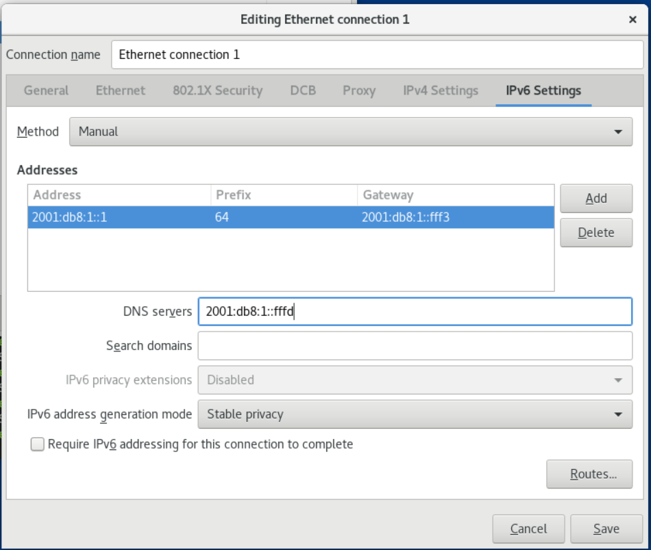
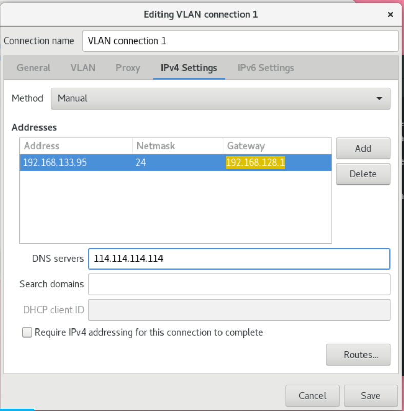
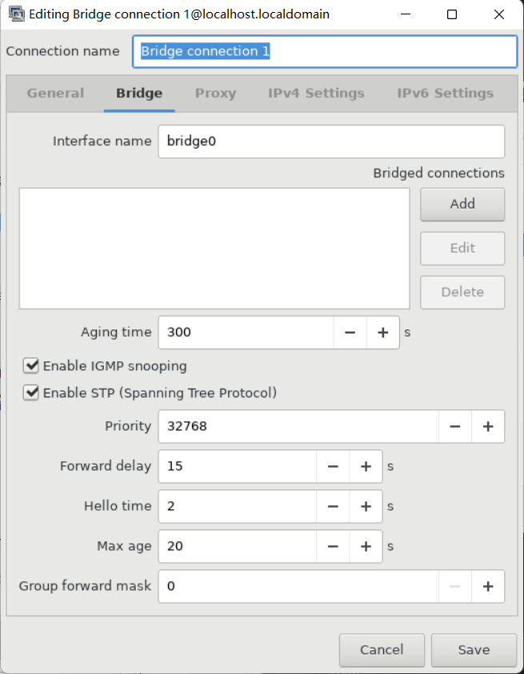
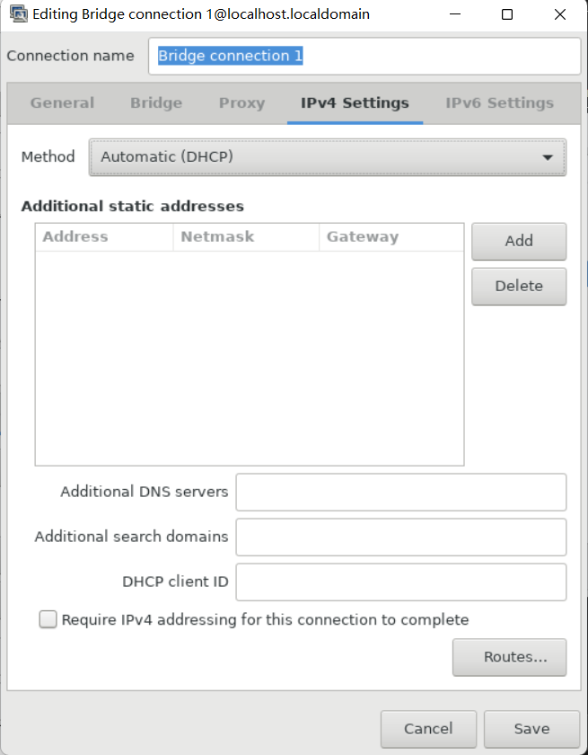

# Chapter 7 Introduction to Nmstate

Nmstate is a declarative network management tool. The nmstate software provides the libnmstate Python library, and nmstatectl, a command-line tool for managing NetworkManager. When using Nmstate, you can describe the expected network state using descriptions in YAML or JSON format.

Advantages of using Nmstate:

- Provides a stable and extensible interface to manage OpenCLoudOS network functions

- Supports atomic and transactional operations at the host and cluster levels

- Supports partial editing of most properties and preserves existing settings not specified in description

- Provides plugin support to enable administrators to use their own plugins

## 7.1. Using libnmstate library in Python program

 The libnmstate Python library enables developers to use Nmstate in their own applications

To use the library, import it in your source code:

```python
import libnmstate
```

Note that you must have the nmstate package installed to use this library.

Case: Use the libnmstate library to query the network status

The following code imports the libnmstate library and displays the available network interfaces and their states:

```python
import json
import libnmstate
from libnmstate.schema import Interface


net_state = libnmstate. show()
for iface_state in net_state[Interface.KEY]:
print(iface_state[Interface.NAME] + ": "
	+ iface_state[Interface.STATE])
```

## 7.2. Use nmstatectl to update the network configuration

 You can use the nmstatectl tool to store the current network configuration for one or more interfaces in a file. Then you can use this file:

- Modify the configuration and apply it to the same system.

- Copy the files to other hosts and configure the hosts with the same or modified settings.

Here's how to export the settings for the ens3 interface to a file, modify the configuration, and apply the settings on the host.

**Prerequisites**

- The nmstate package is installed.

**process**

1. Export the settings of the ens3 interface to the ~/network-config.yml file:

   ```
   # nmstatectl show ens3 > ~/network-config.yml
   ```

   This command will store ens3 configuration in YAML format. To store output in JSON format, pass the --json option to the command.

   If no interface name is specified, nmstatectl will export the configuration of all interfaces.

2. Modify the ~/network-config.yml file using a text editor to update the configuration.

3. Apply the settings in the ~/network-config.yml file:~/network-config.yml file's setting：

   ```
   # nmstatectl apply ~/network-config.yml
   ```

   If you export settings in JSON format, pass the --json option to the command.

## 7.3. Others

    /usr/share/doc/nmstate/README.md
    /usr/share/doc/nmstate/examples/

# Chapter 8 Configuring Ethernet Connections

## 8.1. Configure static ethernet connection using nmcli

**process**

1. Add a new NetworkManager network connection configuration set:

   ```
   # nmcli connection add con-name test-con ifname ens4 type ethernet
   ```

   Change test-con to Configure the set for the network connection you need.

2. Set the IPv4 address:

   ```
   # nmcli connection modify test-con ipv4.addresses 192.128.1.1/24
   ```

3. Set the IPv6 address:

   ```
   #  nmcli connection modify test-con ipv6.addresses AD80::ABAA:0000:00C2:0002/64
   ```

4. Set the IPv4 and IPv6 connection method to manual:

   ```
   #  nmcli connection modify test-con ipv6.method manual
   #  nmcli connection modify test-con ipv4.method manual
   ```

5. Set the IPv4 and IPv6 default gateways：

   ```
   #  nmcli connection modify test-con ipv4.gateway 192.128.1.254
   #  nmcli connection modify test-con ipv6.gateway AD80::ABAA:0000:00C2:FFFE
   ```

6. Set the IPv4 and IPv6 DNS server addresses：

   ```
   #  nmcli connection modify test-con ipv6.dns "AD80::ABAA:0000:00C2:0001"
   #  nmcli connection modify test-con ipv4.dns "114.114.114.114"
   ```

7. Set up DNS search domains for IPv4 and IPv6 connections：

   ```
   #  nmcli connection modify test-con ipv4.dns-search test.com
   #  nmcli connection modify test-con ipv6.dns-search test.com
   ```

8. Activate the connection profile：

   ```
   # nmcli connection up test-con
   ```

**verify**

1. Display the status of the device and the connection：

   ```
   # nmcli device status
   DEVICE      TYPE      STATE      CONNECTION
   ens4      ethernet  connected  test-con
   ```

2. Display all settings of the networking profile：

   ```
   # nmcli connection show test-con
   connection.id:              test-con
   connection.uuid:            b6cdfa1c-e4ad-46e5-af8b-a75f06b79f76
   connection.stable-id:       --
   connection.type:            802-3-ethernet
   connection.interface-name:  ens4
   ...
   ```

3. Verify network connectivity using the ping command：

   - same subnet：
     IPv4:

     ```
     # ping 192.128.1.3
     ```

     IPv6:

     ```
     # ping AD80::ABAA:0000:00C2:0005
     ```

     If the command fails, check the IP and subnet settings.

   - Remote subnet:
     IPv4:

     ```
     # ping 192.168.1.3
     ```

     IPv6:

     ```
     # ping AD80::ABAA:0000:00C3:0005
     ```

     - If the command fails, first ping the default gateway to verify the settings.
       IPv4:

       ```
       # ping 192.128.1.254
       ```

       IPv6:

       ```
       # ping AD80::ABAA:0000:00C2:FFFE
       ```

4. Use the host command to verify whether the domain name resolution is normal:

   ```
   # host client.test.com
   ```

   If the command returns any errors, such as connection timed out or no servers could be reached, verify your DNS settings.

- **Troubleshooting Steps**

  If the connection fails, or the network interface toggles between the up and down states:

  - Make sure the network cable is plugged into the host and switch.

  - Check if the connection failure exists only on this host, or other hosts connected to the same switch that this server is connected to.

  - Verify that the network cables and network interfaces are working as expected. Perform hardware diagnostic steps and replace defective cables and network interface cards.

  - If the configuration on disk does not match the configuration in the device, starting or restarting NetworkManager creates an in-memory connection representing the device's configuration.

## 8.2. Configuring Static Ethernet Connections Using the nmcli Interactive Editor

**process**

1. Add a NetworkManager networking profile in interactive mode:

   ```
   # nmcli connection edit type ethernet con-name test-con
   ```

2. Set up the network interface:

   ```
   nmcli> set connection.interface-name ens4
   ```

3. Set the IPv4 address:

   ```
   nmcli> set ipv4.addresses 192.128.1.1/24
   ```

4. Set the IPv6 address:

   ```
   nmcli> set ipv6.addresses AD80::ABAA:0000:00C2:0002/64
   ```

5. Set the IPv4 and IPv6 connection method to manual:

   ```
   nmcli> set ipv4.method manual
   nmcli> set ipv6.method manual
   ```

6. Set the IPv4 and IPv6 default gateways:

   ```
   nmcli> set ipv4.gateway 192.128.1.254
   nmcli> set ipv6.gateway AD80::ABAA:0000:00C2:FFFE
   ```

7. Set the IPv4 and IPv6 DNS server addresses:

   ```
   nmcli> set ipv4.dns 114.114.114.114
   nmcli> set ipv6.dns AD80::ABAA:0000:00C2:0001
   ```

   To set up multiple DNS servers, separate them by Spaces and enclose them in quotation marks.

8. Set up DNS search domains for IPv4 and IPv6 connections:

   ```
   nmcli> set ipv4.dns-search example.com
   nmcli> set ipv6.dns-search example.com
   ```

9. Save and activate the connection:

   ```
   nmcli> save persistent
   Saving the connection with 'autoconnect=yes'. That might result in an immediate activation of the connection.
   Do you still want to save? (yes/no) [yes] yes
   ```

10. Exit interactive mode:

    ```
    nmcli> quit
    ```

**verify**

1. Display the status of the device and the connection:

   ```
   # nmcli device status
   DEVICE      TYPE      STATE      CONNECTION
   ens4      ethernet  connected  test-con
   ```

2. Display all settings of the networking profile:

   ```
   # nmcli connection show test-con
   connection.id:              test-con
   connection.uuid:            b6cdfa1c-e4ad-46e5-af8b-a75f06b79f76
   connection.stable-id:       --
   connection.type:            802-3-ethernet
   connection.interface-name:  ens4
   ...
   ```

3. Verify network connectivity using the ping command:

   - same subnet:
     IPv4:

     ```
     # ping 192.128.1.3
     ```

     IPv6:

     ```
     # ping AD80::ABAA:0000:00C2:0005
     ```

     If the command fails, check the IP and subnet settings.

   - Remote subnet:

     IPv4:

     ```
     # ping 192.168.1.3
     ```

     IPv6:

     ```
     # ping AD80::ABAA:0000:00C3:0005
     ```

     -  If the command fails, first ping the default gateway to verify the settings.
       IPv4:

       ```
       # ping 192.128.1.254
       ```

       IPv6:

       ```
       # ping AD80::ABAA:0000:00C2:FFFE
       ```

4. Use the host command to verify whether the domain name resolution is normal:

   ```
   # host client.test.com
   ```

   If the command returns any errors, such as connection timed out or no servers could be reached, verify your DNS settings.

**Troubleshooting Steps**

If the connection fails, or the network interface toggles between the up and down states:

- Make sure the network cable is plugged into the host and switch.

- Check if the connection failure exists only on this host, or other hosts connected to the same switch that this server is connected to.

- Verify that the network cables and network interfaces are working as expected. Perform hardware diagnostic steps and replace defective cables and network interface cards.

- If the configuration on disk does not match the configuration in the device, starting or restarting NetworkManager creates an in-memory connection representing the device's configuration.

## 8.3.Configure a static Ethernet connection using nmstatectl

**Prerequisites**

- nmstate installed.

**process**

1. Create a YAML file ~/create-ethernet-profile.yml with the following content:

   ```
   ---
   dns-resolver:
   config:
       search: []
       server:
       - 114.114.114.114
   route-rules:
   config: []
   routes:
   config:
   - destination: 0.0.0.0/0
       metric: 100
       next-hop-address: 192.168.128.1
       next-hop-interface: ens3
       table-id: 254
   interfaces:
   - name: ens3
   type: ethernet
   state: up
   accept-all-mac-addresses: false
   ipv4:
       enabled: true
       address:
     - ip: 192.168.133.95
       prefix-length: 20
     dhcp: false
   ipv6:
     enabled: true
     address:
     - ip: fe80::f816:3eff:fec6:ce86
       prefix-length: 64
     auto-dns: true
     auto-gateway: true
     auto-route-table-id: 0
     auto-routes: true
     autoconf: true
     dhcp: true
   ```

2. Apply the configuration to the system:

   ```
   # nmstatectl apply ~/create-ethernet-profile.yml
   ```

**verify**

1. Display the status of the device and the connection:

   ```
   # nmcli device status
   DEVICE      TYPE      STATE      CONNECTION
   ens3      ethernet  connected  ens3
   ```

2. Display all settings of the connection profile:

   ```
   # nmcli connection show ens3
   connection.id:              ens3
   connection.uuid:            b6cdfa1c-e4ad-46e5-af8b-a75f06b79f76
   connection.stable-id:       --
   connection.type:            802-3-ethernet
   connection.interface-name:  ens3
   ...
   ```

3. Display the connection settings in YAML format:

   ```
   # nmstatectl show ens3
   ```

## 8.4. Configuring static ethernet connections with interface names using rhel-ssystem-roles

**Prerequisites**

- rhel-system-roles and ansible installed.

- If you are using a non-root user to run the playbook, that user is required to have sudo privileges.

- The host uses NetworkManager to configure the network.

**process**

1. Add the host IP or name to the /etc/ansible/hosts Ansible inventory file:

   ```
   node.example.com
   ```

2. Create playbook ~/ethernet-static-IP.yml:

   ```
   ---
   - name: Configure an Ethernet connection with static IP
     hosts: node.example.com
     become: true
     tasks:
    - include_role:
        name: rhel-system-roles.network
   
      vars:
        network_connections:
          - name: enp7s0
            interface_name: enp7s0
            type: ethernet
            autoconnect: yes
            ip:
              address:
                - 192.0.2.1/24
                - 2001:db8:1::1/64
              gateway4: 192.0.2.254
              gateway6: 2001:db8:1::fffe
              dns:
                - 192.0.2.200
                - 2001:db8:1::ffbb
              dns_search:
                - example.com
            state: up
   ```

3. Run playbook：

   -  To connect to the managed host as root, enter:

     ```
     # ansible-playbook -u root ~/ethernet-static-IP.yml
     ```

   - To connect to a managed host as a user, enter:

     ```
     # ansible-playbook -u user_name --ask-become-pass ~/ethernet-static-IP.yml
     ```

     The --ask-become-pass option ensures that the ansible-playbook command prompts for the sudo password for the user defined in the -u user_name option.

   If the -u user_name option is not specified, ansible-playbook connects to the managed host as the user currently logged into the control node.

## 8.5. Using rhel-ssystem-roles to configure static ethernet connections with device paths

You can identify the device path with the following command:

```
# udevadm info /sys/class/net/<device_name> | grep ID_PATH=
```

**Prerequisites**

- rhel-system-roles and ansible installed.

- If you are using a non-root user to run the playbook, that user is required to have sudo privileges.

- The host uses NetworkManager to configure the network.

**process**

1. Add the host IP or name to the /etc/ansible/hosts Ansible inventory file:

   ```
   node.example.com
   ```

2. Create playbook ~/ethernet-dynamic-IP.yml includes things as below：

   ```
   ---
     - name: Configure an Ethernet connection with dynamic IP
     hosts: node.example.com
     become: true
     tasks:
     - include_role:
        name: rhel-system-roles.network
   
      vars:
        network_connections:
          - name: example
            match:
              path:
                - pci-0000:00:0[1-3].0
                - &!pci-0000:00:02.0
            type: ethernet
            autoconnect: yes
            ip:
              address:
                - 192.0.2.1/24
                - 2001:db8:1::1/64
              gateway4: 192.0.2.254
              gateway6: 2001:db8:1::fffe
              dns:
                - 192.0.2.200
                - 2001:db8:1::ffbb
              dns_search:
                - example.com
            state: up
   ```

   The match parameter in this example defines Ansible to apply the script to devices that match PCI ID 0000:00:0[1-3].0, but not 0000:00:02.0. See the match parameter description in the /usr/share/ansible/roles/rhel-system-roles.network/README.md file for details on the special modifiers and wildcards that can be used.

3. Run the playbook:

   - To connect to the managed host as root, enter:

     ```
     # ansible-playbook -u root ~/ethernet-dynamic-IP.yml
     ```

   - To connect to a managed host as a user, enter:

     ```
     # ansible-playbook -u user_name --ask-become-pass ~/ethernet-dynamic-IP.yml
     ```

     The --ask-become-pass option ensures that the ansible-playbook command prompts for the sudo password for the user defined in the -u user_name option.

   If the -u user_name option is not specified, the ansible-playbook connects to the managed host as the user currently logged in to the control node.

## 8.6. Configuring Dynamic Ethernet Connections Using nmcli

**Prerequisites**

- There is a DHCP server in the network

**process**

1. Add a new NetworkManager connection profile for Ethernet connections:

   ```
   # nmcli connection add con-name Example-Connection ifname enp7s0 type ethernet
   ```

2. (Optional) Change the hostname that NetworkManager sends to the DHCP server when using the Example-Connection configuration file:

   ```
   # nmcli connection modify Example-Connection ipv4.dhcp-hostname Example ipv6.dhcp-hostname Example
   ```

3. (Optional) Change the client ID that NetworkManager sends to the IPv4 DHCP server when using the Example-Connection profile:

   ```
   # nmcli connection modify Example-Connection ipv4.dhcp-client-id client-ID
   ```

   Note that for IPv6 there is no dhcp-client-id parameter. To create an identifier for IPv6, configure the dhclient service.

**Verify**

1. Display the status of the device and the connection:

   ```
   # nmcli device status
   DEVICE      TYPE      STATE      CONNECTION
   enp7s0      ethernet  connected  Example-Connection
   ```

2. Display all settings of the connection profile:

   ```
   # nmcli connection show Example-Connection
   connection.id:              Example-Connection
   connection.uuid:            b6cdfa1c-e4ad-46e5-af8b-a75f06b79f76
   connection.stable-id:       --
   connection.type:            802-3-ethernet
   connection.interface-name:  enp7s0
   ...
   ```

3. Use the ping program to verify network connectivity.

   -  Find IP addresses on the same subnet.
     IPv4:
     
     ```
     # ping 192.0.2.3
     ```
     
     IPv6:
     
   ```
     # ping 2001:db8:2::1
   ```
   
     -  If the command fails, ping the default gateway to verify the settings.
       IPv4:
     
       ```
       # ping 192.0.2.254
       ```
     
       IPv6:
     
       ```
       # ping 2001:db8:1::fff3
       ```

4. Use the host command to verify whether the domain name resolution is normal:

   ```
   # host client.test.com
   ```

   If the command is wrong, such as connection timed out or no servers could be reached, verify your DNS settings.

## 8.7. Configure dynamic ethernet connections using the nmcli interactive editor

**Prerequisites**

- There is a DHCP server in the network.

**Process**

1. Add a new NetworkManager connection profile for the Ethernet connection and start interactive mode:

   ```
   # nmcli connection edit type ethernet con-name Example-Connection
   ```

2. Set up the network interface:

   ```
   nmcli> set connection.interface-name enp7s0
   ```

3. (Optional) Change the hostname that NetworkManager sends to the DHCP server when using the Example-Connection configuration file:

   ```
   nmcli> set ipv4.dhcp-hostname Example
   nmcli> set ipv6.dhcp-hostname Example
   ```

4. (Optional) Change the client ID that NetworkManager sends to the IPv4 DHCP server when using the Example-Connection profile:

   ```
   nmcli> set ipv4.dhcp-client-id client-ID
   ```

   Note that for IPv6 there is no dhcp-client-id parameter. To create an identifier for IPv6, configure the dhclient service.

5. Save and activate the connection:

   ```
   nmcli> save persistent
   Saving the connection with 'autoconnect=yes'. That might result in an immediate activation of the connection.
   Do you still want to save? (yes/no) [yes] yes
   ```

6. Save and exit interactive mode:

   ```
   nmcli> quit
   ```

**Verify**

1. Display the status of the device and the connection:

   ```
   # nmcli device status
   DEVICE      TYPE      STATE      CONNECTION
   enp7s0      ethernet  connected  Example-Connection
   ```

2. Display all settings of the connection profile:

   ```
   # nmcli connection show Example-Connection
   connection.id:              Example-Connection
   connection.uuid:            b6cdfa1c-e4ad-46e5-af8b-a75f06b79f76
   connection.stable-id:       --
   connection.type:            802-3-ethernet
   connection.interface-name:  enp7s0
   ...
   ```

3. Use the ping program to verify network connectivity.

   - Find IP addresses on the same subnet.


        IPv4:
    
     ```
     # ping 192.0.2.3
     ```
    
        IPv6:
    
         ```
      # ping 2001:db8:1::2
         ```
    
     -  If the command fails, ping the default gateway to verify the settings.
       IPv4:
    
       ```
       # ping 192.0.2.254
       ```
    
       IPv6:
    
       ```
       # ping 2001:db8:1::fff3
       ```

4. 11111

   - Use the host command to verify whether the domain name resolution is normal:

      ```
      # host client.test.com
      ```

      If the command is wrong, such as connection timed out or no servers could be reached, verify your DNS settings.

## 8.8.Use nmstatectl to configure a dynamic Ethernet connection

This section describes how to add a dynamic ethernet connection to the enp7s0 device using the nmstatectl tool. During setup during this process, NetworkManager requests IP settings for this connection from a DHCP server.

The nmstatectl tool ensures that when a configuration is set, the results match the configuration file. If anything fails, nmstatectl automatically rolls back the changes to avoid leaving the system in an incorrect state.

The process defines the interface configuration in YAML format. Alternatively, you can also specify configuration in JSON format:

**Prerequisites**

- The nmstate software is installed.

**process**

1. Create a YAML file ~/create-ethernet-profile.yml with the following content:

   ```
   ---
   interfaces:
   - name: enp7s0
   type: ethernet
   state: up
   ipv4:
       enabled: true
       auto-dns: true
       auto-gateway: true
       auto-routes: true
       dhcp: true
   ipv6:
       enabled: true
       auto-dns: true
       auto-gateway: true
       auto-routes: true
       autoconf: true
       dhcp: true
   ```

2. Apply the configuration to the system:

   ```
   # nmstatectl apply ~/create-ethernet-profile.yml
   ```

**verify**

1. Display the status of the device and the connection:

   ```
   # nmcli device status
   DEVICE      TYPE      STATE      CONNECTION
   enp7s0      ethernet  connected  enp7s0
   ```

2. Display all settings of the connection profile:

   ```
   # nmcli connection show enp7s0
   connection.id:              enp7s0
   connection.uuid:            b6cdfa1c-e4ad-46e5-af8b-a75f06b79f76
   connection.stable-id:       --
   connection.type:            802-3-ethernet
   connection.interface-name:  enp7s0
   ...
   ```

3. Display the connection settings in YAML format:

   ```
   # nmstatectl show enp7s0
   ```

## 8.9. Configure dynamic ethernet connections using rhel-system-roles with interface names

**Prerequisites**

- There is a DHCP server in the network.

- Ansible and rhel-system-roles packages are installed on the control node.

- If you are using a non-root user to run the playbook, that user is required to have sudo privileges.

- The host uses NetworkManager to configure the network.

**process**

1. If the host you want to execute the playbook on is not already listed, add the host's IP or name to the /etc/ansible/hosts Ansible inventory file:

   ```
   node.example.com
   ```

2. Creat playbook ~/ethernet-dynamic-IP.yml with the following：

   ```
   ---
   - name: Configure an Ethernet connection with dynamic IP
       hosts: node.example.com
       become: true
       tasks:
       - include_role:
           name: rhel-system-roles.network
   
       vars:
           network_connections:
           - name: enp7s0
               interface_name: enp7s0
               type: ethernet
               autoconnect: yes
               ip:
               dhcp4: yes
               auto6: yes
               state: up
   ```

3.  Run the playbook：

   - To connect to the managed host as root, enter:

     ```
     # ansible-playbook -u root ~/ethernet-dynamic-IP.yml
     ```

   -  To connect to a managed host as a user, enter:

     ```
     # ansible-playbook -u user_name --ask-become-pass ~/ethernet-dynamic-IP.yml
     ```

     The --ask-become-pass option ensures that the ansible-playbook command prompts for the user's sudo password as defined in the -u user_name option.

   If the -u user_name option is not specified, ansible-playbook connects to the managed host as the user currently logged into the control node.

## 8.10. Configuring dynamic ethernet connections with device paths using rhel-system-roles

You can identify the device path with the following command:

```
# udevadm info /sys/class/net/<device_name> | grep ID_PATH=
```

**Prerequisites**

- There is a DHCP server in the network.

- Ansible and rhel-system-roles packages are installed on the control node.

- If you are using a non-root user to run the playbook, that user is required to have sudo privileges.

- The host uses NetworkManager to configure the network.

**process**

1.  If the host you want to execute the playbook on is not already listed, add the host's IP or name to the /etc/ansible/hosts Ansible inventory file:

   ```
   node.example.com
   ```

2. Create a playbook with ~/ethernet-dynamic-IP.yml:

   ```
   ---
   - name: Configure an Ethernet connection with dynamic IP
   hosts: node.example.com
   become: true
   tasks:
   - include_role:
       name: rhel-system-roles.network
   
       vars:
       network_connections:
           - name: example
           match:
               path:
               - pci-0000:00:0[1-3].0
               - &!pci-0000:00:02.0
           type: ethernet
           autoconnect: yes
           ip:
               dhcp4: yes
               auto6: yes
           state: up
   ```

   The match parameter in this example defines Ansible to apply the playbook to devices that match PCI ID 0000:00:0[1-3].0, but not 0000:00:02.0. See the match parameter description in the /usr/share/ansible/roles/rhel-system-roles.network/README.md file for details on the special modifiers and wildcards that can be used.

3.  Run the playbook：

   - To connect to the managed host as root, enter:

     ```
     # ansible-playbook -u root ~/ethernet-dynamic-IP.yml
     ```

   -  To connect to a managed host as a user, enter:

     ```
     # ansible-playbook -u user_name --ask-become-pass ~/ethernet-dynamic-IP.yml
     ```

     The --ask-become-pass option ensures that the ansible-playbook command prompts for the sudo password for the user defined in the -u user_name option.

   If the -u user_name option is not specified, ansible-playbook connects to the managed host as the user currently logged into the control node.

## 8.11. Use control-center to configure Ethernet connection

This section describes how to configure Ethernet connections in the GNOME control-center.

Note that control-center does not support as many configuration options as the nm-connection-editor application or the nmcli command.

**Prerequisites**

- There is a physical or virtual Ethernet device in the server configuration.

- GNOME is installed.

**process**

1. Go to Settings.

2. Select Network in the left navigation.

3. Click the + button next to the Wired entry to create a new configuration file.

4. Optional: Set a name for the connection on the Identity tab.

5. On the IPv4 tab, configure the IPv4 settings. For example, select the configuration mode Manual, and set the static IPv4 address, netmask, default gateway and DNS server:

6. On the IPv6 tab, configure the IPv6 settings. For example, select the method Manual to set a static IPv6 address, netmask, default gateway, and DNS server:

   

7. Click the Add button to save the connection. GNOME control-center automatically activates the connection.

**Verify**

1. Displays the status of devices and connections:

   ```
   # nmcli device status
   DEVICE      TYPE      STATE      CONNECTION
   enp7s0      ethernet  connected  Example-Connection
   ```

2. Displays all Settings for the connection configuration set:

   ```
   # nmcli connection show Example-Connection
   connection.id:              Example-Connection
   connection.uuid:            b6cdfa1c-e4ad-46e5-af8b-a75f06b79f76
   connection.stable-id:       --
   connection.type:            802-3-ethernet
   connection.interface-name:  enp7s0
   ...
   ```

3. Use the ping program to verify network connectivity.

   - Find an IP address in the same subnet.
     IPv4:
     
         ```
         # ping 192.0.2.3
         ```
     ​    IPv6:
         ```
         # ping 2001:db8:1::2
       ```
     
   - Find an IP address in a remote subnet.
     IPv4:

     ```
     # ping 192.0.2.3
     ```

     IPv6:

     ```
     # ping 2001:db8:2::1
     ```

     - If the command fails, ping the default gateway is used to verify the Settings.
       IPv4:

       ```
       # ping 192.0.2.254
       ```

       IPv6:

       ```
       # ping 2001:db8:1::fff3
       ```

4. Run the host command to verify that domain name resolution is normal:

   ```
   # host client.test.com
   ```

   If the command is wrong, such as connection timed out or no servers could be reached, verify your DNS Settings.

**Troubleshooting Steps**

If the connection fails, or the network interface toggles between the up and down states:

- Make sure the network cable is plugged into the host and switch.

- Check if the connection failure exists only on this host, or other hosts connected to the same switch that this server is connected to.

- Verify that the network cables and network interfaces are working as expected. Perform hardware diagnostic steps and replace defective cables and network interface cards.

- If the configuration on disk does not match the configuration in the device, starting or restarting NetworkManager creates an in-memory connection representing the device's configuration.

##   8.12. Configure Ethernet connection using nm-connection-editor

**Prerequisites**

- There is a physical or virtual Ethernet device in the server configuration.

- GNOME is installed.

**Process**

1. Enter in the terminal:

   ```
   $ nm-connection-editor
   ```

2. Click the [+] button to add a new connection.

3. Select the Ethernet type, and click [Create].

4. On the General tab: 

   1. To enable this connection automatically at system startup or when the NetworkManager service is restarted:

      1. Select Connect automatically with priority.
      2. Optional: Change the priority value next to Connect automatically with priority.

      If there are multiple connection profiles for the same device, NetworkManager only enables one profile. By default, NetworkManager activates the last used profile with autoconnect enabled. However, if you set a priority value in a configuration set, NetworkManager activates the configuration set with the highest priority.

   2. If the profile should only be available to the user who created the connection profile, clear the All users may connect to this network check box.
      

5. On the Ethernet tab, select a device and optionally select other settings related to Ethernet.
   

6. On the IPv4 Settings tab, configure the IPv4 settings. For example, to set a static IPv4 address, netmask, default gateway and DNS server:
   

7. On the IPv6 Settings tab, configure the IPv6 settings. For example, to set a static IPv6 address, netmask, default gateway and DNS server:
   

8. Save the connection.

9. Close nm-connection-editor.

**Verify**

1. Use the ping program to verify network connectivity.

   - Find IP addresses on the same subnet.
     IPv4:

         ```
         # ping 192.0.2.3
         ```

     ​    IPv6:

         ```
         # ping 2001:db8:1::2
         ```

   - Look up IP addresses in remote subnets.
     IPv4:

     ```
     # ping 198.162.3.1
     ```

     IPv6:

     ```
     # ping 2001:db8:2::1
     ```

     - If the command fails, ping the default gateway to verify the settings.
       IPv4:

       ```
       # ping 192.0.2.254
       ```

       IPv6:

       ```
       # ping 2001:db8:1::fff3
       ```

   - Use the host command to verify whether the domain name resolution is normal:

   ```
   # host client.test.com
   ```

   If the command is wrong, such as connection timed out or no servers could be reached, verify your DNS settings.

## 8.13. Change NetworkManager's DHCP client

By default, NetworkManager uses its internal DHCP client. However, if you need a DHCP client that does not provide a built-in client, you can also configure NetworkManager to use dhclient.

Process

1. Create the /etc/NetworkManager/conf.d/dhcp-client.conf file:

   ```
   [main]
   dhcp=dhclient
   ```

    You can set the dhcp parameter to internal (default) or dhclient.

2. If you set the dhcp parameter for dhclient, install the dhcp-client package:

   ```
   # yum install dhcp-client
   ```

3. Restart NetworkManager：

   ```
   # systemctl restart NetworkManager
   ```

    Note that restarting temporarily interrupts all network connections.

**Verify**

- Search for entries similar to the following in the /var/log/messages log file:

  ```
  Sep  5 06:41:52 server NetworkManager[27748]: <info>  [1650959659.8483] dhcp-init: Using DHCP client 'dhclient'
  ```

  This log entry confirms that NetworkManager is using dhclient as the DHCP client.

##   8.14. Configuring DHCP behavior for NetworkManager connections

A DHCP client requests a dynamic IP address and corresponding configuration information from a DHCP server each time it connects to the network.

When you configure a connection to retrieve an IP address from a DHCP server, NetworkManager requests an IP address from a DHCP server. By default, the client waits 45 seconds for this request to complete. When a DHCP connection is initiated, the dhcp client requests an IP address from the DHCP server.

**Prerequisites**

- A connection using DHCP is configured on the host.

**Process**

1. Set the ipv4.dhcp-timeout and ipv6.dhcp-timeout properties. For example, to set both options to 30 seconds, enter:

   ```
   # nmcli connection modify connection_name ipv4.dhcp-timeout 30 ipv6.dhcp-timeout 30
   ```

    Also, set the parameter to infinity to configure NetworkManager to not stop trying to request and renew an IP address until it succeeds.

2. Optional: Configure the behavior if NetworkManager does not receive an IPv4 address before timing out:

   ```
   # nmcli connection modify connection_name ipv4.may-fail value
   ```

   If the ipv4.may-fail option is set to:

      - yes ,the state of the connection depends on the IPv6 configuration:
        -  If the IPv6 configuration is enabled and successful, NetworkManager activates the IPv6 connection and does not attempt to activate the IPv4 connection.
        -  If IPv6 configuration is disabled or not configured, the connection will fail.
      - no , the connection will be stopped. in this case:
        -  If the connection's autoconnect property is enabled, NetworkManager tries to activate the connection as many times as the value set in the autoconnect-retries property. The default value is 4.
        -  If the connection still cannot obtain a DHCP address, auto activation will fail. Note that after 5 minutes, the automatic connection process starts again to obtain an IP address from the DHCP server.

3. Optional: Configure the behavior if NetworkManager does not receive an IPv6 address before timeout:

   ```
   # nmcli connection modify connection_name ipv6.may-fail value
   ```

## 8.15. Configuring Multiple Ethernet Interfaces Using a Single Connection Profile by Interface Name

In most cases, a connection profile contains the settings for a network device. However, NetworkManager also supports wildcards when you set interface names in connection profiles. You can use this feature to create a single connection profile that can be used for multiple Ethernet interfaces if the host is roaming between Ethernets with dynamic IP address assignment.

**Prerequisites**

- DHCP is available in the network

- The host has multiple ethernet adapters

- The connection profile does not exist on the host

**Process**

1. Add a connection profile that can be applied to all interface names starting with enp:

   ```
   #nmcli connection add con-name Example connection.multi-connect multiple match.interface-name enp* type ethernet
   ```

**Verify**

1. Display all settings for a single connection profile:

   ```
   #nmcli connection show Example
   connection.id:                      Example
   ...
   connection.multi-connect:           3 (multiple)
   match.interface-name:               `enp*`
   ...
   ```

   3 indicates ** The number of interfaces that are active on the connection profile at the same time **, not the number of network interfaces in the connection profile. The connection profile uses all devices that match the pattern in the match.interface-name parameter, so the connection profile has the same universal unique identifier (UUID).

2. Display the status of the connection:

   ```
   #nmcli connection show
   NAME                    UUID                    TYPE     DEVICE
   ...
   Example  6f22402e-c0cc-49cf-b702-eaf0cd5ea7d1  ethernet  enp7s0
   Example  6f22402e-c0cc-49cf-b702-eaf0cd5ea7d1  ethernet  enp8s0
   Example  6f22402e-c0cc-49cf-b702-eaf0cd5ea7d1  ethernet  enp9s0
   ```

##   8.16. Configure a connection profile for multiple Ethernet interfaces using PCI IDs

A PCI ID is a unique identifier for a device connected to the system. A connection profile adds multiple devices by matching interfaces based on a list of PCI IDs. You can use this process to connect multiple device PCI IDs to a connection profile.

**Prerequisites**

- A DHCP server is available in the network
- The host has multiple ethernet adapters
- The connection profile does not exist on the system

**Process**

1. Identify the device path. For example, to display device paths for all interfaces beginning with enp, enter:

   ```
   #udevadm info /sys/class/net/enp* | grep ID_PATH=
   ...
   E: ID_PATH=pci-0000:07:00.0
   E: ID_PATH=pci-0000:08:00.0
   ```

2. Add a connection profile that applies to all PCI IDs that match the expression 0000:00:0[7-8].0:

   ```
   #nmcli connection add type ethernet connection.multi-connect multiple match.path "pci-0000:07:00.0 pci-0000:08:00.0" con-name Example
   ```

**Verify**

1. Display the status of the connection:

   ```
   #nmcli connection show
   
   NAME   UUID     TYPE        DEVICE
   ...
   Example      9cee0958-512f-4203-9d3d-b57af1d88466  ethernet  enp7s0
   Example      9cee0958-512f-4203-9d3d-b57af1d88466  ethernet  enp8s0
   ...
   ```

2. Display all settings of the connection profile:

   ```
   #nmcli connection show Example
   
   connection.id:               Example
   ...
   connection.multi-connect:    3 (multiple)
   match.path:                  pci-0000:07:00.0,pci-0000:08:00.0
   ...
   ```

This connection profile uses all devices whose PCI ID matches the pattern in the match.path parameter, so the connection profile has the same universally unique identifier (UUID).


# Chapter 9 Managing Wi-Fi Connections

##   9.1. Use nmcli to configure Wi-Fi connection

**Prerequisites**

- The nmcli tool is installed.

- Make sure WiFi is enabled:

**Process**

1. Create a Wi-Fi connection profile with a static IP configuration:

   ```markdown
   $ nmcli con add con-name MyCafe ifname wlan0 type wifi ssid MyCafe ip4 192.0.2.101/24 gw4 192.0.2.1
   ```

2. Set up a DNS server. For example, to set 192.0.2.1 as the DNS server:

   ```markdown
   $ nmcli con modify con-name MyCafe ipv4.dns "192.0.2.1"
   ```

3. Optionally, set DNS search domains. For example, to set the search domain to example.com:

   ```
   $ nmcli con modify con-name MyCafe ipv4.dns-search "example.com"
   ```

4. Check specific attributes such as mtu:

   ```
   $ nmcli connection show id MyCafe | grep mtu
   802-11-wireless.mtu:                     auto
   ```

5. Change the properties of the setting:

   ```
   $ nmcli connection modify id MyCafe wireless.mtu 1350
   ```

6. Verify the changes:

   ```
   $ nmcli connection show id MyCafe | grep mtu
   802-11-wireless.mtu:                     1350
   ```

**Verify**

1. Use the ping command to verify whether the wifi network is connected:：

   - same subnet:

     ```
     # ping 192.0.2.103
     ```

     If the command fails, verify the IP and subnet settings.

   - Extranet:

     ```
     # ping 198.51.16.3
     ```

     - If the command fails, ping the default gateway to verify the settings.

       ```
       # ping 192.0.2.1
       ```

2. Use the host command to verify whether the domain name resolution is normal.

   ```
   # host client.example.com
   ```

   If the command returns any errors, such as connection timed out or no servers could be reached, verify your DNS settings.

##   9.2. Use control-center to configure Wi-Fi connection

**process**

1. Go to Settings and select the WI-FI option in the left menu bar to see the available Wi-Fi networks.

2. Select the gear wheel icon to the right of the name of the Wi-Fi connection you want to edit and the Edit Connection dialog will appear. The Details menu window displays connection details that you can further configure.

   **Options**

   1. If you select "Connect automatically", NetworkManager will automatically connect to the connection when NetworkManager detects that it is available. Clear the check box if you do not want NetworkManager to connect automatically. Note that when the check box is cleared, you must select the connection in the network connection icon's menu to make it connect.
   2. To make the connection available to other users, select the Make available to other users check box.
   3. You can also control background data usage by changing Restrict background data usage.

3. Select the Identity menu item to view basic configuration options.

   SSID - The Service Set Identifier (SSID) of the Access Point (AP).

   BSSID - The Basic Service Set Identifier (BSSID) is the MAC address (also known as the hardware address) of the specific wireless access point you are connecting to in infrastructure mode. By default, this field is blank and you can connect to a wireless access point by SSID without specifying a BSSID. If a BSSID is specified, it will force the system to only associate to a specific access point. For ad-hoc networks, the BSSID is randomly generated by the mac80211 subsystem when the ad-hoc network is created. NetworkManager doesn't show it.

   MAC Address - A MAC address allows you to associate a specific wireless adapter with a specific connection (or connections).

   Clone Address - Uses a cloned MAC address instead of the actual hardware address. Leave blank unless required.

4. For further IP address configuration, select the IPv4 and IPv6 menu item.

   By default, both IPv4 and IPv6 are set to auto-configure based on the current network settings. This means that when the interface is connected to the network, the local IP address, DNS address and other settings are automatically detected. If a DHCP server assigns the IP configuration in this network, but you can also provide static configuration in IPv4 and IPv6 settings. In the IPv4 and IPv6 menu entries you can see the following settings:

   - IPv4

     - Automatic (DHCP) - select this option if the network you are connecting to uses a Router Advertisement (RA) or DHCP server to assign dynamic IP addresses. You can see the assigned IP address in the Details menu entry.

     - Link Only - Select this option if the network you are connecting to does not have a DHCP server and you do not want to assign IP addresses manually. Random addresses will be assigned a prefix of 169.254/16 according to RFC 3927.

     - Manual - Select this option if you want to assign IP addresses manually.

     - disable - IPv4 is disabled for this connection.

   - DNS

     - If Automatic is ON and there is no DHCP server available to assign a DNS server for this connection, switch it to OFF to enter the IP addresses of the DNS servers separated by commas.

   - Routes

     Note that in the Routes section, when Automatic is ON, routes from Router Advertisement (RA) or DHCP are used, but you can also add additional static routes. When OFF, only static routes are used.

     - Address - Enter the IP address of the remote network, subnet, or host.

     - Subnet Mask - The subnet mask or prefix length for the IP address entered above.
     - Gateway - The IP address of the gateway for the remote network, subnetwork, or host entered above.
     - metric - network cost, the preferred value given to this route. The lower the number, the higher the priority.

- Use this connection only for resources on their network
  - use this connection only for resources on its network
    - Select this checkbox to prevent the connection from being the default route.
  - IPv6
    - Automatic—Select this option to use IPv6 Stateless Address Autoconfiguration (SLAAC) to create an automatic stateless configuration based on hardware addresses and Router Advertisements (RAs).
    - Automatic, DHCP Only - Select this option to not use RA and instead request information directly from DHCPv6 to create a stateful configuration.
    - Link Only - Select this option if the network you are connecting to does not have a DHCP server and you do not want to assign IP addresses manually. Random addresses will be assigned according to RFC 4862 with a prefix of FE80::0.
    - Manual - Select this option if you want to assign IP addresses manually.
    - disable - IPv6 is disabled for this connection.

5. Select the Security menu item to configure the security settings.
   - safety
     - None - encryption is disabled, data is transmitted in plain text across the network.
     - WEP 40/128 bit key - Wired Equivalent Privacy (WEP), from the IEEE 802.11 standard. Use a single pre-shared key (PSK).
     - WEP 128-bit passphrase - MD5 hash of the passphrase used to generate the WEP key.
     - Dynamic WEP(802.1X) - WEP key changes dynamically.
     - LEAP - Lightweight Extensible Authentication Protocol for Cisco Systems.
     - WPA and WPA2 Personal - Wi-Fi Protected Access (WPA) from the IEEE 802.11i draft standard. Wi-Fi Protected Access 2 (WPA2) from the 802.11i-2004 standard. Personal mode, using a pre-shared key (WPA-PSK).
     - WPA & WPA2 Enterprise—WPA and WPA2 are used with RADIUS authentication servers to provide IEEE 802.1X network access control.
     - WPA3 Personal - Wi-Fi Protected Access 3 (WPA3) Personal uses Simultaneous Authentication of Equals (SAE) instead of Pre-Shared Key (PSK) to prevent dictionary attacks. WPA3 uses perfect forward secrecy.
   - password
     - Enter the password to be used during the verification process.

6. After completing the configuration, click the Apply button to save the configuration.

##   9.3. Connect to Wi-Fi network using nmcli

**Prerequisites**

- The nmcli tool is installed.

- Make sure WiFi is enabled (default):

  ```
  $ nmcli radio wifi on
  ```

**Process**

1. Refresh the list of available Wi-Fi connections:

   ```
   $ nmcli device wifi rescan
   ```

2. View available Wi-Fi access points:

   ```
   $ nmcli dev wifi list
   
   IN-USE  SSID      MODE   CHAN  RATE        SIGNAL  BARS  SECURITY
   ...
           MyCafe    Infra  3     405 Mbit/s  85      ▂▄▆█  WPA1 WPA2
   ```

3. Connect to the Wi-Fi connection using nmcli:

   ```
   $ nmcli dev wifi connect SSID-Name password wireless-password
   ```

   例如：

   ```
   $ nmcli dev wifi connect MyCafe password wireless-password
   ```

   禁用 Wi-Fi ：

   ```
   $ nmcli radio wifi off
   ```

##  9.4. Connect to a hidden Wi-Fi network using nmcli

All Wi-Fi access points have a Service Set Identifier (SSID) to identify them. However, an access point can be configured not to broadcast its SSID, in which case it will be hidden and not appear in NetworkManager's list of available networks.

**Prerequisites**

- The nmcli tool is installed.

- Know the SSID, and password for your Wi-Fi connection.

- Make sure WiFi is enabled (default):

  ```
  $ nmcli radio wifi on
  ```

**Process**

-  Connect to a hidden SSID:

  ```
  $ nmcli dev wifi connect SSID_Name password wireless_password hidden yes
  ```

##  9.5. Connect to Wi-Fi network using GNOME GUI

**Process**

1. Open the GNOME Shell network connections icon menu in the upper right corner of the screen.

2. Select Wi-Fi Not Connected.

3. Click the Select Network option.

4. Click the name of the network you want to connect to, and then click Connect.

Note that if you do not see the network, it may be hidden.

5. If a password or encryption key is required to secure the network, enter the password and click Connect.

Please note: If you do not know the password, please contact the administrator of the Wi-Fi network.

6. If the connection is successful, you will see the network connection in the connection icon menu, the WiFi icon is located in the upper right corner of the screen.

## 9.6. Configure 802.1X network authentication on an existing Wi-Fi connection using nmcli

Using the nmcli tool, you can configure network authentication. This procedure describes how to configure Protected Extensible Authentication Protocol (PEAP) authentication using Microsoft Challenge-Handshake Authentication Protocol version 2 (MSCHAPv2) in an existing NetworkManager Wi-Fi connection profile named wlp1s0.

**Prerequisites**

1. The network must have 802.1X network authentication.

2. A Wi-Fi connection profile exists in NetworkManager and has a valid IP configuration.

3. If the client is required to verify the authenticator's certificate, the Certificate Authority (CA) certificate must be stored in the /etc/pki/ca-trust/source/anchors/ directory.

4. The wpa_supplicant package is installed.

**Process**

1. Set the Wi-Fi security mode to wpa-eap, set the Extensible Authentication Protocol (EAP) to peap, set the internal authentication protocol to mschapv2, and set the username:

   ```
   # nmcli connection modify wlp1s0 wireless-security.key-mgmt wpa-eap 802-1x.eap peap 802-1x.phase2-auth mschapv2 802-1x.identity user_name
   ```

   Note that you must set the wireless-security.key-mgmt, 802-1x.eap, 802-1x.phase2-auth, and 802-1x.identity parameters in a single command.

2. Alternatively, store the password in the configuration:

   ```
   # nmcli connection modify wlp1s0 802-1x.password password
   ```

   By default, NetworkManager saves passwords in clear text in the /etc/sysconfig/network-scripts/keys-connection_name file, which is only readable by the root user. However, clearing text passwords in configuration files has security implications.

   For increased security, set the 802-1x.password-flags parameter to 0x1. With this setup, on servers with the GNOME desktop environment or running nm-applet, NetworkManager retrieves passwords from these services. In other cases, NetworkManager will prompt for a password.

3. If you want the client to verify the authenticator's certificate, set the 802-1x.ca-cert parameter in the connection configuration file to the path to the CA certificate:

   ```
   # nmcli connection modify wlp1s0 802-1x.ca-cert /etc/pki/ca-trust/source/anchors/ca.crt
   ```

4. Activate the connection profile:

   ```
   # nmcli connection up wlp1s0
   ```

# Chapter 10 Configuring VLAN Tags

This chapter discusses how to configure virtual local area networks (VLANs). A VLAN is a logical network within a physical network. When the packet passes through the VLAN interface, it will carry the interface tag and VLAN ID, and the tag will be removed when the packet returns.

You can create a VLAN interface on another interface such as an Ethernet, bond, team, or bridge device. This interface is called the parent interface.

##  10.1. Use the nmcli command to configure VLAN tags

**Prerequisites**

- The parent interface that you plan to use as the virtual VLAN interface supports VLAN tagging.

- If you configure VLANs on bonded interfaces:
  - The bound port is online.
  - This binding is not configured with the fail_over_mac=follow option. A VLAN virtual device cannot change its MAC address to match the new MAC address of the parent device. In this case, traffic is still sent with the incorrect source MAC address.
  - This binding normally does not expect to obtain an IP address from a DHCP server or IPv6 autoconfiguration. Set the ipv4.method=disable and ipv6.method=ignore options when creating the binding. Otherwise, the interface might go down if DHCP or IPv6 autoconfiguration fails after a period of time.

- The switch to which the host is connected is configured to support VLAN tagging. See your switch instructions for details.

##  10.1. Use the nmcli command to configure VLAN tags

**Prerequisites**

- The parent interface that you plan to use as the virtual VLAN interface supports VLAN tagging.

- If you configure VLANs on bonded interfaces:

  - The bound port is online.

  - This binding is not configured with the fail_over_mac=follow option. A VLAN virtual device cannot change its MAC address to match the new MAC address of the parent device. In this case, traffic is still sent with the incorrect source MAC address.

  - This binding normally does not expect to obtain an IP address from a DHCP server or IPv6 autoconfiguration. Set the ipv4.method=disable and ipv6.method=ignore options when creating the binding. Otherwise, the interface might go down if DHCP or IPv6 autoconfiguration fails after a period of time.

- The switch to which the host is connected is configured to support VLAN tagging. See your switch instructions for details.

**Process**

1. Show network interfaces:

   ```
   # nmcli device status
   DEVICE   TYPE      STATE         CONNECTION
   enp1s0   ethernet  disconnected  enp1s0
   bridge0  bridge    connected     bridge0
   bond0    bond      connected     bond0
   ...
   ```

2. Create a VLAN interface. For example, to create a VLAN interface named vlan10 that uses enp1s0 as its parent interface and tags packets with VLAN ID 10, enter：

   ```
   # nmcli connection add type vlan con-name vlan10 ifname vlan10 vlan.parent enp1s0 vlan.id 10
   ```

   Note that VLAN must be in the range 0 to 4094.

3. By default, VLAN attachments inherit the Maximum Transmission Unit (MTU) of the parent interface. Alternatively, a different MTU value can be set:

   ```
   # nmcli connection modify vlan10 ethernet.mtu 2000
   ```

4. Configure the IP settings of the VLAN device. If you want to use this VLAN device as the port of other devices, please skip this step.

   1. Configure the IPv4 settings. For example, to set a static IPv4 address, netmask, default gateway, and DNS server settings for a vlan10 connection, enter:

      ```
      # nmcli connection modify vlan10 ipv4.addresses '192.0.2.1/24'
      # nmcli connection modify vlan10 ipv4.gateway '192.0.2.254'
      # nmcli connection modify vlan10 ipv4.dns '192.0.2.253'
      # nmcli connection modify vlan10 ipv4.method manual
      ```

    2. Configure the IPv6 settings. For example, to set a static IPv6 address, netmask, default gateway, and DNS server settings for a vlan10 connection, enter:

       ```
       # nmcli connection modify vlan10 ipv6.addresses '2001:db8:1::1/32'
       # nmcli connection modify vlan10 ipv6.gateway '2001:db8:1::fffe'
       # nmcli connection modify vlan10 ipv6.dns '2001:db8:1::fffd'
       # nmcli connection modify vlan10 ipv6.method manual
       ```

5. To activate the connection:

   ```
   # nmcli connection up vlan10
   ```

**Verify**

- Verify the configuration:

  ```
  # ip -d addr show vlan10
  4: vlan10@enp1s0: <BROADCAST,MULTICAST,UP,LOWER_UP> mtu 1500 qdisc noqueue state UP group default qlen 1000
      link/ether 52:54:00:72:2f:6e brd ff:ff:ff:ff:ff:ff promiscuity 0
      vlan protocol 802.1Q id 10 <REORDER_HDR> numtxqueues 1 numrxqueues 1 gso_max_size 65536 gso_max_segs 65535
      inet 192.0.2.1/24 brd 192.0.2.255 scope global noprefixroute vlan10
      valid_lft forever preferred_lft forever
      inet6 2001:db8:1::1/32 scope global noprefixroute
      valid_lft forever preferred_lft forever
      inet6 fe80::8dd7:9030:6f8e:89e6/64 scope link noprefixroute
      valid_lft forever preferred_lft forever
  ```

##  10.2. Configure VLAN tags using nm-connection-editor

**Prerequisites**

- The parent interface that you plan to use as the virtual VLAN interface supports VLAN tagging.

- If you configure VLANs on bonded interfaces:
  - The bound port is online.
  - This binding is not configured with the fail_over_mac=follow option. A VLAN virtual device cannot change its MAC address to match the new MAC address of the parent device. In this case, traffic is still sent with the incorrect source MAC address.

- The switch to which the host is connected is configured to support VLAN tagging. See your switch instructions for details.

**Process**

1. Open the terminal and enter nm-connection-editor ：

   ```
   $ nm-connection-editor
   ```

2. Click the + button to add a new connection.

3. Select the VLAN connection type and click Create.

4. On the VLAN tab: 

   1. Select the higher-level interface.

   2. Select a VLAN ID. Note that VLAN must be in the range 0 to 4094.

   3. By default, VLAN attachments inherit the Maximum Transmission Unit (MTU) of the parent interface. In addition, different MTU values can be set.

   4. Optionally, set the name of the VLAN interface and other VLAN-specific options.

5.  Configure the IP settings of the VLAN device. If you want to use this VLAN device as the port of other devices, please skip this step.

   1. On the IPv4 Settings tab, configure the IPv4 settings. For example, to set a static IPv4 address, netmask, default gateway and DNS server:
      
   2. On the IPv6 Settings tab, configure the IPv6 settings. For example, to set a static IPv6 address, netmask, default gateway and DNS server:
      

6. Click Save to save the VLAN connection.

7. Close nm-connection-editor.

**Verify**

1. Verify the configuration:

   ```
   # ip -d addr show vlan3
   4: vlan3@ens3: <BROADCAST,MULTICAST,UP,LOWER_UP> mtu 1500 qdisc noqueue state UP group default qlen 1000
       link/ether 52:54:00:d5:e0:fb brd ff:ff:ff:ff:ff:ff promiscuity 0
       vlan protocol 802.1Q id 10 <REORDER_HDR> numtxqueues 1 numrxqueues 1 gso_max_size 65536 gso_max_segs 65535
       inet 192.0.2.1/24 brd 192.0.2.255 scope global noprefixroute vlan10
       valid_lft forever preferred_lft forever
       inet6 2001:db8:1::1/32 scope global noprefixroute
       valid_lft forever preferred_lft forever
       inet6 fe80::8dd7:9030:6f8e:89e6/64 scope link noprefixroute
       valid_lft forever preferred_lft forever
   ```

##  10.3. Configuring VLAN tagging with nmstatectl

This section describes how to use the nmstatectl tool to configure a VLAN with ID 10 using an Ethernet connection. As a sub-device, VLAN attachments contain IP, default gateway, and DNS configurations.

Depending on your environment, adjust the YAML file accordingly. For example, to use a bridge or bonded device in a VLAN, adjust the base-iface and type attributes of the ports you use in the VLAN.

**Prerequisites**

- To use an Ethernet device as a port in a VLAN, a physical or virtual Ethernet device must be installed in the server.

- The nmstate package is installed.

**Process**

1. Create a YAML file containing the following content, ~/create-vlan.yml:

   ```
   ---
   interfaces:
   - name: vlan10
   type: vlan
   state: up
   ipv4:
       enabled: true
       address:
       - ip: 192.0.2.1
       prefix-length: 24
       dhcp: false
   ipv6:
       enabled: true
       address:
       - ip: 2001:db8:1::1
       prefix-length: 64
       autoconf: false
       dhcp: false
   vlan:
       base-iface: enp1s0
       id: 10
   - name: enp1s0
   type: ethernet
   state: up
   
   routes:
   config:
   - destination: 0.0.0.0/0
       next-hop-address: 192.0.2.254
       next-hop-interface: vlan10
   - destination: ::/0
       next-hop-address: 2001:db8:1::fffe
       next-hop-interface: vlan10
   
   dns-resolver:
   config:
       search:
       - example.com
       server:
       - 192.0.2.200
       - 2001:db8:1::ffbb
   ```

2. Apply the settings to the system:

   ```
   # nmstatectl apply ~/create-vlan.yml
   ```

**Verify**

1. Display the status of the device and the connection:

   ```
   # nmcli device status
   DEVICE      TYPE      STATE      CONNECTION
   vlan10      vlan      connected  vlan10
   ```

2. Display all settings of the connection profile:

   ```
   # nmcli connection show vlan10
   connection.id:              vlan10
   connection.uuid:            1722970f-788e-4f81-bd7d-a86bf21c9df5
   connection.stable-id:       --
   connection.type:            vlan
   connection.interface-name:  vlan10
   ...
   ```

3. Display the connection settings in YAML format:

   ```
   # nmstatectl show vlan0
   ```

   

##  10.4. Configure VLAN tags using rhel-system-roles

This section describes how to add a VLAN with Ethernet connection ID 10 on top of this Ethernet connection. As a sub-device, VLAN attachments contain IP, default gateway, and DNS configurations.

Depending on your environment, adjust accordingly. For example:

To use the VLAN as a port in other connections (such as bonding), omit the ip attribute and set the IP configuration in the subconfiguration.

To use a team, bridge, or bond device in a VLAN, adjust the interface_name and type properties of the port you are using in the VLAN.

**Prerequisites**

- Ansible and rhel-system-roles packages are installed on the control node.

- If you are using a non-root user when running the playbook, make sure this user has sudo privileges on the node.

**Process**

1. If the host you want to execute the playbook on is not already listed, add the host's IP or name to the /etc/ansible/hosts Ansible inventory file:

   ```
   node.example.com
   ```

2. Create a ~/vlan-ethernet.yml playbook with the following content:

   ```
   ---
   - name: Configure a VLAN that uses an Ethernet connection
     hosts: node.example.com
     become: true
     tasks:
     - include_role:
         name: rhel-system-roles.network
   
       vars:
         network_connections:
           # Add an Ethernet profile for the underlying device of the VLAN
           - name: enp1s0
             type: ethernet
             interface_name: enp1s0
             autoconnect: yes
             state: up
             ip:
               dhcp4: no
               auto6: no
   
           # Define the VLAN profile
           - name: enp1s0.10
             type: vlan
             ip:
               address:
                 - "192.0.2.1/24"
                 - "2001:db8:1::1/64"
               gateway4: 192.0.2.254
               gateway6: 2001:db8:1::fffe
               dns:
                 - 192.0.2.200
                 - 2001:db8:1::ffbb
               dns_search:
                 - example.com
             vlan_id: 10
             parent: enp1s0
             state: up
   ```

   The parent attribute in the VLAN configuration file configures the VLAN to run on top of the enp1s0 device.

3. Run the playbook:

- To connect to a managed host as root, enter:

  ```
  # ansible-playbook -u root ~/vlan-ethernet.yml
  ```

- To connect to a managed host as a user, enter:

  ```
  # ansible-playbook -u user_name --ask-become-pass ~/vlan-ethernet.yml
  ```

  The --ask-become-pass option ensures that the ansible-playbook command prompts for the sudo password for the user defined in the -u user_name option.
  
  If the -u user_name option is not specified, ansible-playbook connects to the managed host as the user currently logged into the control node.

# Chapter 11 Creating Virtual Layer 2 Domains for Virtual Machines Using VXLAN

Virtual Extensible LAN (VXLAN) is a network protocol that tunnels Layer 2 traffic over an IP network using the UDP protocol. For example, some virtual machines (VMs) running on different hosts can communicate through VXLAN tunnels. Hosts can be on different subnets, or even in different data centers around the world. From the perspective of the virtual machine, other virtual machines in the same VXLAN are in the same layer 2 domain.

This document describes how to configure VM-invisible VXLAN on an OpenCLoudOS host:

In this example, OpenCloudOS-host-A and OpenCloudOS-host-B use bridge br0 to connect the virtual machines' virtual networks on each host with VXLAN vxlan10. Due to this configuration, VXLAN is invisible to the virtual machine and the virtual machine does not require any special configuration. If you later connect more virtual machines to the same virtual network, the virtual machines will automatically become members of the same virtual layer 2 domain.

Data in VXLAN is not encrypted just like normal Layer 2 traffic. For security reasons, use VXLAN over VPN or other types of encrypted connections.

##  11.1. Advantages of VXLAN

Virtual Extensible LAN (VXLAN) offers the following key benefits:

- VXLAN uses 24-bit IDs. Therefore, you can create up to 16,777,216 isolated networks. For example, virtual LANs (VLANs) only support 4,096 isolated networks.

- VXLAN uses the IP protocol. This allows you to control traffic through routing and run systems virtually on different networks and locations within the same Layer 2 domain.

- Unlike most tunneling protocols, VXLAN is not just a point-to-point network. VXLAN can learn the IP addresses of other endpoints dynamically, or it can use statically configured forwarding entries.

- Some NICs support UDP tunnel related offload functionality.

##  11.2. Configure the Ethernet interface on the host

To connect an OpenCloudOS virtual machine host to Ethernet, create a network connection profile, configure IP settings, and activate the profile.

Run this procedure on the OpenCloudOS host and adjust the IP address configuration accordingly.

**Prerequisites**

- The host is connected to the Ethernet host.

**Process**

1. Add a new Ethernet connection profile in NetworkManager:

   ```
   # nmcli connection add con-name Example ifname enp1s0 type ethernet
   ```

2. Configure the IPv4 settings:

   ```
   # nmcli connection modify Example ipv4.addresses 198.51.100.2/24 ipv4.method manual ipv4.gateway 198.51.100.254 ipv4.dns 198.51.100.200 ipv4.dns-search example.com
   ```

   Skip this step if your network uses DHCP.

3. Activate the Example connection:

   ```
   # nmcli connection up Example
   ```

**Verify**

1. Display the status of the device and the connection:

   ```
   # nmcli device status
   DEVICE      TYPE      STATE      CONNECTION
   enp1s0      ethernet  connected  Example
   ```

2. Ping the host on the remote network to verify the IP settings:

   ```
   # ping OpenCloudOS-host-B.example.com
   ```

   Note that you cannot ping other virtual machine hosts until networking is configured on that host.

##  11.3. Create a bridge with VXLAN attached

To make Virtual Extensible LAN (VXLAN) invisible to virtual machines (VMs), create a bridge on the host and attach VXLAN to the bridge. Use NetworkManager to create bridges and VXLANs. You cannot add any traffic access point (TAP) devices (often called vnet* on the host machine) of virtual machines to the bridge. They are added dynamically by the libvirtd service when the virtual machine starts.

Run this procedure on the OpenCloudOS host and adjust the IP address accordingly.

**Process**

1. Create bridge br0:

   ```
   # nmcli connection add type bridge con-name br0 ifname br0 ipv4.method disabled ipv6.method disabled
   ```

   This command sets no IPv4 and IPv6 addresses on the bridge device because the bridge works at layer 2.

2. Create a VXLAN interface and attach it to br0:

   ```
   # nmcli connection add type vxlan slave-type bridge con-name br0-vxlan10 ifname vxlan10 id 10 local 198.51.100.2 remote 203.0.113.1 master br0
   ```

   This command uses the following settings:

   - ID 10 : Set the VXLAN identifier.
     - local 198.51.100.2 : Sets the source IP address of outgoing packets.
     - remote 203.0.113.1 : Sets the unicast or multicast IP address to use in outgoing packets when the destination link-layer address is unknown in the VXLAN device forwarding database.
     - remote 203.0.113.1 : Sets the unicast or multicast IP address to use in outgoing packets when the destination link-layer address is unknown in the VXLAN device forwarding database.
     - ipv4.method disabled and ipv6.method disabled: Disable IPv4 and IPv6 on the bridge.

3. Activate the br0 connection profile:

   ```
   # nmcli connection up br0
   ```

4. Open port 8472 in the local firewall for incoming UDP connections:

   ```
   # nmcli connection up br0
   ```

**Verify**

- show forwarding table:

  ```
  # bridge fdb show dev vxlan10
  2a:53:bd:d5:b3:0a master br0 permanent
  00:00:00:00:00:00 dst 203.0.113.1 self permanent
  ...
  ```

##  11.4. Create a virtual network in libvirt with an existing bridge

To enable a virtual machine (VM) to use the br0 bridge with Virtual Extensible LAN (VXLAN) attached, first add a virtual network to the libvirtd service that uses this bridge.

**Prerequisites**

- You have installed the libvirt package.

- You have installed the libvirt package.

- You have configured a br0 device with VXLAN on OpenCloudOS.

**Process**

1. Create a ~/vxlan10-bridge.xml file with the following content:

   ```
   <network><name>vxlan10-bridge</name><forward mode="bridge" /><bridge name="br0" /></network>
   ```

2. Use the ~/vxlan10-bridge.xml file to create a new virtual network in libvirt:

   ```
   # virsh net-define ~/vxlan10-bridge.xml
   ```

3. Delete the ~/vxlan10-bridge.xml file:

   ```
   # rm ~/vxlan10-bridge.xml
   ```

4. Start the vxlan10-bridge virtual network:

   ```
   # virsh net-start vxlan10-bridge
   ```

5. Configure the vxlan10-bridge virtual network to start automatically when the libvirtd service starts:

   ```
   # virsh net-autostart vxlan10-bridge
   ```

**Verify**

- Display a list of virtual networks:

  ```
  # virsh net-list
  Name              State    Autostart   Persistent
  ----------------------------------------------------
  vxlan10-bridge    active   yes         yes
  ...
  ```


##  11.5. Configuring Virtual Machines to Use VXLAN

To configure a virtual machine on a host to use a bridge device with an attached Virtual Extensible LAN (VXLAN), create a new virtual machine that uses the vxlan10-bridge virtual network or update the settings of an existing virtual machine to use this network .

**Prerequisites**

- You configured the vxlan10-bridge virtual network in libvirtd.

**Process**

- To create a new virtual machine and configure it to use the vxlan10-bridge network, pass the --network network:vxlan10-bridge option to the virt-install command when creating the virtual machine:

  ```
  # virt-install ... --network network:vxlan10-bridge
  ```

- To change the network settings of an existing virtual machine:

1. Connect the virtual machine's network interface to the vxlan10-bridge virtual network:

   ```
   # virt-xml VM_name --edit --network network=vxlan10-bridge
   ```

2. Shut down the virtual machine, and restart it:

   ```
   # virsh shutdown VM_name
   # virsh start VM_name
   ```

**Verify**

1. Display the virtual network interfaces of the virtual machines on the host:

   ```
   # virsh domiflist VM_name
   Interface   Type     Source           Model    MAC
   -------------------------------------------------------------------
   vnet1       bridge   vxlan10-bridge   virtio   52:54:00:c5:98:1c
   ```

2. Display the interfaces connected to the vxlan10-bridge bridge:

   ```
   # ip link show master vxlan10-bridge
   18: vxlan10: <BROADCAST,MULTICAST,UP,LOWER_UP> mtu 1500 qdisc noqueue master br0 state UNKNOWN mode DEFAULT group default qlen 1000
       link/ether 2a:53:bd:d5:b3:0a brd ff:ff:ff:ff:ff:ff
   19: vnet1: <BROADCAST,MULTICAST,UP,LOWER_UP> mtu 1500 qdisc noqueue master br0 state UNKNOWN mode DEFAULT group default qlen 1000
       link/ether 52:54:00:c5:98:1c brd ff:ff:ff:ff:ff:ff
   ```

   Note that the libvirtd service dynamically updates the configuration of the bridge. When you start a virtual machine that uses the vxlan10-bridge network, the corresponding vnet* device on the host will appear as the port of the bridge.

3. Use Address Resolution Protocol (ARP) requests to verify that the virtual machines are in the same VXLAN:

   1. Start two or more virtual machines in the same VXLAN.

   2. Send an ARP request from one virtual machine to another:

      ```
       # arping -c 1 192.0.2.2
       ARPING 192.0.2.2 from 192.0.2.1 enp1s0
       Unicast reply from 192.0.2.2 [52:54:00:c5:98:1c] 1.450ms
       Sent 1 probe(s) (0 broadcast(s))
       Received 1 response(s) (0 request(s), 0 broadcast(s))
      ```

   If the command displays a reply, then the virtual machines are in the same Layer 2 domain, in this case, the same VXLAN.

   Install the iputils package to use the arping tool.

#  Chapter 12 Configuring Network Bridging

A network bridge is a link-layer device that forwards traffic between networks based on a list of MAC addresses. Bridges build MAC address tables by listening to network traffic and learning about the hosts connected to each network. For example, you can use software bridging on an OpenCLoudOS host to emulate hardware bridging or in a virtualized environment to integrate virtual machines (VMs) into the same network as the host.

Bridging requires a network device in each network that the bridge should connect to. When you configure a bridge, the bridge is called a controller, which is a device that uses ports.

You can create bridges in different types of devices, such as:

- Physical and virtual Ethernet devices

- network binding

- Network team (team)

- VLAN devices

Since the IEEE 802.11 standard specifies the use of 3 address frames in Wi-Fi to effectively use random time, you cannot configure a bridge over a Wi-Fi network in Ad-Hoc or Infrastructure mode.

##  12.1. Use the nmcli command to configure network bridging

**Prerequisites**

- Install two or more physical or virtual network devices in the server.

- To use an Ethernet device as a port of a bridge, a physical or virtual Ethernet device must be installed in the server.

- To use team, bond, or VLAN devices as ports for the bridge, you can create these devices when creating the bridge, or create them beforehand.

**Process**

1. Create a bridge interface:

   ```
   # nmcli connection add type bridge con-name bridge0 ifname bridge0
   ```

   This command creates a bridge named bridge0.

2. Display the network interfaces, and note the name of the interface you want to add to the bridge:

   ```
   # nmcli device status
   DEVICE  TYPE      STATE         CONNECTION
   enp7s0  ethernet  disconnected  --
   enp8s0  ethernet  disconnected  --
   bond0   bond      connected     bond0
   bond1   bond      connected     bond1
   ...
   ```

   In this example:

   - enp7s0 and enp8s0 are not configured. To use these devices as ports, add a connection profile in the next step.

   - bond0 and bond1 already have connection profiles. To use these devices as ports, modify their configuration sets in the next step.

3. Assign the interface to the bridge.

   1. If the interface you want to assign to the bridge is not configured, create a new connection profile for it:

      ```
      # nmcli connection add type ethernet slave-type bridge con-name bridge0-port1 ifname enp7s0 master bridge0
      # nmcli connection add type ethernet slave-type bridge con-name bridge0-port2 ifname enp8s0 master bridge0
      ```

   2. If you want to assign existing connection profiles to bridges, set the master parameter of these connections to bridge0:

      ```
      # nmcli connection modify bond0 master bridge0
      # nmcli connection modify bond1 master bridge0
      ```

      These commands assign the existing connection profiles named bond0 and bond1 to the bridge0 connection.

4. Configure the IP settings for the bridge. Skip this step if you want to use this bridge as a port for other devices.
   1. Configure the IPv4 settings. Example: To set a static IPv4 address, netmask, default gateway, DNS server, and DNS search domain for the bridge0 connection, enter:
   2. Configure the IPv6 settings. Example: To set a static IPv6 address, netmask, default gateway, DNS server, and DNS search domain for the bridge0 connection, enter:

5. Optional: Configure other properties of the bridge. For example, to set the Spanning Tree Protocol (STP) priority of bridge0 to 16384, enter:

6. Activate the connection:

   ```
   # nmcli connection up bridge0
   ```

7. Verify that the port is connected and that the CONNECTION column shows the port's connection name:

   ```
   # nmcli device
   DEVICE   TYPE      STATE      CONNECTION
   ...
   enp7s0   ethernet  connected  bridge0-port1
   enp8s0   ethernet  connected  bridge0-port2
   ```

   When you activate any port connected, NetworkManager also activates the bridge, but not its other ports. You can configure Red Hat Enterprise Linux to automatically enable all ports when bridging is enabled:

   1. Enable the connection.autoconnect-slaves parameter for the bridge connection:

      ```
      # nmcli connection modify bridge0 connection.autoconnect-slaves 1
      ```

   2. Reactivate the bridge:

      ```
      # nmcli connection up bridge0
      ```

**Verify**

- Use the ip tool to display the link status of the ethernet device as a specific bridge port:

  ```
  # ip link show master bridge0
  3: enp7s0: <BROADCAST,MULTICAST,UP,LOWER_UP> mtu 1500 qdisc fq_codel master bridge0 state UP mode DEFAULT group default qlen 1000
      link/ether 52:54:00:62:61:0e brd ff:ff:ff:ff:ff:ff
  4: enp8s0: <BROADCAST,MULTICAST,UP,LOWER_UP> mtu 1500 qdisc fq_codel master bridge0 state UP mode DEFAULT group default qlen 1000
      link/ether 52:54:00:9e:f1:ce brd ff:ff:ff:ff:ff:ff
  ```

- Use the bridge tool to display the status of Ethernet devices acting as ports on any bridge device:

  ```
  # bridge link show
  3: enp7s0: <BROADCAST,MULTICAST,UP,LOWER_UP> mtu 1500 master bridge0 state forwarding priority 32 cost 100
  4: enp8s0: <BROADCAST,MULTICAST,UP,LOWER_UP> mtu 1500 master bridge0 state listening priority 32 cost 100
  5: enp9s0: <BROADCAST,MULTICAST,UP,LOWER_UP> mtu 1500 master bridge1 state forwarding priority 32 cost 100
  6: enp11s0: <BROADCAST,MULTICAST,UP,LOWER_UP> mtu 1500 master bridge1 state blocking priority 32 cost 100
  ...
  ```

  To display the status of a specific Ethernet device, use the bridge link show dev ethernet_device_name command.

##  12.2. Use nm-connection-editor to configure network bridging

This section describes how to configure the bridge using the nm-connection-editor application. Note that nm-connection-editor can only add new ports to bridges. To use an existing connection profile as a port, use the nmcli tool to create a bridge.

**Prerequisites**

- Install two or more physical or virtual network devices in the server.

- To use an Ethernet device as a port of a bridge, a physical or virtual Ethernet device must be installed in the server.

- To use team, bond or VLAN devices as bridge ports, make sure those devices are not already configured.

**Process**

1. Open the terminal and enter nm-connection-editor

2. Click the + button to add a new connection.

3. Select the Bridge connection type and click Create.

4. On the Bridge tab: 
   1. Optional: Set a name for the bridge interface in the Interface name field.
   2. Click the Add button to create a new connection profile for the network interface and add the profile as a port to the bridge.
      1. Select the connection type of the interface. For example, choose Ethernet for a wired connection.
      2. In addition, a connection name can be set for the port device.
      3. If you are creating a connection profile for an Ethernet device, open the Ethernet tab, and in the Device field select the network interface you want to add as a port to the bridge. If you selected a different device type, configure it accordingly.

**Process**

1. Open the terminal and enter nm-connection-editor
2. Click the + button to add a new connection.
3. Select the Bridge connection type and click Create.
4. On the Bridge tab:
   1. Optional: Set a name for the bridge interface in the Interface name field.
   2. Click the Add button to create a new connection profile for the network interface and add the profile as a port to the bridge.
      1. Select the connection type of the interface. For example, choose Ethernet for a wired connection.
      2. In addition, a connection name can be set for the port device.
      3. If you are creating a connection profile for an Ethernet device, open the Ethernet tab, and in the Device field select the network interface you want to add as a port to the bridge. If you selected a different device type, configure it accordingly.
         
5. Optional: Configure other bridge settings, such as Spanning Tree Protocol (STP) options.
6. Configure the IP settings for the bridge. Skip this step if you want to use this bridge as a port for other devices.
   1. On the IPv4 Settings tab, configure the IPv4 settings. For example, to set a static IPv4 address, netmask, default gateway, DNS server, and DNS search domain:
      
   2. On the IPv6 Settings tab, configure the IPv6 settings. For example, to set a static IPv6 address, netmask, default gateway, DNS server, and DNS search domain:
      
7. Save the bridge connection.
8. Close nm-connection-editor.

**Verify**

- Use the ip command to display the link status of the Ethernet device as a specific bridge port.

  ```
  # ip link show master bridge0
  3: enp7s0: <BROADCAST,MULTICAST,UP,LOWER_UP> mtu 1500 qdisc fq_codel master bridge0 state UP mode DEFAULT group default qlen 1000
      link/ether 52:54:00:62:61:0e brd ff:ff:ff:ff:ff:ff
  4: enp8s0: <BROADCAST,MULTICAST,UP,LOWER_UP> mtu 1500 qdisc fq_codel master bridge0 state UP mode DEFAULT group default qlen 1000
      link/ether 52:54:00:9e:f1:ce brd ff:ff:ff:ff:ff:ff
  ```

- Use the bridge command to display the status of Ethernet devices that are ports in any bridge device:

  ```
  # bridge link show
  3: enp7s0: <BROADCAST,MULTICAST,UP,LOWER_UP> mtu 1500 master bridge0 state forwarding priority 32 cost 100
  4: enp8s0: <BROADCAST,MULTICAST,UP,LOWER_UP> mtu 1500 master bridge0 state listening priority 32 cost 100
  5: enp9s0: <BROADCAST,MULTICAST,UP,LOWER_UP> mtu 1500 master bridge1 state forwarding priority 32 cost 100
  6: enp11s0: <BROADCAST,MULTICAST,UP,LOWER_UP> mtu 1500 master bridge1 state blocking priority 32 cost 100
  ...
  ```

  To display the status of a specific Ethernet device, use the bridge link show dev ethernet_device_name command.

##  12.3. Use nmstatectl to configure network bridging

**Prerequisites**

- Install two or more physical or virtual network devices in the server.

- To use an Ethernet device as a port of a bridge, a physical or virtual Ethernet device must be installed in the server.

- To use a team, bond or VLAN device as a port in a bridge, set the interface name in the port list and define the corresponding interface.

- The nmstate package is installed.

**Process**

1. Create a YAML file, ~/create-bridge.yml , with the following content:

   ```
   ---
   interfaces:
   - name: bridge0
   type: linux-bridge
   state: up
   ipv4:
       enabled: true
       address:
       - ip: 192.0.2.1
       prefix-length: 24
       dhcp: false
   ipv6:
       enabled: true
       address:
       - ip: 2001:db8:1::1
       prefix-length: 64
       autoconf: false
       dhcp: false
   bridge:
       options:
       stp:
           enabled: true
       port:
       - name: enp1s0
       - name: enp7s0
   - name: enp1s0
   type: ethernet
   state: up
   - name: enp7s0
   type: ethernet
   state: up
   
   routes:
   config:
   - destination: 0.0.0.0/0
       next-hop-address: 192.0.2.254
       next-hop-interface: bridge0
   - destination: ::/0
       next-hop-address: 2001:db8:1::fffe
       next-hop-interface: bridge0
   dns-resolver:
   config:
       search:
       - example.com
       server:
       - 192.0.2.200
       - 2001:db8:1::ffbb
   ```

2. Apply the settings to the system:

   ```
   # nmstatectl apply ~/create-bridge.yml
   ```

**Verify**

1. Display the status of the device and the connection:

   ```
   # nmcli device status
   DEVICE      TYPE      STATE      CONNECTION
   bridge0     bridge    connected  bridge0
   ```

2. Display all settings of the connection profile:

   ```
   # nmcli connection show bridge0
   connection.id:              bridge0
   connection.uuid:            e2cc9206-75a2-4622-89cf-1252926060a9
   connection.stable-id:       --
   connection.type:            bridge
   connection.interface-name:  bridge0
   ...
   ```

3. Display the connection settings in YAML format:

   ```
   # nmstatectl show bridge0
   ```

   

