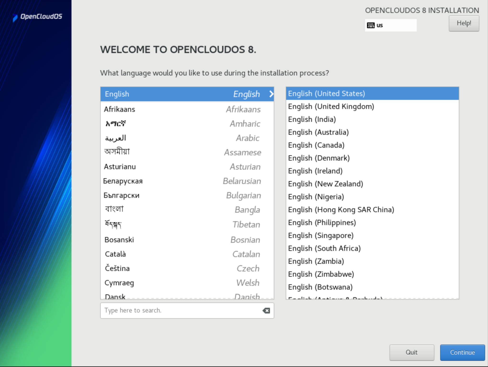
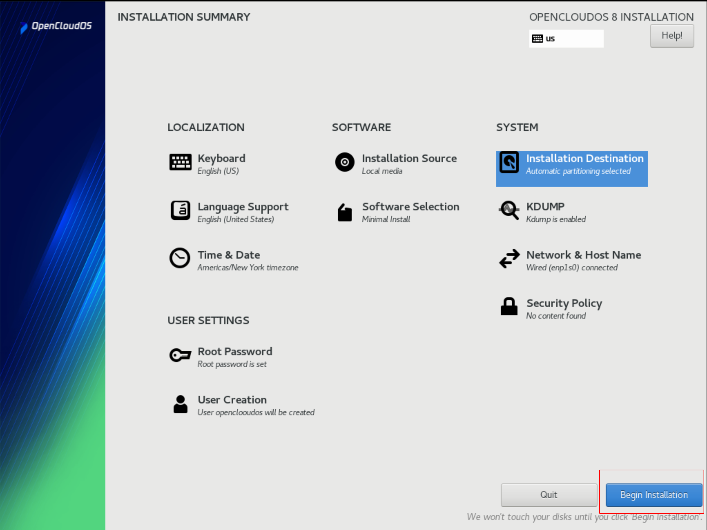
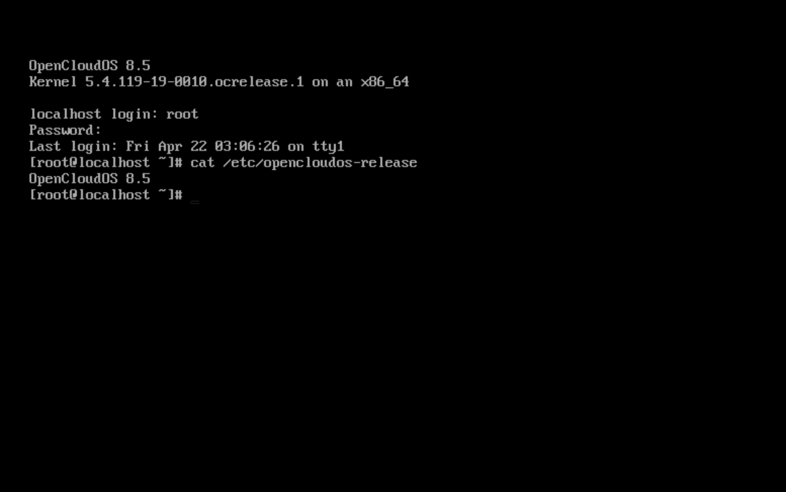

# OpenCloudOS V8 Installation Guide With GUI

## Overview
As an enterprise-level Linux server operating system, OpenCloudOS is independently developed and designed based on the Linux kernel. OpenCloudOS 8.5 is a stable enterprise-level server Linux distribution, and its core capabilities such as stability, security, compatibility and performance have been fully verified.

The ISO of OpenCloudOS currently supports the automatic detection mode. After booting, the installation will perform the installation operation and format the disk for installation. **Before performing the installation operation, please make sure that your disk data has been backed up to avoid data loss.**

### 1. Introduction
OpenCloudOS is a customized server operating system developed by the enterprise-level community. The system integrates the advantages of many server series, and adds self-developed software, which is convenient for users to operate and use, and provides all-round (kernel and user mode) operating system support. System features: safe, easy to use, stable, fast, long-term support. The installation image provides support for various software commonly used by the server, and can use online software sources to install and update software. **These instructions apply to the installation and use of the OpenCloudOS distribution.**

### 2. Prepare to Install
Before installing OpenCloudOS, your server hardware must be checked.

- The server connect with a stable power.
- Leave at least 50GB hardware size, 4GB memory.
- Get images CD/DVD, or an images USB drive.
- **Please backup hard disks data at first.**
Image URL：
    - [https://mirrors.opencloudos.tech/opencloudos/8/isos/](https://mirrors.opencloudos.tech/opencloudos/8/isos/)
    - [https://mirrors.tencent.com/opencloudos/8/isos/](https://mirrors.tencent.com/opencloudos/8/isos/)

### 3. CD Installation
- Insert the installation CD, enter the BIOS and choose to boot from the CDROM drive during startup
- Enter the system installation guide selection, select Install to install          

### 4. USB Installation
- Use rufus software or dd cmdline write ISO images into USB Drive.
- Insert USB, start server from BIOS USB drive.
- At installation list page, choose the second category with use.

### 5. Language Selection
OpenCloudOS Support international language， Select your language and Continue.

### 6. Software Selection
You can select Software group as your favorite to OpenCloudOS ,Click **Done** go to next step.

### 7. Seclect Destination Disk
OpenCloudOS supports selecting the installation path. When there are more than two disks on your server, you can choose to install to the specified disk.
- After selecting the specified disk, the system will automatically partition and install the system image
- Support user-defined partition, click **Custom** to manually partition, complete Done to next step.

### 8. User Settings
You can config your user policy by User Settings, username or password , Root password or normal user password.

### 9. Complete Installation
If everything goes well，Reboot System to enjoy OpenCloudOS.

While Reboot , you would see grub boot menu. Select by up and down Keys and Enter to boot.

### 10. Reboot And Login
If reboot successful， Username and password you can type and Enjoy OpenCloudOS .

