# 第 1 章 文件系统概述

因为有着大量的选项以及其中所涉及的权衡，因此选择适合应用的文件系统是一个重要的决定。本章节讲述了OpenCloud OS 附带的一些文件系统，并且提供了适合应用的文件系统的相关历史背景以及建议。

## 1.1 文件系统类型

OpenCloud OS 支持各种类型的文件系统（File System）。不同类型的文件系统可以解决不同类型的问题，并且在某些特定的应用程序中他们的也会有不同的应用。在大多数情况下，文件系统的主要类型可分为以下几种：

**表 1.1 文件系统类型及其用例**

| 类型                | 文件系统          | 属性和使用案例                                                                                                                |
| ----------------- | ------------- | ---------------------------------------------------------------------------------------------------------------------- |
| 磁盘/本地文件系统         | XFS           | XFS 是 OpenCloudOS 中默认使用的文件系统。因为它将文件布局扩展为数据块，所以它不像 ext4 那样容易受到文件碎片的影响。除非有兼容性或性能方面的相关问题方可部署为其它的文件系统，一般建议使用 XFS 文件系统。     |
|                   | ext4          | ext4 的优势是在 Linux 上使用时间长。因此，几乎所有的 Linux 应用都支持它。在大多数情况下，它和 XFS 在性能上相互竞争。ext4 通常都用于主目录。                                   |
| 网络/客户端和服务器之间的文件系统 | NFS           | 使用NFS在同一份网络的多个系统之间共享文件。                                                                                                |
|                   | SMB           | 使用SMB可以与 Windows 系统的文件进行共享                                                                                             |
| 共享存储/共享磁盘文件系统     | GFS2          | GFS2 为计算集群的成员提供共享写入的访问权限。其重点在于稳定性和可靠性，可以获得类似本地文件系统的体验。                                                                 |
| 卷管理文件系统           | Stratis（技术预览） | Stratis 是基于 XFS 和 LVM 构建的卷管理器。Stratis 的目的是模拟卷管理文件系统（如 Btrfs 和 ZFS）所提供的功能。可以手动构建此堆栈，但 Stratis 可以减少配置的复杂度、实施最佳实践并整合错误信息。 |

## 1.2 本地文件系统

本地文件系统是在本地单一服务器中运行并直接附加到存储的文件系统。

例如，本地文件系统是内部 SATA 或 SAS 磁盘的唯一选择，可在当您的服务器具有内部硬件 RAID 控制器（带有本地驱动器）时使用。当 SAN 上导出的设备未共享时，本地文件系统也是 SAN 连接的存储上最常用的文件系统。

所有本地文件系统都与 POSIX 兼容，且与所有支持的 OpenCloud OS 版本完全兼容。与 POSIX 兼容的文件系统为一组定义良好的系统调用提供支持，如 `read()`、`write()` 和 `seek()`。

从应用程序员的角度来看，本地文件系统之间的差别相对较少。从用户的角度来看，最显著的差异与可扩展性和性能相关。在考虑如何选择文件系统时，请考虑文件系统需要多大、应该具有哪些独特的功能，以及它在您的工作负载下性能如何。

**可用的本地文件系统**

- XFS
- ext4

## 1.3 XFS 文件系统

XFS 是一个高度可扩展、高性能、健壮且成熟的 64 位日志文件系统，其支持单个主机上非常大的文件和文件系统。XFS 最初于 1990 年代由 SGI 早期开发，并在大型的服务器和存储阵列中运行有很长的历史记录。

XFS 的功能包括：

**可靠性**

元数据日志，其确保系统崩溃后文件系统的完整性，方法是保留系统重启和重新挂载文件系统时可以重新执行的文件系统操作的记录，

- 广泛的运行时元数据一致性检查
- 可扩展且快速修复工具
- 配额日志。这可避免在崩溃后进行冗长的配额一致性检查。

**可伸缩性和性能**

- 支持最多 1024 TiB 的文件系统大小
- 支持大量并发操作的能力
- B-tree 索引，用于空闲空间的可扩展性管理
- 复杂的元数据读头算法
- 优化流视频工作负载

**分配方案**

- 基于扩展数据块的分配
- 条带化分配策略
- 延迟分配
- 空间预分配
- 动态分配的 inode

**其他功能**

- 基于 Reflink 的文件副本
- 严格集成备份和恢复工具
- 在线清理
- 在线文件系统增大
- 全面的诊断功能
- 扩展属性(`xattr`)。这允许系统能够按文件关联多个额外的名称/值对
- 项目或目录配额。这允许对目录树的配额限制
- 小于秒的时间戳

**性能特性**

XFS 在具有企业级工作负载的大型系统上具有高性能。大型系统是一个有相对较多的 CPU 、多个 HBA 和连接外部磁盘阵列的系统。XFS 在具有多线程、并行 I/O 工作负载的较小系统上也表现良好。

对于单线程、元数据密集型的工作负载，XFS 的性能相对较低：例如，在单个线程中创建或删除大量小文件的工作负载。

## 1.4 ext4文件系统

ext4 文件系统是 ext 文件系统系列的第四代。

ext4 驱动程序可以对 ext2 和 ext3 文件系统进行读写，但 ext4 文件系统格式又与 ext2 和 ext3 驱动程序是不兼容的。

ext4 添加了几个新的改进的功能，例如：

- 支持的文件系统大小高达 50 TiB
- 基于扩展的元数据
- 延迟分配
- 日志的 checksum
- 大型存储支持

基于扩展数据块的元数据和延迟分配功能提供了一种更加紧凑和高效的方法来跟踪文件系统中的已用空间。这些功能提高了文件系统性能，并减少了元数据所占用的空间。延迟分配允许文件系统延迟选择新写入用户数据的永久位置，直到数据刷新到磁盘。这可以实现更高的性能，因为它允许更大的、连续的分配，允许文件系统根据更佳的信息做出相应决策。

在 ext4 中使用 fsck 工具对文件系统的修复时间比在 ext2 和 ext3 中要快得多。一些文件系统修复的性能会增加最多 6 倍。

## 1.5 XFS 和 ext4 的比较

XFS 是 OpenClous OS 中的默认文件系统。本节比较 XFS 和 ext4 的用法和功能。

**元数据错误行为**

在 ext4 中，当文件系统遇到元数据错误时您可以配置行为。默认的行为是继续操作。当 XFS 遇到不可恢复的元数据错误时，它会关闭文件系统，并返回 `EFSCORRUPTED` 错误。

**配额**

在 ext4 中，您可以在创建文件系统时启用配额，或稍后在现有文件系统上启用配额。然后您可以使用挂载选项配置配额强制。

XFS 配额不是一个可重新挂载的选项。您必须在初始挂载中激活配额。

在 XFS 文件系统上运行 `quotacheck` 命令没有效果。当您第一次打开配额记帐时，XFS 会自动检查配额。

**文件系统重新定义大小**

XFS 没有工具来缩小文件系统的大小。您只能增大 XFS 文件系统的大小。而 ext4 支持扩展和缩小文件系统大小。

**内节点（inode）号**

ext4 文件系统不支持超过 2<sup>32</sup> 内节点。

XFS 动态分配内节点。只要文件系统上存在空闲空间，XFS 文件系统就无法耗尽 inode 。

某些应用程序无法正确处理 XFS 文件系统上大于 2<sup>32</sup> 的 inode 数。这些应用程序可能会导致 32 位 stat 调用失败，返回值为 EOVERFLOW 。在以下情况下，inode 数超过 2<sup>32</sup>:

- 文件系统大于 1 TiB，其 inode 为 256 字节。
- 文件系统大于 2 TiB，其 inode 为 512 字节。

如果您的应用程序由于 inode 数太大而失败，请使用 `-o inode32` 选项挂载 XFS 文件系统，来强制inode 数低于 2<sup>32</sup>。请注意，使用 `inode32` 不会影响已分配了 64 位数的 inode。

> **重要**
> 
> 除非特定环境需要，否则请勿使用 `inode32` 选项。`inode32` 选项可改变分配行为。因此，如果没有可用空间在较低磁盘块中分配 inode ，则可能会出现 `ENOSPC` 错误。

## 1.6 选择文件系统

要选择一个满足应用要求的文件系统，您需要对部署文件系统的目标系统有一定的了解。您通过以下问题来决定文件系统的类型：

- 您有大型服务器吗？
- 您有大的存储需求或者在本地使用的、读取速度慢的 SATA 驱动器吗？
- 您希望应用程序在哪一种 I/O 工作负载中？
- 您对吞吐量和延迟有要求吗？
- 您的服务器和存储硬件稳定性怎么样？
- 您的文件和数据组的默认大小是多少？
- 如果系统失败，您能接受的关机时间是多少？

如果您的服务器和存储设备都很大，那么 XFS 无疑是最佳选择。即使在存储阵列比较小，平均文件大小较大（例如，几百兆字节）的情况下，XFS 也依旧表现良好。

如果您现有的工作负载在 ext4 上表现良好，那么继续使用 ext4 会为您和您的应用提供一个舒适的环境。

ext4 文件系统在 I/O 能力有限的系统上往往表现会更好。ext4 在有限带宽（小于 200MB/s）上使用性能也会更好，最高可达到 1000 IOPS 。在能力较高的任何事情上，XFS 往往会比 ext4 更快。

与 ext4 相比，XFS 消耗的CPU元数据是 ext4 的两倍 ，因此如果您用很少并发的 CPU 绑定工作负载，则 ext4 会更快。通常情况下，如果应用使用单个读/写线程和小文件，则 ext4 效果更佳；而当应用使用多个读/写线程和较大的文件时，XFS 会更出色。

您无法对 XFS 文件系统进行缩小操作。如果您想要缩小文件系统，请考虑使用 ext4 ，其支持离线缩小。

通常，建议您使用 XFS，除非您有 ext4 的特殊用例。为了确保您选择到合适的文件系统，您还需要考虑到服务器和存储系统上特定应用的性能问题。

**表 1.2 本地文件系统建议概述**

| 场景                      | 推荐的文件系统 |
| ----------------------- | ------- |
| 没有特殊用例                  | XFS     |
| 大型服务器                   | XFS     |
| 大型存储设备                  | XFS     |
| 大文件                     | XFS     |
| 多线程 I/O                 | XFS     |
| 单线程 I/O                 | ext4    |
| 有限 I/O 能力（1000 IOPS 以下） | ext4    |
| 有限带宽（200 MB/s 以下）       | ext4    |
| CPU 绑定工作负载              | ext4    |
| 支持离线缩小                  | ext4    |

## 1.7 网络文件系统

网络文件系统也被称为客户端/服务器文件系统，使客户端能够访问存储在共享服务器上的文件。这可以实现多个系统上的多个用户可以共享文件和存储资源。

此类文件系统由一个或多个服务器中构建，这些服务器将一组文件系统导出到一个或多个客户端。客户端节点无法访问底层的块存储，而是使用允许更好的访问控制协议与存储进行交互。

**可用网络文件系统**

- OpenCloud OS 客户最常用的客户端/服务器文件系统就是 NFS 文件系统。OpenCloud OS 提供了一个 NFS 服务器组件来通过网络导出本地文件系统，并提供 NFS 客户端来导入这些文件系统。
- Open Cloud OS 还包括 CIFS 客户端，该客户端支持流行的 Microsoft SMB 文件服务器以实现 Windows 互操性。用户空间 Samba 服务器为 Windows 客户端提供来自 Open Cloud OS 服务器的 Microsoft SMB 服务。

## 1.8 共享存储文件系统

共享存储文件系统有时被称为集群文件系统，允许集群中的每台服务器通过本地的存储区域网络(SAN)直接访问共享块设备。

**和网络文件系统的比较**

与客户端/服务器文件系统一样，共享存储文件系统在一组服务器上工作，这些服务器都是集群的成员。但与 NFS 不同，没有一个服务器向其他成员提供对数据或元数据的访问：即集群的每个成员都可以直接访问同一存储设备（共享存储），并且所有群集节点都可以访问同一组文件。

**并发**

缓存一致性是集群文件系统中确保数据一致性和完整性的关键。集群中所有文件的单个版本都必须对集群内的所有节点可见。为了防止数据损坏，文件系统必须阻止集群成员同时更新同一存储块。为此，共享存储文件系统使用集群范围的锁机制作为并发控制机制来仲裁对存储的访问。例如，在创建新文件或写入多个服务器上打开的文件之前，服务器上的文件系统组件必须获得正确的锁。

集群文件系统的要求是提供一种像 Apache Web 服务器那样高可用的服务。集群中的任何成员都将看到存储在共享磁盘文件系统中的数据的完全一致的视图，并且所有更新都会通过锁机制进行正确的仲裁。

**性能特性**

由于锁开销的计算成本，共享磁盘文件系统并不总像运行在同一个系统上的本地文件系统那样表现良好。如果每个节点几乎都以独占方式写入一组不与其他节点共享的特定文件或者一组文件在一组节点上以几乎独占的只读方式被共享，那么共享磁盘文件系统可以很好地执行这种工作负载。这将导致最小的跨节点缓存失效，并可以最大限度地提高性能。

设置共享磁盘文件系统非常复杂，调优应用以在共享磁盘文件系统上表现良好非常有挑战性。

**可用的共享存储文件系统**

- 提供 GFS2 文件系统。GFS2 与 OpenCloud OS High Availability Add-On 和 Resilient Storage 附加组件紧密整合。

- 支持集群中 GFS2 的节点大小为 2 到 16 个。

## 1.9 网络和共享存储文件系统之间的抉择

在网络和共享存储文件系统之间选择时，请考虑以下几点：

- 对于提供 NFS 服务器的环境来说，基于 NFS 的网络文件系统是非常常见和流行的选择。

- 网络文件系统可以使用超高性能的网络技术（如 Infiniband 或 10 GB 以太网卡）来进行部署。这意味着您不应该仅仅为了获得存储的原始带宽而转向使用共享存储文件系统。如果访问速度至关重要，则使用 NFS 导出类似 XFS 的本地文件系统。

- 共享存储文件系统的设置或维护并非易事，因此您应该在本地或网络文件系统无法提供所需的可用性时才部署它们。

- 集群环境中的共享存储文件系统可以通过消除涉及到重新分配高可用性服务的典型故障切换情景中所需要执行的卸载和挂载步骤来减少停机时间。

除非您有共享存储文件系统的特定用例，否则还是建议您使用网络文件系统。共享存储文件系统主要用于需要以最少的停机时间提供高可用性服务且具有严格的服务等级要求的部署。

## 1.10 卷管理文件系统

为了实现堆栈内优化和简洁，卷管理文件系统集成了整个存储堆栈。

**可用卷管理文件系统**

OpenCloud OS 作为技术预览提供 Stratis 卷管理器。Stratis 对文件系统层使用 XFS，并将其与 LVM、设备映射器和其他组件集成。

Stratis 1.0 是一个直观的、基于命令行的卷管理器，可以在隐藏用户复杂性的同时执行重要的存储管理操作：

- 卷管理

- 创建池

- 精简存储池

- 快照

- 自动读取缓存

Stratis 提供强大的功能，但目前缺乏其他产品（如 Btrfs 或 ZFS）的某些功能。最值得注意的是，它不支持带自我修复的 CRC。

# 第 2 章 使用系统角色管理本地存储

要使用 Ansible 管理 LVM 和本地文件系统(FS)，您可以使用 Storage 角色，这是 OpenCloud OS 中可用的系统角色之一。

使用存储角色可让您自动管理多台机器上的磁盘和逻辑卷上的文件系统，以及系统的版本。

## 2.1 Storage （存储）角色简介

Storage 角色可以管理：

- 磁盘上未被分区的文件系统
- 完整的 LVM 卷组，包括其逻辑卷和文件系统

使用 Storage 角色，您可以执行以下任务：

- 创建文件系统
- 删除文件系统
- 挂载文件系统
- 卸载文件系统
- 创建 LVM 卷组
- 删除 LVM 卷组
- 创建逻辑卷
- 删除逻辑卷
- 创建 RAID 卷
- 删除 RAID 卷
- 创建带有 RAID 的 LVM 池
- 删除带有 RAID 的 LVM 池

## 2.2 识别存储设备参数（存储系统角色）

您的存储角色配置仅影响您在以下变量中列出的文件系统、卷和池.

`storage_volumes`

在所有要管理的未分区磁盘中的文件系统列表。

当前不支持的分区。

`storage_pools`

要管理的池列表。

目前唯一支持的池类型是 LVM。使用 LVM 时，池代表卷组（VG）。每个池中都有一个要由角色管理的卷列表。对于 LVM，每个卷对应一个带文件系统的逻辑卷（LV）。

## 2.3 在块存储设备中创建XFS 文件系统的 Ansible playbook 示例

本节提供了一个 Ansible playbook 示例。此 playbook 应用存储角色，来使用默认参数在块设备上创建 XFS 文件系统。

> **警告**
> 
> 存储角色只能在未分区、整个磁盘或逻辑卷（LV）上创建文件系统。它不能在分区中创建文件系统。

> **例 2.1 在/dev/sdb上创建 XFS 的playbook**
> 
> ```
> ---
> - hosts: all
>  vars:
>    storage_volumes:
>      - name: barefs
>        type: disk
>        disks:
>          - sdb
>        fs_type: xfs
>  roles:
>    - rhel-system-roles.storage
> ```
> 
> - 卷名称（示例中的 barefs ）目前是任意的。存储角色根据 disk: 属性下列出的磁盘设备来识别卷。
> - 您可以省略 `fs_type: xfs` 行，因为 XFS 是 OpenCloud OS 中的默认文件系统。
> - 要在 LV 上创建文件系统，请在 `disks: `属性下提供 LVM 设置，包括括起来的卷组。详情请参阅 管理逻辑卷 的 Ansible playbook 示例。
> 
> 不要提供到 LV 设备的路径。

## 2.4 永久挂载系统文件的 Ansible playbook 示例

本节提供了一个 Ansible playbook 示例。此 playbook 应用存储角色用来立即和永久挂载 XFS 文件系统。

> **例 2.2 将 /dev/sdb 上的文件系统挂载到 /mnt/data 的 playbook**
> 
> ```
> ---
> - hosts: all
>  vars:
>   storage_volumes:
>      - name: barefs
>        type: disk
>        disks:
>          - sdb
>        fs_type: xfs
>        mount_point: /mnt/data
>  roles:
>    - rhel-system-roles.storage
> ```
> 
> - 此 playbook 将文件系统添加到 `/etc/fstab` 文件中，并立即挂载文件系统。
> - 如果 `/dev/sdb` 设备上的文件系统或挂载点目录不存在，则 playbook 会创建它们。

## 2.5 管理逻辑卷的 Ansible playbook 示例

本节提供了一个 Ansible playbook 示例。此 playbook 应用存储角色在卷组中创建 LVM 逻辑卷。

> **例 2.3 在 myvg 卷组中创建 mylv 逻辑卷的 playbook**
> 
> ```
> - hosts: all
>  vars:
>    storage_pools:
>      - name: myvg
>        disks:
>          - sda
>          - sdb
>          - sdc
>        volumes:
>          - name: mylv
>            size: 2G
>            fs_type: ext4
>            mount_point: /mnt
>  roles:
>    - rhel-system-roles.storage
> ```
> 
> - `myvg` 卷组由以下磁盘组成：
>   
>   - `/dev/sda`
>   - `/dev/sdb`
>   - `/dev/sdc`
> 
> - 如果 `myvg` 卷组已存在，则 playbook 会将逻辑卷添加到卷组。
> 
> - 如果 `myvg` 卷组不存在，则 playbook 会创建它。
> 
> - playbook 在 `mylv` 逻辑卷上创建 Ext4 文件系统，并在 `/mnt` 上永久挂载文件系统。

## 2.5 启用在线快丢弃的 Ansible playbook 示例

本节提供了一个 Ansible playbook 示例。此 playbook 应用存储角色用来挂载启用了在线块丢弃的 XFS 文件系统。

> **例 2.4 一个 playbook，它在 `/mnt/data/` 上启用在线块丢弃功能**
> 
> ```
> ---
> - hosts: all
>  vars:
>    storage_volumes:
>      - name: barefs
>        type: disk
>        disks:
>          - sdb
>        fs_type: xfs
>        mount_point: /mnt/data
>        mount_options: discard
>  roles:
>    - rhel-system-roles.storage
> ```

## 2.7 创建挂载 Ext4 文件系统的 Ansible playbook 示例

本节提供了一个 Ansible playbook 示例。此 playbook 应用存储角色来创建和挂载 Ext4 文件系统。

> **例 2.5 在 `/dev/sdb` 上创建 Ext4 并挂载到 `/mnt/data` 的 playbook**
> 
> ```
> ---
> - hosts: all
>  vars:
>    storage_volumes:
>      - name: barefs
>        type: disk
>        disks:
>          - sdb
>        fs_type: ext4
>        fs_label: label-name
>        mount_point: /mnt/data
>  roles:
>    - rhel-system-roles.storage
> ```
> 
> - playbook 在 `/dev/sdb` 磁盘上创建文件系统。
> - playbook 将文件系统永久挂载在 `/mnt/data` 目录。
> - 文件系统的标签是 `label-name`。

## 2.8 创建和挂载 ext3 文件系统的 Ansible playbook 示例

本节提供了一个 Ansible playbook 示例。此 playbook 应用存储角色来创建和挂载 Ext3 文件系统。

> **例 2.6 在 `/dev/sdb` 上创建 Ext3 ，并将其挂载在 `/mnt/data` 的 playbook**
> 
> ```
> ---
> - hosts: all
>  vars:
>    storage_volumes:
>      - name: barefs
>        type: disk
>        disks:
>          - sdb
>        fs_type: ext3
>        fs_label: label-name
>        mount_point: /mnt/data
>  roles:
>    - rhel-system-roles.storage
> ```
> 
> - playbook 在 `/dev/sdb` 磁盘上创建文件系统。
> - playbook 将文件系统永久挂载在 `/mnt/data` 目录。
> - 文件系统的标签是 `label-name`。

## 2.9 使用存储 OpenCloud OS系统角色对现有 Ext4 或 Ext3 文件系统调整大小的 Ansible playbook 示例

本节提供了一个 Ansible playbook 示例。此 playbook 应用存储角色来调整块设备上现有的 Ext4 或 Ext3 文件系统的大小。

> **例 2.7 在磁盘上设置单个卷的 playbook**
> 
> ```
> ---
> - name: Create a disk device mounted on /opt/barefs
> - hosts: all
>  vars:
>    storage_volumes:
>      - name: barefs
>        type: disk
>        disks:
>          - /dev/sdb
>    size: 12 GiB
>        fs_type: ext4
>        mount_point: /opt/barefs
>  roles:
>    - rhel-system-roles.storage
> ```

- 如果上例中的卷已存在，要调整卷的大小，您需要运行相同的 playbook，使用不同的 `size` 参数值。例如：

> **例 2.8 在 `/dev/sdb`上调整 `ext4` 大小的 playbook**
> 
> ```
> ---
> - name: Create a disk device mounted on /opt/barefs
> - hosts: all
>  vars:
>    storage_volumes:
>      - name: barefs
>        type: disk
>        disks:
>          - /dev/sdb
>    size: 10 GiB
>        fs_type: ext4
>        mount_point: /opt/barefs
>  roles:
>    - rhel-system-roles.storage
> ```
> 
> - 卷名称（示例中的 barefs）当前是任意的。Storage 角色根据 disk: 属性中列出的磁盘设备标识卷。

> **注意**
> 
> 在其他文件系统中使用 调整大小 操作可能会破坏您正在使用的设备上的数据

## 2.10 使用存储 OpenCloud OS 系统角色在 LVM 上对现有文件系统的大小进行调整的 Ansible playbook 示例

本节提供了一个 Ansible playbook 示例。此 playbook 应用存储 OpenCloud OS 系统角色来使用文件系统重新定义 LVM 逻辑卷大小。

> **警告**
> 
> 在其他文件系统中使用 调整大小 操作可能会破坏您正在使用的设备上的数据。

> **例 2.9 调整 myvg 卷组中现有 mylv1 和 myvl2 逻辑卷大小的 playbook**
> 
> ```
> ---
> 
> - hosts: all
>   vars:
>    storage_pools:
>      - name: myvg
>        disks:
>          - /dev/sda
>          - /dev/sdb
>          - /dev/sdc
>        volumes:
>            - name: mylv1
>              size: 10 GiB
>              fs_type: ext4
>              mount_point: /opt/mount1
>            - name: mylv2
>              size: 50 GiB
>              fs_type: ext4
>              mount_point: /opt/mount2
> 
> - name: Create LVM pool over three disks
>  incude_role:
>    name: rhel-system-roles.storage
> ```
> 
> - 此 playbook 调整以下现有文件系统的大小：
>   
>   - `mylv1` 卷上的 Ext4 文件系统挂载在 `/opt/mount1`，大小调整为 10 GiB。
>     - `mylv2` 卷上的 Ext4 文件系统挂载在 `/opt/mount2`，大小调整为 50 GiB。

## 2.11 使用存储 OpenCloud OS 系统角色创建交换分区的 Ansible playbook 示例

本节提供了一个 Ansible playbook 示例。此 playbook 应用存储角色来创建交换分区（如果不存在的话），或者使用默认参数在块设备上修改交换分区（如果已存在的话）。

> **例 2.10 创建或修改 `/dev/sdb` 上现有 XFS 的 playbook**
> 
> ```
> name: Create a disk device with swap
> hosts: all
> vars:
>  storage_volumes:```
> - name: swap_fs
>  type: disk
>  disks:
>    - /dev/sdb
> size: 15 GiB
> fs_type: swap
> roles:
> - rhel-system-roles.storage 
> ```
> 
> - 卷名称（示例中的 `swap_fs` ）目前是任意的。存储角色根据 `disk:` 属性下列出的磁盘设备来识别卷。

## 2.12 使用存储系统角色配置 RAID 卷

使用存储系统角色，您可以使用  Ansible Automation Platform 在 OpenCloud OS 上配置 RAID 卷。在本小节中，您将了解如何使用可用参数设置 Ansible playbook 来配置 RAID 卷以满足您的要求。

**前提条件**

- Ansible Core 软件包安装在控制机器上。
- 您已在要运行 playbook 的系统上安装了 `rhel-system-roles` 软件包。
- 您有一个清单文件详细描述了您要使用存储系统角色部署 RAID 卷的系统。

**流程**

1. 使用以下内容创建一个新的 *`playbook.yml`* 文件：
   
   ```
   - hosts: all
    vars:
        storage_safe_mode: false
        storage_volumes:
         - name: data
           type: raid
           disks: [sdd, sde, sdf, sdg]
           raid_level: raid0
           raid_chunk_size: 32 KiB
           mount_point: /mnt/data
           state: present
    roles:
        - name: rhel-system-roles.storage
   ```
   
   > **警告**
   > 
   > 设备名称在某些情况下可能会改变，例如：当您在系统中添加新磁盘时。因此，为了避免数据丢失,我们不建议在 playbook 中使用特定的磁盘名称。

2. 可选。验证 playbook 语法。
   
   ```
    # ansible-playbook --syntax-check playbook.yml*
   ```

3. 在清单文件上运行 playbook:
   
   ```
   # ansible-playbook -i inventory.file /path/to/file/playbook.yml
   ```

## 2.13 使用存储系统角色使用 RAID 配置 LVM 池

使用 Storage 系统角色，您可以使用 Ansible Automation Platform 在 OpenCloud OS 上使用 RAID 配置 LVM 池。在本小节中，您将了解如何使用可用参数设置 Ansible playbook 来配置使用 RAID 的 LVM 池。

**前提条件**

- Ansible Core 软件包安装在控制机器上。
- 您已在要运行 playbook 的系统上安装了 `rhel-system-roles` 软件包。
- 您有一个清单文件详细描述了您要使用存储系统角色在其上配置带有 RAID 的 LVM 池的系统。

**流程**

1. 使用以下内容创建一个新的 *`playbook.yml`* 文件：
   
   ```
   - hosts: all
   vars:
       storage_safe_mode: false
       storage_pools:
       - name: my_pool
           type: lvm
           disks: [sdh, sdi]
           raid_level: raid1
           volumes:
           - name: my_pool
               size: "1 GiB"
               mount_point: "/mnt/app/shared"
               fs_type: xfs
               state: present
   roles:
       - name: rhel-system-roles.storage
   ```

> **注意**
> 
> 要创建带有 RAID 的 LVM 池，您必须使用 raid_level 参数指定 RAID 类型。

2. 可选。验证 playbook 语法。
   
   ```
   # ansible-playbook --syntax-check playbook.yml
   ```

3. 在清单文件上运行 playbook:
   
   ```
   # ansible-playbook -i inventory.file /path/to/file/playbook.yml
   ```

## 2.14 使用存储 OpenClous OS 系统角色在 LVM 上压缩和删除数据重复的 VDO 卷的 Ansible playbook 示例

本节提供了一个 Ansible playbook 示例。此 playbook 应用存储 OpenCloud OS 系统角色来使用虚拟数据优化(VDO)，让卷对逻辑管理器卷(LVM)的进行压缩和删除重复数据操作。

**例 2.11 在 `myvg` 卷组中创建 `mylv1` LVM VDO 卷的 playbook**

> ```
> ---
> - name: Create LVM VDO volume under volume group 'myvg'
>  hosts: all
>  roles:
>    -opencloudos-system-roles.storage
>  vars:
>    storage_pools:
>     - name: myvg
>       disks:
>         - /dev/sdb
>       volumes:
>         - name: mylv1
>           compression: true
>           deduplication: true
>           vdo_pool_size: 10 GiB
>           size: 30 GiB
>           mount_point: /mnt/app/shared
> ```

在本例中，`compression` 和 `deduplication` 都被设置为 true，这里指定使用 VDO。下面描述了这些参数的用法：

- `deduplication` 用于删除存储在存储卷上重复的数据。
- `compression` 用于压缩存储卷上存储的数据，从而增加存储容量。
- vdo_pool_size 指定卷在设备上的实际大小。VDO 卷的虚拟大小由 `size` 参数设置。注：由于 Storage 角色使用 LVM VDO，每个池只有一个卷可以使用压缩和删除重复数据。

## 2.15 使用使用存储系统角色创建 LUKS 加密卷

您可以使用存储角色运行 Ansible playbook 来创建和配置那些使用 LUKS 加密的卷。

**前提条件**

- 对一个或多个 *受管节点* 的访问和权限，*受管节点* 是您要使用加密策略系统角色配置的系统。

- 对控制节点的访问和权限，这是 Ansible Core 配置其他系统的系统。

- 在控制节点上：
  
  - `ansible-core` 和 `rhel-system-roles` 软件包已安装 。

> **重要**
> 
> OpenCloud OS 提供对基于 Ansible 的自动化需要 Ansible Engine 的独立 Ansible 存储库的访问权限。Ansible Engine 包含命令行实用程序，如 ansible、ansible-playbook、连接器（如 docker 和 podman ）以及许多插件和模块。
> 
> OpenCloud OS 引入了 Ansible Core（以 ansible-core 软件包的形式提供），其中包含 Ansible 命令行工具、命令以及小型内置 Ansible 插件。

- 列出受管节点的清单文件。

**流程**

1. 使用以下内容创建一个新的 *`playbook.yml`* 文件：
   
   ```
   - hosts: all
   vars:
       storage_volumes:
       - name: barefs
           type: disk
           disks:
           - sdb
           fs_type: xfs
           fs_label: label-name
           mount_point: /mnt/data
           encryption: true
           encryption_password: your-password
   roles:
   - rhel-system-roles.storage
   ```

2. 可选：验证 playbook 语法：
   
   ```
   # ansible-playbook --syntax-check playbook.yml
   ```

3. 在清单文件上运行 playbook:
   
   ```
   # ansible-playbook -i inventory.file /path/to/file/playbook.yml
   ```

## 2.16 使用存储 OpenCloud OS 系统角色以百分比形式表示池卷大小的 Ansible playbook 示例

本节提供了一个 Ansible playbook 示例。此 playbook 应用存储系统角色来通过存储池百分比的形式表示逻辑卷管理卷(LVM)的大小。

> **例 2.12 将卷大小表示为池容量百分比的 playbook**
> 
> ```
> ---
> - name: Express volume sizes as a percentage of the pool's total size
>  hosts: all
>  roles
>    - rhel-system-roles.storage
>  vars:
>    storage_pools:
>    - name: myvg
>      disks:
>        - /dev/sdb
>      volumes:
>        - name: data
>          size: 60%
>          mount_point: /opt/mount/data
>        - name: web
>          size: 30%
>          mount_point: /opt/mount/web
>        - name: cache
>          size: 10%
>          mount_point: /opt/cache/mount
> ```

这个示例将 LVM 卷的大小以存储池容量的百分比表示，例如："60%"。另外，您还可以将 LVM 卷的大小以文件系统中人类可读的类型（如 "10g" 或 "50 GiB"）使用存储池容量的百分比表示。

# 第 3 章 挂载 NFS 共享

作为系统管理员，您可以在您的系统上挂载远程 NFS 共享来访问共享数据。

## 3.1 NFS 简介

这部分解释了 NFS 服务的基本概念。

网络文件系统(NFS)允许远程主机通过网络挂载文件系统，并像挂载在本地那样与文件系统进行交互。这可以让您将资源整合到网络的集中服务器中。

NFS 服务器参考 `/etc/exports` 配置文件来确定是否允许客户端访问任何导出的文件系统。一旦被验证，那么所有文件和目录操作都对用户有效。

## 3.2 支持的 NFS 版本

这部分列出了 OpenCloud OS 支持的 NFS 版本及其特性。

目前，OpenCloud OS 8 支持以下 NFS 主版本：

- 与 NFSv2 相比，NFS 版本 3（NFSv3）支持安全异步写入操作，并在处理错误时更加可靠。同时它也支持 64 位文件和偏移，允许客户端访问的文件数据超过 2 GB 。

- NFS 版本 4(NFSv4)可以越过防火墙在 Internet 上工作，这以为着不再需要 rpcbind 服务。同时 NFSv4 支持访问控制列表(ACL)，并且可以使用有状态操作。

不再支持 NFS 版本 2(NFSv2)。

### 默认 NFS 版本

OpenCloud OS 8 中默认 NFS 版本为 4.2。NFS 客户端默认尝试使用 NFSv4.2 挂载，并在服务器不支持 NFSv4.2 时回退到 NFSv4.1。挂载之后会返回到 NFSv4.0，然后回退到 NFSv3。

### 次要 NFS 版本的特性

以下是 OpenCloud OS 8 中的 NFSv4.2 的功能：

**服务器端复制**

使用 `copy_file_range()` 调用系统，可以使 NFS 客户端高效地复制数据，而不至于浪费网络资源。

**稀疏文件**

使文件存在一个或者多个空位，其中存在只由 0 组成的未分配或者未初始化的数据块。NFSv4.2 中的 `lseek()` 操作支持 `seek_hole()` 和 `seek_data()`，使应用程序能够在稀疏文件中映射出漏洞的位置。

**保留空间**

允许存储服务器保留空闲空间防止服务器耗尽空间。NFSv4.2 支持 `allocate()` 操作来保留空间，支持 `deallocate()` 操作来释放空间，支持 `fallocate()` 操作来预分配和释放文件中的空间。

**标记的 NFS**

强制实施数据访问权限，并在客户端和服务器之间 NFS 文件系统上的各个文件中启用 SELinux 标签。

**布局增强**

提供 `layoutstats()` 操作，它可以让使并行 NFS(pNFS)服务器收集到更好的性能统计数据。

 NFSv4.1 的功能如下：

- 增强性能和网络安全，同时支持 pNFS 的客户端。

- 对于回调不再需要单独的 TCP 连接，回调允许 NFS 服务器在无法联系客户端的情况下授予委托：例如， NAT 或防火墙干扰。

- 只提供一次命令（除重启操作外），防止出现先前的问题，即如果回复丢失且操作被发送了两次，则某些操作有时会返回不准确的结果。

## 3.3 NFS 所需的服务

这部分列出了运行 NFS 服务器或挂载 NFS 共享所需的系统服务。Opencloud OS 会自动启动这些服务。

Opencloud OS 使用内核级支持和服务流程组合提供 NFS 文件共享。所有 NFS 版本都依赖于客户端和服务器间的远程过程调用（RPC）。要共享或者挂载 NFS 文件系统，下列服务根据所使用的 NFS 版本而定：

**`nfsd`**

为共享 NFS 文件系统请求的 NFS 服务器内核模块。

**`rpcbind`**

接受本地 RPC 服务保留的端口。这些端口随后可用（或公布出去），以便相应的远程 RPC 服务访问。`rpcbind` 服务对 RPC 服务的请求进行响应，并与请求的 RPC 服务建立连接。这不能与 NFSv4 一起使用。

**`rpc.mountd`**

NFS 服务器使用这个进程处理来自 NFSv3 客户端的 `MOUNT` 请求。它检查请求的 NFS 共享是否由目前的 NFS 服务器导出，并且允许客户端访问它。如果允许挂载请求，`nfs-mountd` 服务会回复 Success 状态，并将此 NFS 共享的文件句柄返回给 NFS 客户端。

**`rpc.nfsd`**

这个过程允许定义服务器通告的显式 NFS 版本和协议。它与 Linux 内核一起工作来满足 NFS 客户端的动态需求。例如，在每次连接 NFS 客户端时提供服务器线程。这个进程对应于 `nfs-server` 服务。

**`lockd`**

这是一个在客户端和服务器中运行的内核线程。它实现了网络锁管理器(NLM)协议，该协议使 NFSv3 客户端能够锁住服务器上的文件。每当运行 NFS 服务器以及挂载 NFS 文件系统时，它会自动启动。

**`rpc.statd`**

这个进程实现网络状态监控器(NSM)RPC 协议，该协议可在 NFS 服务器没有正常关机而重启时通知 NFS 客户端。`rpc-statd` 服务由 `nfs-server` 服务自动启动，并且此服务不需要用户配置。这不能与 NFSv4 一起使用。

**`rpc.rquotad`**

这个过程为远程用户提供用户的配额信息。启动 `nfs-server` 时，用户也必须启动 `quota-rpc` 软件包提供的 `rpc-rquotad` 服务。

**`rpc.idmapd`**

此进程提供 NFSv4 客户端和服务器调用， 它们在线上 NFSv4 名称（`user@domain`形式的字符串）、本地 UID 、 GID 之间进行映射。要使 `idmapd` 与 NFSv4 正常工作，必须配置 `/etc/idmapd.conf` 文件。至少应该指定 `Domain` 参数，该参数定义了 NFSv4 的映射域。如果 NFSv4 的映射域与 DNS 域名相同，则可以跳过该参数。客户端和服务器就 NFSv4 的映射域达成一致，ID 映射才能正常工作。

只有 NFSv4 服务器使用 `rpc.idmapd`，它由 `nfs-idmapd` 服务启动。NFSv4 客户端使用基于密钥环的 `nfsidmap` 工具，内核按需调用它来执行 ID 映射。如果 `nfsidmap` 有问题，客户端将退回使用 `rpc.idmapd`。

### NFSv4 的 RPC 服务

挂载和锁定协议已合并到 NFSv4 协议中。该服务器还会侦听已知的 TCP 端口 2049。因此，NFSv4 不需要与 `rpcbind`、`lockd` 和 `rpc-statd` 服务进行交互。NFS 服务器上仍然需要 nfs-mountd 服务来设置导出，但不涉及任何线上操作。

## 3.4 NFS 主机名格式

这部分论述了在挂载或导出 NFS 共享时用来指定主机的不同格式。

您可以使用以下格式指定主机：

**单台机器**

  以下任意一种：

- 完全限定域名（可由服务器解析）
- 主机名（可由服务器解析）
- IP 地址。

**IP 网络**

  以下格式之一有效：

- `a.b.c.d/z` ，其中 `a.b.c.d` 是网络，`z` 是子网掩码中的位数，例如 `192.168.0.0/24`。
- `a.b.c.d/netmask`，其中 `a.b.c.d` 是网络，`netmask` 是子网掩码；例如 `192.168.100.8/255.255.255.0`。

**Netgroups**

`@group-name` 格式，其中 `group-name` 是 NIS netgroup 名称。

## 3.5 安装 NFS

这个过程安装挂载或导出 NFS 共享所需的所有软件包。

**流程**

- 安装 nfs-utils 软件包：
  
  ```
  # yum install nfs-utils
  ```

## 3.6  发现 NFS 导出

这个步骤发现给定 NFSv3 或者 NFSv4 服务器导出哪个文件系统。

**流程**

- 对于支持 NFSv3 的任何服务器，请使用 `showmount` 工具：
  
  ```
  $ showmount --exports my-server
  
  Export list for my-server
  /exports/foo
  /exports/bar
  ```

- 对于支持 NFSv4 的任何服务器，挂载根目录并查找：
  
  ```
  # mount my-server:/ /mnt/
  # ls /mnt/
  
  exports
  
  # ls /mnt/exports/
  
  foo
  bar
  ```

在同时支持 NFSv4 和 NFSv3 的服务器上，这两种方法都可以工作，并给出同样的结果。

## 3.7 使用 mount 挂载一个 NFS 共享

这个流程使用 mount 工具挂载从服务器导出的 NFS 共享。

**流程**

- 要挂载一个 NFS 共享，请使用以下命令：
  
  ```
  # mount -t nfs -o options host:/remote/export /local/directory
  ```

这个命令使用以下变量：

***选项***

以逗号分隔的挂载选项列表。

***host***

导出您要挂载的文件系统的服务器的主机名、IP 地址或者完全限定域名。

***/remote/export***

从服务器导出的文件系统或目录，即您要挂载的目录。

***/local/directory***

挂载 /remote/export 的客户端位置。

## 3.8 常用 NFS 挂载选项

这部分列出了在挂载 NFS 共享时常用的选项。这些选项可用于手动挂载命令、`/etc/fstab` 设置和 `autofs`。

**`lookupcache=mode`**

指定内核应该如何管理给定挂载点的目录条目缓存。*mode* 的有效参数为 `all`、`none` 或 `positive`。

**`nfsvers=version`**

指定要使用 NFS 协议的哪个版本，其中 *version* 为 `3`、`4`、`4.0`、`4.1` 或 `4.2`。这对于运行多个 NFS 服务器的主机很有用，或者禁止使用较低版本重试挂载。如果没有指定版本，NFS 将使用内核和 `mount` 工具支持的最高版本。

选项 `vers` 等同于 `nfsvers` ，出于兼容性的原因包含在此发行版本中。

**`noacl`**

关闭所有 ACL 处理。当与 Solaris 交互时，可能需要此功能，因为最新的 ACL 技术与较旧的系统不兼容。

**`nolock`**

禁用文件锁定。当连接到非常旧的 NFS 服务器时，有时需要这个设置。

**`noexec`**

防止在挂载的文件系统中执行二进制文件。这在系统挂载不兼容二进制文件的非 Linux 文件系统时有用。

**`nosuid`**

禁用 `set-user-identifier` 和 `set-group-identifier` 位。这可防止远程用户通过运行 `setuid` 程序获得更高的特权。

**`port=num`**

指定 NFS 服务器端口的数字值。如果 *num* 为 `0`（默认值），则 `mount` 查询远程主机上 `rpcbind` 服务，以获取要使用的端口号。如果远程主机上的 NFS 服务没有注册其 `rpcbind` 服务，则使用标准的 NFS 端口号 TCP 2049。

**`rsize=num` 和 `wsize=num`**

这些选项设定单一 NFS 读写操作传输的最大字节数。

`rsize` 和 `wsize` 没有固定的默认值。默认情况下，NFS 使用服务器和客户端都支持的最大的可能值。在 Opencloud OS 8 中，客户端和服务器最大为 1,048,576 字节。

**`sec=flavors`**

用于访问挂载导出文件的安全类别。*flavors* 值是一个冒号分隔的、由一个或多个安全类别组成的列表。

默认情况下，客户端会尝试查找客户端和服务器都支持的安全类别。如果服务器不支持任何选定的类别，挂载操作将失败。

可用类别：

- `sec=sys` 使用本地 UNIX UID 和 GID。它们使用 `AUTH_SYS` 验证 NFS 操作。
- `sec=krb5` 使用 Kerberos V5 ,而不是本地 UNIX UID 和 GID 来验证用户。
- `sec=krb5i` 使用 Kerberos V5 进行用户身份验证，并使用安全校验和执行 NFS 操作的完整性检查，以防止数据被篡改。
- `sec=krb5p` 使用 Kerberos V5 进行用户身份验证、完整性检查，并加密 NFS 流量以防止流量嗅探。这是最安全的设置，但它也会涉及最大的性能开销。

**`tcp`**

指示 NFS 挂载使用 TCP 协议。

# 第 4 章 导出 NFS 共享

作为系统管理员，您可以使用 NFS 服务器来通过网络共享系统上的目录。

## 4.1 NFS 简介

这部分解释了 NFS 服务的基本概念。

网络文件系统(NFS)允许远程主机通过网络挂载文件系统，并像它们挂载在本地那样与这些文件系统进行交互。这可让您将资源整合到网络的集中服务器中。

NFS 服务器参考 `/etc/exports` 配置文件来确定是否允许客户端访问任何导出的文件系统。一旦被验证，所有的文件和目录操作都对用户有效。

## 4.2 支持的 NFS 版本

这部分列出了 OpenCloud OS 支持的 NFS 版本及其特性。

目前，OpenCloud OS 8 支持以下 NFS 主版本：

- 与 NFSv2 相比，NFS 版本 3（NFSv3）支持安全异步写入操作，并在处理错误时更加可靠。同时它也支持 64 位文件和偏移，允许客户端访问的文件数据超过 2 GB 。

- NFS 版本 4(NFSv4)可以越过防火墙在 Internet 上工作，这以为着不再需要 rpcbind 服务。同时 NFSv4 支持访问控制列表(ACL)，并且可以使用有状态操作。

不再支持 NFS 版本 2(NFSv2)。

### 默认 NFS 版本

OpenCloud OS 8 中默认 NFS 版本为 4.2。NFS 客户端默认尝试使用 NFSv4.2 挂载，并在服务器不支持 NFSv4.2 时回退到 NFSv4.1。挂载之后会返回到 NFSv4.0，然后回退到 NFSv3。

### 次要 NFS 版本的特性

以下是 OpenCloud OS 8 中的 NFSv4.2 的功能：

**服务器端复制**

使用 `copy_file_range()` 调用系统，可以使 NFS 客户端高效地复制数据，而不至于浪费网络资源。

**稀疏文件**

使文件存在一个或者多个空位，其中存在只由 0 组成的未分配或者未初始化的数据块。NFSv4.2 中的 `lseek()` 操作支持 `seek_hole()` 和 `seek_data()`，使应用程序能够在稀疏文件中映射出漏洞的位置。

**保留空间**

允许存储服务器保留空闲空间防止服务器耗尽空间。NFSv4.2 支持 `allocate()` 操作来保留空间，支持 `deallocate()` 操作来释放空间，支持 `fallocate()` 操作来预分配和释放文件中的空间。

**标记的 NFS**

强制实施数据访问权限，并在客户端和服务器之间 NFS 文件系统上的各个文件中启用 SELinux 标签。

**布局增强**

提供 `layoutstats()` 操作，它可以让使并行 NFS(pNFS)服务器收集到更好的性能统计数据。

 NFSv4.1 的功能如下：

- 增强性能和网络安全，同时支持 pNFS 的客户端。

- 对于回调不再需要单独的 TCP 连接，回调允许 NFS 服务器在无法联系客户端的情况下授予委托：例如， NAT 或防火墙干扰。

- 只提供一次命令（除重启操作外），防止出现先前的问题，即如果回复丢失且操作被发送了两次，则某些操作有时会返回不准确的结果。

## 4.3 NFSv3 和 NFSv4 中的 TCP 和 UDP 协议

NFSv4 需要通过 IP 网络运行的传输控制协议（TCP）。

NFSv3 还可以使用早期 Linux 版本中的用户数据报协议(UDP)。在 Opencloud OS 8 中不再支持通过 UDP 的 NFS。默认情况下，UDP 在 NFS 服务器中被禁用。

## 4.4 NFS 所需的服务

这部分列出了运行 NFS 服务器或挂载 NFS 共享所需的系统服务。Opencloud OS 会自动启动这些服务。

Opencloud OS 使用内核级支持和服务流程组合提供 NFS 文件共享。所有 NFS 版本都依赖于客户端和服务器间的远程过程调用（RPC）。要共享或者挂载 NFS 文件系统，下列服务根据所使用的 NFS 版本而定：

**`nfsd`**

为共享 NFS 文件系统请求的 NFS 服务器内核模块。

**`rpcbind`**

接受本地 RPC 服务保留的端口。这些端口随后可用（或公布出去），以便相应的远程 RPC 服务访问。`rpcbind` 服务对 RPC 服务的请求进行响应，并与请求的 RPC 服务建立连接。这不能与 NFSv4 一起使用。

**`rpc.mountd`**

NFS 服务器使用这个进程处理来自 NFSv3 客户端的 `MOUNT` 请求。它检查请求的 NFS 共享是否由目前的 NFS 服务器导出，并且允许客户端访问它。如果允许挂载请求，`nfs-mountd` 服务会回复 Success 状态，并将此 NFS 共享的文件句柄返回给 NFS 客户端。

**`rpc.nfsd`**

这个过程允许定义服务器通告的显式 NFS 版本和协议。它与 Linux 内核一起工作来满足 NFS 客户端的动态需求。例如，在每次连接 NFS 客户端时提供服务器线程。这个进程对应于 `nfs-server` 服务。

**`lockd`**

这是一个在客户端和服务器中运行的内核线程。它实现了网络锁管理器(NLM)协议，该协议使 NFSv3 客户端能够锁住服务器上的文件。每当运行 NFS 服务器以及挂载 NFS 文件系统时，它会自动启动。

**`rpc.statd`**

这个进程实现网络状态监控器(NSM)RPC 协议，该协议可在 NFS 服务器没有正常关机而重启时通知 NFS 客户端。`rpc-statd` 服务由 `nfs-server` 服务自动启动，并且此服务不需要用户配置。这不能与 NFSv4 一起使用。

**`rpc.rquotad`**

这个过程为远程用户提供用户的配额信息。启动 `nfs-server` 时，用户也必须启动 `quota-rpc` 软件包提供的 `rpc-rquotad` 服务。

**`rpc.idmapd`**

此进程提供 NFSv4 客户端和服务器调用， 它们在线上 NFSv4 名称（`user@domain`形式的字符串）、本地 UID 、 GID 之间进行映射。要使 `idmapd` 与 NFSv4 正常工作，必须配置 `/etc/idmapd.conf` 文件。至少应该指定 `Domain` 参数，该参数定义了 NFSv4 的映射域。如果 NFSv4 的映射域与 DNS 域名相同，则可以跳过该参数。客户端和服务器就 NFSv4 的映射域达成一致，ID 映射才能正常工作。

只有 NFSv4 服务器使用 `rpc.idmapd`，它由 `nfs-idmapd` 服务启动。NFSv4 客户端使用基于密钥环的 `nfsidmap` 工具，内核按需调用它来执行 ID 映射。如果 `nfsidmap` 有问题，客户端将退回使用 `rpc.idmapd`。

### NFSv4 的 RPC 服务

挂载和锁定协议已合并到 NFSv4 协议中。该服务器还会侦听已知的 TCP 端口 2049。因此，NFSv4 不需要与 `rpcbind`、`lockd` 和 `rpc-statd` 服务进行交互。NFS 服务器上仍然需要 nfs-mountd 服务来设置导出，但不涉及任何线上操作。

## 4.5 NFS 主机名格式

这部分论述了在挂载或导出 NFS 共享时用来指定主机的不同格式。

您可以使用以下格式指定主机：

**单台机器**

  以下任意一种：

- 完全限定域名（可由服务器解析）
- 主机名（可由服务器解析）
- IP 地址。

**IP 网络**

  以下格式之一有效：

- `a.b.c.d/z` ，其中 `a.b.c.d` 是网络，`z` 是子网掩码中的位数，例如 `192.168.0.0/24`。
- `a.b.c.d/netmask`，其中 `a.b.c.d` 是网络，`netmask` 是子网掩码；例如 `192.168.100.8/255.255.255.0`。

**Netgroups**

  `@group-name` 格式，其中 `group-name` 是 NIS netgroup 名称。

## 4.6 NFS 服务器配置

这部分论述了在 NFS 服务器中配置导出的语法和选项：

- 手动编辑 /etc/exports 配置文件
- 在命令行上使用 exportfs 工具

### 4.6.1 /etc/exports 配置文件

`/etc/exports` 文件控制哪些文件系统被导出到远程主机，并指定选项。它遵循以下语法规则：

- 空白行将被忽略。
- 要添加注释一行，以井号(`#`)开头。
- 您可以使用反斜杠(`\`)换行长行。
- 每个导出的文件系统都应该独立。
- 所有在导出的文件系统后放置的授权主机列表都必须用空格分开。 
- 每个主机的选项必须在主机标识符后直接放在括号中，没有空格分离主机和第一个括号。

#### 导出条目

导出的文件系统的每个条目都有以下结构：

```
export host(options)
```

您还可以指定多个主机以及每个主机的特定选项。要做到这一点，在同一行中列出主机列表（以空格分隔），每个主机名带有其相关的选项（在括号中），如下所示：

```
export host1(options1) host2(options2) host3(options3)
```

在这个结构中：

***export***

  导出的目录

***host***

  导出要共享的主机或网络

***options***

  用于主机的选项

> **例 4.1 一个简单的 /etc/exports 文件**
> 
> 在最简单的形式中，`/etc/exports` 文件只指定导出的目录和允许访问它的主机：
> 
> ```
> /exported/directory bob.example.com
> ```
> 
> `bob.example.com` 可以挂载 NFS 服务器的 `/exported/directory/`。因为在这个示例中没有指定选项，所以 NFS 使用默认选项。

> **重要**
> 
> `/etc/exports` 文件的格式要求非常精确，特别是在空格字符的使用方面。需要将导出的文件系统与主机、不同主机间使用空格分隔。但是，除了注释行外，文件中不应该包括其他空格。
> 
> 例如，下面两行并不具有相同的意义：
> 
> ```
> /home bob.example.com(rw)
> /home bob.example.com (rw)
> ```
> 
> 第一行仅允许来自 `bob.example.com` 的用户读写 `/home` 目录。第二行允许来自 `bob.example.com` 的用户以只读方式挂载目录（默认），而其他用户可以将其挂载为读/写。

#### 默认选项

导出条目的默认选项有：

**`ro`**

  导出的文件系统是只读的。远程主机无法更改文件系统中共享的数据。要允许主机更改文件系统（即读写），指定 rw 选项。

**`sync`**

  在将之前的请求所做的更改写入磁盘前，NFS 服务器不会回复请求。要启用异步写，请指定 `async` 选项。

**`wdelay`**

  如果 NFS 服务器预期另外一个写入请求即将发出，则 NFS 服务器会延迟写入磁盘。这可以提高性能，因为它可减少不同的命令写入访问磁盘的次数，从而减少写入开销。要禁用此功能，请指定 `no_wdelay` 选项，该选项仅在指定了默认 sync 选项时才可用。

**`root_squash`**

  这可以防止远程连接的 root 用户（与本地连接相反）具有 root 特权；相反，NFS 服务器为他们分配用户 ID `nobody` 。这可以有效地将远程 root 用户的权限"挤压"成最低的本地用户，从而防止在远程服务器上可能的未经授权的写操作。要禁用 root 挤压，请指定 `no_root_squash` 选项。

  要挤压每个远程用户（包括 root 用户），请使用 `all_squash` 选项。要指定 NFS 服务器应该分配给来自特定主机的远程用户的用户和组 ID，请分别使用 `anonuid` 和 `anongid` 选项，如下所示：

```
export host(anonuid=uid,anongid=gid)
```

  这里，uid 和 gid 分别是用户 ID 号和组 ID 号。anonuid 和 anongid 选项允许您为要共享的远程 NFS 用户创建特殊的用户和组帐户。

默认情况下，Opencloud OS 下的 NFS 支持访问控制列表(ACL)。要禁用此功能，请在导出文件系统时指定 no_acl 选项。

#### 默认和覆盖选项

每个导出的文件系统的默认值都必须被显式覆盖。例如，如果没有指定 rw 选项，则导出的文件系统将以只读形式共享。以下是 /etc/exports 中的示例行，其覆盖两个默认选项：

```/another/exported/directory 192.168.0.3(rw,async)```

在此示例中，`192.168.0.3` 可以以读写的形式挂载 `/another/exported/directory/` ，并且所有对磁盘的写入都是异步的。

### 4.6.2 exportfs 工具

`exportfs` 工具使 root 用户能够有选择地导出或取消导出目录，而无需对 NFS 服务进行重启。给定合适的选项后，`exportfs` 工具将导出的文件系统写到 `/var/lib/nfs/xtab`。由于 `nfs-mountd` 服务在决定访问文件系统的特权时参考的是 `xtab` 文件，所以对导出的文件系统列表所做的更改会立即生效。

#### 常用的 exportfs 选项

以下是 `exportfs` 的常用选项：

**`-r`**

  通过在 `/var/lib/nfs/etab` 中构建出新的导出列表，可以将 `/etc/exports` 中列出的所有目录导出。如果对 `/etc/exports` 做了任何更改，那么这个选项可以有效地刷新导出列表。

**`-a`**

  根据传给了 `exportfs`的那些其他选项，将导出或取消导出所有目录。如果没有指定其他选项，`exportfs` 会导出 `/etc/exports` 中指定的所有文件系统。

**`-o file-systems`**

  指定没有在 `/etc/exports` 中列出的要导出的目录。使用要导出的额外文件系统替换 *file-systems*。这些文件系统的格式化方式必须与 `/etc/exports` 中指定的方式相同。此选项通常用于在将其永久添加到导出的文件系统列表之前测试导出的文件系统。

**`-i`**

  忽略 `/etc/exports` ；只有命令行上指定的选项才会用于定义导出的文件系统。

**`-u`**

  取消导出所有的共享目录。命令 exportfs -ua 可暂停 NFS 文件共享，同时保持所有 NFS 服务正常运行。要重新启用 NFS 共享，请使用 exportfs -r。

**`-v`**

  详细操作，当执行 exportfs 命令时，更详细地显示正在导出的或取消导出的文件系统。

如果没有选项传给 exportfs 工具，它将显示当前导出的文件系统列表。

## 4.7 NFS 和 rpcbind

本节解释 NFSv3 所需的 `rpcbind` 服务的用途。

`rpcbind` 服务将远程过程调用(RPC)服务映射到其侦听的端口。RPC 进程在启动时通知 `rpcbind`，注册它们正在侦听的端口以及它们期望提供服务的 RPC 程序号。然后，客户端系统会使用特定的 RPC 程序号联系服务器上的 `rpcbind`。`rpcbind` 服务将客户端重定向到正确的端口号，这样它就可以与请求的服务进行通信。

由于基于 RPC 的服务依赖 `rpcbind` 来与所有传入的客户端请求建立连接，因此 `rpcbind` 必须在这些服务启动之前可用。

`rpcbind` 的访问控制规则会影响所有基于 RPC 的服务。另外，也可以为每个 NFS 的 RPC 守护进程指定访问控制规则。

## 4.8 安装 NFS

这个过程中安装挂载/导出 NFS 共享所需的所有软件包。

**流程**

- 安装 nfs-utils 软件包：
  
  ```
  # yum install nfs-utils
  ```

## 4.9 启动 NFS 服务器

这个步骤描述了如何启动 NFS 服务器,这是导出 NFS 共享所必需的步骤。

**前提条件**

- 对于支持 NFSv3 连接的服务器，`rpcbind` 服务必须处于运行状态。要验证 `rpcbind` 是否处于活动状态，请使用以下命令：
  
  ```
  $ systemctl status rpcbind
  ```
  
  如果停止该服务，启动并启用该服务：
  
  ```
  $ systemctl enable --now rpcbind
  ```

**流程**

- 要启动 NFS 服务器，并使其在引导时自动启动，请使用以下命令：
  
  ```
  # systemctl enable --now nfs-server
  ```

## 4.10 NFS 和 rpcbind 故障排除

由于 `rpcbind` 服务在 RPC 服务和用于与之通信的端口号之间提供协调，因此在排除故障时，使用 `rpcbind` 查看当前 RPC 服务的状态非常有用。`rpcinfo` 工具显示每个基于 RPC 的服务，以及其端口号、RPC 程序号、版本号和 IP 协议类型（TCP 或 UDP）。

**流程**

1. 要确保为 rpcbind 启用了正确的基于 NFS RPC 的服务，请使用以下命令：
   
   ```
   # rpcinfo -p
   ```
   
   > **例 4.2. rpcinfo -p 命令输出**
   > 
   > 下面是一个这个命令的输出示例：
   > 
   > ```
   > program vers proto   port  service
   > 100000    4   tcp    111  portmapper
   > 100000    3   tcp    111  portmapper
   > 100000    2   tcp    111  portmapper
   > 100000    4   udp    111  portmapper
   > 100000    3   udp    111  portmapper
   > 100000    2   udp    111  portmapper
   > 100005    1   udp  20048  mountd
   > 100005    1   tcp  20048  mountd
   > 100005    2   udp  20048  mountd
   > 100005    2   tcp  20048  mountd
   > 100005    3   udp  20048  mountd
   > 100005    3   tcp  20048  mountd
   > 100024    1   udp  37769  status
   > 100024    1   tcp  49349  status
   > 100003    3   tcp   2049  nfs
   > 100003    4   tcp   2049  nfs
   > 100227    3   tcp   2049  nfs_acl
   > 100021    1   udp  56691  nlockmgr
   > 100021    3   udp  56691  nlockmgr
   > 100021    4   udp  56691  nlockmgr
   > 100021    1   tcp  46193  nlockmgr
   > 100021    3   tcp  46193  nlockmgr
   > 100021    4   tcp  46193  nlockmgr
   > ```
   
   如果其中一个 NFS 服务没有正确启动，`rpcbind` 将不能将来自客户端的对该服务的 RPC 请求映射到正确的端口。。

2. 在很多情况下，如果 NFS 没有出现在 rpcinfo 输出中，重启 NFS 会使服务正确使用 rpcbind 注册，并开始工作：
   
   ```
   # systemctl restart nfs-server
   ```

## 4.11 将 NFS 服务器配置在防火墙后运行

NFS 需要 `rpcbind` 服务，该服务为 RPC 服务动态分配端口，并可能导致配置防火墙规则时出现问题。下面的部分描述了如何在防火墙后配置 NFS 版本（如果要支持）：

- NFSv3
  
  这包括支持 NFSv3 的任何服务器：
  
  - NFSv3-only 服务器
  - 支持 NFSv3 和 NFSv4 的服务器

- 只使用 NFSv4

### 4.11.1 将 NFSv3-enabled 服务器配置在防火墙后运行

下面的步骤描述了如何将支持 NFSv3 的服务器配置为在防火墙后运行。这包括支持 NFSv3 和 NFSv4 的 NFSv3-only 服务器和服务器。

**流程**

1. 要允许客户端访问防火墙后面的 NFS 共享，请在 NFS 服务器上运行以下命令来配置防火墙：
   
   ```
   firewall-cmd --permanent --add-service mountd
   firewall-cmd --permanent --add-service rpc-bind
   firewall-cmd --permanent --add-service nfs
   ```

2. 指定 `/etc/nfs.conf` 文件中 RPC 服务 `nlockmgr` 使用的端口，如下所示：
   
   ```
   [lockd]
   
   port=tcp-port-number
   udp-port=udp-port-number
   ```
   
   或者，您可以在 `/etc/modprobe.d/lockd.conf` 文件中指定 `nlm_tcpport` 和 `nlm_udpport`。

3. 在 NFS 服务器中运行以下命令打开防火墙中指定的端口：
   
   ```
   firewall-cmd --permanent --add-port=<lockd-tcp-port>/tcp
   firewall-cmd --permanent --add-port=<lockd-udp-port>/udp
   ```

4. 通过编辑 `/etc/nfs.conf` 文件中的 `[statd]` 部分为 `rpc.statd` 添加静态端口，如下所示：
   
   ```
   [statd]
   
   port=port-number
   ```

5. 在 NFS 服务器中运行以下命令，在防火墙中打开添加的端口：
   
   ```
   firewall-cmd --permanent --add-port=<statd-tcp-port>/tcp
   firewall-cmd --permanent --add-port=<statd-udp-port>/udp
   ```

6. 重新载入防火墙配置：
   
   ```
   firewall-cmd --reload
   ```

7. 首先重启 `rpc-statd` 服务，然后重启 `nfs-server` 服务：
   
   ```
   # systemctl restart rpc-statd.service
   # systemctl restart nfs-server.service
   ```
   
   或者，如果您在 `/etc/modprobe.d/ lockd.conf` 文件中指定锁定端口：
   
   i.更新 `/proc/sys/fs/nfs/nlm_tcpport` 和 `/proc/sys/fs/nfs/nlm_udpport` 的当前值：
   
   ```
   # sysctl -w fs.nfs.nlm_tcpport=<tcp-port>
   # sysctl -w fs.nfs.nlm_udpport=<udp-port>
   ```
   
   ii. 重启 `rpc-statd` 和 `nfs-server` 服务：
   
   ```
   # systemctl restart rpc-statd.service
   # systemctl restart nfs-server.service
   ```

### 4.11.2 将只使用 NFSv4 的服务器配置在防火墙后运行

下面的步骤描述了如何将只使用 NFSv4 的服务器配置为在防火墙后运行。

**流程**

1. 要允许客户端在防火墙后访问 NFS 共享，在 NFS 服务器中运行以下命令配置防火墙：
   
   ```
   firewall-cmd --permanent --add-service nfs
   ```

2. 重新载入防火墙配置：
   
   ```
   firewall-cmd --reload
   ```

3. 重启 nfs-server：
   
   ```
   # systemctl restart nfs-server
   ```

### 4.11.3 将 NFSv3 客户端配置为在防火墙后运行

将 NFSv3 客户端配置为在防火墙后运行的步骤类似于将 NFSv3 服务器配置为在防火墙后运行。

如果您要配置的机器既是 NFS 客户端也是服务器，请按照 [将 NFSv3-enabled 服务器配置在防火墙后运行](#4111-将-nfsv3-enabled-服务器配置在防火墙后运行) 中所述的步骤进行。

以下流程描述了如何配置只在防火墙后运行的 NFS 客户端的机器。

**流程**

1. 要在客户端位于防火墙后允许 NFS 客户端对 NFS 客户端的执行进行回调，请在 NFS 客户端上运行以下命令将 `rpc-bind` 服务添加到防火墙中：
   
   ```
   firewall-cmd --permanent --add-service rpc-bind
   ```

2. 指定 `/etc/nfs.conf` 文件中 RPC 服务 `nlockmgr` 使用的端口，如下所示：
   
   ```
   [lockd]
   
   port=port-number
   udp-port=upd-port-number
   ```
   
   或者，您可以在 `/etc/modprobe.d/lockd.conf` 文件中指定 `nlm_tcpport` 和 `nlm_udpport`。

3. 在 NFS 客户端中运行以下命令打开防火墙中指定的端口：
   
   ```
   firewall-cmd --permanent --add-port=<lockd-tcp-port>/tcp
   firewall-cmd --permanent --add-port=<lockd-udp-port>/udp
   ```

4. 通过编辑 `/etc/nfs.conf` 文件的 `[statd]` 部分为 `rpc.statd` 添加静态端口，如下所示：

```
[statd]

port=port-number
```

5. 在 NFS 客户端中运行以下命令，在防火墙中打开添加的端口：
   
   ```
   firewall-cmd --permanent --add-port=<statd-tcp-port>/tcp
   firewall-cmd --permanent --add-port=<statd-udp-port>/udp
   ```

6. 重新载入防火墙配置：
   
   ```
   firewall-cmd --reload
   ```

7. 重启 `rpc-statd` 服务：
   
   ```
   # systemctl restart rpc-statd.service
   ```
   
   或者，如果您在 `/etc/modprobe.d/ lockd.conf` 文件中指定锁定端口：
   
   i.更新 `/proc/sys/fs/nfs/nlm_tcpport` 和 `/proc/sys/fs/nfs/nlm_udpport` 的当前值：
   
   ```
   # sysctl -w fs.nfs.nlm_tcpport=<tcp-port>
   # sysctl -w fs.nfs.nlm_udpport=<udp-port>
   ```
   
   ii. 重启 rpc-statd 服务：
   
   ```
   # systemctl restart rpc-statd.service
   ```

### 4.11.4 将 NFSv4 客户端配置为在防火墙后运行

仅在客户端使用 NFSv4.0 时执行此步骤。在这种情况下，需要为 NFSv4.0 回调打开端口。

NFSv4.1 或更高版本不需要这个过程，因为在后续协议版本中，服务器在客户端发起的同一连接上执行回调。

**流程**

1. 要允许 NFSv4.0 通过防火墙回调，请设置 `/proc/sys/fs/nfs_callback_tcpport` 并允许服务器连接到客户端上的该端口，如下所示：
   
   ```
   # echo "fs.nfs.nfs_callback_tcpport = <callback-port>" >/etc/sysctl.d/90-nfs-callback-port.conf
   # sysctl -p /etc/sysctl.d/90-nfs-callback-port.conf
   ```

2. 在 NFS 客户端中运行以下命令打开防火墙中指定的端口：
   
   ```
   firewall-cmd --permanent --add-port=<callback-port>/tcp
   ```

3. 重新载入防火墙配置：
   
   ```
   firewall-cmd --reload
   ```

## 4.12 通过防火墙导出 RPC 配额

如果您导出使用磁盘配额的文件系统，那么您可以使用配额远程调用(RPC)服务来给 NFS 客户端提供磁盘的配额数据。

**流程**

1. 启用并启动 `rpc-rquotad` 服务：
   
   ```
   # systemctl enable --now rpc-rquotad
   ```
   
   > **注意**
   > 
   > 如果启用了 `rpc-rquotad` 服务，其会在启动 `nfs-server` 服务后自动启动。

2. 为了使配额 RPC 服务可在防火墙后访问，需要打开 TCP（如果启用了 UDP，则为 UDP）端口 875。默认端口号定义在 `/etc/services` 文件中。
   
   您可以通过将 `-p port-number` 附加到 `/etc/sysconfig/rpc-rquotad` 文件中的 `RPCRQUOTADOPTS` 变量来覆盖默认端口号。

3. 默认情况下，远程主机只能读取配额。如果允许客户端设置配额，请将 `-S` 选项附加到 `/etc/sysconfig/rpc-rquotad` 文件中的 `RPCRQUOTADOPTS` 变量中。

4. 重启 `rpc-rquotad` ，使 `/etc/sysconfig/rpc-rquotad` 文件中的更改生效：
   
   ```
   # systemctl restart rpc-rquotad
   ```

## 4.13 启用通过 RDMA(NFSoRDMA) 的 NFS

远程直接访问内存(RDMA)服务在 Opencloud OS 8 中启用了 RDMA 硬件实现自动工作。

**流程**

1. 安装 `rdma-core` 软件包：
   
   ```
   # yum install rdma-core
   ```

2. 在 `/etc/rdma/modules/rdma 文件中验证带有 xprtrdma 和 svcrdma` 的行已注释掉：
   
   ```
   # NFS over RDMA client support
   xprtrdma
   # NFS over RDMA server support
   svcrdma
   ```

3. 在 NFS 服务器中，创建目录 `/mnt/nfsordma` 并将其导出到 `/etc/exports` ：
   
   ```
   # mkdir /mnt/nfsordma
   # echo "/mnt/nfsordma *(fsid=0,rw,async,insecure,no_root_squash)" >> /etc/exports
   ```

4. 在 NFS 客户端上，使用服务器 IP 地址挂载 nfs-share，例如 `192.168.1.10` ：
   
   ```
   # mount -o rdma,port=20049 192.168.1.10:/mnt/nfs-share /mnt/nfs
   ```

5. 重启 `nfs-server` 服务：
   
   ```
   # systemctl restart nfs-server
   ```

# 第 5 章 配置只使用

作为 NFS 服务器管理员，您可以将 NFS 服务器配置为仅支持 NFSv4，从而最大限度地减少系统上打开的端口和运行服务的数量。

## 5.1 只使用 NFSv4 的服务的优劣

本节说明将 NFS 服务器配置为仅支持 NFSv4 的优点和缺点。

默认情况下，NFS 服务器在 Opencloud OS 8 中支持 NFSv3 和 NFSv4 连接。但是，您也可以将 NFS 配置为仅支持 NFS 4.0 和更高版本。这最大限度地减少了系统上打开的端口和运行服务的数量，因为 NFSv4 不需要 `rpcbind` 服务来监听网络。

当您的 NFS 服务器配置为仅 NFSv4 时，尝试使用 NFSv3 挂载共享的客户端会失败，并出现如下错误：

```
Requested NFS version or transport protocol is not supported.
```

或者，您还可以禁用对 `RPCBIND`、`MOUNT` 和 `NSM` 协议的监听，这在仅使用 NFSv4 的情况下不是必需的。

禁用这些附加选项的影响有：

- 尝试使用 NFSv3 从服务器挂载共享的客户端会无响应。
- NFS 服务器本身无法挂载 NFSv3 文件系统。

## 5.2 将 NFS 服务器配置为仅支持 NFSv4

此过程描述如何将 NFS 服务器配置为仅支持 NFS 4.0 版及更高版本。

**流程**

1. 通过将以下行添加到 `/etc/nfs.conf` 配置文件的 `[nfsd]` 部分来禁用 NFSv3：
   
   ```
   [nfsd]
   
   vers3=no
   ```

2. (可选)禁用对 `RPCBIND`、`MOUNT` 和 `NSM` 协议的监听，这在仅使用 NFSv4 的情况下不是必需的。 禁用相关服务：
   
   ```
   # systemctl mask --now rpc-statd.service rpcbind.service rpcbind.socket
   ```

3. 重启 NFS 服务器：
   
   ```
   # systemctl restart nfs-server
   ```

更改会在您启动或重新启动 NFS 服务器后立即生效。

## 5.3 验证只读 NFSv4 配置

此过程描述如何使用 netstat 工具验证您的 NFS 服务器是否配置为仅使用 NFSv4 模式。

**流程**

- 使用 `netstat` 实用程序列出侦听 TCP 和 UDP 协议的服务：
  
  ```
  # netstat --listening --tcp --udp
  ```
  
  > **例 5.1 仅 NFSv4 服务器上的输出**
  > 
  > 以下是仅使用 NFSv4 服务器上的 `netstat` 输出示例；禁用对 `RPCBIND`、MOUNT 和 NSM 的监听。这里，`nfs` 是唯一一个监听 NFS 的服务：
  > 
  > ```
  > # netstat --listening --tcp --udp
  > 
  > Active Internet connections (only servers)
  > Proto Recv-Q Send-Q Local Address           Foreign Address         State
  > tcp        0      0 0.0.0.0:ssh             0.0.0.0:*               LISTEN
  > tcp        0      0 0.0.0.0:nfs             0.0.0.0:*               LISTEN
  > tcp6       0      0 [::]:ssh                [::]:*                  LISTEN
  > tcp6       0      0 [::]:nfs                [::]:*                  LISTEN
  > udp        0      0 localhost.locald:bootpc 0.0.0.0:*
  > ```
  
  > **例 5.2 配置仅 NFSv4 服务器之前的输出**
  > 
  > 相比之下，配置仅 NFSv4 服务器之前的 `netstat` 输出包括 `sunrpc` 和 `mountd` 服务：
  > 
  > ```
  > # netstat --listening --tcp --udp
  > 
  > Active Internet connections (only servers)
  > Proto Recv-Q Send-Q Local Address           Foreign Address State
  > tcp        0      0 0.0.0.0:ssh             0.0.0.0:*       LISTEN
  > tcp        0      0 0.0.0.0:40189           0.0.0.0:*       LISTEN
  > tcp        0      0 0.0.0.0:46813           0.0.0.0:*       LISTEN
  > tcp        0      0 0.0.0.0:nfs             0.0.0.0:*       LISTEN
  > tcp        0      0 0.0.0.0:sunrpc          0.0.0.0:*       LISTEN
  > tcp        0      0 0.0.0.0:mountd          0.0.0.0:*       LISTEN
  > tcp6       0      0 [::]:ssh                [::]:*          LISTEN
  > tcp6       0      0 [::]:51227              [::]:*          LISTEN
  > tcp6       0      0 [::]:nfs                [::]:*          LISTEN
  > tcp6       0      0 [::]:sunrpc             [::]:*          LISTEN
  > tcp6       0      0 [::]:mountd             [::]:*          LISTEN
  > tcp6       0      0 [::]:45043              [::]:*          LISTEN
  > udp        0      0 localhost:1018          0.0.0.0:*
  > udp        0      0 localhost.locald:bootpc 0.0.0.0:*
  > udp        0      0 0.0.0.0:mountd          0.0.0.0:*
  > udp        0      0 0.0.0.0:46672           0.0.0.0:*
  > udp        0      0 0.0.0.0:sunrpc          0.0.0.0:*
  > udp        0      0 0.0.0.0:33494           0.0.0.0:*
  > udp6       0      0 [::]:33734              [::]:*
  > udp6       0      0 [::]:mountd             [::]:*
  > udp6       0      0 [::]:sunrpc             [::]:*
  > udp6       0      0 [::]:40243              [::]:*
  > ```

# 第 6 章 保护 NFS

为了最大限度地降低 NFS 安全风险并保护服务器上的数据，在服务器上导出 NFS 文件系统或将它们挂载到客户端时，请考虑以下部分。

## 6.1 具有 AUTH_SYS 和导出控制的 NFS 安全性

NFS 提供以下传统选项以控制对导出文件的访问：

- 服务器限制哪些主机可以通过 IP 地址或主机名挂载哪些文件系统。

- 服务器对 NFS 客户端上的用户强制执行文件系统权限的方式与对本地用户强制执行权限的方式相同。传统上，NFS 使用 `AUTH_SYS` 调用消息（也称为 `AUTH_UNIX`）来执行此操作，该消息依赖于客户端来声明用户的 UID 和 GID。请注意，这意味着恶意或配置错误的客户端可能很容易出错，并允许用户访问不应访问的文件。

为了限制潜在风险，管理员通常将访问权限限制为只读或压缩用户权限为普通用户和组 ID。不幸的是，这些解决方案阻止了 NFS 共享以最初预期的方式使用。

此外，如果攻击者获得了导出 NFS 文件系统的系统所使用的 DNS 服务器的控制权，他们可以将与特定主机名或完全限定域名关联的系统指向未经授权的机器。此时，未经授权的机器是允许挂载 NFS 共享的系统，因为没有交换用户名或密码信息来为 NFS 挂载提供额外的安全性。

通过 NFS 导出目录时应谨慎使用通配符，因为通配符的范围可能包含比预期更多的系统。

## 6.2 带有 AUTH_GSS 的 NFS 安全性

NFS 的所有版本都支持 RPCSEC_GSS 和 Kerberos 机制。

与 AUTH_SYS 不同，使用 RPCSEC_GSS Kerberos 机制，服务器不依赖客户端来正确表示正在访问文件的用户。相反，加密用于向服务器验证用户身份，从而防止恶意客户端在没有该用户的 Kerberos 凭证的情况下模拟用户。使用 RPCSEC_GSS Kerberos 机制是保护挂载的最直接方法，因为在配置 Kerberos 之后，不需要额外的设置。

## 6.3 配置 NFS 服务器和客户端使用 Kerberos

Kerberos 是一种网络身份验证系统，它允许客户端和服务器通过使用对称加密和受信任的第三方 KDC 来相互进行身份验证。 建议使用身份管理 (IdM) 来设置 Kerberos。

**前提条件**

- 已安装并配置 Kerberos 密钥分发中心 (`KDC`)。

**流程**

1. - 在 NFS 服务器端创建 nfs/hostname.domain@REALM 主体。
     - 在服务器端和客户端创建 host/hostname.domain@REALM 主体。
     - 将相应的密钥添加到客户端和服务器的密钥表中。

2. 在服务器端，使用 `sec=` 选项启用所需的安全类别。启用所有安全类别以及非加密挂载：
   
   ```
   /export *(sec=sys:krb5:krb5i:krb5p)
   ```
   
   与 `sec=` 选项一起使用的有效安全类型是：
   
   - `sys`：无密码保护，默认
   
   - `krb5`：仅认证
   
   - `krb5i`：完整性保护
     
     - 使用 Kerberos V5 进行用户身份验证，并使用安全校验和执行 NFS 操作的完整性检查，以防止数据篡改。
   
   - `krb5p`：隐私保护
     
     - 使用 Kerberos V5 进行用户身份验证、完整性检查，并加密 NFS 流量以防止流量嗅探。这是最安全的设置，但也涉及最多的性能开销
       。

3. 在客户端，将 `sec=krb5`（或 `sec=krb5i`，或 `sec=krb5p`，取决于设置）添加到挂载选项：

```
# mount -o sec=krb5 server:/export /mnt
```

## 6.4 NFSv4 安全选项

NFSv4 包括基于 Microsoft Windows NT 模型而不是 POSIX 模型的 ACL 支持，因为 Microsoft Windows NT 模型的功能和广泛部署。

NFSv4 的另一个重要安全特性是不再使用 `MOUNT` 协议来挂载文件系统。 因为协议处理文件句柄的方式，`MOUNT` 协议存在安全风险。

## 6.5 挂载的 NFS 导出的文件权限

一旦 NFS 文件系统被远程主机以读取或读写方式挂载，保护每个共享文件的唯一方法就是权限。如果共享相同用户 ID 值的两个用户在不同的客户端系统上挂载相同的 NFS 文件系统，他们可以修改彼此的文件。此外，在客户端系统上以 root 身份登录的任何人都可以使用 `su -` 命令访问具有 NFS 共享的任何文件。

默认情况下，Opencloud OS 的 NFS 支持访问控制列表 (ACL)。一般建议保持启用此功能。

默认情况下，NFS 在导出文件系统时使用 *root squashing* 。这会将在其本地计算机上以 root 用户身份访问 NFS 共享的任何人的用户 ID 设置为 `nobody`。Root squashing 由默认选项 `root_squash` 控制；有关此选项的更多信息，请参阅 [NFS 服务器配置](#46-nfs-服务器配置)。

将 NFS 共享导出为只读时，请考虑使用 `all_squash` 选项。此选项使访问导出文件系统的每个用户都使用 `nobody` 用户的用户ID。

# 第 7 章 在 NFS 中启用 pNFS SCSI 布局

您可以将 NFS 服务器和客户端配置为使用 pNFS SCSI 布局来访问数据。pNFS SCSI 在涉及对文件进行更长时间的单客户端访问的用例中非常有用。

**前提条件**

- 客户端和服务器都必须能够向同一个块设备发送 SCSI 命令。也就是说，块设备必须在共享的 SCSI 总线上。
- 块设备必须包含 XFS 文件系统。
- SCSI 设备必须支持 SCSI-3 Primary Commands，比如规范中描述的 SCSI Persistent Reservations。

## 7.1 pNFS 技术

pNFS 架构提高了 NFS 的可扩展性。当服务器实现 pNFS 时，客户端能够同时通过多个服务器访问数据。这可以提高性能。

pNFS 在 OpenCloud OS 上支持以下存储协议或布局：

- 文件
- Flexfiles
- SCSI

## 7.2 pNFS SCSI 布局

SCSI 布局建立在 pNFS 布局的基础上。布局是依靠 SCSI 设备定义的。它包含一系列固定大小的块来作为逻辑单元 (LU)，这些块必须能够支持 SCSI 持久保留。 LU 设备由它们的 SCSI 设备来识别。

pNFS SCSI 在涉及对文件进行长时间的单客户端访问中表现良好。例如：邮件服务器或虚拟机。

**客户端和服务器之间的操作**

当 NFS 客户端读取或写入文件时，客户端执行 `LAYOUTGET` 操作。服务器以文件在 SCSI 设备上的位置进行响应。客户端可能需要执行 `GETDEVICEINFO` 的附加操作来确定要使用的 SCSI 设备。如果这些操作正常工作，客户端可以直接向 SCSI 设备发出 I/O 请求，而不是向服务器发送 `READ` 和 `WRITE` 操作。

客户端之间的错误或争用可能会导致服务器重新调用布局或不将它们发布给客户端。在这些情况下，客户端回退到向服务器发出 READ 和 WRITE 操作，而不是直接向 SCSI 设备发送 I/O 请求。

要监控操作，请参阅[监控 pNFS SCSI 布局功能](#第-8-章-监控-pnfs-scsi-布局功能)。

**预留设备**

pNFS SCSI 通过预留分配来处理防护。在服务器向客户端发布布局之前，它会保留 SCSI 设备以确保只有注册的客户端才能访问该设备。如果客户端可以向该 SCSI 设备发出命令但未向该设备注册，则该设备上客户端的许多操作都会失败。例如，如果服务器没有为客户端提供该设备的布局，则客户端上的 `blkid` 命令无法显示 XFS 文件系统的 UUID。

服务器不会删除它自己的持久保留。这可以在客户端和服务器重新启动时保护设备上文件系统中的数据。为了重新利用 SCSI 设备，您可能需要手动删除 NFS 服务器上的持久保留。

## 7.3 检查与 pNFS 兼容的 SCSI 设备

此过程检查 SCSI 设备是否支持 pNFS SCSI 布局。

**前提条件**

- 安装 `sg3_util`s 包：
  
  ```
  # yum install sg3_utils
  ```

**流程**

- 在服务器和客户端上，检查正确的 SCSI 设备支持：
  
  ```
  # sg_persist --in --report-capabilities --verbose path-to-scsi-device
  ```
  
  确保设置了 *Persist Through Power Loss Active* (`PTPL_A`) 位。
  
  > **例 7.1 支持 pNFS SCSI 的 SCSI 设备**
  > 
  > 以下是支持 pNFS SCSI 的 SCSI 设备的 `sg_persist` 输出示例。 `PTPL_A` 位报告` 1`。
  > 
  > ```
  >    inquiry cdb: 12 00 00 00 24 00
  >    Persistent Reservation In cmd: 5e 02 00 00 00 00 00 20 00 00
  >  LIO-ORG   block11           4.0
  >  Peripheral device type: disk
  > Report capabilities response:
  >  Compatible Reservation Handling(CRH): 1
  >  Specify Initiator Ports Capable(SIP_C): 1
  >  All Target Ports Capable(ATP_C): 1
  >  Persist Through Power Loss Capable(PTPL_C): 1
  >  Type Mask Valid(TMV): 1
  >  Allow Commands: 1
  >  Persist Through Power Loss Active(PTPL_A): 1
  >    Support indicated in Type mask:
  >      Write Exclusive, all registrants: 1
  >      Exclusive Access, registrants only: 1
  >      Write Exclusive, registrants only: 1
  >      Exclusive Access: 1
  >      Write Exclusive: 1
  >      Exclusive Access, all registrants: 1
  > ```

## 7.4 在服务器上设置 pNFS SCSI

此过程将 NFS 服务器配置为导出 pNFS SCSI 布局。

**流程**

1. 在服务器上，挂载在 SCSI 设备上创建的 XFS 文件系统。

2. 将 NFS 服务器配置为导出 NFS 4.1 或更高版本。在 `/etc/nfs.conf` 文件的 `[nfsd]` 部分中设置以下选项：
   
   ```
   [nfsd]
   
   vers4.1=y
   ```

3. 使用 pnfs 选项配置 NFS 服务器以通过 NFS 导出 XFS 文件系统：
   
   > **例 7.2 /etc/exports 中用于导出 pNFS SCSI 的条目**
   > 
   > `/etc/exports` 配置文件中的以下条目将挂载在 `/exported/directory/` 的文件系统导出到 `allowed.example.com` 客户端，来作为来作为 pNFS SCSI 布局：
   > 
   > ```
   > /exported/directory allowed.example.com(pnfs)
   > ```
   
   > **注意**
   > 
   > 必须在整个块设备中创建导出的文件系统，而不仅仅在分区中创建。

## 7.5 在客户端上设置 pNFS SCSI

此过程将 NFS 客户端配置为挂载 pNFS SCSI 布局。

**前提条件**

- NFS 服务器配置为通过 pNFS SCSI 导出 XFS 文件系统。请参阅[在服务器上设置 pNFS SCSI](#74-在服务器上设置-pnfs-scsi)。

**流程**

- 在客户端上，使用 NFS 4.1 或更高版本挂载导出的 XFS 文件系统：
  
  ```
  # mount -t nfs -o nfsvers=4.1 host:/remote/export /local/directory
  ```
  
  不要在没有 NFS 的情况下直接挂载 XFS 文件系统。

## 7.6 释放服务器上的 pNFS SCSI 保留

此过程释放 NFS 服务器在 SCSI 设备上保留的持久保留。这使您可以在不再需要导出 pNFS SCSI 时重新调整 SCSI 设备的用途。

您必须从服务器中删除保留。它不能从不同的 IT Nexus 中删除。

**前提条件**

- 安装 `sg3_utils` 包：
  
  ```
  # yum install sg3_utils
  ```

**流程**

1. 查询服务器上的现有预留：
   
   ```
   # sg_persist --read-reservation path-to-scsi-device
   ```
   
   > **例 7.3 在 /dev/sda 上查询预留**
   > 
   > ```
   > # *sg_persist --read-reservation /dev/sda*
   > 
   >  LIO-ORG   block_1           4.0
   >  Peripheral device type: disk
   >  PR generation=0x8, Reservation follows:
   >    Key=0x100000000000000
   >    scope: LU_SCOPE,  type: Exclusive Access, registrants only
   > ```

2. 删除服务器上的现有注册：
   
   ```
   # sg_persist --out \
              --release \
              --param-rk=reservation-key \
              --prout-type=6 \
              path-to-scsi-device
   ```
   
   > **例 7.4 删除 /dev/sda 上的保留**
   > 
   > ```
   > # sg_persist --out \
   >            --release \
   >            --param-rk=0x100000000000000 \
   >            --prout-type=6 \
   >            /dev/sda
   > 
   >  LIO-ORG   block_1           4.0
   >  Peripheral device type: disk
   > ```

# 第 8 章 监控 pNFS SCSI 布局功能

您可以监视 pNFS 客户端和服务器是否交换正确的 pNFS SCSI 操作，或者它们是否回退到常规 NFS 操作。

**前提条件**

- 配置了 pNFS SCSI 客户端和服务器。

## 8.1 使用 nfsstat 从服务器检查 pNFS SCSI 操作

此过程使用 `nfsstat` 实用程序从服务器监视 pNFS SCSI 操作。

**流程**

1. 监控从服务器服务的操作：
   
   ```
   # watch --differences \
          "nfsstat --server | egrep --after-context=1 read\|write\|layout"
   
   Every 2.0s: nfsstat --server | egrep --after-context=1 read\|write\|layout
   
   putrootfh    read         readdir      readlink     remove     rename
   2         0% 0         0% 1         0% 0         0% 0         0% 0         0%
   --
   setcltidconf verify      write        rellockowner bc_ctl     bind_conn
   0         0% 0         0% 0         0% 0         0% 0         0% 0         0%
   --
   getdevlist   layoutcommit layoutget    layoutreturn secinfononam sequence
   0         0% 29        1% 49        1% 5         0% 0         0% 2435     86%
   ```

2. 客户端和服务器在以下情况下使用 pNFS SCSI 操作：
- `layoutget`、`layoutreturn` 和 `layoutcommit` 计数器递增。这意味着服务器正在提供布局。
- 服务器 `READ` 和 `WRITE` 计数器不会增加。这意味着客户端直接向 SCSI 设备执行 I/O 请求。

## 8.2 使用 mountstats 从客户端检查 pNFS SCSI 操作

此过程使用 `/proc/self/mountstats` 文件从客户端监视 pNFS SCSI 操作。

**流程**

1. 列出每个挂载操作计数器：
   
   ```
   # cat /proc/self/mountstats \
        | awk /scsi_lun_0/,/^$/ \
        | egrep device\|READ\|WRITE\|LAYOUT
   
   device 192.168.122.73:/exports/scsi_lun_0 mounted on /mnt/rhel7/scsi_lun_0 with fstype nfs4 statvers=1.1
      nfsv4:  bm0=0xfdffbfff,bm1=0x40f9be3e,bm2=0x803,acl=0x3,sessions,pnfs=LAYOUT_SCSI
              READ: 0 0 0 0 0 0 0 0
            WRITE: 0 0 0 0 0 0 0 0
          READLINK: 0 0 0 0 0 0 0 0
          READDIR: 0 0 0 0 0 0 0 0
        LAYOUTGET: 49 49 0 11172 9604 2 19448 19454
      LAYOUTCOMMIT: 28 28 0 7776 4808 0 24719 24722
      LAYOUTRETURN: 0 0 0 0 0 0 0 0
      LAYOUTSTATS: 0 0 0 0 0 0 0 0
   ```

2. 在结果中：
- `LAYOUT` 统计信息指示客户端和服务器使用 pNFS SCSI 操作的请求。
- `READ` 和 `WRITE` 统计信息指示客户端和服务器退回到 NFS 操作的请求。

# 9 FS-Cache 入门

FS-Cache 是一个持久的本地缓存，文件系统可以使用它来获取通过网络检索的数据并将其缓存在本地磁盘上。 这有助于最大限度地减少用户从通过网络安装的文件系统（例如 NFS）访问数据的网络流量。

9.1  FS-Cache 概述
下图是 FS-Cache 如何工作的高级说明：

**图 9.1 FS 缓存概述**


FS-Cache 旨在对系统的用户和管理员尽可能透明。与 Solaris 上的 `cachefs` 不同，FS-Cache 允许服务器上的文件系统直接与客户端的本地缓存交互，而无需创建过载的文件系统。对于 NFS，挂载选项指示客户端在启用 FS-cache 的情况下挂载 NFS 共享。挂载点将导致两个内核模块的自动上传：`fscache` 和 `cachefiles`。 cachefilesd 守护进程与内核模块通信以实现缓存。

FS-Cache 不会改变在网络上工作的文件系统的基本操作——它只是为该文件系统提供一个可以永久缓存数据的位置。例如，无论是否启用了 FS-Cache，客户端仍然可以挂载 NFS 共享。此外，缓存的 NFS 可以处理不能全部缓存的文件（无论是单独的还是集体的），因为文件可以被部分缓存，而不必预先完全读取。FS-Cache 还会隐藏发生在客户端文件系统驱动程序的缓存中的所有 I/O 错误。

为了提供缓存服务，FS-Cache 需要一个 *缓存后端* 。缓存后端是配置缓存服务的存储驱动程序，即 `cachefile` 。在这种情况下，FS-Cache 需要一个已挂载的基于块的文件系统，该文件系统支持 `bmap` 和扩展属性（例如 ext3）作为其缓存后端。

支持 FS-Cache 缓存后端所需功能的文件系统包括以下几种（文件系统由 OpenCloud OS 8 实现）：

- ext3（启用扩展属性）
- ext4
- XFS

FS-Cache 不能任意缓存任何文件系统，无论是通过网络还是其他方式：必须更改共享文件系统的驱动程序以允许与 FS-Cache、数据存储/检索以及元数据设置和验证进行交互。 FS-Cache 需要缓存的文件系统中 *索引密钥* 和 *一致性数据* 来支持持久性：索引密钥匹配文件系统对象缓存对象，一致性数据确定缓存对象是否仍然有效。

> **注意**
> 
> 在 OpenCloud OS 8 中，不会默认安装 **cachefilesd** 软件包，需要手动安装。

## 9.2 性能保证

FS-Cache 不保证提高性能。使用缓存会导致性能损失：例如，缓存的 NFS 共享会将磁盘访问添加到跨网络查找中。虽然 FS-Cache 尽可能尝试异步，但在同步路径（例如读取）中这是不可能的。

例如，使用 FS-Cache 在没有负载的 GigE 网络上的两台计算机之间缓存 NFS 共享，可能不会显示文件访问的任何性能改进。相反，从服务器内存而不是本地磁盘可以更快地满足 NFS 请求。

因此，FS-Cache 的使用是各种因素之间的 *折衷* 。例如，如果使用 FS-Cache 来缓存 NFS 流量，它可能会稍微降低客户端的速度，但会通过满足本地读取请求而不消耗网络带宽来大幅减少网络和服务器负载。

## 9.3 设置缓存

目前，OpenCloud OS 8 只提供缓存文件缓存后端。 cachefilesd 守护进程启动和管理缓存文件。 /etc/cachefilesd.conf 文件控制 cachefiles 如何提供缓存服务。

缓存后端通过在托管缓存的分区上维护一定数量的可用空间来工作。它会根据系统的其他元素用尽可用空间来增加和缩小缓存，使其在根文件系统（例如笔记本电脑）上安全使用。 FS-Cache 对此行为设置默认值，可以通过缓存剔除限制进行配置。有关配置缓存剔除限制的更多信息，请参阅缓存剔除限制配置。

此过程显示如何设置缓存。

**前提条件**

- 软件包已安装并且服务已成功启动。要确保服务正在运行，请使用以下命令：
  
  ```
  # systemctl start cachefilesd
  # systemctl status cachefilesd
  ```
  
  状态必须处于 *active（running）*。

**流程**

1. 在缓存后端配置哪个目录用作缓存，使用以下参数：
   
   ```
   $ dir /path/to/cache
   ```

2. 通常，缓存后端目录在 `/etc/cachefilesd.conf` 中设置为 `/var/cache/fscache`，如下所示：
   
   ```
   $ dir /var/cache/fscache
   ```

3. 如果要更改缓存后端目录，selinux 上下文必须与 `/var/cache/fscache` 相同：
   
   ```
   # semanage fcontext -a -e /var/cache/fscache /path/to/cache
   # restorecon -Rv /path/to/cache
   ```

4. 设置缓存时将 */path/to/cache* 替换为目录名称。

5. 如果用于设置 selinux 上下文的给定命令不起作用，请使用以下命令：
   
   ```
   # semanage permissive -a cachefilesd_t
   # semanage permissive -a cachefiles_kernel_t
   ```
   
   FS-Cache 将缓存存储在托管 *`/path/to/cache`* 的文件系统中。在笔记本电脑上，建议使用根文件系统 (`/`) 作为主机文件系统，但对于台式机，更谨慎的做法是安装专门用于缓存的磁盘分区。

6. 主机文件系统必须支持用户定义的扩展属性； FS-Cache 使用这些属性来存储保持一致性的维护信息。要为 ext3 文件系统（即`device`）启用用户定义的扩展属性，请使用：
   
   ```
   # tune2fs -o user_xattr /dev/device
   ```

7. 要在挂载时为文件系统启用扩展属性，也可以使用以下命令：
   
   ```
   # mount /dev/device /path/to/cache -o user_xattr
   ```

8. 配置文件到位后，启动 `cachefilesd` 服务：
   
   ```
   # systemctl start cachefilesd
   ```

9. 要将 cachefilesd 配置为在引导时启动，请以 root 身份执行以下命令：

```
# systemctl enable cachefilesd
```

## 9.4 cache cull limits 配置

`cachefilesd` 守护进程工作原理：通过缓存来自共享文件系统的远程数据来释放磁盘空间。这可能会消耗所有的可用空间，如果磁盘还存在根分区，这可能会很糟糕。为了控制这一点，`cachefilesd` 尝试通过丢弃缓存中的旧对象（即最近访问较少的对象）来维持一定数量的可用空间。这种行为称为缓存筛选 （*cache culling*）。

缓存筛选是根据底层文件系统中块的百分比和可用文件的百分比来完成的。 `/etc/cachefilesd.conf` 中有控制六个限制的设置：

brun ***N%***（**块百分比**），frun ***N%***（**文件百分比**）

  如果缓存中的可用空间量和可用文件的数量超过这两个限制，则关闭筛选。

bcull ***N%***（**块百分比**），fcull ***N%***（**文件百分比**）

  如果缓存中的可用空间量或文件数低于这些限制中的任何一个，则开始筛选。

bstop ***N%***（**块百分比**），fstop ***N%***（**文件百分比**）

  如果缓存中的可用空间量或可用文件数低于这些限制中的任何一个，则不允许进一步分配磁盘空间或文件，直到筛选出再次引发超过这些限制的情况。

每个设置的默认 `N` 值如下：

- `brun`/`frun` - 10%
- `bcull`/`fcull` - 7%
- `bstop`/`fstop` - 3%

配置这些设置时，以下必须成立：

- bstop < bcull < brun < 100
- fstop < fcull < frun < 100

这些是可用空间和可用文件的百分比，不会显示为 100 减去 `df` 程序显示的百分比。

> **重要**
> 
> 筛选同时依赖于 bxxx 和 fxxx 对；用户不能单独处理它们。

## 9.5 从 fscache 内核模块检索统计信息

FS-Cache 还跟踪一般统计信息。此过程显示如何获取此信息。

**流程**

1. 要查看 FS-Cache 的统计信息，请使用以下命令：
   
   ```
   # cat /proc/fs/fscache/stats
   ```

FS-Cache 统计信息包括有关决策点和对象计数器的信息。有关详细信息，请参阅以下内核文档：

`/usr/share/doc/kernel-doc-4.18.0/Documentation/filesystems/caching/fscache.txt`

## 9.6 FS-Cache 参考

本节提供 FS-Cache 的参考信息。

1. 有关 `cachefilesd` 以及如何配置它的更多信息，请参阅 `man cachefilesd` 和 `man cachefilesd.conf`。以下内核文档还提供了其他信息：
- `/usr/share/doc/cachefilesd/README`

- `/usr/share/man/man5/cachefilesd.conf.5.gz`

- `/usr/share/man/man8/cachefilesd.8.gz`
2. 有关 FS-Cache 的常用信息，包括有关其设计约束、可用统计数据和功能的详细信息，请参阅以下内核文档：
   
   `/usr/share/doc/kernel-doc-4.18.0/Documentation/filesystems/caching/fscache.txt`

# 第 10 章 在 NFS 中使用缓存

除非明确指示，否则 NFS 不会使用缓存。本段说明如何使用 FS-Cache 配置 NFS 挂载。

**前提条件**

- **cachefilesd** 软件包已安装并正在运行。要确保它正在运行，请使用以下命令：
  
  ```
  # systemctl start cachefilesd
  # systemctl status cachefilesd
  ```
  
  状态处于 *active（running）*。

- 使用以下选项挂载 NFS 共享：
  
  ```
  # mount nfs-share:/ /mount/point -o fsc
  ```
  
  对 *`/mount/point`* 下文件的所有访问都将通过缓存，除非该文件是为直接 I/O 或写入而打开的。有关详细信息，请参阅 [NFS 的缓存限制](#102-nfs-的缓存限制)。

NFS 使用 NFS 文件句柄而不是文件名来索引缓存内容，这意味着硬链接文件正确共享缓存。

NFS 版本 3、4.0、4.1 和 4.2 支持缓存。但是，每个版本都使用不同的分支进行缓存。

## 10.1 配置 NFS 缓存共享

NFS 缓存共享存在几个潜在问题。因为缓存是持久的，所以缓存中的数据块会在四个键的序列上被索引：

- 第 1 级：服务器详情
- 第 2 级：一些挂载选项；安全类型；FSID；uniquifier
- 第 3 级：文件处理
- 第 4 级：文件中的页号

为了避免超级块之间的一致性管理问题，所有需要缓存数据的 NFS 超级块都具有唯一的 2 级键。通常，具有相同源卷和选项的两个 NFS 挂载共享一个超级块.因此，共享缓存在该卷中挂载不同的目录也是如此。

以下是如何使用不同选项配置缓存共享的示例。

**流程**

1. 使用以下命令挂载 NFS 共享：
   
   ```
   mount home0:/disk0/fred /home/fred -o fsc
   mount home0:/disk0/jim /home/jim -o fsc
   ```
   
   在这里，`/home/fred` 和 `/home/jim` 可能共享超级块，因为它们具有相同的选项，特别是如果它们来自 NFS 服务器 (`home0`) 上的相同卷/分区。

2. 要是不共享超级块，请使用带有以下选项的 `mount` 命令：
   
   ```
   mount home0:/disk0/fred /home/fred -o fsc,rsize=8192
   mount home0:/disk0/jim /home/jim -o fsc,rsize=65536
   ```
   
   在这种情况下，`/home/fred` 和 `/home/jim` 不会共享超级块，因为它们具有不同的网络访问参数，这些参数是 2 级键的一部分。

3. 要在不共享超级块的情况下将两个子树（`/home/fred1` 和 `/home/fred2`）的内容缓存两次，请使用以下命令：
   
   ```
   mount home0:/disk0/fred /home/fred1 -o fsc,rsize=8192
   mount home0:/disk0/fred /home/fred2 -o fsc,rsize=65536
   ```

4. 避免超级块共享的另一种方法是使用 `nosharecache` 参数显式抑制它。使用相同的示例：
   
   ```
   mount home0:/disk0/fred /home/fred -o nosharecache,fsc
   mount home0:/disk0/jim /home/jim -o nosharecache,fsc
   ```
   
   然而，在这种情况下，只有一个超级块被允许使用缓存，因为没有什么可以区分 `home0:/disk0/fred` 和 `home0:/disk0/jim` 的 2 级键。

5. 要指定超级块的寻址，请在至少一个挂载上添加 *unique-identifie* ，即 `fsc=unique-identifier`：
   
   ```
   mount home0:/disk0/fred /home/fred -o nosharecache,fsc
   mount home0:/disk0/jim /home/jim -o nosharecache,fsc=jim
   ```
   
   这里，唯一标识符 `jim` 被添加到 `/home/jim` 的缓存中使用的 2 级键中。

> **重要**
> 
> 用户不能在具有不同通信或协议参数的超级块之间共享缓存。例如，无法在 NFSv4.0 和 NFSv3 之间或 NFSv4.1 和 NFSv4.2 之间共享，因为它们强制使用不同的超级块。另外，设置读取大小(rsize)等参数可防止缓存共享，因为它也强制使用不同的超级块。

## 10.2  NFS 的缓存限制

NFS 有一些缓存限制：

- 通过直接 I/O 从共享文件系统打开文件会自动绕过缓存。这是因为这种类型的访问必须直接访问服务器。
- 从共享文件系统打开文件来进行直接 I/O 或写入会刷新文件的缓存副本。 FS-Cache 不会再次缓存文件，直到它不再为直接 I/O 或写操作而打开。
- 此外，此版本的 FS-Cache 仅缓存常规 NFS 文件。 FS-Cache 不会缓存目录、符号链接、设备文件、FIFO 和套接字。

# 第 11 章 挂载 SMB 共享

服务器消息块 (SMB) 协议实现了一个应用层网络协议，用于访问服务器上的资源，例如文件共享和共享打印机。

> **注意**
> 
> 在 SMB 的上下文中，您可以发现提到了通用 Internet 文件系统(CIFS)协议，它是 SMB 的一种方言。 SMB 和 CIFS 协议都受支持，并且挂载 SMB 和 CIFS 共享所涉及的内核模块和实用程序都使用名称 `cifs`。

本节介绍如何从 SMB 服务器挂载共享。

**前提条件**

在 Microsoft Windows 上，默认实现 SMB。在 OpenCloud OS 上，内核的 `cifs.ko` 文件系统模块支持挂载 SMB 共享。因此，安装 `cifs-utils` 包：

```
# yum install cifs-utils
```

`cifs-utils` 软件包提供了以下实用程序：

- 挂载 SMB 和 CIFS 共享
- 管理内核密钥环中的 NT Lan Manager (NTLM) 凭证
- 在 SMB 和 CIFS 共享的安全描述符中设置和显示访问控制列表 (ACL)

## 11.1 支持的 SMB 协议版本

`cifs.ko` 内核模块支持以下 SMB 协议版本：

- SMB 1

> **警告**
> 
> 由于已知的安全问题，SMB1 协议已被弃用，只能在**私有网络上安全使用**。 SMB1 仍然作为受支持的选项提供的主要原因是，它是目前唯一支持 UNIX 扩展的 SMB 协议版本。如果您不需要在 SMB 上使用 UNIX 扩展，强烈建议使用 SMB2 或更高版本。

- SMB 2.0
- SMB 2.1
- SMB 3.0
- SMB 3.1.1

> **注意**
> 
> 根据协议版本，并非所有 SMB 功能都已实现。

## 11.2  UNIX 扩展支持

Samba 使用 SMB 协议中的 `CAP_UNIX` 功能位来提供 UNIX 扩展功能。 `cifs.ko` 内核模块也支持这些扩展。但是，Samba 和内核模块都只支持 SMB 1 协议中的 UNIX 扩展。

要使用 UNIX 扩展：

1. 将 `/etc/samba/smb.conf` 文件中 `[global]` 部分中的 `server min protocol` 设置为 `NT1`。

2. 通过向 mount 命令提供 `-o vers=1.0` 选项，使用 SMB 1 协议安装共享。例如：
   
   ```
   # mount -t cifs -o vers=1.0,username=user_name //server_name/share_name /mnt/
   ```
   
   默认情况下，内核模块使用 SMB 2 或服务器支持的更高版本的协议。将 `-o vers=1.0` 选项传递给 `mount` 命令会强制内核模块使用使用 UNIX 扩展所需的 SMB 1 协议。

要验证是否启用了 UNIX 扩展，请显示已安装共享的选项：

```
# mount
...
//server/share on /mnt type cifs (...,unix,...)
```

如果 `unix` 条目显示在挂载选项列表中，则表示启用了 UNIX 扩展。

## 11.3 手动挂载 SMB 共享

如果您只需要临时挂载 SMB 共享，则可以使用 `mount` 工具手动挂载它。

> **注意**
> 
> 重新启动系统时，手动挂载的共享不会再次自动挂载。要配置 OpenCloud OS 在系统引导时自动挂载共享，请参阅在[系统启动时自动挂载 SMB 共享](#114-系统启动时自动挂载-smb-共享)。

**前提条件**

- `cifs-utils` 软件包已安装。

**流程**

要手动挂载 SMB 共享，请使用带有 `-t cifs` 参数的 `mount` 工具：

```
# mount -t cifs -o username=user_name //server_name/share_name /mnt/
Password for user_name@//server_name/share_name:  password
```

在 `-o` 参数中，您可以指定用于挂载共享的选项。有关详细信息，请参阅 `mount.cifs(8)` 手册页中的 `OPTIONS` 部分和[常用挂载选项](#116-常用挂载选项)。

**例 11.1 使用加密的 SMB 3.0 连接挂载共享**

要以 *`DOMAIN`*`\Administrator` 用户身份通过​​加密的 SMB 3.0 连接将` \\server\example\` 共享挂载到 /mnt/ 目录：

```
# mount -t cifs -o username=DOMAIN\Administrator,seal,vers=3.0 //server/example /mnt/
>Password for DOMAIN\Administrator@//server_name/share_name:  password
```

## 11.4 系统启动时自动挂载 SMB 共享

如果服务器上永久需要访问已安装的 SMB 共享，请在启动时自动挂载共享。

**前提条件**

- `cifs-utils` 软件包已安装。

**流程**

要在系统引导时自动挂载 SMB 共享，请将共享条目添加到 `/etc/fstab` 文件。例如：

```
//server_name/share_name /mnt cifs credentials=/root/smb.cred 0 0
```

> **重要**
> 
> 要使系统能够自动挂载共享，您必须将用户名、密码和域名存储在凭证文件中。有关详细信息，请参阅[使用凭证文件对 SMB 共享进行身份验证](#115-使用凭证文件对-smb-共享进行身份验证)。

在 `/etc/fstab` 中的第四个字段中，指定挂载选项，例如凭证文件的路径。有关详细信息，请参阅 `mount.cifs(8)` 手册页中的 `OPTIONS` 部分和[常用挂载选项](#116-常用挂载选项)。

要验证共享是否成功，请输入：

```
# mount /mnt/
```

## 11.5 使用凭证文件对 SMB 共享进行身份验证

在某些情况下，例如在引导时自动挂载共享时，应在不输入用户名和密码的情况下挂载共享。要实现这一点，请创建一个凭证文件。

**前提条件**

- `cifs-utils` 软件包已安装。

**流程**

1. 创建一个文件，例如 `/root/smb.cred`，并指定该文件的用户名、密码和域名：
   
   ```
   username=user_name
   password=password
   domain=domain_name
   ```

2. 将权限设置为只允许所有者访问文件：

```
# chown user_name /root/smb.cred
# chmod 600 /root/smb.cred
```

您现在可以将 `credentials=file_name` 挂载选项传递给 `mount` 工具，或在 `/etc/fstab` 文件中使用它来挂载共享，而不会提示您输入用户名和密码。

## 11.6 常用挂载选项

挂载 SMB 共享时，选项确定：

- 如何与服务器建立连接。例如，连接到服务器时使用哪个 SMB 协议版本。
- 如何将共享挂载到本地文件系统中。例如，如果系统覆盖远程文件和目录权限，使多个本地用户能够访问服务器上的内容。

要在 `/etc/fstab` 文件的第四个字段或 mount 命令的 `-o` 参数中设置多个选项，请用逗号分隔它们。例如，请参阅[使用 multiuser 选项挂载共享](#121-使用-multiuser-选项挂载共享)。

以下列表给出了常用的挂载选项：

| **选项**                      | **描述**                                                                                                                                                          |
| --------------------------- | --------------------------------------------------------------------------------------------------------------------------------------------------------------- |
| credentials=*file_name*     | 设置凭证文件的路径。请参阅[使用凭证文件认证到 SMB 共享](#115-使用凭证文件对-smb-共享进行身份验证)。                                                                                                     |
| dir_mode=*mode*             | 如果服务器不支持 CIFS UNIX 扩展，则设置目录模式。                                                                                                                                  |
| file_mode=*mode*            | 如果服务器不支持 CIFS UNIX 扩展，则设置文件模式。                                                                                                                                  |
| password=*password*         | 设置在 SMB 服务器中验证的密码。另外，也可使用 `credentials` 选项指定凭证文件。                                                                                                               |
| seal                        | 使用 SMB 3.0 或更高的协议版本启用对连接的加密支持。因此，使用 `seal` 和 `vers` 挂载选项来设置成 `3.0` 或更高版本。请参阅 [手动挂载 SMB 共享](#113-手动挂载-smb-共享) 中的示例。                                              |
| sec=*security_mode*         | 设置安全模式，如 `ntlmsspi`，来启用 NTLMv2 密码哈希和已启用的数据包签名。有关支持值的列表，请查看 `mount.cifs(8)` 手册页中的选项描述。如果服务器不支持 ntlmv2 安全模式，则使用 `sec=ntlmssp`，这是默认值。出于安全考虑，请不要使用不安全的 `ntlm` 安全模式。 |
| username=*user_name*        | 设置在 SMB 服务器中验证的用户名。另外，也可使用 `credentials` 选项指定凭证文件。                                                                                                              |
| vers=*SMB_protocol_version* | 设定用于与服务器通信的 SMB 协议版本。                                                                                                                                           |

有关完整列表，请参阅 `mount.cifs(8)` 手册页中的 `OPTIONS` 部分。

# 第 12 章 执行多用户 SMB 挂载

默认情况下，您提供的用于挂载共享的凭证决定了挂载点的访问权限。例如，如果您在挂载共享时使用 *`DOMAIN`*`\example` 用户，则该共享上的所有操作都将以该用户执行，而不管是哪个本地用户执行操作。

但是，在某些情况下，管理员希望在系统启动时自动挂载共享，但用户应使用自己的凭证对共享内容执行操作。 `multiuser` 挂载选项允许您配置此方案。

> **重要**
> 
> 要使用 `multiuser` 挂载选项，您必须另外将 `sec` 挂载选项设置为支持以非交互方式提供凭证的安全类型，例如 `krb5` 或带有凭证文件的 `ntlmssp` 选项。有关详细信息，请参阅[以用户身份访问共享](#123-以用户身份访问共享)。

`root` 用户使用多用户选项和对共享内容具有最小访问权限的帐户来安装共享。然后，普通用户可以使用 cifscreds 实用程序将他们的用户名和密码提供给当前会话的内核密钥环。如果用户访问已挂载共享的内容，内核将使用来自内核密钥环的凭证，而不是最初用于挂载共享的凭证。

使用此功能包括以下步骤：

- [使用 `multiuser` 选项安装共享](#121-使用-multiuser-选项挂载共享)。
- [（可选）验证是否使用 `multiuser` 选项成功安装了共享](#122-验证是否使用-multiuser-选项挂载了-smb-共享)。
- [以用户身份访问共享](#123-以用户身份访问共享)。

**前提条件**

- `cifs-utils` 软件包已安装。

## 12.1 使用 multiuser 选项挂载共享

在用户可以使用自己的凭证访问共享之前，请使用权限有限的帐户以 `root` 用户身份安装共享。

**流程**

在系统引导时使用 `multiuser` 选项自动挂载共享：

1. 在 /etc/fstab 文件中为共享创建条目。例如：
   
   ```
   //server_name/share_name /mnt cifs multiuser,sec=ntlmssp,credentials=/root/smb.cred 0 0
   ```

2. 挂载共享：
   
   ```
   # mount /mnt/
   ```

如果您不想在系统启动时自动挂载共享，请通过将 `-o multiuser,sec=security_type` 传递给 `mount` 命令来手动挂载它。有关手动挂载 SMB 共享的详细信息，请参阅[手动挂载 SMB 共享](#113-手动挂载-smb-共享)。

## 12.2 验证是否使用  multiuser 选项挂载了 SMB 共享

若要验证共享是否是通过 multiuser 选项挂载的，显示挂载选项如下。

**流程**

```
# mount
...
//server_name/share_name on /mnt type cifs (sec=ntlmssp,multiuser,...)
```

如果 multiuser 条目显示在挂载选项列表中，则该功能已启用。

## 12.3 以用户身份访问共享

如果使用 multiuser 选项挂载 SMB 共享，用户可以将其服务器凭证提供给内核的密钥环：

```
# cifscreds add -u SMB_user_name server_name
Password: password
```

当用户在包含挂载的 SMB 共享的目录中执行操作时，服务器会为该用户提供文件系统权限，而不是在挂载共享时最初使用的权限。

> **注意**
> 
> 多个用户可以同时在挂载的共享上使用他们自己的凭证执行操作。

# 第 13 章 持久性命名属性概述

作为系统管理员，您需要使用持久性命名属性来引用存储卷，以构建在多个系统启动时更可靠的存储设置。

## 13.1 非持久性命名属性的缺点

OpenCloud OS 提供了多种识别存储设备的方法。在使用时务必要使用正确的选项来识别每个设备，以避免无意中访问错误的设备，尤其是在安装到驱动器或重新格式化驱动器时。

传统上，在 Linux 上使用 `/dev/sd(major number)(minor number)` 形式的非持久名称来指代存储设备。当检测到每个设备时，会为其分配主要和次要编号范围以及相关的 `sd` 名称。这意味着如果设备检测的顺序发生变化，主次编号范围之间的关联以及相关的 `sd` 名称可能会发生变化。

在以下情况下可能会发生这种排序更改：

- 系统引导过程的并行化会在每次系统引导时以不同的顺序检测存储设备。
- 磁盘无法启动或响应 SCSI 控制器。这导致正常设备探测器无法检测到它。系统无法访问该磁盘，并且后续设备将具有其主要和次要编号范围，并且其相关的 `sd` 名称会向下移动。例如，如果未检测到通常称为 `sdb` 的磁盘，则通常称为 `sdc` 的磁盘将改为显示为 `sdb`。
- SCSI 控制器（主机总线适配器或 HBA）无法初始化，导致无法检测到连接到该 HBA 的所有磁盘。任何连接到随后探测的 HBA 的磁盘都被分配了不同的主要和次要编号范围，以及不同的关联 `sd` 名称。
- 如果系统中存在不同类型的 HBA，则驱动程序初始化的顺序会发生变化。导致这些 HBA 的磁盘会以不同的顺序被检测到。如果将 HBA 连接到系统上的不同 PCI 插槽时也可能会发生这种情况。
- 使用光纤通道、iSCSI 或 FCoE 适配器连接到系统的磁盘可能在探测存储设备时无法访问，例如，由于存储阵列或中间交换机断电。如果存储阵列在线所需的时间比系统启动所需的时间长，则系统在电源故障后重新启动时可能会发生这种情况。尽管某些光纤通道驱动程序支持指定持久性 SCSI 目标 ID 到 WWPN 映射的机制，但这不会保留主要和次要编号范围以及相关的 `sd` 名称，它只提供一致的 SCSI 目标 ID 号。

这些原因使得在引用设备(例如在 `/etc/fstab` 文件中的)时不希望使用主要和次要编号范围或相关的 `sd` 名称.可能会挂载错误的设备并导致数据损坏。

然而，即使使用其他机制（例如设备报告错误时），仍然需要引用 `sd` 名称。这是因为 Linux 内核在有关设备的内核消息中使用 `sd` 名称（以及 SCSI 主机/通道/目标/LUN 元组）。

## 13.2 文件系统和设备标识符

本节解释了标识文件系统和块设备的持久属性之间的区别。

**文件系统标识符**

文件系统标识符与在块设备上创建的特定文件系统绑定。标识符也作为文件系统的一部分保存。如果将文件系统复制到不同的设备，它仍然带有相同的文件系统标识符。另一方面，如果您重写设备，例如使用 `mkfs` 工具对其进行格式化，则设备会丢失该属性。

文件系统标识符包括：

- 唯一标识符 (UUID)
- 标签

**设备标识符**

设备标识符与块设备绑定：例如磁盘或分区。如果您重写设备，例如使用 `mkfs` 工具对其进行格式化，则设备会保留该属性，因为它没有存储在文件系统中。

设备标识符包括：

- 通用标识符 (WWID)
- 分区 UUID
- 序列号

**建议**

- 某些文件系统（例如逻辑卷）跨越多个设备。建议使用文件系统标识符而不是设备标识符来访问这些文件系统。

## 13.3 使用 /dev/disk/ 中的 udev 机制管理的设备名称

本节列出了 `udev` 服务在 `/dev/disk/` 目录中提供的不同类型的持久命名属性。

`udev` 机制用于 Linux 中的所有类型的设备，而不仅仅是存储设备。对于存储设备，OpenCloud OS 包含在 `/dev/disk/` 目录中创建符号链接的 `udev` 规则。这使您可以通过以下方式指向存储设备：

- 其内容
- 唯一标识符
- 它们的序列号。

尽管 `udev` 命名属性是持久的，因为它们不会在系统重新启动后自行更改，但有些也是可配置的。

### 13.3.1 文件系统标识符

**/dev/disk/by-uuid/ 中的 UUID 属性**

此目录中的条目提供了一个符号链接名称，该名称通过保存在设备上的内容（即数据）中的**唯一标识符** (UUID) 来指向存储设备。例如：

```
/dev/disk/by-uuid/15cd6646-bff7-4bbd-90a3-b6f232047a84
```

您可以使用 UUID 使用以下语法来引用 /etc/fstab 文件中的设备：

```
UUID=15cd6646-bff7-4bbd-90a3-b6f232047a84
```

您可以在创建文件系统时配置 UUID 属性，也可以稍后更改它。


**/dev/disk/by-label/ 中的 Label 属性**

此目录中的条目提供了一个符号链接名称，该名称通过保存在设备上的内容（即数据）中的**label**来指向存储设备。

例如：

```
/dev/disk/by-label/opencloudos-8-5-x86_64-dvd
```

您可以使用以下语法使用标签来引用 `/etc/fstab` 文件中的设备：

```
LABEL=opencloudos-8-5-x86_64-dvd
```

您可以在创建文件系统时配置 Label 属性，也可以稍后更改它。

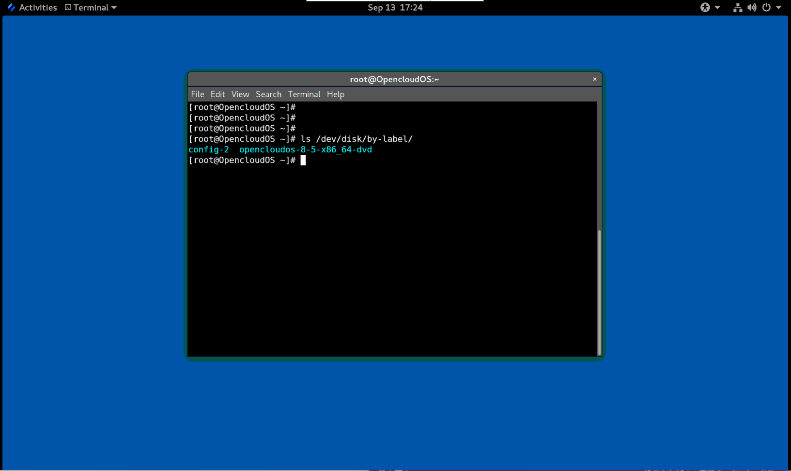

## 13.3.2 设备标识符

**/dev/disk/by-id/ 中的 WWID 属性**

全球标识符 (WWID) 是 SCSI 标准要求所有 SCSI 设备提供的持久的且**独立于系统的标识符**。 保证WWID 标识符对于每个存储设备都是唯一的，并且独立于用于访问设备的路径。标识符是设备的属性，但不存储在设备上的内容（即数据）中。

可以通过发出 SCSI 查询来检索设备标识重要产品数据（第 `0x83` 页）或单元序列号（第 `0x80` 页）来获取此标识符。

OpenCloud OS 自动维护从基于 WWID 的设备名称到该系统上当前 `/dev/sd` 名称的正确映射。应用程序可以使用 `/dev/disk/by-id/` 名称来引用磁盘上的数据，即使设备的路径发生变化，甚至在从不同系统访问设备时也是如此。

> **例 13.1 WWID 映射**
> 
> | **WWID 符号链接**                                                         | **非持久设备**   | **备注**             |
> | --------------------------------------------------------------------- | ----------- | ------------------ |
> | `/dev/disk/by-id/scsi-3600508b400105e210000900000490000`              | `/dev/sda`  | 具有页面 `0x83` 标识符的设备 |
> | `/dev/disk/by-id/scsi-SSEAGATE_ST373453LW_3HW1RHM6`                   | `/dev/sdb`  | 具有页面 `0x80` 标识符的设备 |
> | `/dev/disk/by-id/ata-SAMSUNG_MZNLN256HMHQ-000L7_S2WDNX0J336519-part3` | `/dev/sdc3` | 磁盘分区               |

除了系统提供的这些持久化名称之外，您还可以使用 `udev` 规则来实现持久化名称映射到存储的 WWID 中。

**/dev/disk/by-partuuid 中的分区 UUID 属性**

分区 UUID (PARTUUID) 属性标识 GPT 分区表定义的分区。

> **例 13.2 分区 UUID 映射**
> 
> | **PARTUUID 符号链接**                   | **非持久性设备**  |
> | ----------------------------------- | ----------- |
> | `/dev/disk/by-partuuid/35e6a7c2-01` | `/dev/sda1` |
> | `/dev/disk/by-partuuid/35e6a7c2-02` | `/dev/sda2` |


**/dev/disk/by-path/ 中的 Path 属性**

此属性通过用于访问该设备的**硬件路径**来提供一个指向存储设备的符号链接。

如果硬件路径的任何部分（例如 PCI ID、目标端口或 LUN 号）发生更改，则 Path 属性会失败。因此 Path 属性是不可靠的。但是 Path 属性在以下场景中可能很有用：

- 您需要识别您要替换的磁盘。
- 您计划在特定位置的磁盘上安装存储服务。

## 13.4 带有 DM 多路径的通用标识符

本节介绍设备映射器多路径配置中通用标识符 (WWID) 和非持久设备名称之间的映射。

如果从系统到设备有多条路径，DM Multipath 使用 WWID 来检测设备。然后 DM Multipath 在 `/dev/mapper/wwid` 目录中显示单个“pseudo-device”，例如 `/dev/mapper/3600508b400105df70000e00000ac0000`。

`multipath -l` 命令显示到非持久性标识符的映射：

- *`Host:Channel:Target:LUN`*
- `/dev/sd` 名称
- `major:minor` 号

> **例 13.3 多路径配置中的 WWID 映射**
> 
> `multipath -l` 命令的一个输出示例：
> 
> ```
> 3600508b400105df70000e00000ac0000 dm-2 vendor,product
> [size=20G][features=1 queue_if_no_path][hwhandler=0][rw]
> \_ round-robin 0 [prio=0][active]
> \_ 5:0:1:1 sdc 8:32  [active][undef]
> \_ 6:0:1:1 sdg 8:96  [active][undef]
> \_ round-robin 0 [prio=0][enabled]
> \_ 5:0:0:1 sdb 8:16  [active][undef]
> \_ 6:0:0:1 sdf 8:80  [active][undef]
> ```

DM Multipath 自动维护每个基于 WWID 的设备名称到系统上相应 `/dev/sd` 名称的正确映射。这些名称在路径更改时保持不变，并且在从不同系统访问设备时保持一致。

当使用 DM Multipath 的 `user_friendly_names` 功能时，WWID 被映射为 `/dev/mapper/mpathN` 形式的名称。默认情况下，此映在文件 `/etc/multipath/bindings` 中维护。只要维护该文件，这些 `mpathN` 名称就一直存在。

> **重要**
> 
> 如果您使用 `user_friendly_names`，则需要额外的步骤才能在集群中获得一致的名称。

## 13.5 udev 设备命名规则的限制

以下是 `udev` 命名规则的一些限制：

- 执行查询时可能无法访问设备，因为当 `udev` 处理 `udev` 规则时，`udev` 机制可能依赖于查询存储设备的能力。当设备不在服务器中时，光纤通道、iSCSI 或 FCoE 存储设备更可能发生这种情况。
- 内核可能随时发送 `udev` ，从而导致规则被处理，并可能导致设备无法访问时，`/dev/disk/by-*/` 链接被删除。
- 在 `udev` 产生和处理时（如检测到大量设备），用户空间 `udevd` 服务花费一些时间来处理每个事件的规则时，可能会有延迟。这可能会导致内核检测到设备与 `/dev/disk/by-*/` 名称可用之间存在延迟。
- 规则调用的外部程序（例如 `blkid`）可能会在短时间内打开设备，从而使设备无法用于其他用途。
- `/dev/disk/` 中 `udev` 机制管理的设备名称可能会在主版本之间发生变化，需要您更新链接。

## 13.6 列出持久命名属性

此过程描述如何找出非持久性存储设备的持久命名属性。

**流程**

- 要列出 UUID 和 Label 属性，请使用 `lsblk` 工具：
  
  ```
  $ lsblk --fs storage-device
  ```
  
  例如：
  
  > **例 13.4 查看文件系统的 UUID 和标签**
  > 
  > ```
  > $ lsblk --fs /dev/vda1
  > 
  > NAME FSTYPE LABEL UUID                                 MOUNTPOINT
  > vda1 xfs          15cd6646-bff7-4bbd-90a3-b6f232047a84 /boot
  > ```
  
  

- 要列出 PARTUUID 属性，请使用 `lsblk` 工具以及 `--output +PARTUUID` 选项：
  
  ```
  $ lsblk --output +PARTUUID
  ```
  
  例如：
  
  > **例 13.5 查看分区的 PARTUUID 属性**
  > 
  > ```
  > $ $ lsblk --output +PARTUUID /dev/sda1
  > 
  > NAME MAJ:MIN RM SIZE RO TYPE MOUNTPOINT PARTUUID
  > vda1 253:1    0   1G  0 part /boot      35e6a7c2-01
  > ```
  
  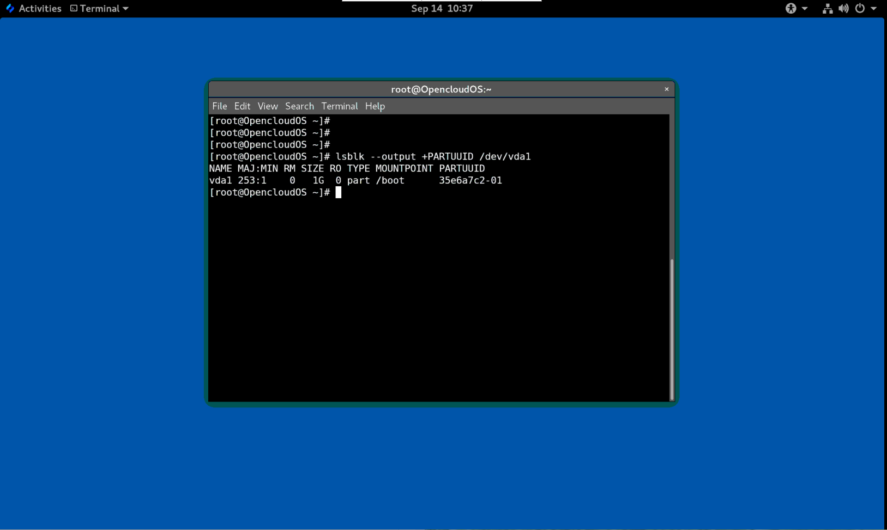

- 要列出 WWID 属性，请检查 `/dev/disk/by-id/` 目录中符号链接的目标。例如：
  
  > **例 13.6 查看系统上所有存储设备的 WWID**
  > 
  > ```
  > $ file /dev/disk/by-id/*
  > 
  > /dev/disk/by-id/ata-QEMU_DVD-ROM_bef07694-82b3-402e-b:                                        symbolic link to ../../sr0
  > /dev/disk/by-id/ata-QEMU_DVD-ROM_QM00002:                                                     symbolic link to ../../sr1
  > /dev/disk/by-id/dm-name-opencloudos-root:                                                     symbolic link to ../../dm-0
  > /dev/disk/by-id/dm-name-opencloudos-swap:                                                     symbolic link to ../../dm-1
  > /dev/disk/by-id/dm-uuid-LVM-vF7qTdo3J0KWKmyBiHI6dCwkf7Z0K8rcbu8oaxySo5oqcytCMTd5Cb3RX2rBt1QH: symbolic link to ../../dm-1
  > /dev/disk/by-id/dm-uuid-LVM-vF7qTdo3J0KWKmyBiHI6dCwkf7Z0K8rcjTTWKI2DYXGWm6tfwdHIxHzvRUhO38bv: symbolic link to ../../dm-0
  > /dev/disk/by-id/lvm-pv-uuid-O0JKeK-uPCw-cUa0-KOE5-KfiT-HjIM-3MhRiy:                           symbolic link to ../../vda2
  > /dev/disk/by-id/virtio-2e46d4c6-b145-4250-8:                                                  symbolic link to ../../vdb
  > /dev/disk/by-id/virtio-326e8248-eb33-4f06-8:                                                  symbolic link to ../../vda
  > /dev/disk/by-id/virtio-326e8248-eb33-4f06-8-part1:                                            symbolic link to ../../vda1
  > /dev/disk/by-id/virtio-326e8248-eb33-4f06-8-part2:                                            symbolic link to ../../vda2
  > ```
  
  

## 13.7 修改持久命名属性

此步骤描述如何更改文件系统的 UUID 或 Label persistent naming 属性。

> **注意**
> 
> 更改 `udev` 属性发生在后台，可能需要很长时间。 `udevadm set` 命令会等待更改完全注册，这样可以确保您的下一个命令能够正确使用新属性。

在以下命令中：

- 将 *new-uuid* 替换为你要设置的 UUID；例如，`d52531b8-ae6f-443b-9b9a-16cbf1e6a3f4` 。您可以使用 `uuidgen` 命令生成 UUID。
- 用标签替换 *new-label* ；例如，`backup_data` 。

**前提条件**

- 如果要修改 XFS 文件系统的属性，请先卸载它。

**流程**

- 要更改 **XFS** 文件系统的 UUID 或 Label 属性，请使用 `xfs_admin` 实用程序：
  
  ```
  # xfs_admin -U new-uuid -L new-label storage-device
  # udevadm settle 
  ```

- 要更改 **ext4**、**ext3** 或 **ext2** 文件系统的 UUID 或标签属性，请使用 `tune2fs` 实用程序：
  
  ```
  # tune2fs -U new-uuid -L new-label storage-device
  # udevadm settle
  ```

- 要更改交换卷的 UUID 或标签属性，请使用 `swaplabel` 实用程序：
  
  ```
  # swaplabel --uuid new-uuid --label new-label swap-device
  # udevadm settle
  ```

# 第 14 章 用parted查看分区表

显示块设备的分区表以查看分区布局和有关各个分区的详细信息。您可以使用 `parted` 工具查看块设备上的分区表。

**流程**

1. 启动 `parted` 实用程序。例如，以下输出列出了设备 `/dev/sda`：
   
   ```
   # parted /dev/sda
   ```

2. 查看分区表：
   
   ```
   (parted) print                                                            
   Model: Virtio Block Device (virtblk)
   Disk /dev/vda: 53.7GB
   Sector size (logical/physical): 512B/512B
   Partition Table: msdos
   Disk Flags: 
   
   Number  Start   End     Size    Type     File system  Flags
   1      1049kB  1075MB  1074MB  primary  xfs          boot
   2      1075MB  53.7GB  52.6GB  primary               lvm
   ```
   
   

3. 可选：切换到您接下来要检查的设备：
   
   ```
   # (parted) select block-device
   ```

有关打印命令输出的详细说明，请参见以下内容：

**`Virtio Block Device (virtblk)`**：磁盘类型、制造商、型号和接口。
**`Disk /dev/vda: 53.7GB`**： 块设备的文件路径和存储容量。
**`Partition Table: msdos`**：磁盘标签类型。
**`Number`**：  分区号。例如，次要编号为 1 的分区对应于 /dev/vda1。
**`Start`** 和 **`End`**：  设备上分区开始和结束的位置。
**`Type`**：  有效类型是metadata、free、primary、extended 或 logical
**`File system`**： 文件系统类型。如果设备的 `File system` 没有显示任何值，这意味着它的文件系统类型是未知的。 `parted` 工具无法识别加密设备上的文件系统。
**`Flags`**：列出为分区设置的标签。可用的标签是 `boot`、`root`、`swap`、`hidden`、`raid`、`lvm` 或 `lba`。

# 第 15 章 使用parted在磁盘上创建分区表

使用 `parted` 工具可以更轻松地使用分区表格式化块设备。

> **警告**
> 
> 使用分区表格式化块设备会删除设备上存储的所有数据。

**流程**

1. 启动交互式 `parted` shell：
   
   ```
   # parted block-device
   ```

2. 判断设备上是否已经存在分区表：
   
   ```
   # (parted) print
   ```
   
   如果设备已经包含分区，它们将在以下步骤中被删除。

3. 创建新的分区表：
   
   ```
   # (parted) mklabel table-type
   ```
   
   - 将 *table-type* 替换为预期的分区表类型：
     
     - 用于 MBR 的 `msdos`
     - 用于 GPT 的 `gpt`
   
   > 例 15.1 创建 GUID 分区表 (GPT) 表
   > 
   > 要在磁盘上创建 GPT 表，请使用：
   > 
   > ```
   > # (parted) mklabel gpt
   > ```
   
   输入此命令后，更改开始应用。

4.查看分区表确认是否创建：

```
# (parted) print
```

5. 退出 `parted` shell：
   
   ```
   # (parted) quit
   ```


# 第 16 章 使用parted创建分区

作为系统管理员，您可以使用 `parted` 工具在磁盘上创建新分区。

> **注意**
> 所需的分区是 `swap` 、`/boot/` 和 `/(root)`。

**前提条件**

- 磁盘上的分区表。
- 如果您要创建的分区大于 2TiB，请使用 **GUID 分区表 (GPT)** 格式化磁盘。

**流程**

1. 启动 parted 工具：
   
   ```
   # parted block-device
   ```

2. 查看当前分区表是否有足够的可用空间：
   
   ```
   # (parted) print
   ```
   
   - 如果没有足够的可用空间，请调整分区大小。
   
   - 从分区表中确定：
     
     - 新分区的起点和终点。
     - 在 MBR 上，它应该是什么分区类型。

3. 创建新分区：
   
   ```
   # (parted) mkpart part-type name fs-type start end
   ```
   
   - 将 *part-type* 替换为 `primary`、`logical` 或 `extended`。这仅适用于 MBR 分区表。
   - 将 *name* 替换为任意分区名称。这是 GPT 分区表所必需的。
   - 将 *fs-type* 替换为 `xfs`、`ext2`、`ext3`、`ext4`、`fat16`、`fat32`、`hfs`、`hfs+`、`linux-swap`、`ntfs` 或 `reiserfs`。 *fs-type* 参数是可选的。请注意，`parted` 工具不会在分区上创建文件系统。
   - 将 `start` 和 `end` 替换为确定分区起点和终点的大小，从磁盘的开头开始计数。您可以使用大小后缀，例如 `512MiB`、`20GiB` 或 `1.5TiB`。默认大小以兆字节为单位。
   
   > **例 16.1 创建一个小的主分区**
   > 
   > 要在 MBR 表上创建从 1024MiB 到 2048MiB 的主分区，请使用：
   > 
   > ```
   > # (parted) mkpart primary 1024MiB 2048MiB
   > ```
   
   输入命令后更改开始应用。

4. 查看分区表，确认创建的分区在分区表中，分区类型、文件系统类型、大小都正确：
   
   ```
   # (parted) print
   ```

5. 退出 `parted` shell：
   
   ```
   # (parted) quit
   ```

6. 注册新的设备节点：
   
   ```
   # udevadm settle
   ```

7. 验证内核是否识别新分区：
   
   ```
   # cat /proc/partitions
   ```

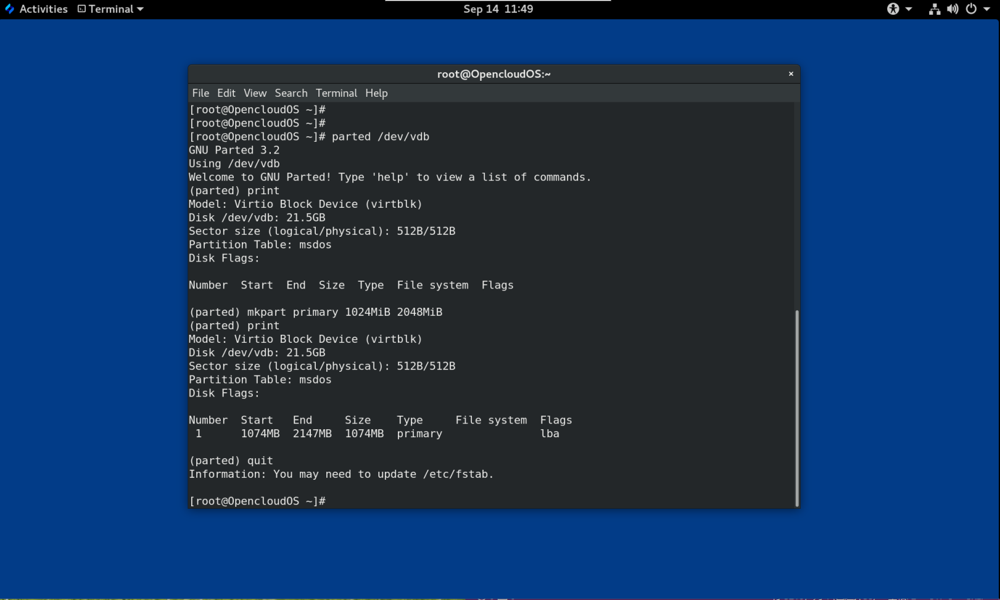

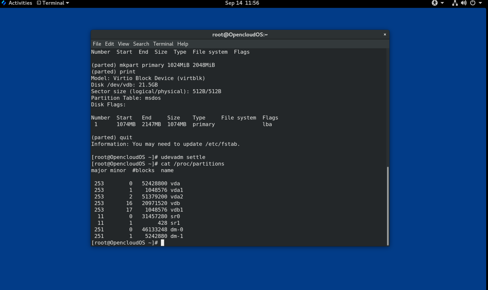

# 第 17 章 使用parted删除分区

使用 `parted` 工具，您可以删除磁盘分区以释放磁盘空间。

> **警告**
> 
> 删除分区会删除该分区上存储的所有数据。

**流程**

1. 启动交互式 `parted` shell：
   
   ```
   # parted block-device
   ```

2. 查看当前分区表以确定要删除的分区的次要编号：
   
   ```
   # (parted) print
   ```

3. 删除分区：
   
   ```
   # (parted) rm minor-number
   ```
   
   - 将 *minor-number* 替换为要删除的分区的次要编号。
   
   输入此命令后，更改立即开始应用。

4. 验证您是否已从分区表中删除该分区：
   
   ```
   # (parted) print
   ```

5. 退出 `parted` shell：
   
   ```
   # (parted) quit
   ```

6. 验证内核是否已删除分区的注册信息：
   
   ```
   # cat /proc/partitions
   ```

7. 如果存在分区，则从 `/etc/fstab` 文件中删除分区。找到声明删除分区的行，并将其从文件中删除。

8. 重新生成挂载单元，以便您的系统注册新的 `/etc/fstab` 配置：
   
   ```
   # systemctl daemon-reload
   ```

9. 如果您删除了交换分区或 LVM 分区，请从 `/etc/default/grub` 文件中的内核命令行中删除对该分区的所有引用，然后重新生成 GRUB 配置：
- 在基于 BIOS 的系统上：
  
  ```
  # grub2-mkconfig --output=/etc/grub2.cfg
  ```

- 在基于 UEFI 的系统上：
  
  ```
  # grub2-mkconfig --output=/etc/grub2-efi.cfg
  ```
10. 要在早期引导系统中注册更改，请重建 `initramfs` 文件系统：
    
    ```
    # dracut --force --verbose
    ```


# 第 18 章 使用parted调整分区大小

使用 `parted` 工具，扩展分区以利用未使用的磁盘空间，或缩小分区以将其容量用于不同目的。

**前提条件**

- 在收缩分区之前备份数据。
- 如果您要创建的分区大于 2TiB，请使用 **GUID 分区表 (GPT)** 格式化磁盘。
- 如果要收缩分区，首先要收缩文件系统，使其不大于调整后的分区。

> **注意**
> 
> XFS 不支持收缩。

流程

1. 启动 `parted` 工具：
   
   ```
   # parted block-device
   ```

2. 查看当前分区表：
   
   ```
   # (parted) print
   ```
   
   从分区表中决定：
- 分区的次要编号。

- 调整大小后现有分区的位置及其新的结束点。
3. 调整分区大小：
   
   ```
   # (parted) resizepart 1 2GiB
   ```
- 将 1 替换为要调整大小的分区的次要编号。

- 将确定要调整大小的分区的新结束点的大小替换为 2 ，从磁盘的开头开始计数。您可以使用大小后缀，例如 `512MiB`、`20GiB` 或 `1.5TiB`。默认大小以兆字节为单位。
4. 查看分区表，确认调整大小的分区在大小正确的分区表中：
   
   ```
   # (parted) print
   ```

5. 退出 `parted` shell：
   
   ```
   # (parted) quit
   ```

6. 验证内核是否注册了新分区：
   
   ```
   # cat /proc/partitions
   ```

7. 可选：如果您扩展了分区，也扩展其上面的文件系统。


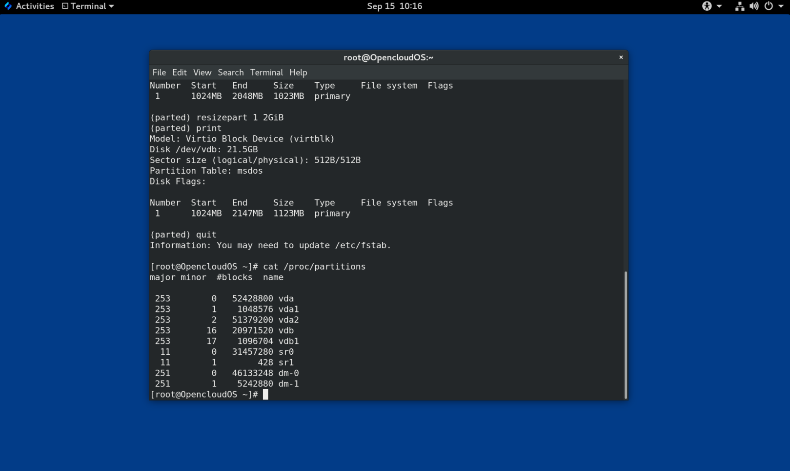

# 第 19 章 重新分区磁盘的策略

磁盘重新分区的方法有很多。包括：

- 有未分区的空闲空间可用。
- 有一个未使用的分区可用。
- 活跃使用的分区中有可用的空间。

> **注意**
> 
> 为了清楚起见，以下示例进行了简化，并不反映实际安装 OpenCloud OS 时的确切分区布局。

## 19.1.使用未分区的可用空间

已定义且不跨越整个硬盘的分区会保留不属于任何已定义分区的未分配空间。下图显示了这种情况。

**图 19.1 具有未分区可用空间的磁盘**


第一个图展示了一个带有一个主分区的磁盘以及带有未分配空间的未定义分区。第二个图表示了具有两个已定义分区并分配空间的磁盘。

未使用的硬盘也属于这种类型。唯一的区别是，所有的空间都不是任何一个已定义分区的一部分。

在新磁盘上，您可以从未使用的空间中创建必要的分区。大多数预安装的操作系统都被配置为占用磁盘驱动器上的所有可用空间。

## 19.2 使用未使用分区中的空间

在以下示例中，第一个图表表示具有未使用分区的磁盘。第二张图表示为 Linux 分配未使用的分区。

**图 19.2 具有未使用分区的磁盘**


要使用分配给未使用分区的空间，请删除该分区，然后改为创建大小合适的 Linux 分区。或者，在安装过程中，删除未使用的分区并手动创建新分区。

## 19.3 使用活跃分区的可用空间

此过程可能难以管理，因为在已经使用的活跃分区中包含所需的可用空间。在大多数情况下，预装软件的计算机硬盘包含一个较大的分区用于保存操作系统和数据。

> **警告**
> 
> 如果要在活动分区上使用操作系统 (OS)，则必须重新安装操作系统。请注意，某些包含预装软件的计算机不包含用于重新安装原始操作系统的安装介质。在销毁原始分区和操作系统安装之前，请检查这是否适用于您的操作系统。

要选择使用可用空间，您可以使用破坏性或非破坏性重新分区的方法。

### 19.3.1 破坏性重新分区

破坏性重新分区会破坏硬盘上的分区并创建几个较小的分区。从原始分区备份任何需要的数据，因为此方法会删除完整的内容。

为现有操作系统创建较小的分区后，您可以：

- 重新安装软件。
- 恢复您的数据。
- 开始您的 OpenCloud OS 安装。

下图是使用破坏性重新分区方法的简化形式。

**图 19.3 磁盘上的破坏性重新分区操作**


> **警告**
> 
> 此方法会删除之前存储在原始分区中的所有数据。

### 19.3.2 非破坏性重新分区

非破坏性重新分区调整分区大小，不会丢失任何数据。此方法是可靠的，但在大型驱动器上需要更长的处理时间。

以下列出了可以帮助启动非破坏性重新分区的方法。

- 压缩现有数据

某些数据的存储位置无法更改。这可以防止将分区大小调整到所需大小，并最终导致破坏性重新分区。压缩现有分区中的数据可以帮助您根据需要调整分区大小。它还有助于最大限度地利用可用空间。

下图是此过程的简化形式。

**图 19.4 磁盘上的数据压缩**


为避免任何可能的数据丢失，请在继续压缩过程之前创建备份。

- 调整现有分区的大小

通过调整现有分区的大小，您可以释放更多空间。根据您的软件调整大小，结果可能会有所不同。在大多数情况下，您可以创建与原始分区相同类型的新未格式化分区。

调整大小后采取的步骤可能取决于您使用的软件。在以下示例中，最好的做法是删除新的 DOS（Disk Operating System）分区，创建一个 Linux 分区。在开始调整大小过程之前，验证是否最适合您的硬盘。

**图 19.5 在磁盘上调整分区大小**


- 可选：创建新分区

一些调整大小的软件支持基于 Linux 的系统。在这种情况下，调整大小后无需删除新创建的分区。之后创建新分区取决于您使用的软件。

下图表示创建新分区之前和之后的磁盘状态。

**图 19.6 带有最终分区配置的磁盘**

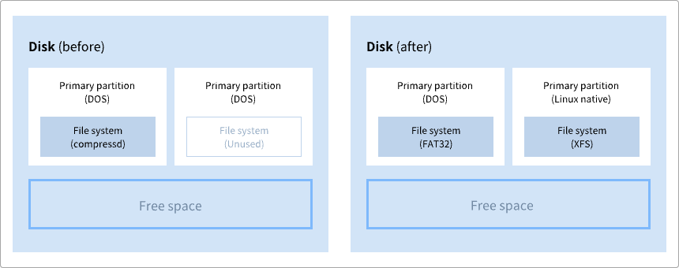

# 第 20 章 XFS 入门

这是如何创建和维护 XFS 文件系统的概述。

## 20.1 XFS 文件系统

XFS 是一个扩展性高、高性能、健壮且成熟的 64 位日志文件系统，它在单个主机上支持非常大的文件和文件系统。它是 OpenCloud OS 8 中的默认文件系统。XFS 最初由 SGI 在 1990 年代初期开发，并且在超大型服务器和存储阵列上运行已有很长的一段历史。

XFS 的特点包括：

**可靠性**

- 元数据日志，通过保留系统重启和重新挂载文件系统时可以重新执行的文件系统操作的记录，来确保系统崩溃后文件系统的完整性
- 大面积检查运行时元数据的一致性
- 可扩展的快速修复工具
- 配额日志。这样可以避免在崩溃后进行冗长的检查（配额一致性）。

**可扩展性和性能**

- 支持的文件系统大小高达 1024 TiB
- 支持大量并发操作的能力
- B-tree 索引用于可用空间的可扩展性管理
- 复杂的元数据预读算法
- 优化流视频工作负载

**分配方案**

- 基于扩展数据块的分配
- 条带化分配策略
- 延迟分配
- 空间预分配
- 动态分配的 inode

**其它功能**

- 基于 Reflink 的文件副本
- 紧密集成的备份和恢复工具
- 在线清理
- 在线文件系统增长
- 全面的诊断能力
- 扩展属性 (xattr)。这允许系统能够按文件关联多个额外的名称/值对。
- 项目或目录配额。这允许对目录树进行配额限制。
- 小于秒的时间戳

**性能特点**

XFS 在具有企业级工作负载的大型系统上具有高性能。大型系统是一个具有相对较多数量的 CPU、多个 HBA 以及与外部磁盘阵列相连的系统。 XFS 在具有多线程、并行 I/O 工作负载的小型系统上也表现良好。

XFS 对于单线程、元数据密集型工作负载的性能相对较低。例如：在单个线程中创建或删除大量小文件的工作负载。

## 20.2. ext4 和 XFS 使用的工具比较

这部分比较用于完成 ext4 和 XFS 文件系统中常用任务的工具。

| **任务**    | **ext4**           | **XFS**                          |
| --------- | ------------------ | -------------------------------- |
| 创建文件系统    | `mkfs.ext4`        | `mkfs.xfs`                       |
| 文件系统检查    | `e2fsck`           | `xfs_repair`                     |
| 调整文件系统的大小 | `resize2fs`        | `xfs_growfs`                     |
| 保存文件系统的图像 | `e2image`          | `xfs_metadump` 和 `xfs_mdrestore` |
| 标记或调整文件系统 | `tune2fs`          | `xfs_admin`                      |
| 备份文件系统    | `dump` 和 `restore` | `xfsdump` 和 `xfsrestore`         |
| 配额管理      | `quota`            | `xfs_quota`                      |
| 文件映射      | `filefrag`         | `xfs_bmap`                       |

# 第 21 章 创建 XFS 文件系统

作为系统管理员，您可以在块设备上创建 XFS 文件系统，使其能够存储文件和目录。

## 21.1 使用 mkfs.xfs 创建 XFS 文件系统

此过程描述了如何在块设备上创建 XFS 文件系统。

**流程**

1. 创建文件系统：
- 如果设备是常规分区、LVM 卷、MD 卷、磁盘或类似设备，请使用以下命令：
  
  ```
  # mkfs.xfs block-device
  ```
  
  - 用块设备的路径替换块设备。例如：`/dev/sdb1`、`/dev/disk/by-uuid/15cd6646-bff7-4bbd-90a3-b6f232047a84` 或 `/dev/my-volgroup/my-lv`。
  - 通常，默认选项是常见用途的最佳选择。
  - 在包含现有文件系统的块设备上使用 `mkfs.xfs` 时，添加 `-f` 选项以覆盖该文件系统。

- 要在硬件 RAID 设备上创建文件系统，请检查系统是否正确检测到设备的条带几何结构：
  
  - 如果条带几何信息正确，则不需要其他选项。创建文件系统：
    
    ```
    # mkfs.xfs block-device
    ```
  
  - 如果信息不正确，请使用 `-d` 选项的 `su` 和 `sw` 参数手动指定条带几何。 `su` 参数指定 RAID 块大小，`sw` 参数指定 RAID 设备中数据磁盘的数量。
    
    例如：
    
    ```
    # mkfs.xfs -d su=64k,sw=4 /dev/sda3
    ```
2. 使用以下命令等待系统注册新的设备节点：
   
   ```
   # udevadm settle
   ```


# 第 22 章 使用系统角色在块设备上创建 XFS 文件系统

本节介绍如何使用 Storage 角色在多台目标机器上的块设备上创建 XFS 文件系统。

**前提条件**

- 存在使用 Storage 角色的 Ansible playbook。

## 22.1 在块设备上创建 XFS 文件系统的示例 Ansible playbook

本节提供了一个示例 Ansible 剧本。本 playbook 应用 Storage 角色使用默认参数在块设备上创建 XFS 文件系统。

> 警告
> 
> Storage 角色只能在未分区的整个磁盘或逻辑卷 (LV) 上创建文件系统。它不能在分区上创建文件系统。

> 例 22.1 在 /dev/sdb 上创建 XFS 的 playbook
> 
> ```
> ---
> - hosts: all
>   vars:
>     storage_volumes:
>       - name: barefs
>         type: disk
>         disks:
>           - sdb
>         fs_type: xfs
>   roles:
>     - rhel-system-roles.storage
> ```
> 
> - 卷名（示例中为 *`barefs`*）当前是任意的。 Storage 角色可以通过 `disks:` 列出的磁盘设备识别卷。
> - 您可以省略 `fs_type: xfs` 行，因为 XFS 是 OpenCloud OS 8 中的默认文件系统。
> - 要在 LV 上创建文件系统，请在 `disks:` 属性下提供 LVM 设置，包括关闭的卷组。
> 
> 不要提供 LV 设备的路径。

# 第 23 章 备份 XFS 文件系统

作为系统管理员，您可以使用 `xfsdump` 将 XFS 文件系统备份到文件或磁带上。这提供了一种简单的备份机制。

## 23.1 XFS 备份的特点

本节介绍使用 `xfsdump` 工具备份 XFS 文件系统的主要概念和功能。

您可以使用 `xfsdump` 工具来：

- 对常规文件镜像进行备份。
  
   只能将一个备份写入常规文件。

- 在磁带驱动器中进行备份。
  
   `xfsdump` 工具还允许您将多个备份写入同一磁带。一个备份可以跨越多个磁带。
  
   要将多个文件系统备份到单个磁带设备上，只需将备份写入到包含 XFS 备份的磁带。这会将新备份附加到上一个备份的上面。默认情况下，`xfsdump` 从不覆盖现有备份。

- 创建增量备份。
  
   `xfsdump` 工具使用转储级别来确定与其他备份相关的基本备份。从 0 到 9 的数字表示增加的转储级别。增量备份仅备份自上次转储较低级别以来发生更改的文件：
  
  - 要执行完整备份，请在文件系统上执行 0 级转储。
  - 1 级转储是完整备份之后的第一个增量备份。下一个增量备份将是 2 级，它只备份自上次 1 级转储以来发生更改的文件；以此类推，最高到9级。

- 可以使用大小、子树或 inode 标志从备份中排除文件来过滤它们。

## 23.2 使用 xfsdump 备份 XFS 文件系统

此过程描述如何将 XFS 文件系统的内容备份到文件或磁带中。

**前提条件**

- 可以备份的 XFS 文件系统。
- 可以存储备份的另一个文件系统或磁带驱动器。

**流程**

- 使用以下命令备份 XFS 文件系统：
  
  ```
  # xfsdump -l level [-L label] \
           -f backup-destination path-to-xfs-filesystem
  ```
  
  - 将 *level* 替换为备份的转储级别。使用 `0` 执行完整备份或使用 `1` 到 `9` 执行后续增量备份。
  - 将 *backup-destination* 替换为您要存储备份的路径。目标可以是常规文件、磁带驱动器或远程磁带设备。例如，用于文件的 `/backup-files/Data.xfsdump` 或用于磁带驱动器的 `/dev/st0`。
  - 将 *path-to-xfs-filesystem* 替换为要备份的 XFS 文件系统的挂载点。例如，`/mnt/data/`。必须挂载文件系统。
  - 备份多个文件系统并将它们保存在单个磁带设备上时，使用 `-L` *`label`* 选项为每个备份添加会话标签，以便在恢复时更容易识别它们。使用备份任何名称替换 *label* ：例如，`backup_data`。

> **例 23.1 备份多个 XFS 文件系统**
> 
> - 备份挂载在 `/boot/` 和 `/data/` 目录的 XFS 文件系统的内容并将它们保存为 `/backup-files/` 目录中的文件：
> 
> ```
> # xfsdump -l 0 -f /backup-files/boot.xfsdump /boot
> # xfsdump -l 0 -f /backup-files/data.xfsdump /data
> ```
> 
> - 要在单个磁带设备上备份多个文件系统，请使用 `-L` *`label`* 选项为每个备份添加一个会话标签：
> 
> ```
> # xfsdump -l 0 -L "backup_boot" -f /dev/st0 /boot
> # xfsdump -l 0 -L "backup_data" -f /dev/st0 /data
> ```


# 第 24 章 从备份中恢复 XFS 文件系统

作为系统管理员，您可以使用 `xfsrestore` 工具来恢复使用 `xfsdump` 工具创建并存储在文件或磁带上的 XFS 备份。

## 24.1 从备份恢复 XFS 的功能

本节介绍了使用 `xfsrestore` 工具从备份中恢复 XFS 文件系统的关键概念和功能。

`xfsrestore` 工具从 `xfsdump` 生成的备份中恢复文件系统。 `xfsrestore` 工具有两种模式：

- **简单** 模式使用户能够从 0 级转储中恢复整个文件系统。这是默认模式。
- **累积** 模式允许从增量备份恢复文件系统：即从级别 1 到级别 9。

唯一的会话 *ID* 或会话 *标签* 标识每个备份。从包含多个备份的磁带恢复备份需要相应的会话 ID 或标签。

要从备份中提取、添加或删除特定文件，请进入 `xfsrestore` 交互模式。交互模式提供一组命令来操作备份文件。

## 24.2 使用 xfsrestore 从备份中恢复 XFS 文件系统

此过程描述如何了从文件或磁带备份恢复 XFS 文件系统的内容。

**前提条件**

- XFS 文件系统的文件或磁带备份，如[备份 XFS 文件系统](#第-23-章-备份-xfs-文件系统)中所述。
- 您可以在其中恢复备份的存储设备。

**流程**

- 恢复备份的命令会有所不同，具体取决于您是从完整备份还是增量备份中恢复，还是从单个磁带设备恢复多个备份：
  
  ```
  # xfsrestore [-r] [-S session-id] [-L session-label] [-i]
              -f backup-location restoration-path
  ```
  
  - 将 *backup-location* 替换为备份的位置。这可以是常规文件、磁带驱动器或远程磁带设备。例如: 用于文件的 `/backup-files/Data.xfsdump` 或者用于磁带驱动器的 `/dev/st0` 。
  
  - 将 *restore-path* 替换为要还原文件系统的目录的路径。例如: `/mnt/data/`。
  
  - 要从增量（1 级到 9 级）备份恢复文件系统，请添加 `-r` 选项。
  
  - 要从包含多个备份的磁带设备中恢复备份，请使用 `-S` 或 `-L` 选项指定备份。
    
    `-S` 选项允许您按会话 ID 选择备份，而 `-L` 选项允许您按会话标签进行选择。要获取会话 ID 和会话标签，请使用 `xfsrestore -I` 命令。
    
    将 *session-id* 替换为备份的会话 ID。例如： `89aa11fb-e4e9-43a2-8790-f84cb3977917`。将 *session-label* 替换为备份的会话标签。例如： `backup_session_label`。
    
    
  
  - 要以交互方式使用 `xfsrestore`，请使用 `-i` 选项。
    
    交互式对话框在 `xfsrestore` 完成读取指定设备后开始。交互式 `xfsrestore` shell 中可用的命令包括 `cd`、`ls`、`add`、`delete` 和 `extract`；有关命令的完整列表，请使用 `help` 命令。

> **例 24.1 恢复多个 XFS 文件系统**
> 
> - 要恢复 XFS 备份文件并将其内容保存到 /mnt/ 下的目录中：
> 
> ```
> # xfsrestore -f /backup-files/boot.xfsdump /mnt/boot/
> # xfsrestore -f /backup-files/data.xfsdump /mnt/data/
> ```
> 
> - 要从包含多个备份的磁带设备恢复，请通过会话标签或会话 ID 指定每个备份：
> 
> ```
> # xfsrestore -L "backup_boot" -f /dev/st0 /mnt/boot/
> # xfsrestore -S "45e9af35-efd2-4244-87bc-4762e476cbab" \
>              -f /dev/st0 /mnt/data/
> ```


## 24.3 从磁带恢复 XFS 备份时的说明性消息

从存有多个文件系统备份的磁带中还原备份时，`xfsrestore` 工具可能会发出消息。当 `xfsrestore` 按顺序检查磁带上的每个备份时，这些消息会通知您是否找到了所请求备份的匹配项。例如：

xfsrestore: preparing drive
xfsrestore: examining media file 0
xfsrestore: inventory session uuid (8590224e-3c93-469c-a311-fc8f23029b2a) does not match the media header's session uuid (7eda9f86-f1e9-4dfd-b1d4-c50467912408)
xfsrestore: examining media file 1
xfsrestore: inventory session uuid (8590224e-3c93-469c-a311-fc8f23029b2a) does not match the media header's session uuid (7eda9f86-f1e9-4dfd-b1d4-c50467912408)
[...]

说明性消息会一直出现，直到找到匹配的备份。

# 第 25 章 增加 XFS 文件系统的大小

作为系统管理员，您可以增加 XFS 文件系统的大小以利用更大的存储容量。

> **重要**
> 目前无法减小 XFS 文件系统的大小。

## 25.1 使用 xfs_growfs 增加 XFS 文件系统的大小

此过程描述如何使用 `xfs_growfs` 实用程序扩展 XFS 文件系统。

**前提条件**

- 确保底层块设备具有适当的大小，以便以后保存调整大小的文件系统。对受影响的块设备使用适当的大小调整方法。
- 挂载 XFS 文件系统。

**流程**

- 挂载 XFS 文件系统后，使用 `xfs_growfs` 工具增加其大小：
  
  ```
  # xfs_growfs file-system -D new-size
  ```
  
  - 将 file-system 替换为 XFS 文件系统的挂载点。
  
  - 使用 -D 选项，将 new-size 替换为在文件系统块数中指定的所需文件系统的新大小。
    
    要找出给定 XFS 文件系统的块大小（以 kB 为单位），请使用 `xfs_info` 工具：
    
    ```
    # xfs_info /dev/vdb1
    
    meta-data=/dev/vdb1              isize=512    agcount=4, agsize=131072 blks
           =                       sectsz=512   attr=2, projid32bit=1
           =                       crc=1        finobt=1, sparse=1, rmapbt=0
           =                       reflink=1
    data     =                       bsize=4096   blocks=524288, imaxpct=25
           =                       sunit=0      swidth=0 blks
    naming   =version 2              bsize=4096   ascii-ci=0, ftype=1
    log      =internal log           bsize=4096   blocks=2560, version=2
           =                       sectsz=512   sunit=0 blks, lazy-count=1
    realtime =none                   extsz=4096   blocks=0, rtextents=0
    data size 3 too small, old size is 524288
    ```
  
  - 如果没有 `-D` 选项，`xfs_growfs` 会将文件系统增长到底层设备支持的最大大小。

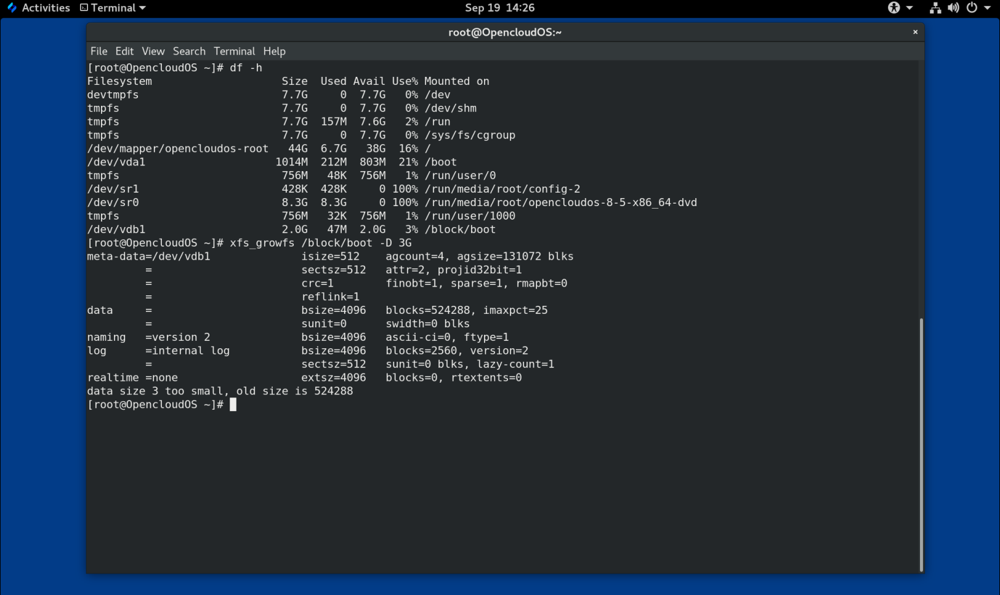

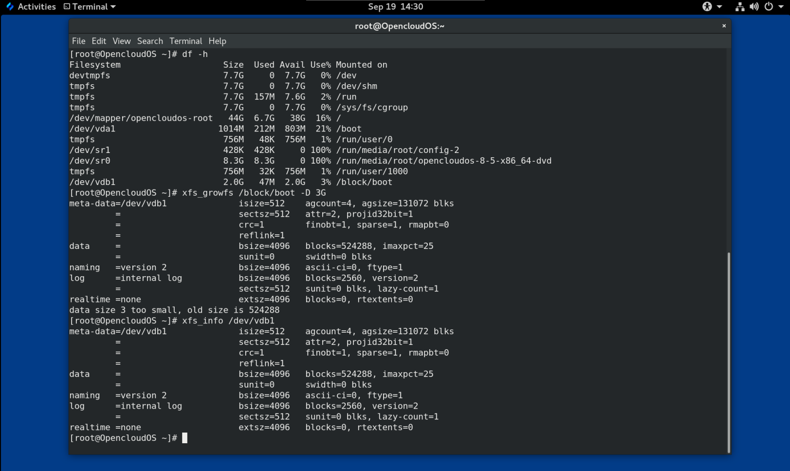

# 第26章 配置XFS错误行为

您可以配置 XFS 文件系统在遇到不同 I/O 错误时的行为。

## 26.1 XFS 中的可配置错误处理

当 I/O 操作期间发生错误时，XFS 文件系统会以下列方式之一进行响应：

- XFS 反复重试 I/O 操作，直到操作成功或 XFS 达到设置的限制。
  
   该限制基于最大重试次数或最大重试时间。

- XFS 认为错误是永久性的，并停止对文件系统的操作。

您可以配置 XFS 如何对以下错误情况做出响应：

`EIO`

  读取或写入时出错

`ENOSPC`

  设备上没有剩余空间

`ENODEV`

  找不到设备

您可以设置最大重试次数和 XFS 认为其是永久错误前的最长时间（以秒为单位）。 XFS 在达到任一限制时停止重试操作。

您还可以配置 XFS，以便在卸载文件系统时，XFS 会立即取消重试，而不考虑任何其他配置。此配置使卸载操作能够成功，尽管存在持续错误。

**默认行为**

每个 XFS 错误情况的默认行为取决于错误上下文。某些 XFS 错误（例如 `ENODEV`）被认为是致命且不可恢复的，无论重试多少次。它们的默认重试限制为 0。

## 26.2 特定和未定义 XFS 错误条件的配置文件

以下目录保存用来控制不同错误条件的 XFS 错误行为的配置文件：

`/sys/fs/xfs/device/error/metadata/EIO/`

  对于 `EIO` 错误情况

`/sys/fs/xfs/device/error/metadata/ENODEV`

  对于 `ENODEV` 错误条件

`/sys/fs/xfs/device/error/metadata/ENOSPC/`

  对于 `ENOSPC` 错误条件

`/sys/fs/xfs/device/error/default/`

  所有其他未定义错误条件的通用配置

每个目录包含以下用于配置重试限制的配置文件：

`max_retries`

  控制 XFS 重试操作的最大次数。

`retry_timeout_seconds`

  以秒为单位指定 XFS 停止重试操作的时间限制。

## 26.3 针对特定条件设置 XFS 行为

此过程配置 XFS 如何对特定错误条件作出反应。

**流程**

- 设置最大重试次数、重试时间限制或两者：
  
  - 要设置最大重试次数，请将所需次数写入 `max_retries` 文件：
    
    ```
    # echo value > /sys/fs/xfs/device/error/metadata/condition/max_retries
    ```
  
  - 要设置时间限制，请将所需的秒数写入 `retry_timeout_seconds` 文件：
    
    ```
    # echo value > /sys/fs/xfs/device/error/metadata/condition/retry_timeout_second
    ```

*value* 是介于 -1 和 C 有符号整数类型的最大可能值之间的数字。这是 64 位 Linux 上的 2147483647。

在这两个限制中，值 `-1` 用于连续重试，`0` 用于立即停止。

*device* 是设备的名称，可以在 `/dev/` 目录中找到；例如，`sda`。

## 26.4 为未定义的条件设置 XFS 行为

此流程配置 XFS 如何对共享一个通用配置的所有未定义的错误情况做出响应。

**流程**

- 设置最大重试次数、重试时间限制或两者：
  
  - 要设置最大重试次数，请将所需次数写入 `max_retries` 文件：
    
    ```
    # echo value > /sys/fs/xfs/device/error/metadata/condition/max_retries
    ```
  
  - 要设置时间限制，请将所需的秒数写入 `retry_timeout_seconds` 文件：
    
    ```
    # echo value > /sys/fs/xfs/device/error/metadata/condition/retry_timeout_second
    ```

*value* 是介于 -1 和 C 有符号整数类型的最大可能值之间的数字。这是 64 位 Linux 上的 2147483647。

在这两个限制中，值 `-1` 用于连续重试，`0` 用于立即停止。

*device* 是设备的名称，可以在 `/dev/` 目录中找到；例如，`sda`。。

## 26.5 设置 XFS 卸载行为

此过程配置 XFS 在卸载文件系统时如何对错误条件作出反应。

如果您在文件系统中设置了 `fail_at_unmount` 选项，它会在卸载期间覆盖所有其他错误配置，并立即卸载文件系统而不重试 I/O 操作。这使得卸载操作即使在持续错误的情况下也能成功。

> **警告**
> 
> 卸载进程启动后，您无法更改 `fail_at_unmount` 值，因为卸载进程会从 `sysfs` 接口中删除相应文件系统的配置文件。您必须在文件系统开始卸载之前配置卸载行为。

**流程**

- 启用或禁用 `fail_at_unmount` 选项：
  
  - 要在文件系统卸载时取消重试所有操作，请启用以下选项：
    
    ```
    # echo 1 > /sys/fs/xfs/device/error/fail_at_unmount
    ```
  
  - 要在文件系统卸载时遵守 `max_retries` 和 `retry_timeout_seconds` 重试限制，请禁用该选项：
    
    ```
    # echo 0 > /sys/fs/xfs/device/error/fail_at_unmount
    ```

*device* 是设备的名称，可以在 `/dev/` 目录中找到；例如，`sda`。

# 第 27 章 检查和修复文件系统

OpenCloud OS 提供了能够检查和修复文件系统的文件系统管理工具。这些工具通常被称为 `fsck` 工具，其中 `fsck` 是文件系统检查的缩短版本。在大多数情况下，如果需要，这些工具会在系统引导期间自动运行，但也可以在需要时手动调用。

> **重要**
> 
> 文件系统检查器仅保证整个文件系统的元数据一致性。它们不知道文件系统中包含的实际数据，也不是数据恢复工具。

## 27.1 需要检查文件系统的场景

如果出现以下任何情况，可以使用相关的 `fsck` 工具检查您的系统：

- 系统无法启动
- 特定磁盘上的文件损坏
- 文件系统因不一致而关闭或更改为只读
- 文件系统上的文件不可访问

文件系统不一致的原因可能有很多种，包括但不限于硬件错误、存储管理错误和软件 bug 。

> **重要**
> 
> 文件系统检查工具无法修复硬件问题。如果要成功进行修复，文件系统必须是完全可读、完全可写的。如果文件系统由于硬件错误而损坏，则必须首先将文件系统移动到良好的磁盘上，例如使用 `dd(8)` 工具。

对于日志文件系统，通常在启动时需要的只是在需要时重播日志，这通常是一个非常短的操作。

但是，如果发生文件系统不一致或损坏，即使是日志文件系统，也必须使用文件系统检查程序来修复文件系统。

> 重要
> 
> 可以通过将 `/etc/fstab` 中的第6个字段设置为 `0` 来启动时禁用文件系统检查。但是，不建议这样做，除非您在启动时遇到 `fsck` 问题，例如非常大或远程文件系统。

## 27.2 运行 fsck 的潜在副作用

一般来说，运行文件系统检查和修复工具至少可以自动修复它的一些不一致性。在某些情况下，可能会出现以下问题：

- 严重损坏的 inode 或目录如果无法修复，可能会被丢弃。
- 文件系统可能会发生重大变化。

为确保不会永久进行意外或不需要的更改，请确保您遵循程序中列出的所有预防措施。

## 27.3 XFS 中的错误处理机制

本节介绍 XFS 如何处理文件系统中的各种错误。

**未完全卸载**

日志维护文件系统上发生的元数据更改的事务记录。

在系统崩溃、电源故障或其他未完全卸载事件中，XFS 使用 journal（也称为 log ）来恢复文件系统。内核在挂载 XFS 文件系统时执行日志恢复。

**损坏**

在这种情况下，*损坏*是指由以下原因引起的文件系统错误：

- 硬件故障
- 存储固件、设备驱动程序、软件堆栈或文件系统本身的错误
- 导致文件系统的某些部分被文件系统之外的东西覆盖的问题

当 XFS 检测到文件系统或文件系统元数据损坏时，它可能会关闭文件系统并在系统日志中报告该事件。请注意，如果托管 `/var` 目录的文件系统发生损坏，则这些日志在重新启动后将不可用。

> 例 27.1 报告 XFS 损坏的系统日志条目
> 
> ```
> # dmesg --notime | tail -15
> 
> XFS (loop0): Mounting V5 Filesystem
> XFS (loop0): Metadata CRC error detected at xfs_agi_read_verify+0xcb/0xf0 [xfs], xfs_agi block 0x2
> XFS (loop0): Unmount and run xfs_repair
> XFS (loop0): First 128 bytes of corrupted metadata buffer:
> 00000000027b3b56: 00 00 00 00 00 00 00 00 00 00 00 00 00 00 00 00  ................
> 000000005f9abc7a: 00 00 00 00 00 00 00 00 00 00 00 00 00 00 00 00  ................
> 000000005b0aef35: 00 00 00 00 00 00 00 00 00 00 00 00 00 00 00 00  ................
> 00000000da9d2ded: 00 00 00 00 00 00 00 00 00 00 00 00 00 00 00 00  ................
> 000000001e265b07: 00 00 00 00 00 00 00 00 00 00 00 00 00 00 00 00  ................
> 000000006a40df69: 00 00 00 00 00 00 00 00 00 00 00 00 00 00 00 00  ................
> 000000000b272907: 00 00 00 00 00 00 00 00 00 00 00 00 00 00 00 00  ................
> 00000000e484aac5: 00 00 00 00 00 00 00 00 00 00 00 00 00 00 00 00  ................
> XFS (loop0): metadata I/O error in "xfs_trans_read_buf_map" at daddr 0x2 len 1 error 74
> XFS (loop0): xfs_imap_lookup: xfs_ialloc_read_agi() returned error -117, agno 0
> XFS (loop0): Failed to read root inode 0x80, error 11
> ```

尝试访问损坏的 XFS 文件系统时，用户空间实用程序通常会报告输入/输出错误消息。使用损坏的日志挂载 XFS 文件系统会导致挂载失败，并且会出现以下错误信息：

```
mount: /mount-point: mount(2) system call failed: Structure needs cleaning.
```

您必须手动使用 `xfs_repair` 工具来修复损坏。

## 27.4 使用 xfs_repair 检查 XFS 文件系统

此过程使用 `xfs_repair` 工具对 XFS 文件系统执行只读检查。您必须手动使用 `xfs_repair` 工具来修复任何损坏。与其他文件系统修复工具不同，`xfs_repair` 不会在引导时运行，即使 XFS 文件系统没有完全卸载。在未完全卸载的情况下，XFS 只是在挂载时重放日志，确保文件系统一致； `xfs_repair` 不能在不先重新挂载脏日志的情况下修复带有脏日志的 XFS 文件系统。

> **注意**
> 
> 尽管 `xfsprogs` 包中存在 `fsck.xfs` 二进制文件，但这只是为了满足在启动时查找 `fsck.file` 系统二进制文件的 `initscripts`。 `fsck.xfs` 立即退出，退出代码为 0。

**流程**

1. 通过挂载和卸载文件系统来重放日志：
   
   ```
   # mount file-system
   # umount file-system
   ```
   
   > **注意**
   > 
   > 如果挂载失败并出现结构需要清理错误，则日志已损坏且无法重播。试运行应该会发现并报告更多的磁盘损坏结果。

2. 使用 xfs_repair 实用程序执行试运行以检查文件系统。在不修改文件系统的情况下，将打印任何错误并指示将要采取的措施。
   
   ```
   # xfs_repair -n block-device
   ```

3. 挂载文件系统：
   
   ```
   # mount file-system
   ```

## 27.5 使用 xfs_repair 修复 XFS 文件系统

此过程使用 `xfs_repair` 工具修复损坏的 XFS 文件系统。

**流程**

1. 使用 `xfs_metadump` 工具在修复前为诊断或测试目的创建元数据镜像。如果损坏是由软件 bug 引起的，则预修复文件系统元数据镜像对于支持调查非常有用。修复前镜像中存在的损坏模式有助于分析根本原因。
   
   - 使用 `xfs_metadump` 调试工具将元数据从 XFS 文件系统复制到文件。如果需要将大型 `metadump` 文件发送给支持人员，则可以使用标准压缩工具压缩生成的`metadump` 文件以减小文件大小。
   
   ```
   # xfs_metadump block-device metadump-file
   ```

2. 通过重新挂载文件系统来重放日志：
   
   ```
   # mount file-system
   # umount file-system
   ```

3. 使用 `xfs_repair` 工具修复卸载的文件系统：
   
   - 如果挂载成功，则不需要其他附加选项：
   
   ```
   # xfs_repair block-device
   ```
   
   - 如果挂载失败并出现 *Structure needs cleaning* 错误，则日志已损坏且无法重播。使用 `-L` 选项（*强制日志归零*）清除日志：
   
   > **警告**
   > 
   > 此命令会导致崩溃时正在进行的所有元数据更新丢失，这可能会导致严重的文件系统损坏和数据丢失。如果无法重播日志，这应该仅作为最后的手段使用。
   
   ```
   # xfs_repair -L block-device
   ```

4. 挂载文件系统：
   
   ```
   # mount file-system
   ```

## 27.6 ext2、ext3 和 ext4 中的错误处理机制

ext2、ext3 和 ext4 文件系统使用 `e2fsck` 工具来执行文件系统检查和修复。文件名 `fsck.ext2`、`fsck.ext3` 和 `fsck.ext4` 是 `e2fsck` 工具的硬链接。这些二进制文件在引导时自动运行，它们的行为会根据被检查的文件系统和文件系统的状态而有所不同。

对不是元数据日志文件系统的 ext2 和没有日志的 ext4 文件系统调用完整的文件系统检查和修复。

对于带有元数据日志的 ext3 和 ext4 文件系统，日志在用户空间中重放并且从实用工具退出。这是默认操作，因为日志重放可确保崩溃后的文件系统一致。

如果这些文件系统在挂载时遇到元数据不一致的情况，它们会将这一事实记录在文件系统超级块中。如果 `e2fsck` 发现文件系统被标记为此类错误，则 `e2fsck` 会在重播日志（如果存在）后执行全面检查。

## 27.7 使用 e2fsck 检查 ext2、ext3 或 ext4 文件系统

此过程使用 `e2fsck` 工具检查 ext2、ext3 或 ext4 文件系统。

**流程**

1. 通过重新挂载文件系统来重放日志：
   
   ```
   # mount file-system
   # umount file-system
   ```

2. 执行试运行以检查文件系统。
   
   ```
   # e2fsck -n block-device
   ```

> **注意**
> 
> 打印任何错误并指示将要采取的操作，而不修改文件系统。稍后一致性检查阶段可能会打印额外的错误，因为在修复模式下运行时，它会发现可能在早期阶段已经修复了的不一致问题。。

## 27.8 使用 e2fsck 修复 ext2、ext3 或 ext4 文件系统

此过程使用 `e2fsck` 工具修复损坏的 ext2、ext3 或 ext4 文件系统。

**流程**

1. 保存文件系统镜像以进行支持调查。如果损坏是由软件bug引起的，则预修复文件系统元数据镜像可用于支持调查。修复前图像中存在的损坏模式可以帮助进行根本原因分析。
   
   > **注意**
   > 
   > 严重损坏的文件系统可能会导致元数据镜像创建出现问题。
   
   - 如果您出于测试目的创建镜像，请使用 `-r` 选项创建与文件系统本身大小相同的稀疏文件。然后 `e2fsck` 可以直接对生成的文件进行操作。
   
   ```
   # e2image -r block-device image-file
   ```
   
   - 如果您正在创建用于存档或提供诊断的镜像，请使用 `-Q` 选项，该选项会创建适合传输并且更紧凑的文件格式。
   
   ```
   # e2image -Q block-device image-file
   ```

2. 通过重新挂载文件系统来重放日志：
   
   ```
   # mount file-system
   # umount file-system
   ```

3. 自动修复文件系统。如果需要用户干预，`e2fsck` 会在其输出中指出未修复的问题，并在退出代码中反映此状态。
   
   ```
   # e2fsck -p block-device
   ```

# 第 28 章 挂载文件系统

作为系统管理员，您可以在系统上挂载文件系统以访问其中的数据。

## 28.1 Linux 挂载机制

本节介绍在 Linux 上挂载文件系统的基本概念。

在 Linux、UNIX 和类似操作系统上，不同分区和可移动设备（例如 CD、DVD 或 USB 闪存）上的文件系统可以附加到目录树中的某个点（挂载点），然后再次分离。当文件系统安装在目录上时，目录的原始内容是不可访问的。

请注意，Linux 不会阻止您将文件系统挂载到已附加文件系统的目录。

挂载时，您可以通过以下方式识别设备：

- 通用唯一标识符 (UUID)：例如,`UUID=34795a28-ca6d-4fd8-a347-73671d0c19cb`
- 卷标签：例如，`LABEL=home`
- 非持久块设备的完整路径：例如 `/dev/sda1`

当您使用 mount 命令挂载文件系统时，如果没有提供所有必需的信息（即设备名称、目标目录或文件系统类型），`mount` 工具会读取 `/etc/fstab` 文件的内容以检查是否列出给定的文件系统。 `/etc/fstab` 文件包含设备名称列表、所选文件系统挂载的目录以及文件系统类型和挂载选项。因此，在挂载 `/etc/fstab` 中指定的文件系统时，以下命令语法就足够了：

- 按挂载点挂载：
  
  ```
  # mount directory
  ```

- 通过块设备挂载：
  
  ```
  # mount device
  ```

## 28.2 列出当前挂载的文件系统

此过程描述如何在命令行上列出所有当前挂载的文件系统。

**流程**

- 要列出所有已挂载的文件系统，请使用 `findmnt` 实用程序：
  
  ```
  $ findmnt
  ```

- 要将列出的文件系统限制为特定的文件系统类型，请添加 `--types` 选项：
  
  ```
  $ findmnt --types fs-type
  ```

例如：

> **例 28.1 仅列出 XFS 文件系统**
> 
> ```
> $ findmnt --types xfs
> 
> TARGET  SOURCE                       FSTYPE OPTIONS
> /       /dev/mapper/opencloudos-root xfs    rw,relatime,attr2,inode64,logbufs=8,logbsize=32k,noquota
> --/boot /dev/vda1                    xfs    rw,relatime,attr2,inode64,logbufs=8,logbsize=32k,noquota
> ```


## 28.3 使用 mount 挂载文件系统

此过程描述如何使用 `mount` 实用程序挂载文件系统。

**前提条件**

- 确保您选择的挂载点上尚未挂载任何文件系统：
  
  ```
  $ findmnt mount-point
  ```

**流程**

1. 要附加某个文件系统，请使用 `mount` 实用程序：
   
   ```
   # mount device mount-point
   ```
   
   > **例 28.2 挂载 XFS 文件系统**
   > 
   > 例如，要挂载由 UUID 标识的本地 XFS 文件系统：
   > 
   > ```
   > # mount UUID=ea74bbec-536d-490c-b8d9-5b40bbd7545b /mnt/data
   > ```

2. 如果 `mount` 无法自动识别文件系统类型，请使用 `--types` 选项指定它：
   
   ```
   # mount --types type device mount-point
   ```
   
   > **例 28.3 挂载 NFS 文件系统**
   > 
   > 例如，要挂载远程 NFS 文件系统：
   > 
   > ```
   > # mount --types nfs4 host：/remote-export /mnt/nfs
   > ```

## 28.4 移动挂载点

此过程描述如何将已挂载的文件系统的挂载点更改到不同的目录。

**流程**

1. 要更改挂载文件系统的目录：
   
   ```
   # mount --move old-directory new-directory
   ```
   
   > **例 28.4 移动主文件系统**
   > 
   > 例如，要将挂载在 `/mnt/userdirs/` 目录中的文件系统移动到 `/home/user` 挂载点：
   > 
   > ```
   > # mount --move /mnt/userdirs /home/user
   > ```

2. 验证文件系统是否已按预期移动：
   
   ```
   $ findmnt
   $ ls old-directory
   $ ls new-directory
   ```

## 28.5 使用 umount 卸载文件系统

此过程描述如何使用 `umount` 实用程序卸载文件系统。

**流程**

1. 使用以下任一命令卸载文件系统：
   
   - 通过挂载点：
   
   ```
   # umount mount-point
   ```
   
   - 通过设备：
   
   ```
   # umount mount-point
   ```

如果命令失败并出现类似以下的错误，则表示文件系统正在使用中，因为某个进程正在使用其上的资源：

```
umount: /run/media/user/FlashDrive: target is busy.
```

2. 如果文件系统正在使用中，请使用 `fuser` 工具来确定哪些进程正在访问它。例如：
   
   ```
   $ fuser --mount /run/user/0
   
   /run/user/0:          1625  2542m  2568  2683m  2798  2807m  2898m  2899m  2962m  3050m  3257m  3296m  3556m  3569m  3573m  3577m  3585m  3588m  3596m  3614m  3627m  3628m  3629m  3630m  3635m  3638m  3642  3707m  3725m  3801m  3834m  3837m  3851m  3856m  7364m
   ```
   
   

之后，使用文件系统终止进程并再次尝试卸载它。

## 28.6 常见的安装选项

本节列出了 `mount` 实用程序的一些常用选项。

您可以按以下语法使用这些选项：

```
# mount --options option1,option2,option
```

**表 28.1 常用挂载选项**

| **选项**     | **描述**                                         |
| ---------- | ---------------------------------------------- |
| `async`    | 对文件系统启用异步输入和输出操作。                              |
| `auto`     | 使用 `mount -a` 命令使文件系统被自动挂载。                    |
| `defaults` | 为 `async,auto,dev,exec,nouser,rw,suid` 选项提供别名。 |
| `exec`     | 允许在特定文件系统中执行二进制文件。                             |
| `loop`     | 将镜像挂载为 loop 设备。                                |
| `noauto`   | 默认行为禁用使用 mount -a 命令对文件系统进行自动挂载。               |
| `noexec`   | 不允许在特定文件系统中执行二进制文件。                            |
| `nouser`   | 不允许普通用户（即 root 用户）挂载和卸载文件系统。                   |
| `remount`  | 如果已经挂载文件系统，则会重新挂载文件系统。                         |
| `ro`       | 仅挂载文件系统以读取。                                    |
| `rw`       | 挂载文件系统以进行读和写操作。                                |
| `user`     | 允许普通用户（即 root 用户）挂载和卸载该文件系统。                   |

# 第 29 章 在多个挂载点上共享一个挂载

作为系统管理员，您可以复制挂载点以使文件系统可以从多个目录访问。

## 29.1 共享挂载类型

您可以使用多种类型的共享挂载。当您在共享挂载点挂载另一个文件系统时，这两种文件系统之间的区别就是这种情况。共享挂载是使用共享子树功能实现的。

提供以下挂载类型：

**`private`**

此类型不接收或转发任何传播事件。

当您在复制挂载点或原始挂载点下挂载另一个文件系统时，它不会反映在另一个文件系统上。

**`shared`**

此类型会为给定挂载点创建准确的副本。

当挂载点被标记为 `shared` 挂载时，原始挂载点内的任何挂载都会反映在其中，反之亦然。

这是根文件系统的默认挂载类型。

**`slave`**

此类型创建给定挂载点的有限副本。

当挂载点被标记为 `slave` 挂载时，原始挂载点内的任何挂载都会反映在其中，但 `slave` 挂载中的任何挂载不会反映在其原始挂载中。

**`unbindable`**

这种类型可以防止给定的挂载点被复制。

## 29.2 创建私有挂载点副本

此过程将挂载点复制为私有挂载。您稍后挂载在副本或原始安装点下的文件系统不会反映在另一个中。

**流程**

1. 从原始挂载点创建一个虚拟文件系统 (VFS) 节点：
   
   ```
   # mount --bind original-dir original-dir
   ```

2. 将原始挂载点标记为私有：
   
   ```
   # mount --make-private original-dir
   ```
   
   或者，要更改选定挂载点及其下所有挂载点的挂载类型，请使用 `--make-rprivate` 选项而不是 `--make-private`。

3. 创建副本：
   
   ```
   # mount --bind original-dir duplicate-dir
   ```

> **例 29.1 将 /media 复制到 /mnt 作为私有挂载点**
> 
> 1. 从 `/media` 目录创建 VFS 节点：
>    
>    ```
>    # mount --bind /media /media
>    ```
> 
> 2. 将 `/media` 目录标记为私有：
>    
>    ```
>    # mount --make-private /media
>    ```
> 
> 3. 在 `/mnt` 中创建其副本：
>    
>    ```
>    # mount --bind /media /mnt
>    ```
> 
> 4. 现在可以验证 `/media` 和 `/mnt` 共享内容，但 `/media` 中的任何挂载都没有出现在 `/mnt` 中。例如，如果 CD-ROM 驱动器包含非空介质并且 `/media/cdrom/` 目录存在，请使用：
>    
>    ```
>    # mount /dev/cdrom /media/cdrom
>    # ls /media/cdrom
>    AppStream  BaseOS  EFI  images  isolinux  media.repo  TRANS.TBL
>    # ls /mnt/cdrom
>    #
>    ```
> 
> 5. 也可以验证挂载在 `/mnt` 目录中的文件系统没有反映在 `/media` 中。例如，如果插入了使用 `/dev/sdc` 设备的非空 USB 闪存驱动器并且存在 `/mnt/flashdisk/` 目录，请使用：
>    
>    ```
>    # mount /dev/sdc /mnt/flashdisk
>    # ls /media/flashdisk
>    # ls /mnt/flashdisk
>    en-US publican.cfg
>    ```


## 29.3 创建共享挂载点副本

此过程将安装点复制为共享安装。您稍后在原始目录或副本下挂载的文件系统始终反映在另一个目录中。

**流程**

1. 从原始挂载点创建一个虚拟文件系统 (VFS) 节点：
   
   ```
   # mount --bind original-dir original-dir
   ```

2. 将原始挂载点标记为共享：
   
   ```
   # mount --make-shared original-dir
   ```
   
   或者，要更改选定挂载点及其下所有挂载点的挂载类型，请使用 `--make-rshared` 选项而不是 `--make-shared`。

3. 创建副本：
   
   ```
   # mount --bind original-dir duplicate-dir
   ```

> **例 29.2 将 /media 复制到 /mnt 作为共享挂载点**
> 
> 要使 `/media` 和 `/mnt` 目录共享相同的内容：
> 
> 1. 从 `/media` 目录创建 VFS 节点：
>    
>    ```
>    # mount --bind /media /media
>    ```
> 
> 2. 将 `/media` 目录标记为共享：
>    
>    ```
>    # mount --make-shared /media
>    ```
> 
> 3. 在 `/mnt` 中创建其副本：
>    
>    ```
>    # mount --bind /media /mnt
>    ```
> 
> 4. 现在可以验证 `/media` 中的挂载是否也出现在 `/mnt` 中。例如，如果 CD-ROM 驱动器包含非空介质并且 `/media/cdrom` 目录存在，请使用：
>    
>    ```
>    # mount /dev/cdrom /media/cdrom
>    # ls /media/cdrom
>    AppStream  BaseOS  EFI  images  isolinux  media.repo  TRANS.TBL
>    # ls /mnt/cdrom
>    AppStream  BaseOS  EFI  images  isolinux  media.repo  TRANS.TBL
>    ```
> 
> 5. 同样，可以验证挂载在 `/mnt` 目录中的任何文件系统是否反映在 `/media` 中。例如，如果插入了使用 `/dev/sdc1` 设备的非空 USB 闪存并且存在 `/mnt/flashdisk/` 目录，请使用：
>    
>    ```
>    # mount /dev/sdc1 /mnt/flashdisk
>    # ls /media/flashdisk
>    en-US  publican.cfg
>    # ls /mnt/flashdisk
>    en-US  publican.cfg
>    ```

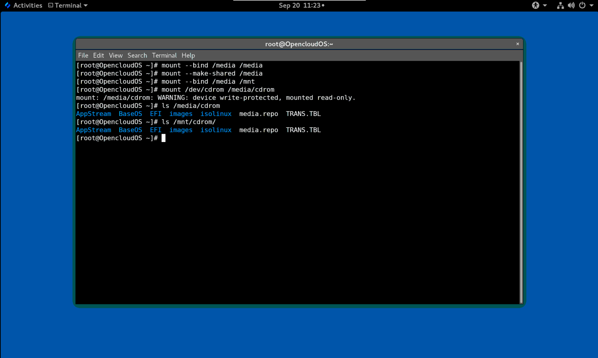

## 29.4 创建从属挂载点副本

此过程将安装点复制为从属安装类型。您稍后在原始挂载点下挂载的文件系统会反映在副本中，但反之则不会。

**流程**

1. 从原始挂载点创建一个虚拟文件系统 (VFS) 节点：
   
   ```
   # mount --bind original-dir original-dir
   ```

2. 将原始挂载点标记为共享：
   
   ```
   # mount --make-shared original-dir
   ```
   
   或者，要更改选定挂载点及其下所有挂载点的挂载类型，请使用 `--make-rshared` 选项而不是 `--make-shared`。

3. 创建副本，并将其标记为 `slave` 类型：
   
   ```
   # mount --bind original-dir duplicate-dir
   # mount --make-slave duplicate-dir
   ```

> **例 29.3 将 /media 复制到 /mnt 作为从属挂载点**
> 
> 此示例说明如何使 `/media` 目录的内容也出现在 `/mnt` 中，但 `/mnt` 目录中没有任何挂载以反映在 `/media` 中。
> 
> 1. 从 `/media` 目录创建 VFS 节点：
>    
>    ```
>    # mount --bind /media /media
>    ```
> 
> 2. 将 `/media` 目录标记为共享：
>    
>    ```
>    # mount --make-shared /media
>    ```
> 
> 3. 在 `/mnt` 中创建其副本，并将其标记为 `slave` ：
>    
>    ```
>    # mount --bind /media /mnt
>    # mount --make-slave /mnt
>    ```
> 
> 4. 现在可以验证 `/media` 中的挂载是否也出现在 `/mnt` 中。例如，如果 CD-ROM 驱动器包含非空介质并且 `/media/cdrom` 目录存在，请使用：
>    
>    ```
>    # mount /dev/cdrom /media/cdrom
>    # ls /media/cdrom
>    AppStream  BaseOS  EFI  images  isolinux  media.repo  TRANS.TBL
>    # ls /mnt/cdrom
>    AppStream  BaseOS  EFI  images  isolinux  media.repo  TRANS.TBL
>    ```
> 
> 5. 同样，可以验证挂载在 `/mnt` 目录中的任何文件系统是否反映在 `/media` 中。例如，如果插入了使用 `/dev/sdc` 设备的非空 USB 闪存并且存在 `/mnt/flashdisk/` 目录，请使用：
>    
>    ```
>    # mount /dev/sdc1 /mnt/flashdisk
>    # ls /media/flashdisk
>    en-US  publican.cfg
>    # ls /mnt/flashdisk
>    en-US  publican.cfg
>    ```


## 29.5 防止挂载点被复制

此过程将挂载点标记为不可绑定，因此无法将其复制到另一个挂载点。

**流程**

- 要将挂载点的类型更改为不可绑定的挂载，请使用：
  
  ```
  # mount --bind mount-point mount-point
  # mount --make-unbindable mount-point
  ```
  
   或者，要更改所选挂载点及其下所有挂载点的挂载类型，请使用 `--make-runbindable` 选项而不是 `--make-unbindable`。
  
   任何后续复制此挂载的尝试都会失败，并出现以下错误：
  
  ```
  #  mount --bind mount-point duplicate-dir
  
  mount: wrong fs type, bad option, bad superblock on mount-point,
  missing codepage or helper program, or other error
  In some cases useful info is found in syslog - try
  dmesg | tail  or so
  ```
  
  > **例 29.4 防止 /media 被复制**
  > 
  > - 要防止 `/media` 目录被共享，请使用：
  >   
  >   ```
  >   # mount --bind /media /media
  >   # mount --make-unbindable /media
  >   ```

# 第 30 章 永久挂载文件系统

作为系统管理员，您可以永久挂载文件系统以配置不可移动存储。

## 30.1 /etc/fstab 文件

本节介绍 /etc/fstab 配置文件，它控制文件系统的永久挂载点。使用 `/etc/fstab` 是永久挂载文件系统的推荐方法。

`/etc/fstab` 文件中的每一行都定义了一个文件系统的挂载点。它包括由空格分隔的六个字段：

1. 由持久属性或 `/dev` 目录的路径标识的块设备。
2. 将挂载设备的目录。
3. 设备上的文件系统。
4. 文件系统的挂载选项。选项 `defaults` 表示分区在启动时使用默认选项挂载。本节还识别 `x-systemd.option` 格式的 `systemd` 挂载单元选项。
5. `dump` 工具的备份选项。
6. `fsck` 工具的检查顺序。

> **例 30.1 `/etc/fstab` 中的 `/boot` 文件系统**
> 
> | **块设备**                                     | **挂载点** | **文件系统** | **选项**     | **备份** | **检查** |
> | ------------------------------------------- | ------- | -------- | ---------- | ------ | ------ |
> | `UUID=15cd6646-bff7-4bbd-90a3-b6f232047a84` | `/boot` | `xfs`    | `defaults` | `0`    | `0`    |


`systemd` 服务从 `/etc/fstab` 中的条目自动生成挂载单元。

## 30.2 将文件系统添加到 /etc/fstab

此过程描述了如何在 `/etc/fstab` 配置文件中为文件系统配置永久挂载点。

**流程**

1. 找出文件系统的 UUID 属性：
   
   ```
   $ lsblk --fs storage-device
   ```
   
   例如：
   
   > **例 30.2 查看分区的 UUID**
   > 
   > $ lsblk --fs /dev/vda1
   > 
   > NAME FSTYPE LABEL UUID                                 MOUNTPOINT
   > vda1 xfs          15cd6646-bff7-4bbd-90a3-b6f232047a84 /boot


2. 如果挂载点目录不存在，则创建它：
   
   ```
   # mkdir --parents mount-point
   ```

3. 以 root 身份编辑 `/etc/fstab` 文件并为文件系统添加一行，由 UUID 标识。
   
   例如：
   
   > **例 30.3 /etc/fstab 中的 /boot 挂载点**
   > 
   > ```
   > UUID=15cd6646-bff7-4bbd-90a3-b6f232047a84 /boot xfs defaults 0 0
   > ```

4. 重新生成安装单元，以便您的系统注册新配置：
   
   ```
   # systemctl daemon-reload
   ```

5. 尝试挂载文件系统以验证配置是否有效：
   
   ```
   # mount mount-point
   ```

# 31 使用 RHEL 系统角色持久挂载文件系统

本节介绍如何使用 `storage` 角色持久挂载文件系统。

**前提条件**

- 存在使用 `storage` 角色的 Ansible playbook。

## 31.1 持久挂载文件系统的示例 Ansible playbook

本节提供了一个示例 Ansible 剧本。本手册应用 Storage 角色来立即且持久地挂载 XFS 文件系统。

> **例 31.1 将 /dev/sdb 上的文件系统挂载到 /mnt/data 的剧本**
> 
> ```
> ---
> - hosts: all
>   vars:
>     storage_volumes:
>       - name: barefs
>         type: disk
>         disks:
>           - vdb
>         fs_type: xfs
>         mount_point: /mnt/data
>   roles:
>     - rhel-system-roles.storage
> ```

- 此 playbook 将文件系统添加到 `/etc/fstab` 文件中，并立即挂载文件系统。
- 如果 `/dev/sdb` 设备上的文件系统或挂载点目录不存在，则 playbook 会创建它们。

# 第 32 章 按需挂载文件系统

作为系统管理员，您可以将NFS等文件系统配置为按需自动挂载。

## 32.1 autofs 服务

本节介绍 `autofs` 服务的优点和基本概念，用于按需挂载文件系统。

使用 `/etc/fstab` 配置进行永久挂载的一个缺点是，无论用户访问挂载文件系统的频率如何，系统都必须使用资源来保持挂载文件系统就位。例如，当系统同时将 NFS 挂载到多个系统时，这可能会影响系统性能。

`/etc/fstab` 的替代方法是使用基于内核的 `autofs` 服务。它由以下组件组成：

- 实现文件系统的内核模块
- 执行所有其他功能的用户空间服务。

`autofs` 服务可以根据需求自动挂载和卸载文件系统，从而节省系统资源。可用于挂载NFS、AFS、SMBFS、CIFS、本地文件系统等文件系统。

## 32.2 autofs 配置文件

本节介绍 `autofs` 服务使用的配置文件的用法和语法。

**主映射文件**

`autofs` 服务使用 `/etc/auto.master`（主映射）作为其默认的主配置文件。这可以通过使用 `/etc/autofs.conf` 配置文件中的 `autofs` 配置以及名称服务切换 (NSS) 机制来更改为使用另一个受支持的网络源和名称。

必须在主映射中配置所有 on-demand 挂载点。挂载点、主机名、导出目录和选项都可以在一组文件（或其他支持的网络源）中指定，而不是为每个主机手动配置它们。

主映射文件列出了由 `autofs` 控制的挂载点，以及它们对应的配置文件或被称为自动挂载映射的网络源。master 映射格式如下：

```
mount-point  map-name  options
```

此格式中使用的变量是：

***mount-point***

  `autofs` 挂载点；例如，`/mnt/data` 。

***map-file***

  映射源文件，其中包含挂载点列表和应挂载这些挂载点的文件系统位置。

***options***

  如果提供，这些将应用于给定映射中的所有条目（如果它们本身没有指定选项）。

> **例 32.1 /etc/auto.master 文件**
> 
> 以下是 `/etc/auto.master` 文件中的示例行：
> 
> /mnt/data  /etc/auto.data

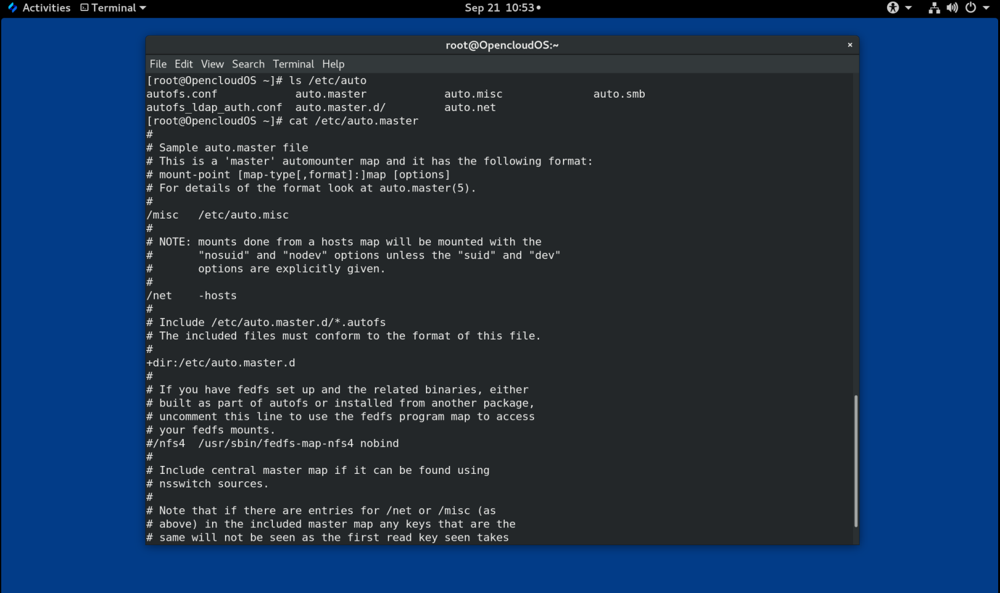

**映射文件**

映射文件配置各个 on-demand 挂载点的属性。

如果目录不存在，自动挂载程序会创建这些目录。如果目录在自动挂载程序启动之前就存在，则自动挂载程序在退出时不会删除它们。如果指定了超时，则如果在超时期限内未访问目录，则会自动卸载该目录。

映射的一般格式类似于主映射。但是，options 字段出现在挂载点和位置之间，而不是在 master 映射那样的条目末尾：

```
mount-point  options  location
```

此格式中使用的变量是：

***mount-point***

这是指 `autofs` 挂载点。这可以是间接挂载的单个目录名称，也可以是直接挂载的挂载点的完整路径。每个直接和间接映射条目键（挂载点）后面可以跟一个空格分隔的偏移目录列表（每个以 `/` 开头的子目录名称），这就是所谓的多挂载条目。

***options***

提供时，这些选项将附加到主映射条目选项（如果有），或者如果配置条目 `append_options` 设置为 `no`，则使用这些选项代替主映射选项。

***location***

这指的是文件系统位置，例如本地文件系统路径（对于以 `/` 开头的映射名称，前面带有 Sun 映射格式转义字符 `：`）、NFS 文件系统或其他有效的文件系统位置。

> **例 32.2 映射文件**
> 
> 以下是映射文件（例如 `/etc/auto.misc` ）中的一个示例：
> 
> ```
> payroll  -fstype=nfs4  personnel:/exports/payroll
> sales    -fstype=xfs   :/dev/hda4
> ```
> 
> 映射文件中的第一列表示 `autofs` 挂载点：来自名为 `personnel` 的服务器的 `sales` 和 `payroll` 。第二列表示 `autofs` 挂载的选项。第三列表示挂载的来源。
> 
> 按照给定的配置，`autofs` 挂载点将是 `/home/payroll` 和 `/home/sales`。 `-fstype=` 选项通常被省略并且如果文件系统是 NFS 则不需要，如果系统默认 NFSv4 为 NFS 挂载，则包括 NFSv4 的挂载。
> 
> 使用给定的配置，如果进程需要访问 `autofs` 未挂载的目录，例如 `/home/payroll/2006/July.sxc`，那么 `autofs` 服务会自动挂载该目录。

**amd 映射格式**

`autofs` 服务也可以识别 `amd` 格式的映射配置。如果您想重复使用为 `am-utils` 服务编写的现有的自动挂载程序配置（该服务已删除），这将非常有用。

但是，这里建议使用前面章节中描述的更简单的 `autofs` 格式。

## 32.3 配置 autofs 挂载点

此过程描述如何使用 `autofs` 服务配置按需挂载点。

**前提条件**

- 安装 `autofs` 包：

```
# yum install autofs
```

- 启动并启用 `autofs` 服务：

```
# systemctl enable --now autofs
```

**流程**

1. 为位于 `/etc/auto.identifier` 的按需挂载点创建一个映射文件。将 *identifier* 替换为标识安装点的名称。

2. 在映射文件中，按照 [autofs 配置文件](#322-autofs-配置文件)部分中的说明填写挂载点、选项和位置字段。

3. 在主映射文件中注册映射文件，如 [autofs 配置文件](#322-autofs-配置文件)部分所述。

4. 允许服务重新读取配置，这样它就可以管理新配置的 `autofs` 挂载：
   
   ```
   # systemctl reload autofs.service
   ```

5. 尝试访问按需目录中的内容：
   
   ```
   # ls automounted-directory
   ```

## 32.4 使用 autofs 服务自动挂载 NFS 服务器用户主目录

此过程描述如何配置 autofs 服务以自动挂载用户主目录。

**前提条件**

- **autofs** 软件包已安装。
- **autofs** 服务已启用并正在运行。

**流程**

1. 通过在需要挂载用户主目录的服务器上编辑 `/etc/auto.master` 文件来指定映射文件的挂载点和位置。为此，将以下行添加到 `/etc/auto.master` 文件中：
   
   ```
   /home /etc/auto.home
   ```

2. 在需要挂载用户主目录的服务器上创建名为 `/etc/auto.home` 的映射文件，并使用以下参数编辑该文件：
   
   ```
   * -fstype=nfs,rw,sync host.example.com:/home/&
   ```
   
   您可以跳过 *`fstype`* 参数，因为它默认为 *`nfs`*。有关详细信息，请参阅 `autofs(5)` 手册页。

3. 重新加载 `autofs` 服务：
   
   ```
   # systemctl reload autofs
   ```

## 32.5 覆盖或扩充 autofs 站点配置文件

有时覆盖客户端系统上特定挂载点的站点默认值很有用。

> **例 32.3 初始条件**
> 
> 例如，考虑以下条件：
> 
> - Automounter 映射存储在 NIS 中，`/etc/nsswitch.conf` 文件具有以下指令：
>   
>   ```
>   automount:    files nis
>   ```
> 
> - `auto.master` 文件包含：
>   
>   ```
>   +auto.master
>   ```
> 
> - NIS `auto.master` 映射文件包含：
>   
>   ```
>   /home auto.home
>   ```
> 
> - NIS `auto.home` 地图包含：
>   
>   ```
>   beth    fileserver.example.com:/export/home/beth
>   joe     fileserver.example.com:/export/home/joe
>   *       fileserver.example.com:/export/home/&
>   ```
> 
> - `autofs` 配置选项 `BROWSE_MODE` 设置为 `yes`：
>   
>   ```
>   BROWSE_MODE="yes"
>   ```

- 文件映射 `/etc/auto.home` 不存在。

**流程**

本节描述从不同服务器挂载主目录和仅使用选定条目扩充 `auto.home` 的示例。

> **例 32.4 从不同的服务器挂载主目录**
> 
> 根据上述条件，假设客户端系统需要覆盖 NIS 映射 `auto.home` 并从不同的服务器挂载主目录。
> 
> - 在这种情况下，客户端需要使用以下 `/etc/auto.master` 映射：
>   
>   ```
>   /home ­/etc/auto.home
>   +auto.master
>   ```
> 
> - /etc/auto.home 映射包含以下条目：
>   
>   ```
>   *    host.example.com:/export/home/&
>   ```
> 
> 因为自动挂载程序只处理第一次出现的挂载点，所以 `/home` 目录包含 `/etc/auto.home` 的内容，而不是 NIS `auto.home` 映射。

> **例 32.5 仅使用选定条目增强 auto.home**
> 
> 或者，用几个条目来扩充站点范围的 `auto.home` 地图：
> 
> 1. 创建一个 `/etc/auto.home` 文件映射，并在其中放入新条目。最后，包括 NIS `auto.home` 映射。然后 `/etc/auto.home` 文件映射类似于：
>    
>    ```
>    mydir someserver:/export/mydir
>    +auto.home
>    ```
> 
> 2. 使用这些 NIS `auto.home` 映射条件，列出 `/home` 目录输出的内容：
>    
>    ```
>    $ ls /home
>    
>    beth joe mydir
>    ```
> 
> 最后一个示例按预期工作，因为 `autofs` 不包含与其正在读取的文件同名的文件映射的内容。因此，`autofs` 将移至 `nsswitch` 配置中的下一个映射源。

## 32.6 使用 LDAP 存储自动挂载映射

此过程将 `autofs` 配置为将自动挂载程序映射存储在 LDAP 配置中，而不是存储在 `autofs` 映射文件中。

**前提条件**

- 必须在所有配置的系统中安装 LDAP 客户端程序库，以便从 LDAP 检索自动挂载器映射。在 OpenCloud OS 上，`openldap` 软件包应该作为 `autofs` 软件包的依赖项自动安装。

**流程**

1. 要配置 LDAP 访问，请修改 `/etc/openldap/ldap.conf` 文件。确保为您的站点正确设置了 `BASE`、`URI` 和 `schema` 选项。
2. `rfc2307bis` 草案描述了最近建立的用于在 LDAP 中存储自动挂载映射的模式。要使用此模式，请通过从模式定义中删除注释字符在 `/etc/autofs.conf` 配置文件中进行设置。例如：

>    **例 32.6 设置 autofs 配置**
> 
> ```
> DEFAULT_MAP_OBJECT_CLASS="automountMap"
> DEFAULT_ENTRY_OBJECT_CLASS="automount"
> DEFAULT_MAP_ATTRIBUTE="automountMapName"
> DEFAULT_ENTRY_ATTRIBUTE="automountKey"
> DEFAULT_VALUE_ATTRIBUTE="automountInformation"
> ```

3. 确保在配置中注释了所有其他模式条目。 `rfc2307bis` 架构的 `automountKey` 属性替换了 `rfc2307` 架构的 `cn` 属性。以下是 LDAP 数据交换格式 (LDIF) 配置的示例：

>    **例 32.7 LDIF 配置**
> 
> ```
> # auto.master, example.com
> dn: automountMapName=auto.master,dc=example,dc=com
> objectClass: top
> objectClass: automountMap
> automountMapName: auto.master
> 
> # /home, auto.master, example.com
> dn: automountMapName=auto.master,dc=example,dc=com
> objectClass: automount
> automountKey: /home
> automountInformation: auto.home
> 
> # auto.home, example.com
> dn: automountMapName=auto.home,dc=example,dc=com
> objectClass: automountMap
> automountMapName: auto.home
> 
> # foo, auto.home, example.com
> dn: automountKey=foo,automountMapName=auto.home,dc=example,dc=com
> objectClass: automount
> automountKey: foo
> automountInformation: filer.example.com:/export/foo
> 
> # /, auto.home, example.com
> dn: automountKey=/,automountMapName=auto.home,dc=example,dc=com
> objectClass: automount
> automountKey: /
> automountInformation: filer.example.com:/export/&
> ```

## 32.7 使用 systemd.automount 通过 /etc/fstab 按需挂载文件系统

此过程显示了在 `/etc/fstab` 中定义挂载点时如何使用自动挂载 systemd 单元按需挂载文件系统。您必须为每个挂载添加一个自动挂载单元并启用它。

**流程**

1. 添加所需的 fstab 条目，如[第 30 章持久挂载文件系统](#第-30-章-永久挂载文件系统)所述。例如：
   
   ```
   /dev/disk/by-id/da875760-edb9-4b82-99dc-5f4b1ff2e5f4 /mount/point xfs defaults 0 0
   ```

2. 将 `x-systemd.automount` 添加到上一步中创建的条目的 opyions 字段。

3. 加载新创建的单元，以便您的系统注册新配置：
   
   ```
   # systemctl daemon-reload
   ```

4. 启动自动挂载单元：
   
   ```
   # systemctl start mount-point.automount
   ```

**验证**

1. 检查 `mount-point.automount` 是否正在运行：
   
   ```
   # systemctl status mount-point.automount
   ```

2. 检查自动挂载的目录是否有所需的内容：
   
   ```
   # ls /mount/point
   ```

## 32.8 使用 systemd.automount 通过挂载单元按需挂载文件系统

此过程显示了当挂载点由挂载单元定义时，如何使用自动挂载 systemd 单元按需挂载文件系统。您必须为每个挂载添加一个自动安装单元并启用它。

**流程**

1. 创建一个挂载单元。例如：
   
   ```
   mount-point.mount
   [Mount]
   What=/dev/disk/by-uuid/f5755511-a714-44c1-a123-cfde0e4ac688
   Where=/mount/point
   Type=xfs
   ```

2. 创建一个与挂载单元同名但扩展名为 `.automount` 的单元文件。

3. 打开文件并创建一个 `[Automount]` 部分。将 `Where=` 选项设置为挂载路径：
   
   ```
   [Automount]
   Where=/mount/point
   [Install]
   WantedBy=multi-user.target
   ```

4. 加载新创建的单元，以便您的系统注册新配置：
   
   ```
   # systemctl daemon-reload
   ```

5. 启用并启动自动挂载单元：
   
   ```
   # systemctl enable --now mount-point.automount
   ```

**验证**

1. 检查 `mount-point.automount` 是否正在运行：
   
   ```
   # systemctl status mount-point.automount
   ```

2. 检查自动挂载的目录是否有所需的内容：
   
   ```
   # ls /mount/point
   ```

# 第 33 章 使用 IdM 的 SSSD 组件缓存 autofs 映射

系统安全服务守护程序 (SSSD) 是一种用于访问远程服务目录和身份验证机制的系统服务。数据缓存在网络连接缓慢的情况下很有用。要将 SSSD 服务配置为缓存 autofs 映射，请按照本节中的以下步骤来进行操作。

## 33.1 手动配置 autofs 将 IdM 服务器用作 LDAP 服务器

此过程显示如何配置 `autofs` 以将 IdM 服务器用作 LDAP 服务器。

**流程**

1. 编辑 `/etc/autofs.conf` 文件以指定 `autofs` 搜索的模式属性：
   
   ```
   #
   # Other common LDAP naming
   #
   map_object_class = automountMap
   entry_object_class = automount
   map_attribute = automountMapName
   entry_attribute = automountKey
   value_attribute= automountInformation
   ```
   
   > **注意**
   > 
   > 用户可以在 `/etc/autofs.conf` 文件中以小写和大写的形式写入属性。


2. （可选）指定 LDAP 配置。有两种方法可以做到这一点。最简单的方法是让自动挂载服务自行发现 LDAP 服务器和位置：
   
   ```
   ldap_uri = "ldap:///dc=example,dc=com"
   ```
   
   *此选项要求 DNS 包含可发现服务器的 SRV 记录。*
   
   或者，明确设置要使用的 LDAP 服务器和 LDAP 搜索的基本 DN：
   
   ```
   ldap_uri = "ldap://ipa.example.com"
   search_base = "cn=location,cn=automount,dc=example,dc=com"
   ```

3. 编辑 `/etc/autofs_ldap_auth.conf` 文件，以便 autofs 允许客户端使用 IdM LDAP 服务器进行身份验证。
   
   - 将 `authrequired` 更改为 yes。
   - 将主体设置为 IdM LDAP 服务器（ *host/fqdn@REALM* ）的 Kerberos 主机主体。主体名称用于连接到 IdM 目录，作为 GSS 客户端身份验证的一部分。
   
   ```
   <autofs_ldap_sasl_conf
        usetls="no"
        tlsrequired="no"
        authrequired="yes"
        authtype="GSSAPI"
        clientprinc="host/server.example.com@EXAMPLE.COM"
   />
   ```
   
   如有必要，运行 `klist -k` 以获取准确的主机主体信息。


## 33.2 配置 SSSD 缓存 autofs 映射

SSSD 服务可用于缓存存储在 IdM 服务器上的 `autofs` 映射，而无需配置 autofs 来使用 IdM 服务器。

**前提条件**

- 已安装 `sssd` 软件包。

**流程**

1. 打开 SSSD 配置文件：
   
   ```
   # vim /usr/lib64/sssd/conf/sssd.conf
   ```

2. 将 `autofs` 服务添加到 SSSD 处理的服务列表中。
   
   ```
   [sssd]
   services = nss, pam, autofs
   domains = shadowutils
   ```

3. 创建一个新的 `[autofs]` 部分。您可以将此留空，因为 `autofs` 服务的默认设置适用于大多数基础架构。
   
   ```
   [nss]
   
   [pam]
   
   [sudo]
   
   [autofs]
   ```
   
   有关详细信息，请参阅 `sssd.conf` 手册页。

4. （可选）设置 `autofs` 条目的搜索库。默认情况下，这是 LDAP 搜索库。
   
   ```
   [domain/shadowutils]
   id_provider = files
   
   auth_provider = proxy
   proxy_pam_target = sssd-shadowutils
   
   proxy_fast_alias = True
   ```

5. 重启 SSSD 服务：
   
   ```
   # systemctl restart sssd.service
   ```

6. 检查 `/etc/nsswitch.conf` 文件，以便将 SSSD 列为自动挂载配置的源：
   
   ```
   automount: sss files
   ```

7. 重启 `autofs` 服务：
   
   ```
   # systemctl restart autofs.service
   ```

8. 通过列出用户的 /home 目录来测试配置，假设 /home 有一个主映射条目：
   
   ```
   # ls /home/username
   ```

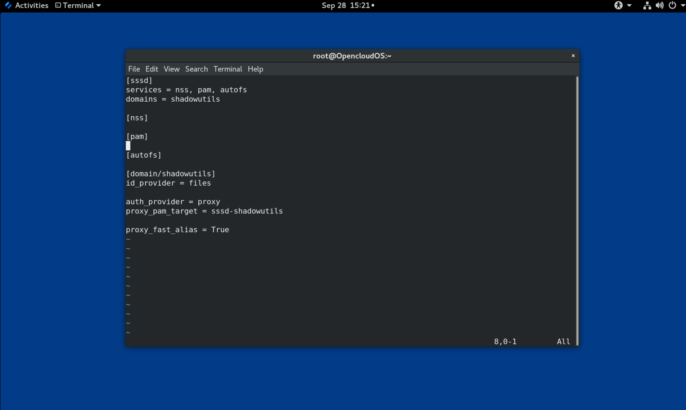

如果这没有挂载远程文件系统，请检查 `/var/log/messages` 文件是否有错误。如有必要，通过将 `logging` 参数设置为 `debug` 来提高 `/etc/sysconfig/autofs` 文件中的 debug 级别。

# 第 34 章 为根文件系统设置只读权限

有时，您需要使用只读权限挂载根文件系统 (`/`)。示例用例包括在系统意外断电后增强安全性或确保数据完整性。

## 34.1 始终保留写入权限的文件和目录

为使系统正常运行，某些文件和目录需要保留写入权限。当根文件系统以只读模式挂载时，这些文件使用 `tmpfs` 临时文件系统挂载在 RAM 中。

此类文件和目录的默认集合是从 `/etc/rwtab` 文件中读取的。请注意，需要 `readonly-root` 软件包才能在您的系统中存在此文件。

```
dirs    /var/cache/man
dirs    /var/gdm
<content truncated>

empty    /tmp
empty    /var/cache/foomatic
<content truncated>

files    /etc/adjtime
files    /etc/ntp.conf
<content truncated>
```

`/etc/rwtab` 文件中的条目遵循以下格式：

```
copy-method    path
```

在这种语法中：

- 将 copy-method 替换为指定如何将文件或目录复制到 tmpfs 的关键字之一。
- 将路径替换为文件或目录的路径。

`/etc/rwtab` 文件识别以下可以将文件或目录复制到 `tmpfs` 的方式：

**`empty`**

  将空路径复制到 tmpfs。例如：

```
empty /tmp
```

**`dirs`**

  空目录树被复制到 tmpfs 。例如：

```
dirs /var/run
```

**`files`**

  文件或目录树原封不动地复制到 `tmpfs`。例如：

```
files /etc/resolv.conf
```

在 `/etc/rwtab.d/` 添加自定义路径时，也适用相同的格式。

## 34.2 将根文件系统配置为在引导时以只读权限挂载

使用此过程，根文件系统在所有后续引导时都以只读方式挂载。

**流程**

1. 在 `/etc/sysconfig/readonly-root` 文件中，将 `READONLY` 选项设置为 `yes`：
   
   ```
   # Set to 'yes' to mount the file systems as read-only.
   READONLY=yes
   ```

2. 在 /`etc/fstab` 文件的根条目 (`/`) 中添加 `ro` 选项：
   
   ```
   /dev/mapper/luks-c376919e... / xfs x-systemd.device-timeout=0,ro 1 1
   ```

3. 将 ro 选项添加到 `/etc/default/grub` 文件中的 `GRUB_CMDLINE_LINUX` 指令中，并确保该指令不包含 `rw`：
   
   ```
   GRUB_CMDLINE_LINUX="rhgb quiet... ro"
   ```

4. 重新创建 GRUB2 配置文件。
   
   - 对于旧版 BIOS 系统：
   
   ```
   # grub2-mkconfig -o /boot/grub2/grub.cfg
   ```
   
   - 对于 UEFI 系统：
   
   ```
   # grub2-mkconfig -o /boot/efi/EFI/redhat/grub.cfg
   ```

5. 如果您需要在 `tmpfs` 文件系统中添加以写入权限挂载的文件和目录，请在 `/etc/rwtab.d/` 目录中创建一个文本文件并将配置放在那里。
   
   例如，要挂载具有写入权限的 `/etc/example/file` 文件，请将此行添加到 `/etc/rwtab.d/example` 文件中：
   
   ```
   files /etc/example/file
   ```

> **重要**
> 
> 对 `tmpfs` 中的文件和目录所做的更改不会在启动后持保留。

6. 重新启动系统，应用更改。

**故障排除**

- 如果您错误地使用只读权限挂载了根文件系统，您可以使用以下命令再次以读写权限重新挂载它：
  
  ```
  # mount -o remount,rw /
  ```

# 第 35 章 使用配额限制 XFS 上的存储空间使用

您可以通过磁盘配额来限制用户或组可用的磁盘空间量。您还可以定义警告级别，用于在用户消耗过多磁盘空间或分区已满之前通知系统管理员。

XFS 配额子系统管理磁盘空间（块）和文件（inode）使用的限制。 XFS 配额控制或报告这些项目在用户、组、目录或项目级别的使用情况。组和项目只适用于旧的非默认 XFS 磁盘格式。

在按目录或按项目进行管理时，XFS 管理与特定项目相关的目录层次结构的磁盘使用情况。

## 35.1 磁盘配额

在大多数计算环境中，磁盘空间不是无限的。配额子系统提供了一种控制磁盘空间使用的机制。

您可以为单个用户以及本地文件系统上的用户组配置磁盘配额。这使得可以将分配给用户特定文件（例如电子邮件）的空间与分配给用户工作的项目的空间分开管理。配额子系统会在用户超过分配的限制时发出警告，但会为当前的工作留出一些额外空间（硬限制/软限制）。

如果执行了配额，您需要检查是否超出配额并确保配额准确。如果用户反复超出配额或持续达到软限制，系统管理员可以帮助用户确定如何使用更少的磁盘空间或增加用户的磁盘配额。

您可以设置配额来控制：

- 消耗的磁盘块数。
- inode 的数量，它们是包含有关 UNIX 文件系统中的文件信息的数据结构。因为 inode 存储与文件相关的信息，所以可以控制可创建的文件数量。

## 35.2 xfs_quota 工具

您可以使用 `xfs_quota` 工具来管理 XFS 文件系统上的配额。此外，您可以将限制强制关闭的 XFS 文件系统用作有效的磁盘使用统计系统。

XFS 配额系统在许多方面与其他文件系统不同。最重要的是，XFS 将配额信息视为文件系统元数据，并使用日志来提供更高级别的一致性保证。

## 35.3 XFS 中的文件系统配额管理

XFS 配额子系统管理磁盘空间（块）和文件（inode）使用的限制。 XFS 配额控制或报告这些项目在用户、组、目录或项目级别的使用情况。组和项目配额仅在较旧的非默认 XFS 磁盘格式上是互斥的。

在按目录或按项目进行管理时，XFS 管理与特定项目相关的目录层次结构的磁盘使用情况。

## 35.4 为 XFS 启用磁盘配额

此过程为 XFS 文件系统上的用户、组和项目启用磁盘配额。启用配额后，`xfs_quota` 工具可用于设置限制并报告磁盘使用情况。

**流程**

1. 为用户启用配额：
   
   ```
   # mount -o uquota /dev/vdb1 /boot
   ```
   
   将 `uquota` 替换为 `uqnoenforce` ，允许使用报告而不强制执行任何限制。

2. 为组启用配额：
   
   ```
   # mount -o gquota /dev/vdb1 /boot
   ```
   
   将 `gquota` 替换为 `gqnoenforce` ，允许使用报告而不强制执行任何限制。

3. 为项目启用配额：
   
   ```
   # mount -o pquota /dev/vdb1 /boot
   ```
   
   将 `pquota` 替换为 `pqnoenforce` ，允许使用报告而不强制执行任何限制。

4. 或者，在 `/etc/fstab` 文件中包含配额挂载选项。以下示例显示 `/etc/fstab` 文件中的条目用来分别在 XFS 文件系统上为用户、组和项目启用配额。这些示例还使用读/写权限挂载文件系统：
   
   ```
   # vim /etc/fstab
   /dev/vdb1 /boot xfs rw,quota 0 0
   /dev/vdb1 /boot xfs rw,gquota 0 0
   /dev/vdb1 /boot xfs rw,prjquota 0 0
   ```

## 35.5 报告 XFS 使用情况

您可以使用 `xfs_quota` 工具设置限制并报告磁盘使用情况。默认情况下，`xfs_quota` 以交互方式运行，并且以基本模式运行。基本模式子命令仅报告使用情况，并且可供所有用户使用。

**前提条件**

- 已为 XFS 文件系统启用配额。请参阅为[为 XFS 启用磁盘配额](#354-为-xfs-启用磁盘配额)。

**流程**

1. 启动 `xfs_quota` shell：
   
   ```
   # xfs_quota
   ```

2. 显示给定用户的使用情况和限制：
   
   ```
   # xfs_quota> username
   ```

3. 显示块和 inode 的可用和已用数量：
   
   ```
   # xfs_quota> df
   ```

4. 运行 help 命令以显示 `xfs_quota` 可用的基本命令。
   
   ```
   # xfs_quota> help
   ```

5. 指定 `q` 以退出 `xfs_quota`。
   
   ```
   #xfs_quota> q
   ```
   
   

## 35.6 修改 XFS 配额限制

使用 `-x` 选项启动 `xfs_quota` 工具，启用专家模式并运行允许修改配额系统的管理员命令。此模式的子命令允许实际配置限制，并且仅对具有提升权限的用户可用。

**前提条件**

- 已为 XFS 文件系统启用配额。请参阅[为 XFS 启用磁盘配额](#354-为-xfs-启用磁盘配额)。

**流程**

1. 使用 `-x` 选项启动 `xfs_quota shell` 以启用专家模式：
   
   ```
   # xfs_quota -x
   ```

2. 报告具体文件系统的配额信息：
   
   ```
   # xfs_quota> report /path
   ```
   
   例如，要显示 `/home`（在 `/dev/blockdevice` 上）的示例配额报告，请使用命令 `report -h /home`。这将显示类似于以下内容的输出：
   
   ```
   User quota on /home (/dev/blockdevice)
   Blocks
   User ID      Used   Soft   Hard Warn/Grace
   ---------- ---------------------------------
   root            0      0      0  00 [------]
   testuser   103.4G      0      0  00 [------]
   ```

3. 修改配额限制：
   
   ```
   # xfs_quota> limit isoft=500m ihard=700m user /path
   ```
   
   例如，要将主目录为 `/home/john` 的用户 `john` 将软硬 inode 数限制为 500 和 700 ，请使用以下命令：
   
   ```
   # xfs_quota -x -c 'limit isoft=500 ihard=700 john' /home/
   ```
   
   在这种情况下，传递 `mount_point` ，它是已挂载的 xfs 文件系统。

4. 运行 help 命令以显示 `xfs_quota -x` 可用的专家命令：
   
   ```
   # xfs_quota> help
   ```

## 35.7 为 XFS 设置项目限制

此过程配置控制项目的目录的限制。

**流程**

1. 将项目控制的目录添加到 `/etc/projects`。例如，下面将唯一 ID 为 11 的 `/var/log` 路径添加到 `/etc/projects`。您的项目 ID 可以是映射到您的项目的任何数值。
   
   ```
   # echo 11:/var/log >> /etc/projects
   ```

2. 将项目名称添加到 `/etc/projid` ，将项目 ID 映射到项目名称。例如，以下命令将名为 `Logs` 的项目与上一步中定义的项目 ID 11 相关联。
   
   ```
   # echo Logs：11 >> /etc/projid
   ```

3. 初始化项目目录。例如，以下初始化项目目录 `/var`：
   
   ```
   # xfs_quota -x -c 'project -s logfiles' /var
   ```

4. 为具有初始化目录的项目配置配额：
   
   ```
   # xfs_quota -x -c 'limit -p bhard=lg logfiles' /var
   ```

# 第 36 章 使用配额限制 ext4 上的存储空间使用

您必须先在系统上启用磁盘配额，然后才能分配它们。您可以为每个用户、每个组或每个项目分配磁盘配额。但是，如果设置了软限制，您可以在可配置的时间段内超过这些配额（称为宽限期）。

## 36.1 安装配额工具

您必须安装 `quota` RPM 包才能实现磁盘配额。

**流程**

- 安装 `quota` 包：
  
  ```
  # yum install quota
  ```

## 36.2 在创建文件系统时启用配额功能

此过程描述如何在创建文件系统时启用配额。

**流程**

1. 在文件系统创建时启用配额：
   
   ```
   # mkfs.ext4 -O quota /dev/vdb
   ```
   
   > **注意**
   > 
   > 默认情况下，仅启用和初始化用户和组配额。

2. 更改文件系统创建的默认值：
   
   ```
   # mkfs.ext4 -O quota -E quotatype=usrquota:grpquota:prjquota /dev/vdb
   ```

3. 挂载文件系统：
   
   ```
   # mount /dev/vdb
   ```
   
   

## 36.3 在现有文件系统上启用配额功能

此过程描述如何使用 `tune2fs` 命令在现有文件系统上启用配额功能。

**流程**

1. 卸载文件系统：
   
   ```
   # umount /dev/vdb
   ```

2. 在现有文件系统上启用配额：
   
   ```
   # tune2fs -O quota /dev/vdb
   ```
   
   > **注意**
   > 
   > 默认情况下仅初始化用户和组配额。

3. 更改默认值：
   
   ```
   # tune2fs -Q usrquota,grpquota,prjquota /dev/vdb
   ```

4. 挂载文件系统：
   
   ```
   # mount /dev/vdb
   ```
   
   

## 36.4 启用配额强制执行

挂载文件系统后默认启用配额记帐，无需任何其他选项，但不会强制执行配额。

**前提条件**

- 启用配额功能并初始化默认配额。

**流程**

- 通过 `quotaon` 为用户配额启用配额强制执行：
  
  ```
  # mount /dev/vdb /mnt
  # quota /mnt
  ```
  
  > **注意**
  > 
  > 可以使用 `usrquota`、`grpquota` 或 `prjquota` 挂载选项在挂载时启用配额强制。
  > 
  > ```
  > # mount -o usrquota,grpquota,prjquota /dev/vdb /mnt
  > ```

- 为所有文件系统启用用户、组和项目配额：
  
  ```
  # quotaon -vaugP
  ```
  
  - 如果未指定 `-u`、`-g` 或 `-P` 选项，则仅启用用户配额。
  - 如果仅指定 -g 选项，则仅启用组配额。
  - 如果仅指定 -P 选项，则仅启用项目配额。

- 为特定文件系统启用配额，例如 /home：
  
  ```
  # quotaon -vugP /home
  ```
  
  

## 36.5 为每个用户分配配额

使用 `edquota` 命令将磁盘配额分配给用户。

> **注意**
> 
> 由 `EDITOR` 环境变量定义的文本编辑器由 `edquota` 使用。要更改编辑器，请将 `~/.bash_profile` 文件中的 `EDITOR` 环境变量设置为您选择的编辑器的完整路径。

**前提条件**

- 在设置用户配额之前，用户必须存在。

**流程**

1. 为用户分配配额：
   
   ```
   # edquota username
   ```
   
   将用户名替换为您要为其分配配额的用户。
   
   例如，如果为 `/dev/vdb` 分区启用配额并执行命令 `edquota root`，系统配置的默认编辑器中会显示以下内容：
   
   ```
   Disk quotas for user root (uid 0):
   Filesystem                   blocks       soft       hard     inodes     soft     hard
   /dev/vdb                         20          0          0          2        0        0
   ```
   
   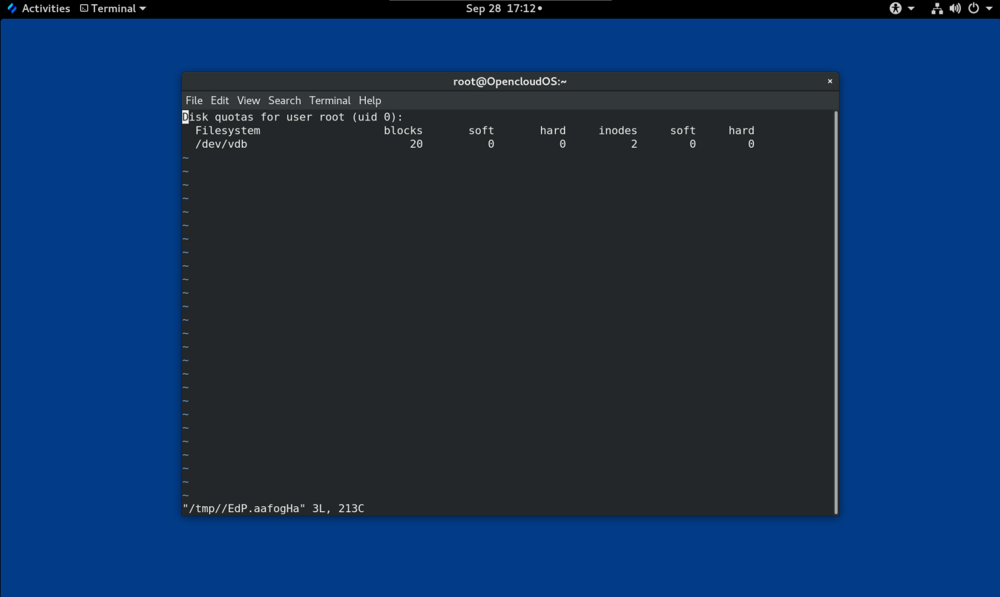

2. 更改所需的限制。
   
   如果任何值设置为 0，则不设置限制。在文本编辑器中更改它们。
   
   例如，下面显示了 root 的软限制和硬限制已分别设置为 5000 和 5500。
   
   ```
   Disk quotas for user root (uid 0):
   Filesystem                   blocks       soft       hard     inodes     soft     hard
   /dev/vdb                         20          5000          5500          2        0        0
   ```
   
   - 第一列是启用了配额的文件系统的名称。
   
   - 第二列显示用户当前使用了多少块。
   
   - 接下来的两列用于为文件系统上的用户设置软限制和硬限制。
   
   - `inodes` 列显示用户当前使用的 inode 数量。
   
   - 最后两列用于为文件系统上的用户设置软和硬 inode 限制。
     
     - 硬限制是用户或组可以使用的绝对最大磁盘空间量。一旦达到此限制，就不能再使用更多磁盘空间。
     - 软限制定义了可以使用的最大磁盘空间量。但是，与硬限制不同，软限制可以在一定时间内超出。该时间称为宽限期。宽限期可以用秒、分钟、小时、天、周或月表示。

**验证步骤**

- 验证用户的配额是否已设置：
  
  ```
  # quota -v root
  Disk quotas for user root (uid 0): 
     Filesystem  blocks   quota   limit   grace   files   quota   limit   grace
        /dev/vdb      20    5000    5500               2       0       0
  ```

## 36.6 为每个组分配配额

您可以按组分配配额。

**前提条件**

- 在设置组配额之前，组必须存在。

**流程**

1. 设置组配额：
   
   ```
   # edquota -g groupname
   ```
   
   例如，为 root 组设置组配额：
   
   ```
   # edquota -g root
   ```
   
   此命令在文本编辑器中显示组的现有配额：
   
   ```
   Disk quotas for group root (gid 0):
   Filesystem                   blocks       soft       hard     inodes     soft     hard
   /dev/vdb                         20          0          0          2        0        0
   ```

2. 修改限制并保存文件。

**验证步骤**

- 验证是否设置了组配额：
  
  ```
  # quota -vg groupname
  ```


## 36.7 为每个项目分配配额

此过程为每个项目分配配额。

**先决条件**

- 您的文件系统上启用了项目配额。

**流程**

1. 将项目控制的目录添加到 `/etc/projects`。例如，下面将唯一 ID 为 11 的 `/var/log` 路径添加到 `/etc/projects`。您的项目 ID 可以是映射到您的项目的任何数值。
   
   ```
   # echo 0:/var/log >> /etc/projects
   ```

2. 将项目名称添加到 `/etc/projid` 以将项目 ID 映射到项目名称。例如，以下将名为 `Logs` 的项目与上一步中定义的项目 ID 11 相关联。
   
   ```
   # echo Logs：0 >> /etc/projid
   ```

3. 设置所需的限制：
   
   ```
   # edquota -P 0
   ```
   
   > **注意**
   > 
   > 您可以通过项目 ID（本例中为 `0` ）或名称（本例中为 `Logs` ）选择项目。


4. 使用 `quotaon`，启用配额强制：
   
   请参阅[启用配额强制](#364-启用配额强制执行)。

**验证步骤**

- 验证是否设置了项目配额：
  
  ```
  # quota -vP 0
  ```
  
  > **注意**
  > 
  > 您可以通过项目 ID 或项目名称进行验证。
  
   

## 36.8 设置软限制的宽限期

如果给定配额有软限制，您可以编辑宽限期，即可以超过软限制的时间量。您可以为用户、组或项目设置宽限期。

**流程**

- 编辑宽限期：
  
  ```
  # edquota -t
  ```

> **重要**
> 
> 虽然其他 `edquota` 命令对特定用户、组或项目的配额进行操作，但 `-t` 选项对每个启用了配额的文件系统进行操作。


## 36.9 关闭文件系统配额

使用 `quotaoff` 关闭指定文件系统上的磁盘配额强制。执行此命令后，配额记帐保持启用状态。

**流程**

- 关闭所有用户和组配额：
  
  ```
  # quotaoff -vaugP
  ```
  
  - 如果未指定 `-u`、`-g` 或 `-P` 选项，则仅禁用用户配额。
  - 如果仅指定 `-g` 选项，则仅禁用组配额。
  - 如果仅指定 `-P` 选项，则仅禁用项目配额。
  - `-v` 开关导致在命令执行时显示详细的状态信息。


## 36.10 报告磁盘配额

您可以使用 `repquota` 工具创建磁盘配额报告。

**流程**

1. 运行 `repquota` 命令：
   
   ```
   #repquota
   ```
   
   例如，命令 `repquota /dev/vdb` 产生以下输出：
   
   ```
   *** Report for user quotas on device /dev/vdb
   Block grace time: 7days; Inode grace time: 7days
                           Block limits                File limits
   User            used    soft    hard  grace    used  soft  hard  grace
   ----------------------------------------------------------------------
   root      --      20    5000    5500              2     0     0       
   ```

   

2. 查看所有启用配额的文件系统的磁盘使用情况报告：
   
   ```
   #repquota -augP
   ```

每个用户后显示的 `--` 符号确定是否超过了块或 inode 限制。如果超过任一软限制，则会出现一个 `+` 字符来代替相应的 - 字符。第一个 `-` 字符表示块限制，第二个表示 inode 限制。

`grace` 列通常是空白的。如果超过了软限制，则该列包含一个时间规范，该时间规范等于宽限期内剩余的时间量。如果宽限期已过，则 `none` 会出现。


# 第 37 章 丢弃未使用的块

您可以在支持它们的块设备上执行或安排丢弃操作。

## 37.1 块丢弃操作

块丢弃操作丢弃已安装文件系统不再使用的块。它们在以下方面很有用：

- 固态驱动器 (SSD)
- 精简置备存储

**要求**

文件系统底层的块设备必须支持物理丢弃（discard）操作。

如果 `/sys/block/device/queue/discard_max_bytes` 文件中的值不为零，则支持物理丢弃操作。

## 37.2 块丢弃操作的类型

您可以使用不同的方法运行 discard 操作：

**批量丢弃**

  由用户明确运行。它们丢弃选定文件系统中所有未使用的块。

**在线丢弃**

  在挂载时指定。它们在没有用户干预的情况下实时运行。在线丢弃操作仅丢弃从 used 转换为 free 的块。

**定期丢弃**

  是由 `systemd` 服务定期运行的批处理操作。

XFS 和 ext4 文件系统以及 VDO 支持所有类型。

> **建议**
> 
> 建议您使用批量或定期丢弃。

仅在以下情况下使用在线丢弃：

- 系统的工作负载使得批量丢弃不可行
- 在线丢弃操作对于保持性能是必要的。

## 37.3 执行批量块丢弃

此过程执行批量块丢弃操作以丢弃已安装文件系统上未使用的块。

**前提条件**

- 文件系统已挂载。
- 文件系统底层的块设备支持物理丢弃操作。

**流程**

- 使用 `fstrim` 工具：
  
  - 要仅对选定的文件系统执行丢弃，请使用：
    
    ```
    # fstrim mount-point
    ```
  
  - 要对所有挂载的文件系统执行丢弃，请使用：
    
    ```
    # fstrim --all
    ```

如果您在以下位置执行 `fstrim` 命令：

- 不支持丢弃操作的设备
- 由多个设备组成的逻辑设备（LVM 或 MD），其中任何一个设备不支持丢弃操作，

显示以下消息：

```
# fstrim /mnt/non_discard

fstrim: /mnt/non_discard: the discard operation is not supported
```

## 37.4 启用在线块丢弃

此过程启用在线块丢弃操作，自动丢弃所有支持的文件系统上未使用的块。

**流程**

- 在挂载时启用在线丢弃：
  
  - 手动挂载文件系统时，添加 `-o discard` 挂载选项：
    
    ```
    # mount -o discard device mount-point
    ```
  
  - 永久挂载文件系统时，将 `discard` 选项添加到 /etc/fstab 文件中的挂载条目。

## 37.5 启用定期块丢弃

此过程启用 `systemd` 计时器，该计时器定期丢弃所有支持的文件系统上未使用的块。

流程

- 启用并启动 `systemd` 计时器：
  
  ```
  # systemctl enable --now fstrim.timer
  ```

# 第 38 章 使用系统角色启用在线块丢弃

本节描述了如何使用 `storage` 角色启用在线块丢弃。

**前提条件**

- 包含 `storage` 角色的 Ansible playbook 已存在。

## 38.1 启用在线块丢弃的 Ansible playbook 示例

本节提供了一个 Ansible playbook 示例。此 playbook 应用存储角色，以挂载启用了在线块丢弃的 XFS 文件系统。

> **例 38.1 一个 playbook，它在 /mnt/data/ 上启用在线块丢弃功能**
> 
> ```
> ---
> - hosts: all
>   vars:
>     storage_volumes:
>       - name: barefs
>         type: disk
>         disks:
>           - vdb
>         fs_type: xfs
>         mount_point: /mnt/data
>         mount_options: discard
>   roles:
>     - rhel-system-roles.storage
> ```

# 第 39 章 设置 Stratis 文件系统

Stratis 作为一项用来管理物理存储设备池的服务运行，简化本地存储管理且易于使用，同时帮助您设置和管理复杂的存储配置。

> **重要**
> 
> Stratis 只是一项技术预览功能。一些服务水平协议 (SLA) 不支持技术预览功能，并且可能在功能上不完整。所以不建议在生产中使用它们。这些功能提供了对即将推出的产品功能的早期访问，使客户能够在开发过程中测试功能并提供反馈。

## 39.1 什么是Stratis

Stratis 是适用于 Linux 的本地存储管理解决方案。它专注于简单性和易用性，并让您可以访问高级存储功能。

Stratis 使以下操作更容易：

- 存储的初始配置
- 稍后进行更改
- 使用高级存储功能

Stratis 是一个混合用户和内核的本地存储管理系统，并且其支持高级存储功能。 Stratis 的核心概念是存储池。这个池是从一个或多个本地磁盘或分区创建的，而卷是从池中创建的。

该池支持许多有用的功能，例如：

- 文件系统快照
- 精简配置
- 分层

## 39.2  Stratis 卷的组成部分

了解构成 Stratis 卷的组件。

另外，Stratis 在命令行界面和 API 中提供了以下卷组件：

**`blockdev`**

  块设备，例如磁盘或磁盘分区。

**`pool`**

  由一个或多个块设备组成。

  池具有固定的大小，等于块设备的大小。

  该池包含大多数 Stratis 层，例如使用 `dm-cache` 目标的非易失性数据缓存。

  Stratis 为每个池创建一个 `/dev/stratis/my-pool/` 目录。此目录包含指向池中代表 Stratis 文件系统的设备的链接。

**`filesystem`**

  每个池可以包含一个或多个文件系统，用于存储文件。

  文件系统是精简配置的，没有固定的总大小。文件系统的实际大小随着存储在其上的数据而增长。如果数据大小接近文件系统的虚拟大小，Stratis 会自动增加精简卷和文件系统。

  文件系统使用 XFS 格式化。

> **重要**
> 
> Stratis 跟踪有关使用 Stratis 创建的文件系统的信息（该信息 XFS 并不知道），并且使用 XFS 所做的更改不会自动在 Stratis 中创建更新。用户不得重新格式化或重新配置由 Stratis 管理的 XFS 文件系统。

Stratis 在 `/dev/stratis/my-pool/my-fs` 路径中创建指向文件系统的链接。

> **注意**
> 
> Stratis 使用许多 Device Mapper 设备，这些设备显示在 `dmsetup` 列表和 `/proc/partitions` 文件中。同样，`lsblk` 命令输出反映了 Stratis 的内部工作和层。

## 39.3 可用于 Stratis 的块设备

可与 Stratis 一起使用的存储设备。

**支持的设备**

Stratis 池已被测试，可以在这些类型的块设备上工作：

- LUKS
- LVM 逻辑卷
- MD RAID
- DM Multipath
- iSCSI
- HDD 和 SSD
- NVMe 设备

**不支持的设备**

因为 Stratis 包含一个精简配置层，不建议在已经精简配置的块设备上放置一个 Stratis 池。

## 39.4 安装 Stratis

安装 Stratis 所需的软件包。

**流程**

1. 安装提供 Stratis 服务和命令行实用程序的软件包：
   
   ```
   # yum install stratisd stratis-cli
   ```
   
   

2. 确保启用了 `stratisd` 服务：
   
   ```
   # systemctl enable --now stratisd
   ```
   
   

## 39.5 创建未加密的 Stratis 池

您可以从一个或多个块设备创建未加密的 Stratis 池。

**前提条件**

- 安装了 Stratis。有关更多信息，请参阅[安装 Stratis](#394-安装-stratis)。
- `stratisd` 服务正在运行。
- 创建 Stratis 池的块设备未使用且未被挂载
- 创建 Stratis 池的每个块设备至少为 1 GB。
- 在 IBM Z 架构上，必须对 `/dev/dasd*` 块设备进行分区。使用 Stratis 池中的分区。

> **注意**
> 
> 您无法加密未加密的 Stratis 池。

**流程**

1. 删除您要在 Stratis 池中使用的每个块设备上存在的任何文件系统、分区表或 RAID 签名：
   
   ```
   # wifefs --all block-device
   ```
   
   其中 *`block-device`* 是块设备的路径；例如，`/dev/vdb`。

2. 在选定的块设备上创建新的未加密 Stratis 池：
   
   ```
   # stratis pool create my-pool block-device
   ```
   
   其中 *`block-device`* 是空的或删除的块设备的路径。
   
   > **注意**
   > 
   > 在一行中指定多个块设备：
   > 
   > ```
   > # stratis pool create my-pool block-device-1 block-device-2
   > ```

3. 确认创建了新的 Stratis 池：
   
   ```
   # stratis pool list
   ```
   
   

## 39.6 创建加密的 Stratis 池

为了保护您的数据，您可以从一个或多个块设备创建一个加密的 Stratis 池。

当您创建加密的 Stratis 池时，内核密钥环用作主要加密机制。在后续系统重新启动后，此内核密钥环用于解锁加密的 Stratis 池。

从一个或多个块设备创建加密的 Stratis 池时，请注意以下几点：

- 每个块设备都使用 `cryptsetup` 库进行加密，并实现 `LUKS2` 格式。
- 每个 Stratis 池可以有一个唯一的密钥或与其他池共享相同的密钥。这些密钥存储在内核密钥环中。
- 组成 Stratis 池的块设备必须全部加密或全部未加密。在同一个 Stratis 池中不可能同时拥有加密和未加密的块设备。
- 添加到加密 Stratis 池的数据层的块设备会自动加密。

**前提条件**

- 安装 Stratis v2.1.0 或更高版本。有关更多信息，请参阅[安装 Stratis](#394-安装-stratis)。
- `stratisd` 服务正在运行。
- 创建 Stratis 池的块设备未使用且未安装。
- 创建 Stratis 池的块设备每个大小至少为 1GB。
- 在 IBM Z 架构上，必须对 `/dev/dasd*` 块设备进行分区。使用 Stratis 池中的分区。

**流程**

1. 删除您要在 Stratis 池中使用的每个块设备上存在的任何文件系统、分区表或 RAID 签名：
   
   ```
   # wifefs --all block-device
   ```
   
   其中 *`block-device`* 是块设备的路径；例如，`/dev/vdb`。

2. 如果您尚未创建密钥集，请运行以下命令并按照提示创建用于加密的密钥集。
   
   ```
   # stratis key set --capture-key key-description
   ```
   
   其中 *`key-description`* 是对在内核密钥环中创建的密钥的引用。

3. 创建加密的 Stratis 池并指定用于加密的密钥描述。您还可以使用 `--keyfile-path` 选项来指定密钥路径，而不是使用 *`key-description`* 选项。
   
   ```
   # stratis pool create --key-desc key-description my-pool block-device
   ```
   
   其中
   
   **`key-description`**
   
     引用您在上一步中创建的内核密钥环中存在的密钥。
   
   **`my-pool`**
   
     指定新 Stratis 池的名称。
   
   **`block-device`**
   
     指定空的或擦除的块设备的路径。
   
   > **注意**
   > 
   > 在一行中指定多个块设备：
   > 
   > ```
   > # stratis pool create --key-desc key-description my-pool block-device-1 block-device-2
   > ```

4. 验证是否创建了新的 Stratis 池：
   
   ```
   # stratis pool list 
   ```

## 39.7 将 Stratis 池绑定到 NBDE

将加密的 Stratis 池绑定到网络绑定磁盘加密 (NBDE) 需要 Tang 服务器。当包含 Stratis 池的系统重新启动时，它会与 Tang 服务器连接并自动解锁加密池，不需要您提供内核密钥环的描述。

> **注意**
> 
> 将 Stratis 池绑定到补充的 Clevis 加密机制不会删除主内核密钥环加密。

**前提条件**

- 安装 Stratis v2.3.0 或更高版本。有关更多信息，请参阅[安装 Stratis ](#394-安装-stratis)。
- `stratisd` 服务正在运行。
- 您已经创建了一个加密的 Stratis 池，并且您拥有用于加密的密钥的密钥描述。有关更多信息，请参阅[创建加密的 Stratis 池](#396-创建加密的-stratis-池)。
- 您可以连接到 Tang 服务器。

**流程**

- 将加密的 Stratis 池绑定到 NBDE：
  
  ```
  # stratis pool bind  nbde --trust-url my-pool tang-server
  ```
  
   其中
  
   **`my-pool`**
  
     指定加密 Stratis 池的名称。
  
   **`tang-server`**
  
     指定 Tang 服务器的 IP 地址或 URL。

## 39.8 将 Stratis 池绑定到 TPM

当您将加密的 Stratis 池绑定到可信平台模块 (TPM) 2.0 时，当包含该池的系统重新启动时，该池会自动解锁，而无需您提供内核密钥环描述。

**前提条件**

- 安装 Stratis v2.3.0 或更高版本。有关更多信息，请参阅[安装 Stratis](#394-安装-stratis)。
- `stratis` 服务正在运行。
- 您已经创建了一个加密的 Stratis 池。有关更多信息，请参阅[创建加密的 Stratis 池](#396-创建加密的-stratis-池)。

**流程**

- 将加密的 Stratis 池绑定到 TPM：
  
  ```
  # stratis pool bind tpm my-pool key-description
  ```
  
   其中
  
   **`my-pool`**
  
     指定加密 Stratis 池的名称。
  
   **`tang-server`**
  
     引用内核密钥环中存在的密钥，该密钥是在您创建加密的 Stratis 池时生成的。

## 39.9 使用内核密钥环解锁加密的 Stratis 池

系统重新启动后，您的加密 Stratis 池或组成它的块设备可能不可见。您可以使用用于加密池的内核密钥环解锁池。

**前提条件**

- 安装了 Stratis v2.1.0。有关更多信息，请参阅[安装 Stratis](#394-安装-stratis)。
- `stratisd` 服务正在运行。
- 您已经创建了一个加密的 Stratis 池。有关更多信息，请参阅[创建加密的 Stratis 池](#396-创建加密的-stratis-池)。

**流程**

1. 使用之前使用的相同密钥描述重新创建密钥集：
   
   ```
   # stratis key set --capture-key key-description
   ```
   
   其中 *key-description* 引用存在于内核密钥环中的密钥，该密钥是在您创建加密的 Stratis 池时生成的。

2. 解锁 Stratis 池和组成它的块设备：
   
   ```
   # stratis pool unlock keyring
   ```

3. 验证 Stratis 池是否可见：
   
   ```
   #stratis pool list
   ```

## 39.10 使用 Clevis 解锁加密的 Stratis 池

系统重新启动后，您的加密 Stratis 池或组成它的块设备可能不可见。您可以使用池绑定的补充加密机制解锁加密的 Stratis 池。

**前提条件**

- 安装 Stratis v2.3.0 或更高版本。有关更多信息，请参阅[安装 Stratis](#394-安装-stratis)。
- `stratisd` 服务正在运行。
- 您已经创建了一个加密的 Stratis 池。有关更多信息，请参阅[创建加密的 Stratis 池](#396-创建加密的-stratis-池)。
- 加密的 Stratis 池绑定到受支持的补充加密机制。有关更多信息，请参阅将[加密的 Stratis 池绑定到 NBDE](#397-将-stratis-池绑定到-nbde) 或将[加密的 Stratis 池绑定到 TPM](#398-将-stratis-池绑定到-tpm)。

**流程**

1. 解锁 Stratis 池和组成它的块设备：
   
   ```
   # stratis pool unlock clevis
   ```

2. 验证 Stratis 池是否可见：
   
   ```
   # stratis pool list
   ```

## 39.11 将 Stratis 池与补充加密解除绑定

当您从受支持的补充加密机制中解绑加密的 Stratis 池时，主内核密钥环加密仍然存在。

**前提条件**

- Stratis v2.3.0 或更高版本已安装在您的系统上。有关更多信息，请参阅[安装 Stratis](#394-安装-stratis)。
- 您已经创建了一个加密的 Stratis 池。有关更多信息，请参阅[创建加密的 Stratis 池](#396-创建加密的-stratis-池)。
- 加密的 Stratis 池绑定到支持的补充加密机制。

**流程**

- 将加密的 Stratis 池与补充加密机制解除绑定：
  
  ```
  # stratis pool unbind clevis my-pool
  ```
  
   其中
  
   *`my-pool`* 指定要解除绑定的 Stratis 池的名称。

## 39.12 创建 Stratis 文件系统

在现有的 Stratis 池上创建一个 Stratis 文件系统。

**前提条件**

- 安装了 Stratis。有关更多信息，请参阅[安装 Stratis](#394-安装-stratis)。
- `stratisd` 服务正在运行。
- 您已经创建了一个 Stratis 池。请参阅[创建未加密的 Stratis 池](#395-创建未加密的-stratis-池)或[创建加密的 Stratis 池](#396-创建加密的-stratis-池)。

**流程**

1. 要在池上创建 Stratis 文件系统，请使用：
   
   ```
   # stratis fs create my-pool my-fs
   ```
   
   其中
   
   *`my-pool`*
   
     指定 Stratis 池的名称。
   
   *`my-fs`*
   
     指定文件系统的任意名称。

2. 要进行验证，请列出池中的文件系统：
   
   ```
   # stratis fs list my-pool
   ```
   
   

## 39.13 挂载 Stratis 文件系统

挂载现有的 Stratis 文件系统以访问内容。

**前提条件**

- 安装了 Stratis。有关更多信息，请参阅[安装 Stratis](#394-安装-stratis)。
- `stratisd` 服务正在运行。
- 您已经创建了一个 Stratis 文件系统。有关更多信息，请参阅[创建 Stratis 文件系统](#3912-创建-stratis-文件系统)。

**流程**

- 要挂载文件系统，请使用 Stratis 在 `/dev/stratis/` 目录中维护的条目：
  
  ```
  # mount /dev/stratis/my-pool/my-fs mount-point
  ```

文件系统现在已挂载到挂载点目录并可以使用了。

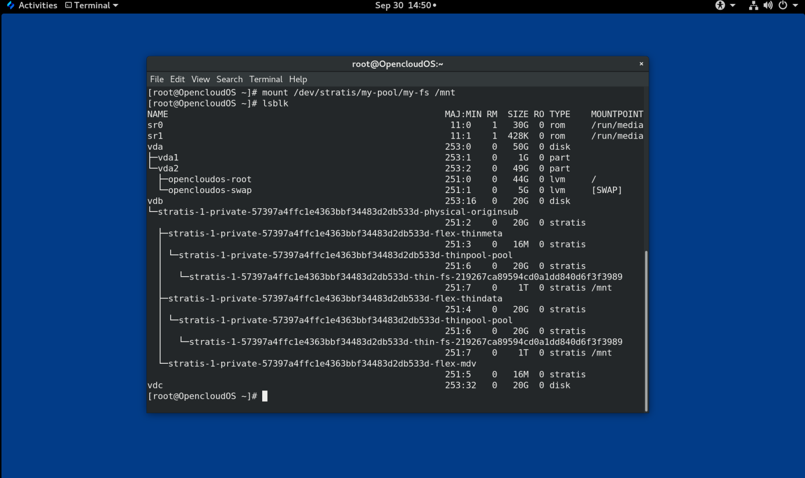

## 39.14 永久挂载 Stratis 文件系统

此过程永久挂载 Stratis 文件系统，以便在引导系统后自动可用。

**前提条件**

- 安装了 Stratis。请参阅[安装 Stratis](#394-安装-stratis)。
- `stratisd` 服务正在运行。
- 您已经创建了一个 Stratis 文件系统。请参阅[创建 Stratis 文件系统](#3912-创建-stratis-文件系统)。

**流程**

1. 确定文件系统的 UUID 属性：
   
   ```
   $ lsblk --output=UUID /dev/stratis/my-pool/my-fs
   ```
   
   例如：
   
   > **例 39.1 查看 Stratis 文件系统的 UUID**
   > 
   > $ lsblk --output=UUID /dev/stratis/my-pool/my-fs
   > 
   > UUID
   > 219267ca-8959-4cd0-a1dd-840d6f3f3989

2. 如果挂载点目录不存在，则创建它：
   
   ```
   # mkdir --parents mount-point
   ```

3. 以 root 身份编辑 `/etc/fstab` 文件并为文件系统添加一行，由 UUID 标识。使用 xfs 作为文件系统类型并添加 `x-systemd.requires=stratisd.service` 选项。
   
   例如：
   
   > **例 39.2 /etc/fstab 中的 /mnt 挂载点**
   > 
   > UUID=219267ca-8959-4cd0-a1dd-840d6f3f3989 /mnt xfs defaults,x-systemd.requires=stratisd.service 0 0
   
   

4. 重新生成安装单元，以便您的系统注册新配置：
   
   ```
   # systemctl daemon-reload
   ```

5. 尝试挂载文件系统以验证配置是否有效：
   
   ```
   # mount mount-point
   ```
   
   

## 39.15 使用 systemd 服务在 /etc/fstab 中设置非根 Stratis 文件系统

您可以使用 systemd 服务管理在 `/etc/fstab` 中设置非根文件系统。

**前提条件**

- 安装了 Stratis。请参阅[安装 Stratis](#394-安装-stratis)。
- Stratisd 服务正在运行。
- 您已经创建了一个 Stratis 文件系统。请参阅[创建 Stratis 文件系统](#3912-创建-stratis-文件系统)。

**流程**

- 对于所有非根 Stratis 文件系统，使用：
  
  ```
  # /dev/stratis/[STRATIS_SYMLINK] [MOUNT_POINT] xfs defaults，x-systemd.requires=stratis-fstab-setup@[POOL_UUID],x-systemd.after=stratis-stab-setup@[POOL_UUID] <dump_value> < fsck_value>
  ```

# 第 40 章 使用附加块设备扩展 Stratis 卷

您可以将附加块设备添加到 Stratis 池，为 Stratis 文件系统提供更多存储容量。

> **重要**
> 
> Stratis 只是一个技术预览功能。一些服务水平协议 (SLA) 不支持技术预览功能，并且可能在功能上不完整。所以不建议在生产中使用它们。这些功能提供了对即将推出的产品功能的早期访问，使客户能够在开发过程中测试功能并提供反馈。

## 40.1 Stratis 卷的组件

了解构成 Stratis 卷的组件。

另外，Stratis 在命令行界面和 API 中提供了以下卷组件：

**`blockdev`**

  块设备，例如磁盘或磁盘分区。

**`pool`**

  由一个或多个块设备组成。

  池具有固定的大小，等于块设备的大小。

  该池包含大多数 Stratis 层，例如使用 `dm-cache` 目标的非易失性数据缓存。

  Stratis 为每个池创建一个 `/dev/stratis/my-pool/` 目录。此目录包含指向池中代表 Stratis 文件系统的设备的链接。

**`filesystem`**

  每个池可以包含一个或多个文件系统，用于存储文件。

  文件系统是精简配置的，没有固定的总大小。文件系统的实际大小随着存储在其上的数据而增长。如果数据大小接近文件系统的虚拟大小，Stratis 会自动增加精简卷和文件系统。

  文件系统使用 XFS 格式化。

> **重要**
> 
> Stratis 跟踪有关使用 Stratis 创建的文件系统的信息（该信息 XFS 并不知道），并且使用 XFS 所做的更改不会自动在 Stratis 中创建更新。用户不得重新格式化或重新配置由 Stratis 管理的 XFS 文件系统。

Stratis 在 `/dev/stratis/my-pool/my-fs` 路径中创建指向文件系统的链接。

> **注意**
> 
> Stratis 使用许多 Device Mapper 设备，这些设备显示在 `dmsetup` 列表和 `/proc/partitions` 文件中。同样，`lsblk` 命令输出反映了 Stratis 的内部工作和层.

## 40.2 将块设备添加到 Stratis 池

此过程将一个或多个块设备添加到 Stratis 池，提供 Stratis 文件系统使用。

**前提条件**

- Stratis 已安装。请参阅[安装 Stratis](#394-安装-stratis)。 
- `stratisd` 服务正在运行。
- 您添加到 Stratis 池的块设备未使用且未挂载。
- 您添加到 Stratis 池的块设备每个大小至少为 1 GiB。

**流程**

- 要将一个或多个块设备添加到池中，请使用： 
  
  ```
  # stratis pool add-data my-pool device-1 device-2 device-n
  ```