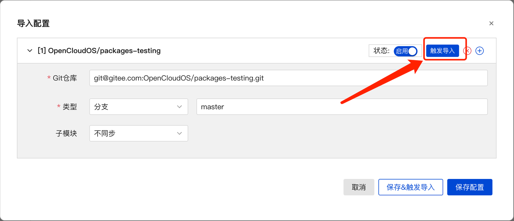
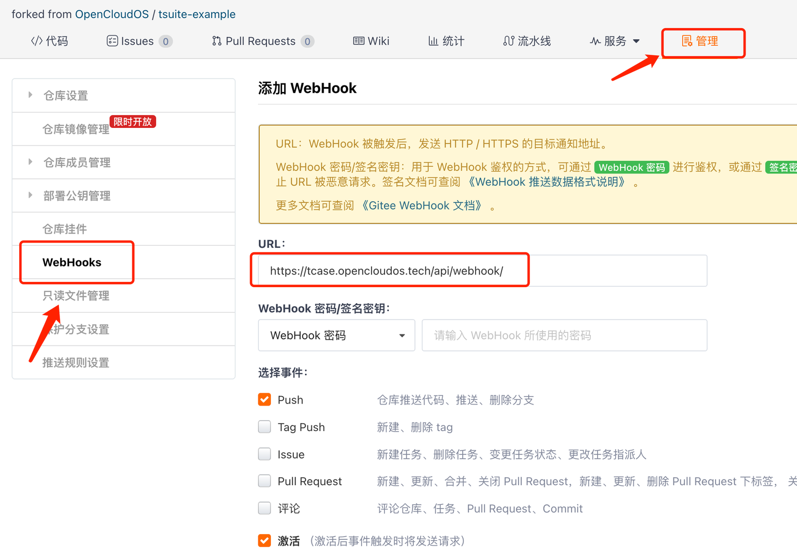
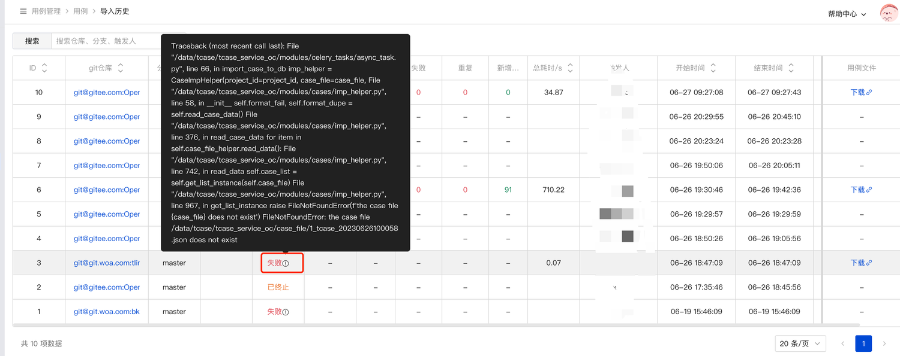

## **1 关联仓库**

在【用例管理->用例】页面，点击【导入配置】按钮，填写对应的Git仓库信息。

> - **Git仓库**: 填写仓库的ssh地址。
> - **类型**：关联仓库【分支/tag/commit】
> - **子模块**：选择是否下载子模块。当开启同步子模块，下载子模块失败时，导入流程会失败返回。
> - **启用状态**：开启【启用】可以触发用例导入，关闭【启用】仅为关联关系，不会导入该仓库的用例；当对应仓库配置了webhook之后会自动导入用例
> - **触发导入**：即立即导入仓库的用例

## **2. 添加webhook**
在对应gitee仓库的【管理→ Webhooks】页面，点击【添加webhook】，填写回调地址【https://tcase.opencloudos.tech/api/webhook/】，选择对应的触发事件。

## **3. 查看导入详情**

在【用例管理->用例】页面，点击【导入历史】跳转到新页面查看用例导入详情，鼠标放置在结果旁边的小图标上，有详细的错误信息提示。

