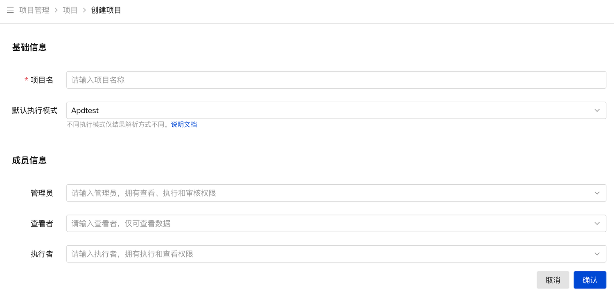

# 
## **1. 申请加入项目**

在项目管理页面，点击【[**申请加入项目**](https://tcase.opencloudos.tech/project)】，选择已有测试项目，申请加入。申请后在【申请】页面查看审批结果。

## **2. 创建项目**

在项目管理页面，点击【[**创建项目**](https://tcase.opencloudos.tech/project)】，创建一个测试项目，输入项目名和测试成员。只有有权限的成员才可以查看项目和执行测试任务。

- **管理员**：编辑项目、审核用户申请、查看和执行任务。  
- **执行者**：查看、编辑和执行任务  
- **查看者**：仅可查看项目数据  

## **3. 审批申请**

项目管理员可以在项目管理-[**审批页面**](https://tcase.opencloudos.tech/project/approve)，审批用户申请。审批时同时授予申请用户相应的权限。

