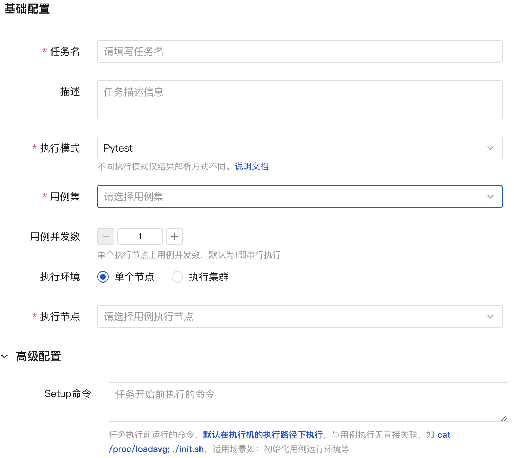

## **1. 任务设置**

### 1.1 执行模式

执行模式有【pytest/类gtest/nose】三种，详细请参考[执行模式说明](./case_create.md)

### 1.2 执行环境
可以选择单个节点或者执行集群  

>**均分执行**：均分后每个节点执行用例集合的部分用例。按照用例历史执行时间，尽可能保证使不同节点的用例执行总耗时相近，最大限度的快速完成任务。  
**全量执行**:  集群的每个节点都执行用例集合中的全部用例  

### 1.3 命令

>**Setup命令**： 用例执行开始前执行的命令  
**Tearddown命令**：全部用例执行完之后执行的命令  
**Reboot命令**：机器重启之后，继续执行未完成用例之前执行的命令 

### 1.4 环境变量命令
与用例执行直接关联，默认在执行机的执行路径下执行，若设置该命令，则设置的命令将与用例命令拼接形成完成的命令  
>如环境变量为 export TEST=case; 用例命令为 pytest test_case.py，则完整的用例执行命令为 export TEST=case; pytest test_case.py  
请注意：每个用例都为单独的进程，所以设置的环境变量仅针对单个用例生效。

### 1.5 自定义参数
若设置该参数，则设置的参数将与用例命令拼接形成完成的命令，如 自定义参数为--key=val 用例命令为 pytest test_case.py，则完整的用例执行命令为 pytest test_case.py --key=val
val支持常量和内置变量。 内置变量说明文档

### 1.6 用例失败停止任务
当有用例失败时，任务终止，未执行用例会被标记为终止状态

### 1.7 用例重试次数
当用例失败/异常/终止/超时时，自动重试次数。重试用例会在所有用例都执行完一轮后执行。

### 1.8 用例超时时间
任务级别的用例超时时间，当用例有设置超时时间时，以用例本身的超时时间为准。

### 1.9 任务超时时间
任务默认没有超时时间，当设置超时时间后，到达超时时间，任务状态为超时

### 1.10 同步代码
若需要同步，则同步用例集合关联的git代码仓库。同步的代码和导入用例代码保持一致。

### 1.11 互斥
当前任务没执行完，后续任务将排队等待

## **2 示意图**

