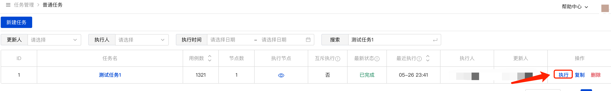
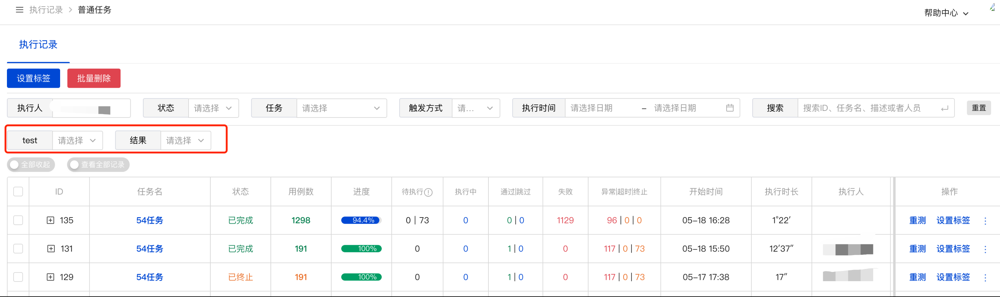
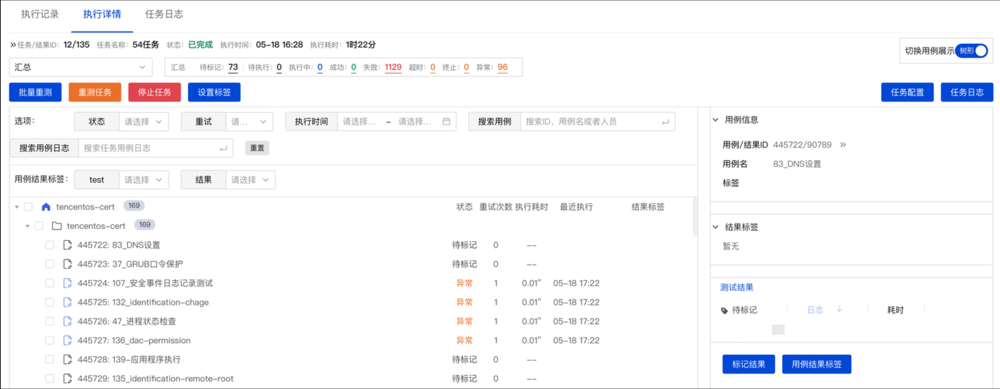
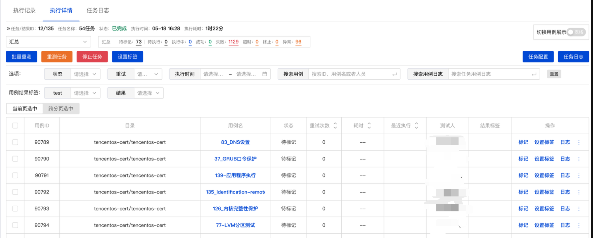
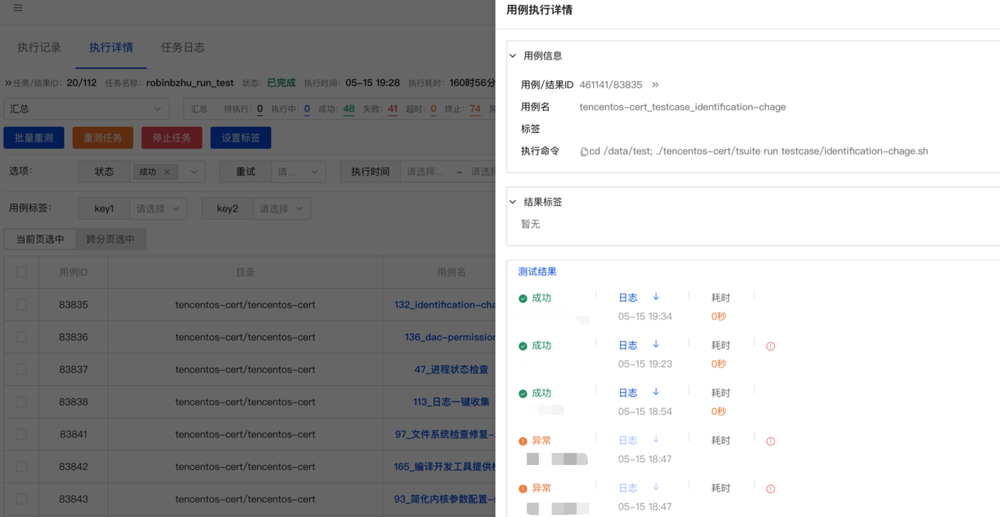
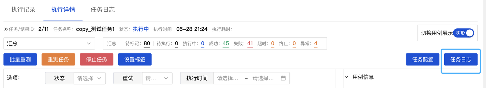
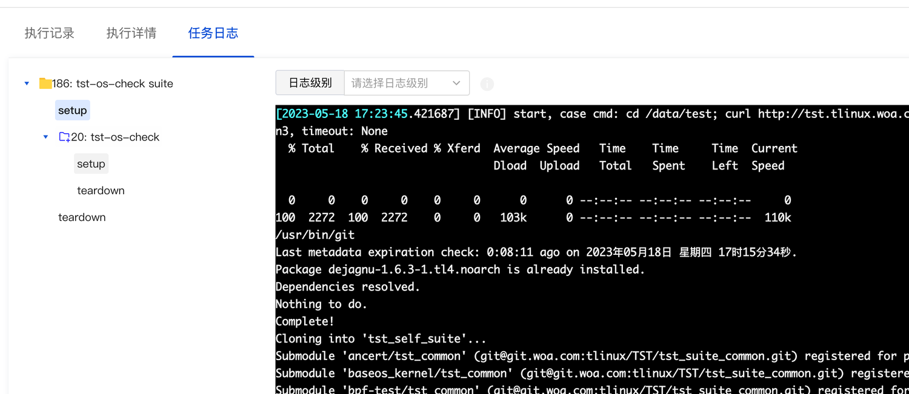

## **1.执行任务**

【任务管理-》普通任务】页面列表，对应的任务行点击【执行】开始执行任务

## **2.执行记录列表**

执行任务后会自动跳转到【任务记录】页面，任务记录页面可以筛选【任务记录标签】，点击单行可以跳转到【记录详情】页面，查看任务中用例执行详情。
点击不同状态的数字，跳转详情时会进行不同筛选。

>**进度**：鼠标放到进度上可以看到各状态用例详细分布数据。  
**重测**：更新当前任务执行记录的最新用例状态，手工用例无法重测，需要手工更新标记。  
**强制终止**：终止正在执行和未执行的用例  
**优雅终止**：仅终止未执行的用例，等待正在执行的用例执行完成后，任务终止。  
**设置标签**：标记任务记录  

## **3. 执行详情-树形**
筛选框可以筛选不同任务，点击不同状态的数字，可以快速筛选用例状态。

>切换用例展示：可以切换树形和表格展现形式，表格展示可以进行排序  
任务配置：查看任务配置信息  
任务日志：跳转到任务日志页面，查看任务setup/teardown日志、测试套的setup/teardown日志  
设置用例结果标签：设置单个用例执行结果标签，设置后支持筛选  
搜索用例日志：搜索任务下所有用例的执行日志。  
标记结果：手工用例支持手工标记结果，自动化用例无法标记  

## **4. 执行详情-表格**

表格支持【重试次数、耗时、最近开始执行时间】排序  
点击单行可以查看单个用例的历史执行详情，表格展示状态为最新状态  
点击日志可以看到最近一次执行日志  

### 4.1 用例执行详情

点击用例信息可以查看用例完整配置

## **5 任务日志**

点击任务执行详情-右上角-任务日志

包括任务、测试套setup、teardown日志等

